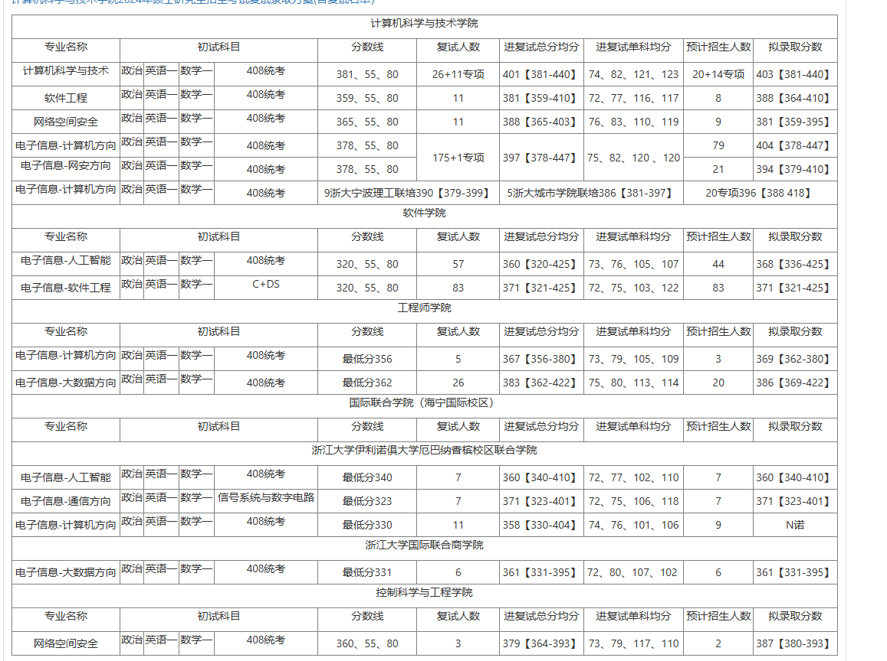
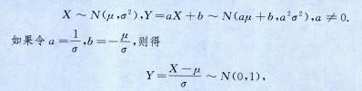

# 第一章
## 概率的性质
### 1.3
PA+B=PA+PB-PAB=PA+PB-P!A!B=
if PB=k
k+p-AB+!A+B=1
k+p-AB+!A!B=1
k=1-p

### 1.4
ABC=0
P!A+B+C
=1-PA+B+C
=1-(A+B+C-AB-AC-BC+ABC)
=1-(3/4-1/4)=1/2

## 古典概型和几何概型

### 1.5（超几何分布
1-P(0次品)
1-C3,0xC6,3/C10,3
=1-1*20/120
5/6

### 1.6
(1)C8,3/C10,3=
7/53=7/15
(2)不含0+不含5-不含05
2*C9,3/C10,3-7/15
2C93-C83/C10,3
9872-876/1098
972-76/109
14-14/3/10
28/30
14/15
(3)C8,2/C10,3
47/538
7/30

### $\star$1.7
函数图像法
x,y在1，1的正方形内分布
x+y>1（y=1-x上方）
xy<1/2（y=1/2x下方）
交点为1-x=1/2x
2x-2x2=1
2x2-2x+1=0
$\delta$=4-8<0，无实数解
S=$\int_0^11/2x-(1-x)dx$
=$ln2x/2-(x-x2/2)|_0^1$
=ln2/2

## 条件概率

### 1.8
缩小样本空间：取出了1个红球，还有9球4白
P=C41/C91=4/9

### 1.9
(1)有90正品，8次品，P=90/98=45/49
(2)12次品3正品的概率：
12都是次品：$10*9/100*99$
3是正品：$90/98$
P=$10*9/100*99*90/98$

## 全概率，贝叶斯公式

### 1.10

全概率：第一次白第二次黄+第一次黄第二次黄
=30*20+20*19/50*49

### 1.11
(1)0.6+0.2*0.5+0.2*0.25=0.75
(2)$掌握|选对=掌握*选对/选对=选对|掌握*掌握/选对=0.6/0.75=4/5$
## 独立与互斥
### 1.12
AB独立性：
PAB=P1=1/4
PA=1-P(3+4)=1/2
AB独立，同理BC独立，AC独立
ABC：PABC=1/4
PAPBPC=1/8
不独立，所以只两两独立，不相互独立

### $\star$1.13
!A!B=1/9
$\star$PA*(1-PB)=PB*(1-PA)
A-AB=B-AB
PA=PB

!A*!B=1/9
!A=1/3
PA=2/3

### $\star$1.14
!(AC)*!C=(!A+!C)*!C=!A!C+!C=!C
## 独立重复试验
### 1.15
111，0111，1011，1101，00111，

2/3^3+C31,1/3*2/3^3+C421/3^22/3^3

# 第二章 一维随机变量

## 分布函数

### 2.1
A在x=0处间断，不符合
B间断，不符合
C间断不符合
D符合

### 2.2
x=1,F=0=a-b,a=b
x->+$\infin$,F=a
a=1,b=1
X$\in$[-1,3]
PX=F3-F-1=2/3-0=2/3

### 2.3
a+1/6=b,a+b+1/6=1
a=1/3,b=1/2
Fx={0(x<-1),1/3(x<0),5/6(x<1),1(x>=1)}

### 2.4
分布律指列出对应随机变量的函数值

### 2.5

### 2.6
5/6^9*1/6

### 2.7
$\lambda$=5
查表计算

### 2.8

x$\in$[0,1]fx=2x，端点值不影响，任取即可
fx=0(其他情况)

### $\star$2.9

概率密度的积分需要是1
C

### 2.10

P(x<1/2)=$\int_0^{1/2}fxdx=1/4$
PY=0=3/4^3=27/64
PY>=1=37/64

### 2.11
$P(X^2\leq5)=\int_{-2}^{\sqrt{5}}$=
$\sqrt{5}/3$

### 2.12
$\int_{-\infin}^{+\infty}=1$
$ksinx|^1_0=k$
S=2k=1,k=1/2
（2）
1/2sinx+1/2(|x|<$\pi/2$)
0,x<$-\pi/2$
1,x>$\pi/2$

### 2.13
互斥：AB=$\empty$
A=AB则A包含于B

### 2.14（均匀分布）
X~U(2,5)，区间长度为3
符合条件的区间长度为2
P=2/3^3+C322/3^21/3=8+12/27=20/27

### 2.15(指数分布)
X~E($\lambda$)
X~fx={$\lambda e^{-\lambda x}$}
Fx=$1-e^{-\lambda x}$
Fa=1-$e^{-\lambda a}$
P(X>a)=$e^{-\lambda a}$

### 2.16（正态分布）
P(X<20)=1-p
P(X>0)=1-p

### 2.17(正态分布)
$\frac{X-\mu}{\sigma}\sim N(0,1)$
$\mu$=72
X-72/$\sigma$~N(0,1)
P(X-72/$\sigma$>24/$\sigma$)=2.3%
$\frac{24}{\sigma}=2$
$\sigma=12$
P=(0.8413-0.5)*2=0.6826

### 2.18
$X^2$的分布律：
$X\sim\begin{pmatrix}
    0,  1,  4\\
    0.2,0.4,0.4
\end{pmatrix}$
$\max(X,1)\sim\begin{pmatrix}
    1,2\\
    0.6,0.4
\end{pmatrix}$

### $\star$2.19
Fy(y)=P(Y<=y)=P(2X+1<=y)
Fy(y)=P(Y<=y)=P(X<=$\frac{y-1}{2}$)=Fx($\frac{y-1}{2}$)

### $\star$2.20

### $\star\star$2.21
$Fx=\frac{x^3}{2}+\frac{1}{2}$($x\in (-1,1)$)
$Fy=P(Y<=y)=P(X^2+1<=y)=P(|X|<=\sqrt{y-1})=P(-\sqrt{y-1}<=X<=\sqrt{y-1})$=$Fx(\sqrt{y-1})-Fx(-\sqrt{y-1})$
$\star\ y<1,Fy=0$
$y\in[1,2]，Fy=(y-1)^{\frac{3}{2}}$
$y>2,Fy=1$
fy=Fy'=$\frac{3}{2}\sqrt{y-1}$($y\in(1,2)$)
fy=0(其他)