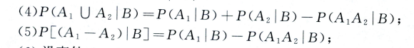
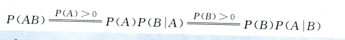
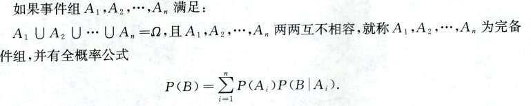
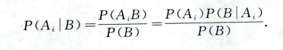
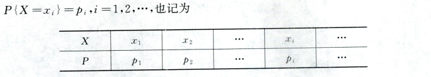
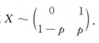
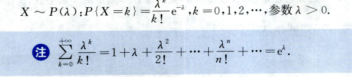
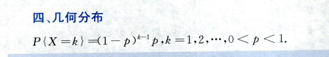
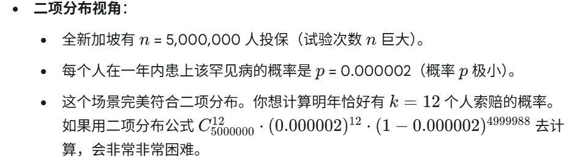
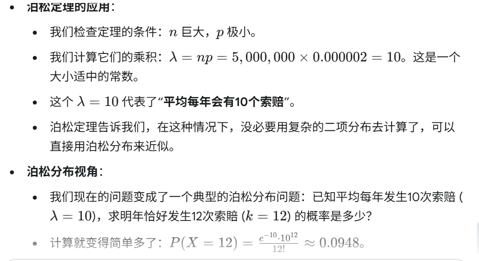

# 概率论
## 第一章 随机事件及其概率
### 基础知识
- **样本点$\omega$**：实验的可能结果
- **样本空间$\Omega$**:全体样本点组成的集合
- **随机事件A**：用大写字母表示
- **概率**：有随机试验E，E的样本空间为$\Omega$，对P（A）有：$P(A)\geqq0，P(\Omega)=1$，，事件$A_n$互不相容且概率和等于和的概率，则称$P(A)$为A的概率
- **概率公式**：
  - 减法公式：$P(A-B)=P(A\overline{B})=P(A)-P(AB)$
  - 加法公式：$P(A+B)=P(A)+P(B)-P(AB) $
  - 推广：
- **古典概型**:样本点有限，每个样本点可能性相同
- **条件概率**：P(B|A)=P(AB)/P(A)
  - 方法：1.直接计算，2.缩小样本空间
  - 条件概率的性质：
    - 
  - 条件概率的乘法公式：
- **全概率公式**：
- **贝叶斯公式**：
- **事件独立**：$P(AB)=P(A)*P(B)$==$P(A|B)=P(A)$==$P(B|A)=P(B)$
  - 事件独立的性质：
  - 独立与互斥：不可互推，独立：P(AB)=PAPB，互斥：P(AB)=0
  - 两两独立不包含PABC=PAPBPC，相互独立包含PABC=PAPBPC
- **重复独立试验，伯努利概型**：n次独立重复事件
## 第二章 一维随机变量及其分布
### 基础知识
- **随机变量**：随机变量是一个单值函数$X$，定义域为$\Omega$即样本点（基本事件）的全体集合（最好可以用数字描述），值域为输出值的集合（数字的集合）
  - 例如：从一批100个灯泡中随机抽取10个。定义随机变量Y($\omega$)为抽出的10个灯泡中次品的数量，定义域为10个灯泡构成的随机集合的集合，这个集合非常大，值域为{0,1,2……,10}
  - 反之，事件也可以通过随机变量的值来表示，例如，用扔100次硬币有50次朝上来描述朝上的样本组(A={X=50})
- **分布函数**：也叫累积分布函数，F(x)=P{X$\leq$x}的概率（随着x的增加，囊括了越来越多的样本点，概率越来越大
  - 分布函数的性质：
    - $0\leq[F(x)]\leq1$
    - F($-\infin$)=0(包含0个样本点)
    - F($\infin$)=1(包含所有样本点)
    - F(x)是单调不减的函数（F会囊括越来越多的样本点）
    - F(x)处处右连续
  - 例如：X表示上班时间，X的值域为[20,50]，F(20)=0，F(50)=1
  - 例如：X表示100次扔硬币正面朝上的次数，F为阶梯状的函数，F(0)=0，F(100)=1
- **离散型随机变量**：x的取值非连续
  - 性质：pi$\geq0$，$\Sigma_i=1$
  - 常见离散型随机变量：
    - 01分布：记为X~B(1,p),
    - 二项分布：记为X~B(n,p)
    - 泊松分布：记为X~P($\lambda$)，有P{X=k}=$\frac{\lambda^k}{k!}e^{-\lambda}$
    - 几何分布    
    - 超几何分布
- **泊松定理**：用于估计n很大，p很小的二项分布，p足够小，n足够大时，可以取$\lambda=pn$计算泊松分布的值来估计二项分布的值：