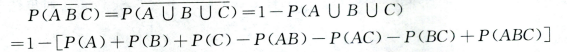

# 概率论
## 第一章 随机事件及其概率
### 基础知识
- **样本点$\omega$**：实验的可能结果
- **样本空间$\Omega$**:全体样本点组成的集合
- **随机事件A**：用大写字母表示
- **概率**：有随机试验E，E的样本空间为$\Omega$，对P（A）有：$P(A)\geqq0，P(\Omega)=1$，，事件$A_n$互不相容且概率和等于和的概率，则称$P(A)$为A的概率
- **概率公式**：
  - 减法公式：$P(A-B)=P(A\overline{B})=P(A)-P(AB)$
  - 加法公式：$P(A+B)=P(A)+P(B)-P(AB)$
