- [1. 操作系统](#1-操作系统)
  - [1.1. 大纲](#11-大纲)
  - [1.2. 操作系统概览](#12-操作系统概览)
    - [1.2.1. 操作系统的概念，定义](#121-操作系统的概念定义)
    - [1.2.2. 操作系统的功能与目标](#122-操作系统的功能与目标)
    - [1.2.3. 操作系统的特征](#123-操作系统的特征)
    - [1.2.4. 操作系统历史与分类](#124-操作系统历史与分类)
    - [1.2.5. 操作系统的运行机制](#125-操作系统的运行机制)
    - [1.2.6. 操作系统的中断与异常](#126-操作系统的中断与异常)
    - [1.2.7. 系统调用](#127-系统调用)
    - [1.2.8. 操作系统的体系结构](#128-操作系统的体系结构)
    - [1.2.9. 操作系统的引导（boot）](#129-操作系统的引导boot)
    - [1.2.10. 虚拟机](#1210-虚拟机)
  - [1.3. 操作系统进程管理](#13-操作系统进程管理)
    - [1.3.1. 进程与线程](#131-进程与线程)
      - [1.3.1.1. 进程的概念,组成,特征](#1311-进程的概念组成特征)
      - [1.3.1.2. 进程的状态和状态转换](#1312-进程的状态和状态转换)
      - [1.3.1.3. 进程控制（理解即可）](#1313-进程控制理解即可)
      - [1.3.1.4. ⭐进程通信](#1314-进程通信)
      - [信号（Signal）](#信号signal)
      - [线程，多线程模型](#线程多线程模型)
      - [线程的实现方式与多线程模型](#线程的实现方式与多线程模型)
---

# 1. 操作系统

## 1.1. 大纲
一，概览
二，进程，线程，调度算法，同步与互斥，死锁
三，内存管理
四，文件结构
五，IO，缓冲区，磁盘调度

---

## 1.2. 操作系统概览
### 1.2.1. 操作系统的概念，定义
  - 计算机系统的层次结构：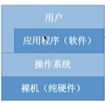
  - 操作系统的概念：
###   1.2.2. 操作系统的功能与目标
  - 操作系统是**系统资源的管理者**（包括**软件资源**和**硬件资源**（内存，CPU，网络等））
    - **文件管理功能**（文件的树状结构（第四章））
    - **存储器管理功能**（将程序放入内存（第三章））
    - **处理机管理**（分配CPU资源（第二章））
    - **设备管理**（管理摄像头等硬件资源（第五章））
  - 操作系统向上层**提供方便易用的服务**（用户，其他软件（将硬件的二进制指令封装为易用的**接口**））
    - 直接给用户使用
      - 提供**GUI**（图形化用户接口）
      - 提供**联机命令接口**（用户与操作系统交互的命令，如time）
      - 提供**脱机命令接口**（批处理命令接口）
    - 提供**程序接口**（由众多**系统调用**组成）（只能通过程序进行**系统调用**来使用）（例如printf函数）
    *命令接口与程序接口统称为**用户接口***
  - 操作系统是最接近硬件的一层**软件**
    - 实现对硬件机器的**拓展**
    *覆盖软件的机器称为**虚拟机***
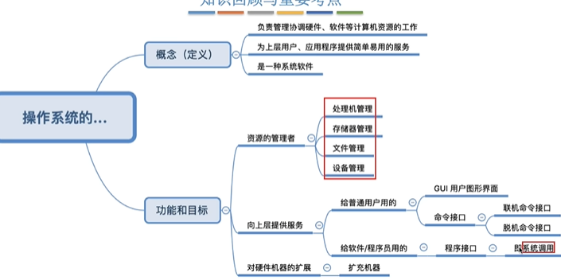
###     1.2.3. 操作系统的特征
- **并发**：并发指两个或多个事件在同一时间间隔内发生，在**宏观上是同时**的，在**微观上是交替**的（与并行的不同）
  - 单核CPU同一时刻只能执行**一个程序**，各个程序只能**并发运行**
- **共享**：系统的资源可以供内存中多个并发的进程共同使用
  - **互斥共享**：一个时间段只允许一个进程访问（调用摄像头）
  - **同步共享**：一个时间段内允许多个进程同时（通常是并发）访问（访问硬盘文件（并发），扬声器播放（并行））
- **虚拟**：把物理上的实体变为若干逻辑上的对应物
  - 空分复用技术（虚拟存储器
  - 时分复用技术（虚拟处理器
- **异步**：由于系统资源有限，进程的运行不是一贯到底，而是走走停停，以不可预知的速度推进

**并发和共享**是两个**最基本**的特征，两者互为存在条件。
- 如果失去并发性，系统只有一个程序在运行，共享性失去意义
- 如果失去共享性，QQ和微信不能同时访问硬盘资源，也就无法并发
- 如果失去并发性，就谈不上虚拟性
- 系统只有拥有并发性，才有可能导致异步性
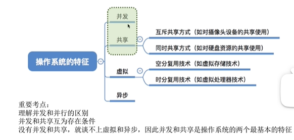
###   1.2.4. 操作系统历史与分类
- **手工操作阶段**：计算占比极低
  - 缺点：用户独占全机，人机速度矛盾导致资源利用率极低
- **单道批处理系统**：引入脱机输入/输出技术（利用外围机与磁带完成）由监督程序负责控制作业的输入输出，输入输出时间占比降低，提升资源利用率
  - 缺点：内存中只能有**一道程序**运行；CPU由大量时间在等待IO完成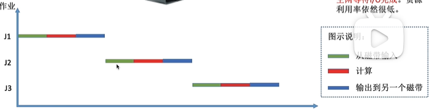
- **多道批处理系统**:支持程序并发运行，每次往内存中读入多道程序
  - 优点：程序可以**并发执行**，资源利用率大幅度提高
  - 缺点：用户**响应时间长**，没有人机交互功能
- **分时操纵系统**：以**时间片**为单位轮流为各个用户/作业服务
  - 优点：用户可以被及时响应，解决了人机交互问题
  - 缺点：不能优先处理紧急任务，完全公平
- **实时操作系统**：接收到紧急任务能在严格的时限内完成，优点：即使可靠
  - 硬实时系统：绝对严格按规定时间完成（导弹控制，自动驾驶）
  - 软实时系统：能够偶尔违反（12306）
- 网络操作系统；分布式操作系统；个人操作系统……
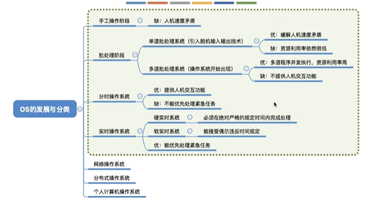
###   1.2.5. 操作系统的运行机制
高级语言---编译--->机器语言->CPU执行

**两种指令**：
- **特权指令**：只能由内核程序使用
- **非特权指令**：应用程序只能使用非特权指令

指令是CPU能识别、运行的最基本的命令

⭐**两种状态**：为了区分正在运行的是内核程序还是应用程序，防止越权指令
- **内核态（管态）**：可以执行特权指令
  - 一条特权指令可以更改寄存器的状态实现变态
- **用户态（目态）**：只能执行非特权指令
  - 当用户态的CPU遇到特权指令时，会立即**变为核心态**，停止执行当前执行的应用程序，转而运行**处理中断信号**的内核程序
    - 但凡需要由用户态切换回内核态的地方，都会触发中断信号（下个小节）
    
实现：CPU有一个寄存器：程序状态字寄存器（PSW）有一个二进制位表示处于用户态还是内核态。

**两种程序**
- **内核程序**：内核程序组成了操作系统**内核**（Kernel），内核是操作系统最核心的部分，也是**最接近硬件的部分**。操作系统还包括用户界面。
- **应用程序**：普通程序员所写的程序
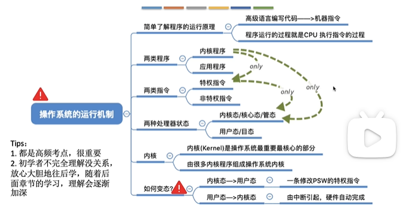
### 1.2.6. 操作系统的中断与异常
**中断的作用**:由用户态切换为内核态时,需要触发中断
- 中断使得操作系统能够实现并发

**中断的类型**
- **内中断(异常)**:中断信号来自CPU内部,与当前执行的指令有关
  - **终止|abort**:用户态遇到特权指令,指令非法...不会交还使用权
  - **故障|fault**:缺页故障...系统尝试修复后,把CPU使用权交回应用程序
  - **陷入|trap**:执行**陷入指令**(请求操作系统内核的服务(系统调用))(不是特权指令)
- **外中断(中断)**:中断信号来自CPU外部,与当前指令无关
  - **时钟中断**:由时钟部件发来的中断信号:并行执行的核心
  - **I/O中断**:IO设备任务完成,向CPU发送中断信号

**中断机制的基本原理**
不同的中断信号,需要不同的中断处理程序来处理:
1. 检测到中断信号
2. 根据中断的类型查询**中断向量表**,找到对应的中断处理程序

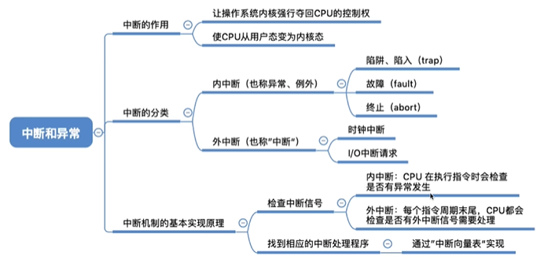

### 1.2.7. 系统调用
**系统调用**
- 操作系统向上提供的接口
- 为了实现系统资源互斥的共享，需要由系统内核统一管理，向上提供系统调用，保证互斥访问
  

**系统调用与库函数的区别**
- 应用程序一般会调用库函数，库函数再调用系统调用
- 系统调用是比库函数更底层的接口

什么功能需要系统调用?

**系统调用的过程**
1. 应用程序运行在用户态
2. 应用程序调用系统调用：
   1. 调用传递参数指令（可能多条），向寄存器传入参数
   2. 执行**陷入指令**
   3. 陷入指令引发**内中断**，切换到**内核态**，内核发现是trap引起的
   4. 内核转入执行相应的中断处理程序：系统调用入口程序
   5. 检查寄存器参数
   6. 执行完相应的程序
3. 切换到用户态，继续执行用户的代码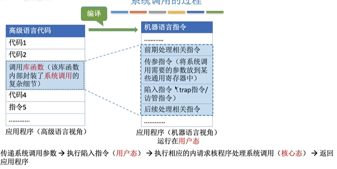
- 陷入指令是在**用户态**下执行的
- 发出系统调用的请求在用户态，系统调用的相应处理在**核心态**
- 陷入指令又名**trap指令；访管指令**
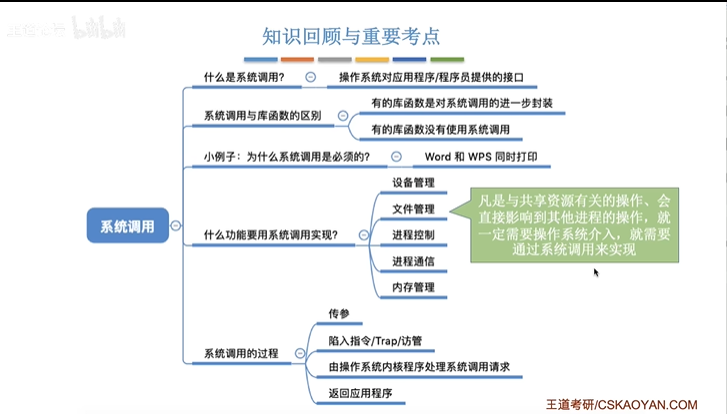
### 1.2.8. 操作系统的体系结构
操作系统的内核包括这些程序：
- **时钟管理**
- **中断处理**
- **原语**
- **对系统资源进行管理**
  - 进程管理
  - 存储器管理
  - 设备管理

操作系统的设计方法（选择）：
- **大内核（宏内核）**：把时钟管理，中断处理，原语和**对系统资源进行管理的程序**都放入内核程序
  - 优点：**性能高**，内核内部各种功能都能相互调用
  - 缺点：内核庞大**功能复杂，难以维护**；**稳定性差**，某一个功能模块出错就有可能导致整个操作系统崩溃
- **微内核**：内核程序只有**时钟管理**，**中断处理**，**原语**
  - 优点：内核小功能少，**易于维护，可靠性高**；**稳定性好**，内核外某个功能出错不会导致整个操作系统崩溃
  - 缺点：系统资源进行管理的程序需要在用户态下运行，**执行效率较低**（CPU状态转换次数多）；用户态下各模块直接**不能相互调用**，只能通过内核的信息传递来间接通信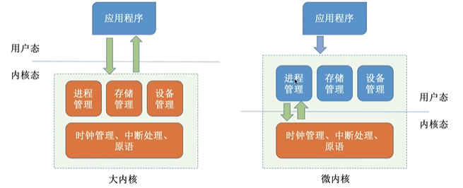
- **分层结构**：操作系统分为多层：最底层是硬件，最高层是用户接口，每层只能调用更低一层的接口
  - 优点：**便于调试和验证**，自底向上逐层调试验证；易于扩充和维护
  - 缺点：只能调用低一层，难以合理定义各层边界（互相调用，例如进程和内存；**效率低**，不可以跨层调用
- **模块化**：将操作系统程序划分为多个模块，内核由**主模块**和**可加载内核模块**组成，主模块只负责核心功能，例如进程调度，内存管理；可加载内核模块可以动态加载到内核，无需重新编译整个内核
  - 优点：
    - 模块间逻辑清晰，易于维护，确定接口后可同时对多个模块进行开发
    - 支持**动态加载**新的内核程序（例如新的驱动程序）
    - 任何模块都可以**相互调用**，效率高
  - 缺点：
    - 模块间接口定义未必合理实用
    - 模块之间相互依赖，难以维护
- **外核**：内核**只负责进程调度，进程通信**等功能，外核负责为用户分配**未经抽象的硬件资源**，并由外核负责保证资源使用安全
  - 优点：资源不抽象，不虚拟，用户使用**更加灵活**；**减少了映射层**，提升了效率
  - 缺点：降低了系统的一致性；让系统变得复杂
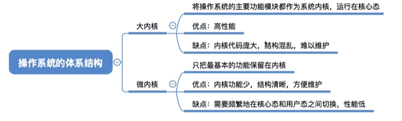
### 1.2.9. 操作系统的引导（boot）
**磁盘里的数据**：
- 磁盘的**开头**是**主引导记录（MBR）**，包括**磁盘引导程序（用于找到活动分区）**和**分区表**
- 安装了操作系统的分区（**活动分区**）
  - **分区引导记录（PBR）**：负责找到启动管理器（加载操作系统内核的程序）
  - 根目录
  - 其他

计算机主存：
- **RAM（物理内存条）**
- **ROM（BIOS）**：包含**ROM引导程序**（**自举程序**）

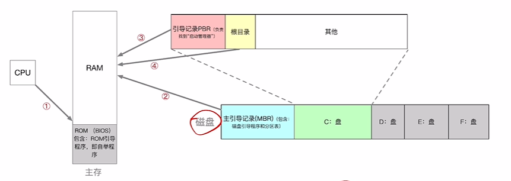

⭐**操作系统引导的过程**，分点为详细补充解释，方便理解
1. **CPU从一个特定的主存地址（指向BIOS）开始，取指令，执行ROM中的引导程序（BIOS程序）（先进行硬件自检，再开机）**
   1. CPU在通电后，其内部的指令指针寄存器会被硬件强制设置为一个固定的、预设好的内存地址（例如x86架构下的 FFFF:0000）。
   2. 这个地址指向的是主板上的BIOS ROM芯片
   3. CPU从这个地址开始执行的代码，就是固化在BIOS芯片里的程序
2. **将磁盘的第一块——主引导记录（MBR）读入内存，执行磁盘引导程序，扫描分区表**
   1. 当POST自检通过后，BIOS会根据你设定的启动顺序（比如 硬盘 -> U盘 -> 光驱）去寻找可启动的设备。对于硬盘来说，BIOS会读取它的第一个扇区（512字节），这就是MBR。
   2. BIOS程序会把这512字节的内容原封不动地加载到一个内存的固定位置
   3. 这512字节里包含了三样东西：一小段引导代码 (Bootloader)：非常小，大约446字节，它的唯一任务就是找到“活动分区”并加载那个分区的引导记录。分区表 (Partition Table)：记录了这块硬盘被分成了几个区，每个区从哪里开始，到哪里结束，大小是多少等信息（64字节）。结束标志 (Magic Number)：55 AA，占2字节，用来表示这是一个有效的MBR。
   4. BIOS将MBR读入内存后，就会把CPU的控制权交给MBR里的那段引导代码。这段代码会读取紧随其后的分区表，从中找到被标记为“活动”（Active）的分区。
3. **从活动分区读入分区引导记录，执行其中的程序**
   1. 在MBR分区表中，最多只能有一个分区被标记为“活动”，这代表操作系统就安装在这个分区里。MBR里的引导代码的任务就是找到它。
   2. MBR的引导代码找到活动分区后，会读取这个活动分区的第一个扇区（引导记录），这个扇区被称为PBR
   3. PBR里也包含了一段引导代码。这段代码比MBR里的那段要更“聪明”一些，它知道如何在这个分区的文件系统中（比如NTFS, FAT32）找到并加载真正的操作系统加载器
4. **从根目录下找到完整的操作系统的初始化程序（即启动管理器）并执行，完成开机的一系列动作**
   1. PBR中的代码在分区的文件系统中找到并加载操作系统加载器
   2. 操作系统加载器接管控制权。它会提供一个启动菜单（如果你装了多系统），然后根据配置去加载操作系统的核心 (Kernel) 和一些必要的驱动程序到内存中
   3. 加载完成后，操作系统加载器将CPU的控制权正式交给操作系统内核
   4. 内核开始执行，这才是真正“开机”的开始。它会进行一系列复杂的初始化工作
### 1.2.10. 虚拟机
虚拟机：使用虚拟化技术，将一台物理及其虚拟化为多台虚拟机器（VM），每个虚拟机都可以**独立运行一个操作系统**

虚拟机管理程序(VMM)：
- 第一类VMM：**直接运行在硬件上**（Guest OS）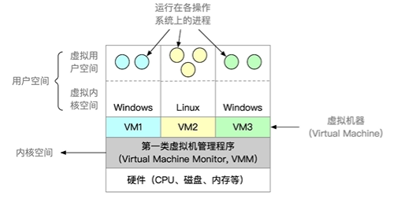
  - 只有管理程序才运行在内核态，操作系统运行在用户态，因此需要管理程序截获特权程序
- 第二类VMM：**运行在宿主操作系统上**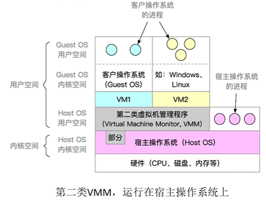

**两类虚拟机管理程序的对比**：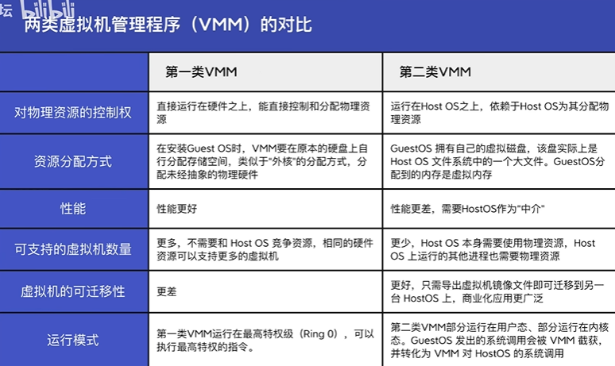
支持虚拟化的CPU通常分更多指令等级
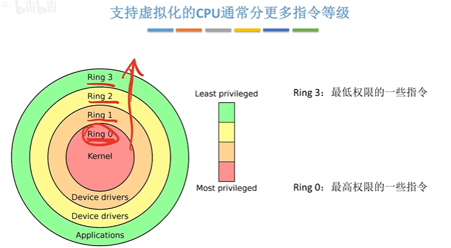

------

## 1.3. 操作系统进程管理
###    1.3.1. 进程与线程
#### 1.3.1.1. 进程的概念,组成,特征
**进程**:进程是进程实体的运行过程,是系统进行资源分配和调度的独立单位

与程序的不同在于,程序是**静态**的,是可执行文件,而一次进程是程序的一次进行,每一次执行程序都会产生一个进程

区分进程的方法:当进程被创建时,会分配唯一的**PID**,也会记录所属用户的UID

**进程的组成**:
- **PCB**:对进程的管理工作需要的信息(给操作系统使用的)
- **程序段**:程序的代码(指令序列)
- **数据段**:运行过程产生的数据(各种变量等)

**进程控制块(PCB)**:保存进程的PID,分配了多少资源,进程的运行情况等   
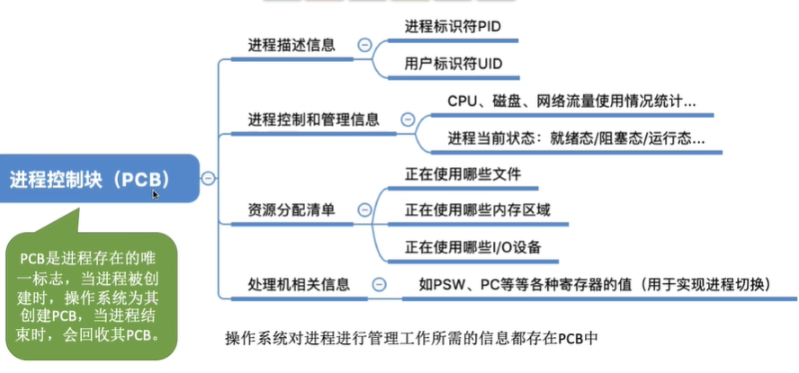

**进程的特征**:
- **动态性**:最基本的特性
- **并发性**:各进程可并发执行
- **独立性**:进程是独立运行,独立获取资源和接受调度的基本单位
- **异步性**:操作系统要提供进程同步机制来解决异步问题
- **结构性**:每个进程都会配置一个PCB

#### 1.3.1.2. 进程的状态和状态转换
⭐⭐**进程的状态**:
- **创建态**:进程创建期间,分配内存空间等资源,初始化PCB
- **就绪态**:CPU忙,暂时没有空闲
- **运行态**
- **阻塞态**:进程运行过程中,请求等待某个事件的发生,CPU就会剥夺运行权力,进入阻塞态
- **终止态**:下CPU,回收资源,回收PCB

PCB中会有一个变量**state**表示进程的当前状态

⭐⭐**进程的状态转换**:
- **创建态→就绪态**:只缺少处理机资源
- **就绪态→运行态**:进程被调度
- **运行态→阻塞态**:进程使用系统调用申请申请资源或等待某个事件发生,被剥夺了处理机资源(进程主动行为)
- **阻塞态→就绪态**:申请的资源被分配或等待的事件发生(被动行为)
- **运行态→终止态**:进程运行结束,或者遇到不可修复的错误
- **运行态→就绪态**:时间片到,或处理器被抢占,被剥夺处理机使用权

单核CPU同一时刻**只有一个进程**处于运行态,多核CPU可能会有多个进程

**进程的组织**
- **链式方式**:执行,就绪,阻塞态的进程形成**队列**,根据阻塞原因的不同还有可能分为多个阻塞队列(例如等待打印机,等待磁盘...)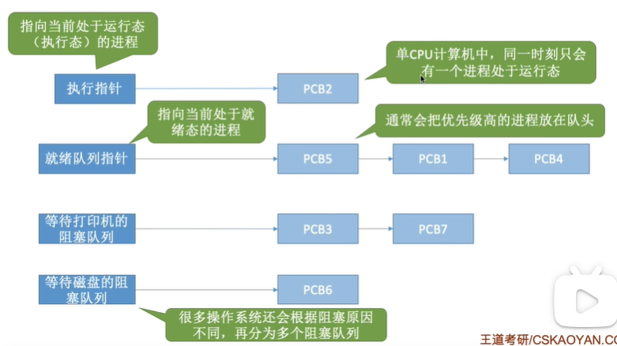
- 索引方式:为每个状态建立索引表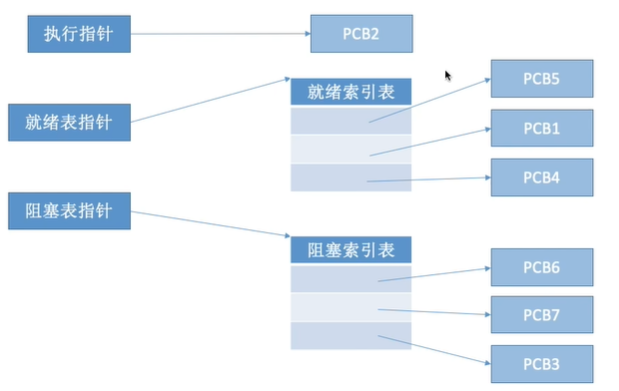

小结
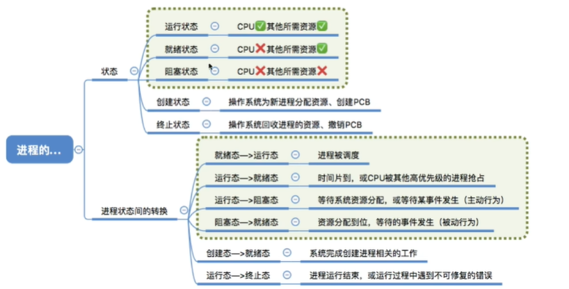
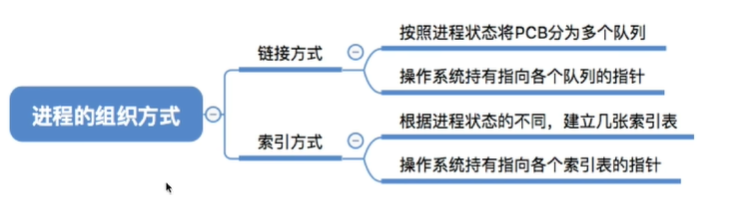

#### 1.3.1.3. 进程控制（理解即可）
**原语**:原语的执行具有**原子性**,执行过程只能一气呵成,**不允许被中断**
通过**关中断指令**和**开中断指令**这两个**特权指令**实现原子性

关中断指令后，CPU停止检测中断信号

**实现进程控制的方法**:进程的状态切换具有原子性
- **进程的创建**:使用**创建原语**
  - **创建原语的步骤**
    1. 申请空白PCB
    2. 为进程分配所需资源
    3. 初始化PCB
    4. 将PCB插入就绪队列(**创建态→就绪态**)
  - 引起进程创建的事件
    1. **用户登录**:分时系统中,用户登录会创建一个新的进程
    2. **作业调度**:多道批处理系统中,有新的作业被放入内存中,会创建一个新的进程
    3. **提供服务**:用户向系统提出某些请求
    4. **应用请求**:用户进程主动请求创建进程!
- **进程的终止**：使用**撤销原语**
  - 撤销原语的步骤：
    1. 从PCB集合中找到要终止进程的PCB
    2. 如果进程正在运行，立刻剥夺CPU，将CPU分配给其他进程
    3. 终止其所有子进程（进程之间是树型结构）
    4. 将进程的所拥有的所有资源归还父进程或操作系统
    5. 删除PCB
  - 引起进程终止的事件：
    1. 正常结束
    2. 异常结束
    3. 外界干预杀掉进程
- **进程的阻塞**：使用**阻塞原语**
  - 阻塞原语的步骤：
    1. 找到要阻塞进程对应的PCB
    2. **保护进程运行现场**，将PCB状态设置为阻塞态，暂时停止进程运行
    3. 将PCB插入对应事件的等待队列
  - 引起进程阻塞的事件：
    1. 需要等待系统分配某种资源
    2. 需要等待相互合作的其他进程完成工作
- **进程的唤醒**：使用**唤醒原语**
  - 唤醒原语的步骤：
    1. 找到PCB
    2. 将PCB从等待队列中移除，将状态设置为就绪态
    3. 将PCB插入就绪队列
  - 导致唤醒原语的步骤：
    1. 等待的事件发生
- **进程的切换**：使用**切换原语**（切换运行的进程
  - 切换原语的步骤：
    1. 将**运行环境**存入PCB
    2. PCB移入相应队列
    3. 选择另一个进程执行，更新其PCB
    4. 根据PCB恢复新进程所需的**运行环境**
  - 引起切换进程的事件：
    1. 进程时间片到
    2. 又更高优先级的进程
    3. 进程主动阻塞
    4. 进程终止
  
**运行环境**：**PSW**（程序状态字寄存器）；**PC**（程序计数器）；**IR**（指令寄存器）；通用寄存器……

#### 1.3.1.4. ⭐进程通信
进程的通信需要通过**操作系统**支持

**三种通信方式**：
- **共享存储**
  - 原理：进程可以申请**共享存储区（共享内存）**（第三章），这个存储区可以被其他进程存取
  - 特性：**互斥访问**（PV操作，读者、写者问题）
  - 共享存储分为两种：
    - **基于存储区的共享**：操作系统划定一片内存空间作为存储区
      - 速度快，灵活程度高，是一种**高级通信**
    - **基于数据结构的共享**：规定只能放置大小的数据结构
      - 速度慢，限制多，是一种**低级通信**
- **消息传递**
  - 原理：数据以**格式化的消息**为单位，通过**发送消息原语**和**接受消息原语**进行数据交换
  - 格式化的消息包括**消息头**，**消息体**，消息头包括发送进程ID，接受进程ID，信息长度等信息
  - 消息传递分为两种：
    - **直接通信方式**：发送进程需要指明接受进程的ID
    - **间接通信方式（信箱通信方式）**：通过**信箱**间接通信
- **管道通信**
  - 管道是一个特殊的**共享文件**，本质是再内存中开辟了大小固定的内存缓冲区（循环队列），而且是先入先出的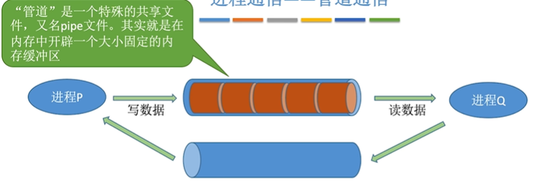
  - 特性：**先入先出**；**半双工通信**（单向）；互斥访问
  - 写满：写进程会被阻塞；读满：读进程会被阻塞
  - **允许多个写进程，一个读进程**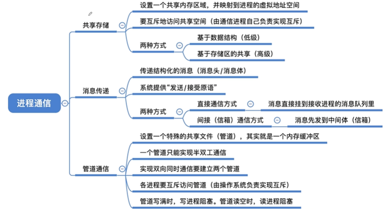

#### 信号（Signal）
- 信号的作用：**信号**用于实现进程间通信，通知进程某个事件已经发生
- **信号的发送与保存**：
  - 进程的PCB中会有两个位向量：**pending**，**blocked**,pending是待处理信号的种类，blocked是屏蔽的信号种类，通过**掩码**的方式实现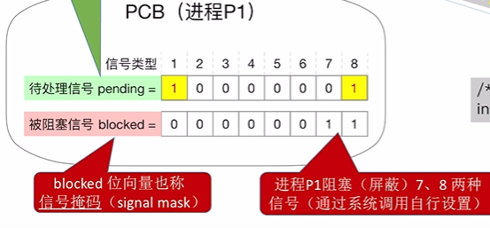
  - 发送信号，以kill函数为例：假设进程id为2666
  - 进程或内核通过调用kill函数来给进程发送信号
  - 进程直接允许发送的信号种类是有限制的，如子进程不能给父进程发送kill信号
- **信号的处理**
  - WHEN：**当进程从内核态转为用户态时**，**不会立即响应**：系统调用返回，中断处理返回，例行检查是否有待处理信号
  - HOW：   
    1. 先把blocked向量**逐位取反**，再与pending**相与**，就得到了要处理的信号。
    1. 每一个信号都有对应的处理程序，转移到每个信号的处理程序
    1. 处理程序为执行操作系统为此类信号**默认的信号处理程序**，有些信号默认为空函数，或执行用户**自定义的信号处理程序**（用户程序**覆盖**默认程序），例如SIGWINCH信号，当窗口大小变化会发送信号，默认为空，用户可以自定义。有的函数不允许这样做，例如linux的SIGKILL函数，SIGSTOP函数
    1. 信号处理结束，通常会**返回到下一条指令**继续执行，除非进程被阻塞或者终止
    2. 一旦处理了某个信号，就**将pending对应位设为0**
    3. 重复的收到同类信号会**被忽略**，因为只有一位记录
    4. 有多个信号从前往后处理
- **信号与异常的关系**：信号可以作为异常的**配套机制**，让进程对操作系统异常处理进行**补充**
  - 有些异常可以由操作系统全部处理，如缺页异常
  - 有些异常需要进程配合处理，例如计算器除以0
  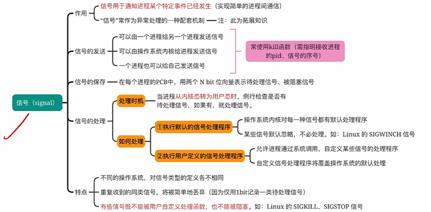

#### 线程，多线程模型
线程：实现**进程内的并发**

引入线程后，线程是**程序执行流的最小单位**，进程不再是调度的基本单位，进程只作为**除了CPU资源以外的系统资源分配单元**
系统开销上，进程之间的并发需要切换进程的运行环境，而**同一进程内的线程并发不需要切换运行环境**，从而**减少系统开销**

线程的特性：
 - 多核CPU，不同线程可以占用不同的CPU
 - 每个线程都有一个**线程ID**和**线程控制块（TCB）**
 - 线程也拥有**就绪，阻塞，运行**三种状态
 - 线程几乎**不拥有系统资源**，同一进程的不同线程**共享进程的资源**，由于共享内存地址空间，同一进程的线程**通信不需要操作系统的干预**
 - 同一进程内的线程切换不会引起进程切换，**系统开销很小**

#### 线程的实现方式与多线程模型
线程的实现方式：
- 用户级线程：由线程库实现，完全没有操作系统干预
  - 优点：无需切换核心态，开销小效率高
  - **缺点**：只能被分配一个核心，不能并行运行；并发度不高，如果一个线程被阻塞，其他线程也会被阻塞，例如：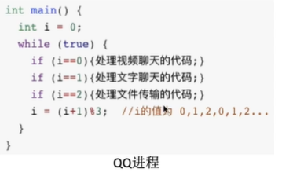
- 内核级线程：由操作系统支持线程的管理由操作系统完成
  - 优点：一个线程被阻塞，其他线程仍然可以执行；可以把不同线程分配给不同核心实现并行运行
  - 缺点：一个用户进程会占用多个内核级线程，线程的切换需要切换核心态，成本高，开销大 