- [1. 操作系统](#1-操作系统)
  - [1.1. 大纲](#11-大纲)
  - [1.2. 操作系统概览](#12-操作系统概览)
    - [1.2.1. 操作系统的概念，功能，特征](#121-操作系统的概念功能特征)
      - [1.2.1.1. 操作系统的概念，定义](#1211-操作系统的概念定义)
      - [1.2.1.2. 操作系统的功能与目标](#1212-操作系统的功能与目标)
      - [1.2.1.3. 操作系统的特征](#1213-操作系统的特征)
    - [1.2.2. 操作系统历史与分类](#122-操作系统历史与分类)
    - [1.2.3. 操作系统的运行概览](#123-操作系统的运行概览)
      - [1.2.3.1. 操作系统的运行机制](#1231-操作系统的运行机制)
      - [1.2.3.2. 操作系统的中断与异常](#1232-操作系统的中断与异常)
      - [1.2.3.3. 系统调用](#1233-系统调用)
    - [1.2.4. 操作系统的体系结构](#124-操作系统的体系结构)
    - [1.2.5. 操作系统的引导（boot）](#125-操作系统的引导boot)
    - [1.2.6. 虚拟机](#126-虚拟机)
  - [1.3. 操作系统进程管理](#13-操作系统进程管理)
    - [1.3.1. 进程与线程](#131-进程与线程)
      - [1.3.1.1. 进程的概念,组成,特征](#1311-进程的概念组成特征)
      - [1.3.1.2. 进程的状态和状态转换](#1312-进程的状态和状态转换)
      - [1.3.1.3. 进程控制（理解即可）](#1313-进程控制理解即可)
      - [1.3.1.4. ⭐进程通信](#1314-进程通信)
      - [1.3.1.5. 信号（Signal）](#1315-信号signal)
      - [1.3.1.6. 线程，多线程模型](#1316-线程多线程模型)
      - [1.3.1.7. 线程的实现方式与多线程模型](#1317-线程的实现方式与多线程模型)
      - [1.3.1.8. 线程的状态与转换，组织与控制](#1318-线程的状态与转换组织与控制)
    - [1.3.2. 进程的调度](#132-进程的调度)
      - [1.3.2.1. 处理机调度](#1321-处理机调度)
      - [1.3.2.2. 进程调度的时机，切换与过程，方式](#1322-进程调度的时机切换与过程方式)
      - [1.3.2.3. 调度器（调度程序），闲逛程序](#1323-调度器调度程序闲逛程序)
      - [1.3.2.4. 评价调度算法的指标](#1324-评价调度算法的指标)
      - [1.3.2.5. ※调度算法（批处理系统）](#1325-调度算法批处理系统)
      - [1.3.2.6. ※调度算法（交互式系统）](#1326-调度算法交互式系统)
      - [1.3.2.7. 多处理机调度](#1327-多处理机调度)
    - [1.3.3. 进程的同步与互斥](#133-进程的同步与互斥)
      - [1.3.3.1. 同步与互斥的概念](#1331-同步与互斥的概念)
      - [1.3.3.2. 进程互斥的软件实现方法](#1332-进程互斥的软件实现方法)
      - [1.3.3.3. 进程互斥的硬件实现方法](#1333-进程互斥的硬件实现方法)
      - [1.3.3.4. 互斥锁（mutex lock)](#1334-互斥锁mutex-lock)
      - [1.3.3.5. ※※信号量](#1335-信号量)
      - [1.3.3.6. ※※使用信号量实现进程的同步与互斥](#1336-使用信号量实现进程的同步与互斥)
      - [1.3.3.7. 生产者，消费者问题：同步问题](#1337-生产者消费者问题同步问题)
      - [1.3.3.8. 多生产者，多消费者问题：同步问题](#1338-多生产者多消费者问题同步问题)
      - [1.3.3.9. 读者，写者问题：复杂的互斥问题](#1339-读者写者问题复杂的互斥问题)
      - [1.3.3.10. 哲学家进餐问题](#13310-哲学家进餐问题)
      - [1.3.3.11. 管程](#13311-管程)
    - [1.3.4. 进程的死锁](#134-进程的死锁)
      - [1.3.4.1. 死锁的概念](#1341-死锁的概念)
      - [1.3.4.2. 处理死锁的策略：预防死锁](#1342-处理死锁的策略预防死锁)
      - [1.3.4.3. ※处理死锁的策略：避免死锁](#1343-处理死锁的策略避免死锁)
      - [1.3.4.4. 处理死锁的策略：死锁的检测和解除](#1344-处理死锁的策略死锁的检测和解除)
  - [1.4. 内存](#14-内存)
    - [1.4.1. 内存管理](#141-内存管理)
      - [1.4.1.1. 内存的基础知识（学会即可）](#1411-内存的基础知识学会即可)
      - [1.4.1.2. 内存管理的概念](#1412-内存管理的概念)
      - [1.4.1.3. 进程的内存映像](#1413-进程的内存映像)
      - [1.4.1.4. 功能：内存空间的扩充（理解即可）](#1414-功能内存空间的扩充理解即可)
      - [1.4.1.5. 连续分配管理方式](#1415-连续分配管理方式)
      - [1.4.1.6. ※离散分配管理方式：基本分页存储管理](#1416-离散分配管理方式基本分页存储管理)
      - [1.4.1.7. ※※基本地址变换机构](#1417-基本地址变换机构)
      - [1.4.1.8. ※具有快表的地址变换机构：改进的基本地址变换机构](#1418-具有快表的地址变换机构改进的基本地址变换机构)
      - [1.4.1.9. ※两级页表](#1419-两级页表)
      - [1.4.1.10. ※离散分配管理方式：基本分段存储管理](#14110-离散分配管理方式基本分段存储管理)
      - [1.4.1.11. 段页式管理](#14111-段页式管理)
    - [1.4.2. 虚拟内存](#142-虚拟内存)
      - [1.4.2.1. 虚拟内存的概念](#1421-虚拟内存的概念)
      - [1.4.2.2. 请求分页管理方式：升级的基本分页管理](#1422-请求分页管理方式升级的基本分页管理)
      - [1.4.2.3. 页面置换算法](#1423-页面置换算法)
      - [1.4.2.4. 页面分配策略](#1424-页面分配策略)
      - [1.4.2.5. 内存映射文件](#1425-内存映射文件)
  - [1.5. 文件管理](#15-文件管理)
    - [1.5.1. 文件管理系统](#151-文件管理系统)
      - [1.5.1.1. 文件管理的概览](#1511-文件管理的概览)
      - [1.5.1.2. 文件的逻辑结构](#1512-文件的逻辑结构)
      - [1.5.1.3. 文件目录](#1513-文件目录)
      - [1.5.1.4. ※文件的物理结构（文件的分配方式）](#1514-文件的物理结构文件的分配方式)
      - [1.5.1.5. 文件存储空间管理：对空闲磁盘空间的管理](#1515-文件存储空间管理对空闲磁盘空间的管理)
      - [1.5.1.6. 文件的基本操作](#1516-文件的基本操作)
      - [1.5.1.7. 文件共享](#1517-文件共享)
      - [1.5.1.8. 文件保护](#1518-文件保护)
    - [1.5.2. 文件系统](#152-文件系统)
      - [1.5.2.1. 文件系统的层次结构](#1521-文件系统的层次结构)
      - [1.5.2.2. 文件系统的全局结构](#1522-文件系统的全局结构)
      - [1.5.2.3. 虚拟文件系统和文件系统的挂载](#1523-虚拟文件系统和文件系统的挂载)
    - [1.5.3. 磁盘](#153-磁盘)
      - [1.5.3.1. 磁盘的结构](#1531-磁盘的结构)
      - [1.5.3.2. 磁盘调度算法](#1532-磁盘调度算法)
      - [1.5.3.3. 减少磁盘延迟时间的方法](#1533-减少磁盘延迟时间的方法)
      - [1.5.3.4. 磁盘管理](#1534-磁盘管理)
      - [1.5.3.5. 固态硬盘（SSD）](#1535-固态硬盘ssd)
  - [1.6. 设备管理](#16-设备管理)
    - [1.6.1. I/O设备](#161-io设备)
      - [1.6.1.1. I/O设备的概念和分类](#1611-io设备的概念和分类)
      - [1.6.1.2. I/O控制器](#1612-io控制器)
      - [1.6.1.3. ※I/O控制方式](#1613-io控制方式)
      - [1.6.1.4. IO软件的层次结构](#1614-io软件的层次结构)
      - [1.6.1.5. I/O应用程序接口，设备应用程序接口](#1615-io应用程序接口设备应用程序接口)
    - [1.6.2. IO核心子系统的功能实现](#162-io核心子系统的功能实现)
      - [1.6.2.1. IO调度、设备保护的实现](#1621-io调度设备保护的实现)
      - [1.6.2.2. 假脱机技术（SPOOLing技术）的实现](#1622-假脱机技术spooling技术的实现)
      - [1.6.2.3. 设备的分配与回收的实现](#1623-设备的分配与回收的实现)
      - [1.6.2.4. 缓冲区管理](#1624-缓冲区管理)
---

# 1. 操作系统

## 1.1. 大纲
一，概览
二，进程，线程，调度算法，同步与互斥，死锁
三，内存管理
四，文件结构
五，IO，缓冲区，磁盘调度

---

## 1.2. 操作系统概览
### 1.2.1. 操作系统的概念，功能，特征
#### 1.2.1.1. 操作系统的概念，定义
  - 计算机系统的层次结构：
  - 操作系统的概念：
####   1.2.1.2. 操作系统的功能与目标
  - 操作系统是**系统资源的管理者**（包括**软件资源**和**硬件资源**（内存，CPU，网络等））
    - **文件管理功能**（文件的树状结构（第四章））
    - **存储器管理功能**（将程序放入内存（第三章））
    - **处理机管理**（分配CPU资源（第二章））
    - **设备管理**（管理摄像头等硬件资源（第五章））
  - 操作系统向上层**提供方便易用的服务**（用户，其他软件（将硬件的二进制指令封装为易用的**接口**））
    - 直接给用户使用
      - 提供**GUI**（图形化用户接口）
      - 提供**联机命令接口**（用户与操作系统交互的命令，如time）
      - 提供**脱机命令接口**（批处理命令接口）
    - 提供**程序接口**（由众多**系统调用**组成）（只能通过程序进行**系统调用**来使用）（例如printf函数）
    *命令接口与程序接口统称为**用户接口***
  - 操作系统是最接近硬件的一层**软件**
    - 实现对硬件机器的**拓展**
    *覆盖软件的机器称为**虚拟机***

####     1.2.1.3. 操作系统的特征
- **并发**：并发指两个或多个事件在同一时间间隔内发生，在**宏观上是同时**的，在**微观上是交替**的（与并行的不同）
  - 单核CPU同一时刻只能执行**一个程序**，各个程序只能**并发运行**
- **共享**：系统的资源可以供内存中多个并发的进程共同使用
  - **互斥共享**：一个时间段只允许一个进程访问（调用摄像头）
  - **同步共享**：一个时间段内允许多个进程同时（通常是并发）访问（访问硬盘文件（并发），扬声器播放（并行））
- **虚拟**：把物理上的实体变为若干逻辑上的对应物
  - 空分复用技术（虚拟存储器
  - 时分复用技术（虚拟处理器
- **异步**：由于系统资源有限，进程的运行不是一贯到底，而是走走停停，以不可预知的速度推进

**并发和共享**是两个**最基本**的特征，两者互为存在条件。
- 如果失去并发性，系统只有一个程序在运行，共享性失去意义
- 如果失去共享性，QQ和微信不能同时访问硬盘资源，也就无法并发
- 如果失去并发性，就谈不上虚拟性
- 系统只有拥有并发性，才有可能导致异步性


###   1.2.2. 操作系统历史与分类
- **手工操作阶段**：计算占比极低
  - 缺点：用户独占全机，人机速度矛盾导致资源利用率极低
- **单道批处理系统**：引入脱机输入/输出技术（利用外围机与磁带完成）由监督程序负责控制作业的输入输出，输入输出时间占比降低，提升资源利用率
  - 缺点：内存中只能有**一道程序**运行；CPU由大量时间在等待IO完成
- **多道批处理系统**:支持程序并发运行，每次往内存中读入多道程序
  - 优点：程序可以**并发执行**，资源利用率大幅度提高
  - 缺点：用户**响应时间长**，没有人机交互功能
- **分时操纵系统**：以**时间片**为单位轮流为各个用户/作业服务
  - 优点：用户可以被及时响应，解决了人机交互问题
  - 缺点：不能优先处理紧急任务，完全公平
- **实时操作系统**：接收到紧急任务能在严格的时限内完成，优点：即使可靠
  - 硬实时系统：绝对严格按规定时间完成（导弹控制，自动驾驶）
  - 软实时系统：能够偶尔违反（12306）
- 网络操作系统；分布式操作系统；个人操作系统……

### 1.2.3. 操作系统的运行概览
####   1.2.3.1. 操作系统的运行机制
高级语言---编译--->机器语言->CPU执行

**两种指令**：
- **特权指令**：只能由内核程序使用
- **非特权指令**：应用程序只能使用非特权指令

指令是CPU能识别、运行的最基本的命令

⭐**两种状态**：为了区分正在运行的是内核程序还是应用程序，防止越权指令
- **内核态（管态）**：可以执行特权指令
  - 一条特权指令可以更改寄存器的状态实现变态
- **用户态（目态）**：只能执行非特权指令
  - 当用户态的CPU遇到特权指令时，会立即**变为核心态**，停止执行当前执行的应用程序，转而运行**处理中断信号**的内核程序
    - 但凡需要由用户态切换回内核态的地方，都会触发中断信号（下个小节）

这些是特权指令：**输入/输出指令**，**开中断，关中断指令**，
运行在内核态：**系统调用**，**中断处理程序**，**设备驱动程序**，**资源调度程序**，**操作系统初始化程序**

实现：CPU有一个寄存器：程序状态字寄存器（PSW）有一个二进制位表示处于用户态还是内核态。

**两种程序**
- **内核程序**：内核程序组成了操作系统**内核**（Kernel），内核是操作系统最核心的部分，也是**最接近硬件的部分**。操作系统还包括用户界面。
- **应用程序**：普通程序员所写的程序

#### 1.2.3.2. 操作系统的中断与异常
**中断的作用**:由用户态切换为内核态时,需要触发中断
- 中断使得操作系统能够实现并发

**中断的类型**
- **内中断(异常)**:中断信号来自CPU内部,与当前执行的指令有关
  - **终止|abort**:用户态遇到特权指令,指令非法...不会交还使用权
  - **故障|fault**:缺页故障...系统尝试修复后,把CPU使用权交回应用程序
  - **陷入|trap**:执行**陷入指令**(请求操作系统内核的服务(系统调用))(不是特权指令)
- **外中断(中断)**:中断信号来自CPU外部,与当前指令无关
  - **时钟中断**:由时钟部件发来的中断信号:并行执行的核心
  - **I/O中断**:IO设备任务完成,向CPU发送中断信号

**中断机制的基本原理**
不同的中断信号,需要不同的中断处理程序来处理:
1. 检测到中断信号
2. 根据中断的类型查询**中断向量表**,找到对应的中断处理程序


#### 1.2.3.3. 系统调用
**系统调用**
- 操作系统向上提供的接口
- 为了实现系统资源互斥的共享，需要由系统内核统一管理，向上提供系统调用，保证互斥访问
  

**系统调用与库函数的区别**
- 应用程序一般会调用库函数，库函数再调用系统调用
- 系统调用是比库函数更底层的接口

什么功能需要系统调用?

**系统调用的过程**
1. 应用程序运行在用户态
2. 应用程序调用系统调用：
   1. 调用传递参数指令（可能多条），向寄存器传入参数
   2. 执行**陷入指令**
   3. 陷入指令引发**内中断**，切换到**内核态**，内核发现是trap引起的
   4. 内核转入执行相应的中断处理程序：系统调用入口程序
   5. 检查寄存器参数
   6. 执行完相应的程序
3. 切换到用户态，继续执行用户的代码
- 陷入指令是在**用户态**下执行的
- 发出系统调用的请求在用户态，系统调用的相应处理在**核心态**
- 陷入指令又名**trap指令；访管指令**
- 进行系统调用后，CPU进入**内核态**，进程可能保持**运行态**，也可能进入**阻塞态**

### 1.2.4. 操作系统的体系结构
操作系统的内核包括这些程序：
- **时钟管理**
- **中断处理**
- **原语**
- **对系统资源进行管理**
  - 进程管理
  - 存储器管理
  - 设备管理

操作系统的设计方法（选择）：
- **大内核（宏内核）**：把时钟管理，中断处理，原语和**对系统资源进行管理的程序**都放入内核程序
  - 优点：**性能高**，内核内部各种功能都能相互调用
  - 缺点：内核庞大**功能复杂，难以维护**；**稳定性差**，某一个功能模块出错就有可能导致整个操作系统崩溃
- **微内核**：内核程序只有**时钟管理**，**中断处理**，**原语**
  - 优点：内核小功能少，**易于维护，可靠性高**；**稳定性好**，内核外某个功能出错不会导致整个操作系统崩溃
  - 缺点：系统资源进行管理的程序需要在用户态下运行，**执行效率较低**（CPU状态转换次数多）；用户态下各模块直接**不能相互调用**，只能通过内核的信息传递来间接通信
- **分层结构**：操作系统分为多层：最底层是硬件，最高层是用户接口，每层只能调用更低一层的接口
  - 优点：**便于调试和验证**，自底向上逐层调试验证；易于扩充和维护
  - 缺点：只能调用低一层，难以合理定义各层边界（互相调用，例如进程和内存；**效率低**，不可以跨层调用
- **模块化**：将操作系统程序划分为多个模块，内核由**主模块**和**可加载内核模块**组成，主模块只负责核心功能，例如进程调度，内存管理；可加载内核模块可以动态加载到内核，无需重新编译整个内核
  - 优点：
    - 模块间逻辑清晰，易于维护，确定接口后可同时对多个模块进行开发
    - 支持**动态加载**新的内核程序（例如新的驱动程序）
    - 任何模块都可以**相互调用**，效率高
  - 缺点：
    - 模块间接口定义未必合理实用
    - 模块之间相互依赖，难以维护
- **外核**：内核**只负责进程调度，进程通信**等功能，外核负责为用户分配**未经抽象的硬件资源**，并由外核负责保证资源使用安全
  - 优点：资源不抽象，不虚拟，用户使用**更加灵活**；**减少了映射层**，提升了效率
  - 缺点：降低了系统的一致性；让系统变得复杂

### 1.2.5. 操作系统的引导（boot）
**磁盘里的数据**：
- 磁盘的**开头**是**主引导记录（MBR）**，包括**磁盘引导程序（用于找到活动分区）**和**分区表**
- 安装了操作系统的分区（**活动分区**）
  - **分区引导记录（PBR）**：负责找到启动管理器（加载操作系统内核的程序）
  - 根目录
  - 其他

计算机主存：
- **RAM（物理内存条）**
- **ROM（BIOS）**：包含**ROM引导程序**（**自举程序**）


⭐**操作系统引导的过程**，分点为详细补充解释，方便理解
1. **CPU从一个特定的主存地址（指向BIOS）开始，取指令，执行ROM中的引导程序（BIOS程序）（先进行硬件自检，再开机）**
   1. CPU在通电后，其内部的指令指针寄存器会被硬件强制设置为一个固定的、预设好的内存地址（例如x86架构下的 FFFF:0000）。
   2. 这个地址指向的是主板上的BIOS ROM芯片
   3. CPU从这个地址开始执行的代码，就是固化在BIOS芯片里的程序
2. **将磁盘的第一块——主引导记录（MBR）读入内存，执行磁盘引导程序，扫描分区表**
   1. 当POST自检通过后，BIOS会根据你设定的启动顺序（比如 硬盘 -> U盘 -> 光驱）去寻找可启动的设备。对于硬盘来说，BIOS会读取它的第一个扇区（512字节），这就是MBR。
   2. BIOS程序会把这512字节的内容原封不动地加载到一个内存的固定位置
   3. 这512字节里包含了三样东西：一小段引导代码 (Bootloader)：非常小，大约446字节，它的唯一任务就是找到“活动分区”并加载那个分区的引导记录。分区表 (Partition Table)：记录了这块硬盘被分成了几个区，每个区从哪里开始，到哪里结束，大小是多少等信息（64字节）。结束标志 (Magic Number)：55 AA，占2字节，用来表示这是一个有效的MBR。
   4. BIOS将MBR读入内存后，就会把CPU的控制权交给MBR里的那段引导代码。这段代码会读取紧随其后的分区表，从中找到被标记为“活动”（Active）的分区。
3. **从活动分区读入分区引导记录，执行其中的程序**
   1. 在MBR分区表中，最多只能有一个分区被标记为“活动”，这代表操作系统就安装在这个分区里。MBR里的引导代码的任务就是找到它。
   2. MBR的引导代码找到活动分区后，会读取这个活动分区的第一个扇区（引导记录），这个扇区被称为PBR
   3. PBR里也包含了一段引导代码。这段代码比MBR里的那段要更“聪明”一些，它知道如何在这个分区的文件系统中（比如NTFS, FAT32）找到并加载真正的操作系统加载器
4. **从根目录下找到完整的操作系统的初始化程序（即启动管理器）并执行，完成开机的一系列动作**
   1. PBR中的代码在分区的文件系统中找到并加载操作系统加载器
   2. 操作系统加载器接管控制权。它会提供一个启动菜单（如果你装了多系统），然后根据配置去加载操作系统的核心 (Kernel) 和一些必要的驱动程序到内存中
   3. 加载完成后，操作系统加载器将CPU的控制权正式交给操作系统内核
   4. 内核开始执行，这才是真正“开机”的开始。它会进行一系列复杂的初始化工作
### 1.2.6. 虚拟机
虚拟机：使用虚拟化技术，将一台物理及其虚拟化为多台虚拟机器（VM），每个虚拟机都可以**独立运行一个操作系统**

虚拟机管理程序(VMM)：
- 第一类VMM：**直接运行在硬件上**（Guest OS）
  - 只有管理程序才运行在内核态，操作系统运行在用户态，因此需要管理程序截获特权程序
- 第二类VMM：**运行在宿主操作系统上**

**两类虚拟机管理程序的对比**：
支持虚拟化的CPU通常分更多指令等级


------

## 1.3. 操作系统进程管理
###    1.3.1. 进程与线程
#### 1.3.1.1. 进程的概念,组成,特征
**进程**:进程是程序的运行过程,是系统进行资源分配和调度的独立单位
进程映像指进程运行的一瞬间状态

与程序的不同在于,程序是**静态**的,是可执行文件,而一次进程是程序的一次进行,每一次执行程序都会产生一个进程

区分进程的方法:当进程被创建时,会分配唯一的**PID**,也会记录所属用户的UID

**进程的组成**:
- **PCB**:对进程的管理工作需要的信息(给操作系统使用的)
- **程序段**:程序的代码(指令序列)
- **数据段**:运行过程产生的数据(各种变量等)

**进程控制块(PCB)**:保存进程的PID,分配了多少资源,进程的运行情况等   ：
- **进程描述信息**: 进程标识符（PID）、用户标识符（UID）。
- **进程控制和管理信息**: 进程当前状态、进程优先级。
- **资源分配清单**: 程序段指针、数据段指针、所打开的文件、所使用的I/O设备。
- **处理机相关信息** (CPU现场): 通用寄存器、程序计数器(PC)、程序状态字(PSW)等的值。这部分信息在进程切换时需要保存和恢复，是实现并发的关键。


**进程的特征**:
- **动态性**:最基本的特性
- **并发性**:各进程可并发执行
- **独立性**:进程是独立运行,独立获取资源和接受调度的基本单位
- **异步性**:操作系统要提供进程同步机制来解决异步问题
- **结构性**:每个进程都会配置一个PCB

#### 1.3.1.2. 进程的状态和状态转换
⭐⭐**进程的状态**:
- **创建态**:进程创建期间,分配内存空间等资源,初始化PCB
- **就绪态**:CPU忙,暂时没有空闲
- **运行态**
- **阻塞态**:进程运行过程中,请求等待某个事件的发生,CPU就会剥夺运行权力,进入阻塞态
- **终止态**:下CPU,回收资源,回收PCB

PCB中会有一个变量**state**表示进程的当前状态

⭐⭐**进程的状态转换**:
- **创建态→就绪态**:只缺少处理机资源
- **就绪态→运行态**:进程被调度
- **运行态→阻塞态**:进程使用系统调用申请申请资源或等待某个事件发生,被剥夺了处理机资源(进程主动行为)
- **阻塞态→就绪态**:申请的资源被分配或等待的事件发生(被动行为)
- **运行态→终止态**:进程运行结束,或者遇到不可修复的错误
- **运行态→就绪态**:时间片到,或处理器被抢占,被剥夺处理机使用权

单核CPU同一时刻**只有一个进程**处于运行态,多核CPU可能会有多个进程

**进程的组织**
- **链式方式**:执行,就绪,阻塞态的进程形成**队列**,根据阻塞原因的不同还有可能分为多个阻塞队列(例如等待打印机,等待磁盘...)
- 索引方式:为每个状态建立索引表

小结


#### 1.3.1.3. 进程控制（理解即可）
**原语**:原语的执行具有**原子性**,执行过程只能一气呵成,**不允许被中断**
通过**关中断指令**和**开中断指令**这两个**特权指令**实现原子性

关中断指令后，CPU停止检测中断信号

**实现进程控制的方法**:进程的状态切换具有原子性
- **进程的创建**:使用**创建原语**
  - **创建原语的步骤**
    1. 申请空白PCB
    2. 为进程分配所需资源
    3. 初始化PCB
    4. 将PCB插入就绪队列(**创建态→就绪态**)
  - 引起进程创建的事件
    1. **用户登录**:分时系统中,用户登录会创建一个新的进程
    2. **作业调度**:多道批处理系统中,有新的作业被放入内存中,会创建一个新的进程
    3. **提供服务**:用户向系统提出某些请求
    4. **应用请求**:用户进程主动请求创建进程!
- **进程的终止**：使用**撤销原语**
  - 撤销原语的步骤：
    1. 从PCB集合中找到要终止进程的PCB
    2. 如果进程正在运行，立刻剥夺CPU，将CPU分配给其他进程
    3. 终止其所有子进程（进程之间是树型结构）
    4. 将进程的所拥有的所有资源归还操作系统
    5. 删除PCB
  - 引起进程终止的事件：
    1. 正常结束
    2. 异常结束
    3. 外界干预杀掉进程
- **进程的阻塞**：使用**阻塞原语**
  - 阻塞原语的步骤：
    1. 找到要阻塞进程对应的PCB
    2. **保护进程运行现场**，将PCB状态设置为阻塞态，暂时停止进程运行
    3. 将PCB插入对应事件的等待队列
  - 引起进程阻塞的事件：
    1. 需要等待系统分配某种资源
    2. 需要等待相互合作的其他进程完成工作
- **进程的唤醒**：使用**唤醒原语**
  - 唤醒原语的步骤：
    1. 找到PCB
    2. 将PCB从等待队列中移除，将状态设置为就绪态
    3. 将PCB插入就绪队列
  - 导致唤醒原语的步骤：
    1. 等待的事件发生
- **进程的切换**：使用**切换原语**（切换运行的进程
  - 切换原语的步骤：
    1. 将**运行环境**存入PCB
    2. PCB移入相应队列
    3. 选择另一个进程执行，更新其PCB
    4. 根据PCB恢复新进程所需的**运行环境**
  - 引起切换进程的事件：
    1. 进程时间片到
    2. 又更高优先级的进程
    3. 进程主动阻塞
    4. 进程终止
  
**运行环境：进程上下文**：
硬件上下文：**PSW**（程序状态字寄存器）；**PC**（程序计数器）；通用寄存器，栈指针寄存器 ……
系统级上下文：内存管理信息，I/O和文件信息，进程调度信息 

#### 1.3.1.4. ⭐进程通信
进程的通信需要通过**操作系统**支持

**三种通信方式**：
- **共享存储**
  - 原理：进程可以申请**共享存储区（共享内存）**（第三章），这个存储区可以被其他进程存取
  - 特性：**互斥访问**（PV操作，读者、写者问题）
  - 共享存储分为两种：
    - **基于存储区的共享**：操作系统划定一片内存空间作为存储区
      - 速度快，灵活程度高，是一种**高级通信**
    - **基于数据结构的共享**：规定只能放置大小的数据结构
      - 速度慢，限制多，是一种**低级通信**
- **消息传递**
  - 原理：数据以**格式化的消息**为单位，通过**发送消息原语**和**接受消息原语**进行数据交换
  - 格式化的消息包括**消息头**，**消息体**，消息头包括发送进程ID，接受进程ID，信息长度等信息
  - 消息传递分为两种：
    - **直接通信方式**：发送进程需要指明接受进程的ID
    - **间接通信方式（信箱通信方式）**：通过**信箱**间接通信
- **管道通信**
  - 管道是一个特殊的**共享文件**，本质是再内存中开辟了大小固定的内存缓冲区（循环队列），而且是先入先出的
  - 特性：**先入先出**；**半双工通信**（单向）；互斥访问
  - 写满：写进程会被阻塞；读空：读进程会被阻塞
  - **允许多个写进程，一个读进程**

#### 1.3.1.5. 信号（Signal）
- 信号的作用：**信号**用于实现进程间通信，通知进程某个事件已经发生
- **信号的发送与保存**：
  - 进程的PCB中会有两个位向量：**pending**，**blocked**,pending是待处理信号的种类，blocked是屏蔽的信号种类，通过**掩码**的方式实现
  - 发送信号，以kill函数为例：假设进程id为2666
  - 进程或内核通过调用kill函数来给进程发送信号
  - 进程直接允许发送的信号种类是有限制的，如子进程不能给父进程发送kill信号
- **信号的处理**
  - WHEN：**当进程从内核态转为用户态时**，**不会立即响应**：系统调用返回，中断处理返回，例行检查是否有待处理信号
  - HOW：   
    1. 先把blocked向量**逐位取反**，再与pending**相与**，就得到了要处理的信号。
    1. 每一个信号都有对应的处理程序，转移到每个信号的处理程序
    1. 处理程序为执行操作系统为此类信号**默认的信号处理程序**，有些信号默认为空函数，或执行用户**自定义的信号处理程序**（用户程序**覆盖**默认程序），例如SIGWINCH信号，当窗口大小变化会发送信号，默认为空，用户可以自定义。有的函数不允许这样做，例如linux的SIGKILL函数，SIGSTOP函数
    1. 信号处理结束，通常会**返回到下一条指令**继续执行，除非进程被阻塞或者终止
    2. 一旦处理了某个信号，就**将pending对应位设为0**
    3. 重复的收到同类信号会**被忽略**，因为只有一位记录
    4. 有多个信号从前往后处理
- **信号与异常的关系**：信号可以作为异常的**配套机制**，让进程对操作系统异常处理进行**补充**
  - 有些异常可以由操作系统全部处理，如缺页异常
  - 有些异常需要进程配合处理，例如计算器除以0
  

等待的事件发生时，进程会进入就绪态，而不是运行态

#### 1.3.1.6. 线程，多线程模型
线程：实现**进程内的并发**

引入线程后，线程是**程序执行流的最小单位**，进程不再是调度的基本单位，进程只作为**除了CPU资源以外的系统资源分配单元**
系统开销上，进程之间的并发需要切换进程的运行环境，而**同一进程内的线程并发不需要切换运行环境**，从而**减少系统开销**

线程的特性：
 - 多核CPU，不同线程可以占用不同的CPU
 - 每个线程都有一个**线程ID**和**线程控制块（TCB）**
 - 线程也拥有**就绪，阻塞，运行**三种状态
 - 线程几乎**不拥有系统资源**，同一进程的不同线程**共享进程的资源**，由于共享内存地址空间，同一进程的线程**通信不需要操作系统的干预**
 - 同一进程内的线程切换不会引起进程切换，**系统开销很小**

**线程共享的资源**：
（1）**进程的地址空间**： 这是最核心的共享资源。

- **代码段** (Code Segment): 所有线程执行的都是进程代码空间里的指令。
- **数据段** (Data Segment): 全局变量和静态变量对所有线程可见。一个线程修改了某个全局变量，其他线程会立刻看到这个修改。
- **堆** (Heap): 进程在堆上动态申请的内存（例如通过malloc()或new）被所有线程共享。线程A创建的一个对象，其指针可以传递给线程B来访问。

（2）进程拥有的其他资源，非内存地址空间内，在内核区：

- **打开的文件描述符**： 如果一个线程打开了一个文件，其他线程都可以使用这个文件描述符进行读写。
- **信号处理器**： 进程定义的信号处理函数是共享的。
- **当前工作目录**。
- **用户ID和组ID**。

**线程不共享的数据**：
- **线程ID** (TID): 在进程内，每个线程都有一个唯一的标识符。
- **栈** (Stack): 这是线程最重要的私有资源。 每个线程都有自己独立的栈空间。
  - 作用： 栈用于存储函数的局部变量、参数、返回地址等。
  - 意义： 正因为每个线程有自己的栈，所以多个线程可以同时调用同一个函数，而不会相互干扰对方的局部变量。这是线程能够并发执行的基础。
- **程序计数器** (PC): 记录了线程当前执行到了哪条指令。每个线程的PC都不同，所以它们可以执行在代码段的不同位置。
- **寄存器组** (Register Set): 包括通用寄存器、状态寄存器等。当线程被切换时，需要保存和恢复这些寄存器的值，以保证线程执行的连续性。
- **错误码** (errno): 在多线程环境下，errno通常被设计为线程局部存储（Thread-Local Storage），以防止一个线程的错误码被另一个线程覆盖。

#### 1.3.1.7. 线程的实现方式与多线程模型
线程的实现方式：
- **用户级线程**：由线程库实现，完全没有操作系统干预
  - 优点：无需切换核心态，开销小效率高
  - **缺点**：只能被分配一个核心，不能并行运行；并发度不高，**如果一个线程被阻塞，其他线程也会被阻塞**，例如：
- **内核级线程**：由操作系统支持线程的管理由操作系统完成
  - 优点：一个线程被阻塞，其他线程仍然可以执行；可以把不同线程分配给不同核心实现并行运行
  - 缺点：一个用户进程会占用多个内核级线程，线程的切换需要切换核心态，成本高，开销大 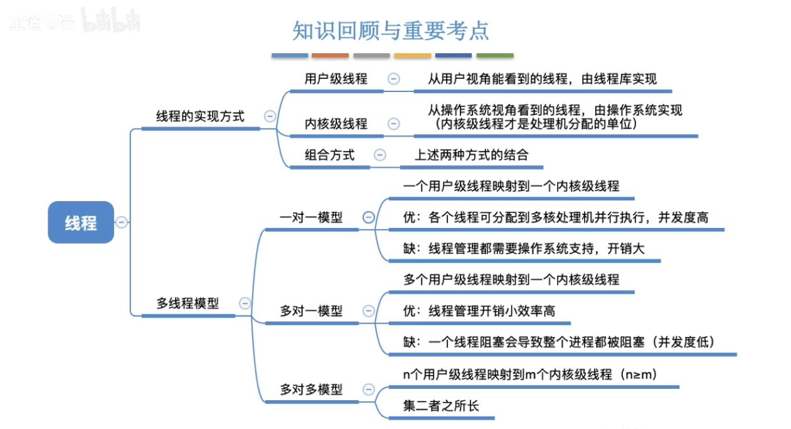
#### 1.3.1.8. 线程的状态与转换，组织与控制
线程的状态转换与进程几乎相同，这里不包括创建态和终止态
- **就绪态→运行态**：线程被调度
- **运行态→就绪态**：时间片用完
- **阻塞态→就绪态**：等待的事件发生
- **运行态→阻塞态**：等待事件

线程的组织与控制与进程也类似
线程拥有**线程控制块（TCB）**，TCB的内容与PCB类似（TID，线程状态，运行环境，线程优先级）
线程组织成线程表

### 1.3.2. 进程的调度
#### 1.3.2.1. 处理机调度
调度：不同的任务要为谁服务

**调度的三个层次**：
- **高级调度（作业调度）**：作业是一个具体的任务（一个程序）：从外存中选择一个作业进行调度，**调入内存**并**创建进程**
  - 特点：调度发生在**外存→内存**，发生**频率最低**，进程由**创建态→就绪态**
- **中级调度（内存调度）**：内存不够时，会将进程调出外存，设为**挂起状态**，等到内存空闲再重新调入
  - 特点:调度发生在**外存→内存**，发生**频率中等**，进程由**挂起态→就绪态**
- **低级调度（进程调度/处理机调度）**：从就绪队列的进程中选择一个进程进行调度（并发）
  - 特点：调度发生在**内存→CPU**，发生**频率最高**，进程由**就绪态→运行态**

进程的七状态模型（加入**就绪挂起**和**阻塞挂起**）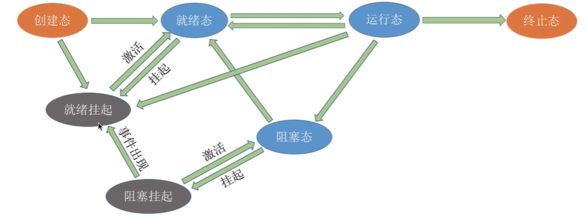
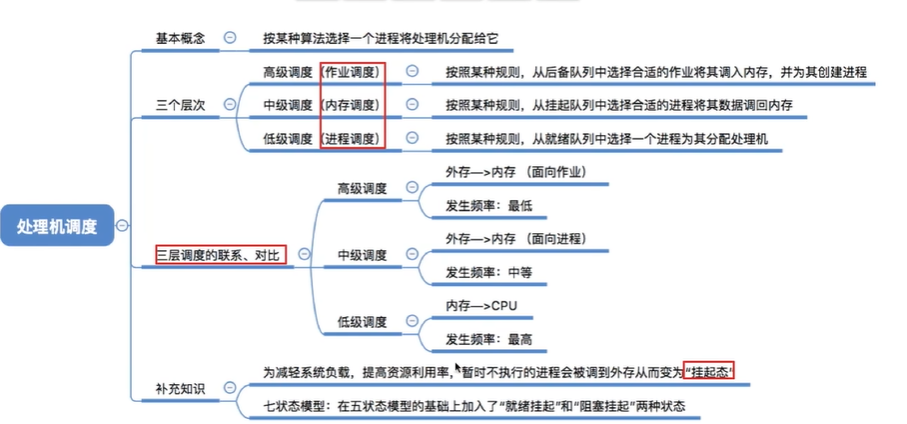

#### 1.3.2.2. 进程调度的时机，切换与过程，方式
**进程调度（低级调度）的时机**：
  - **主动放弃处理机**；请求阻塞，发生异常
  - **被动放弃处理机**：时间片用完，有更优先的任务要处理

**不能进行进程调度的时机**：**处理中断**，**再操作系统*内核程序*临界区中**，**原子操作过程中**

**临界资源**：**同一时刻只允许一个进程使用的资源**，需要**互斥访问**

**临界区**：访问临界资源的代码

**内核程序的临界区**：**访问内核的临界资源的代码**（例如就绪队列）

**进程调度的方式**：根据是否存在进程被动放弃处理机，将调度方式分为：
- **抢占式（剥夺调度方式）**：适用分时操作系统，实时操作系统
- **非抢占式（非剥夺调度方式）**：适用早起批处理系统

进程的调度是**有代价**的

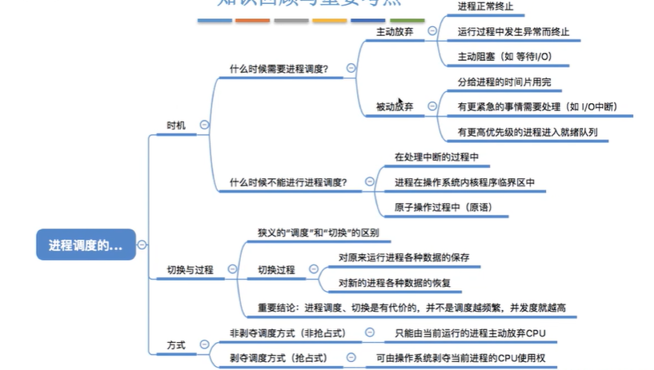

#### 1.3.2.3. 调度器（调度程序），闲逛程序
调度程序需要决定进程的：
- 让谁运行（调度算法）
- 运行多长时间（时间片大小）

调度时机：**创建新进程**，**进程退出**，**正在运行的进程阻塞**，**IO中断发生**

抢占式的调度策略，**每个时钟周期或k个时钟周期**就会触发调度程序

**闲逛进程**：没有其他就绪进程
特点：优先级最低，指令末尾进行中断检查，能耗低

#### 1.3.2.4. 评价调度算法的指标
1. **CPU利用率**：CPU处于忙绿时间的比例
2. **系统吞吐量**：单位时间完成的作业数（作业数/时间）
3. **周转时间**：作业从提交到完成的时间
4. **平均周转时间**：所有作业周转时间的平均值
5. **带权周转时间（比例）**：$\frac{周转时间}{运行时间}\geq1$
6. **平均带权周转时间**：执行时间比例的平均值
7. **等待时间**：等待被调度的时间，**等待IO调度的时间不计入**，作业的等待时间还有再外存中等待的时间
8. **响应时间**：用户从提出请求到首次响应的时间
  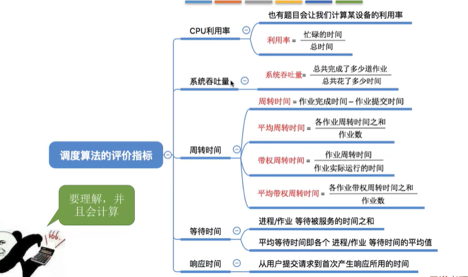

#### 1.3.2.5. ※调度算法（批处理系统）
关注算法的：思想，规则，适用于作业调度还是进程调度，是抢占式还是非抢占式，优点和缺点，**是否导致饥饿**

- **先来先服务(FCFS)，考虑等待时间**：**非抢占式**，**缺点：短作业的带权周转时间太长**；**不会导致饥饿**
- **短作业优先（SJF），考虑执行时间**：最短的进程/作业优先得到服务，同样短就按顺序来；**非抢占式，也有抢占式的版本**；优点：**平均等待时间，平均周转时间短**；缺点：**对长作业不利**；**长作业可能饥饿**
- **最短剩余时间优先（SRNF）**：短作业优先的抢占版本
- **高响应比优先算法（HRRN）,选择等待时间长，执行时间短的**：选择响应比最高的服务；**非抢占式**；**不会导致饥饿**
  - 响应比=$\frac{等待时间+要求服务时间}{要求服务时间}\geq1$，要求服务时间由程序估计
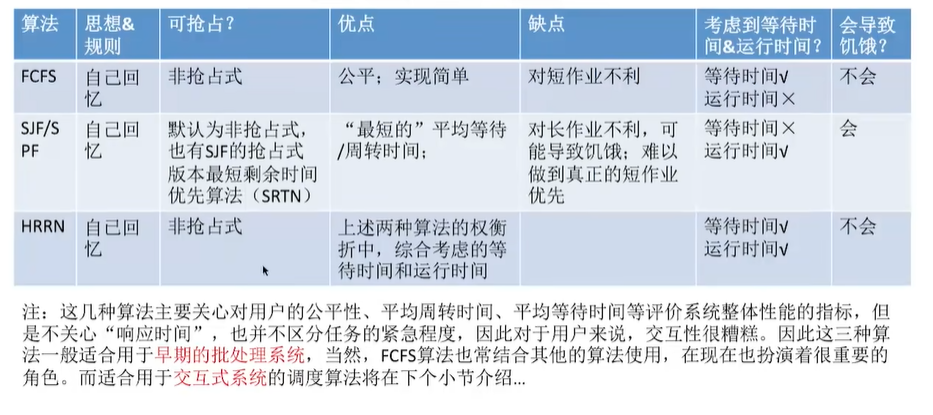

#### 1.3.2.6. ※调度算法（交互式系统）
- **时间片轮转调度算法（RR，Round-Robin）**：用于进程调度；抢占式，通过时钟中断实现；如果时间片太大，**RR就会退化为FCFS**，等待时间太长，如果时间片太短，切换代价太高；**不会导致饥饿**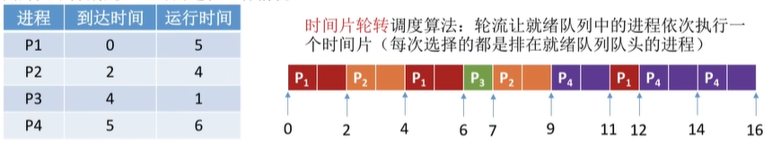
- **优先级调度算法**：可用于进程/作业调度；有抢占式的与非抢占式的版本；**可能导致饥饿**
  - 优先级通常为：**系统进程高于用户进程，前台进程高于后台进程，IO繁忙型进程高于计算型进程**
  - 根据优先级是否可以改变，分为**静态优先级和动态优先级**
  - 非抢占式：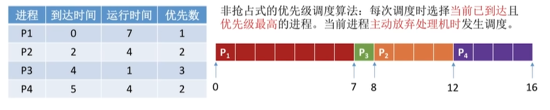
  - 抢占式：就绪队列发生改变时检查优先级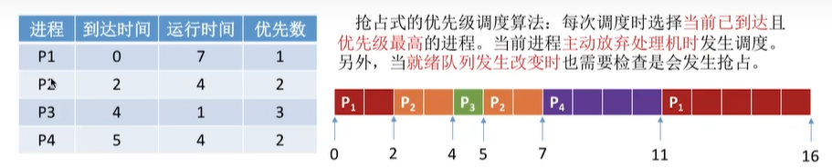
- **※多级反馈队列调度算法**：抢占式算法；用于进程调度，综合了上述的调度算法，公平（FCFS），等待时间短（SJF），响应时间短（RR），灵活调整优先级（优先级调度算法），**可能导致饥饿**
  - **※规则**：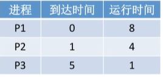
    - （分级队列）设计多级就绪队列，优先级从高到低，**时间片从小到大**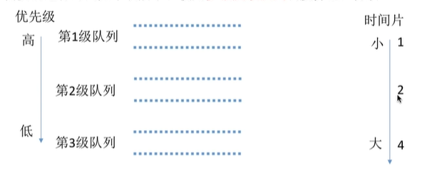
    - （每个队列为进程提供的时间片有限）新的进程会先进入第一级就绪队列，等待分配时间片，如果时间片用完还没有结束任务，则放入下一级就绪队列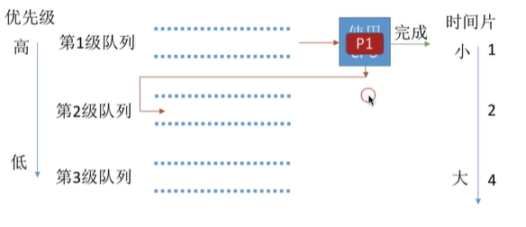
    - （上级队列优先）优先选择更高级的队列进行调度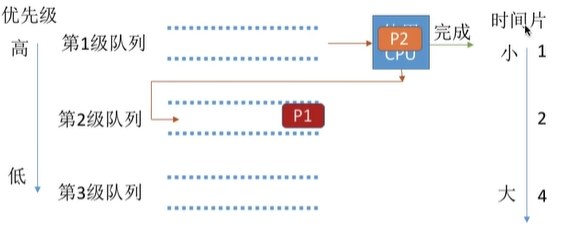
    - （抢占）每次有新任务时，会**抢占处理机资源**，未完成的任务会放入**本级队列**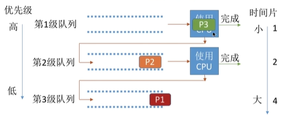
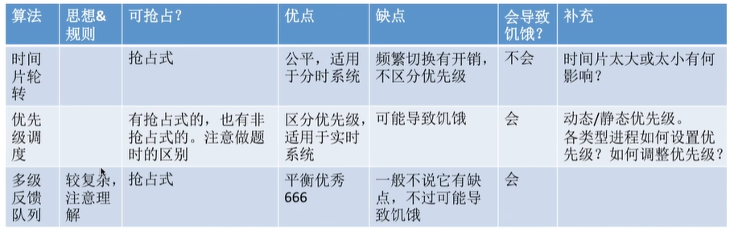

**多级队列调度算法**：按照进程类型分为多个队列，例如**系统进程队列**，**交互式进程队列**，**批处理进程队列**
- 通常**系统进程>交互式进程>批处理进程**
- 可以采取优先级调度算法，时间片划分（如为这三个队列分配50%，40%，10%的时间片
- 各级队列可以采用不同的调度算法，例如**系统进程采用优先级策略，交互式进程采用RR，批处理进程采用FCFS**

**分时操作系统**：追求快速响应和资源共享的公平性。
**实时操作系统**：必须在严格规定的时间内完成特定任务。

#### 1.3.2.7. 多处理机调度
与单处理机调度相比，多处理机还要考虑：选择哪一个CPU去运行

**新的调度目标**：**负载均衡**，**处理机亲和性**
**处理机亲和性**：尽量让**一个进程调度到一个CPU上**运行，发挥CPU的Cache的作用

**方案**：
- **公共就绪队列**
  - 规则：所有CPU**共享一个就绪队列**，每个CPU空闲时都会运行调度程序
  - 特点：**互斥访问就绪队列**
  - 优点：天然实现**负载均衡**
  - 缺点：处理机亲和性不好
  - 解决方法：
    - **软亲和**：由进程调度程序尽量保证亲和性
    - **硬亲和**：用户进程通过系统调用自行选择CPU
- **私有就绪队列**
  - 规则：每个CPU都拥**有自己的就绪队列**
  - 优点：天然实现**处理机亲和性**
  - 缺点：负载不均衡
  - 解决方法：
    - **推迁移**：特定的系统程序检查CPU负载，如果由CPU忙碌，就分配一些进程到其他CPU
    - **拉迁移**：CPU周期性检查自身负载，如果自身相对空闲，就从其他CPU主动拉一些进程到自己的CPU
  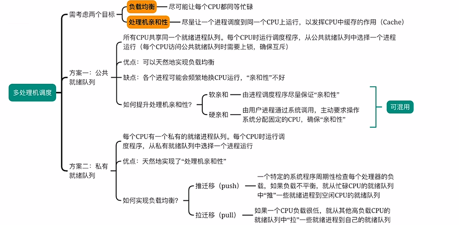

### 1.3.3. 进程的同步与互斥
####   1.3.3.1. 同步与互斥的概念
同步：进程执行保证顺序
互斥：同一时间只允许一个进程访问

实现进程的互斥的代码需要有：
- **进入区**：检查是否可进入临界区，如果可进入，先上锁
- **临界区/临界段**访问临界资源的代码
- **退出区**：解锁临界资源
- **做其他处理**：做其他处理

为了保证对临界资源的互斥访问，需要保证下面的原则：
- **空闲让进**
- **忙则等待**
- **有限等待**：保证不会饥饿
- **让权等待**：进不来临界区的进程，要释放处理机（不会空循环）
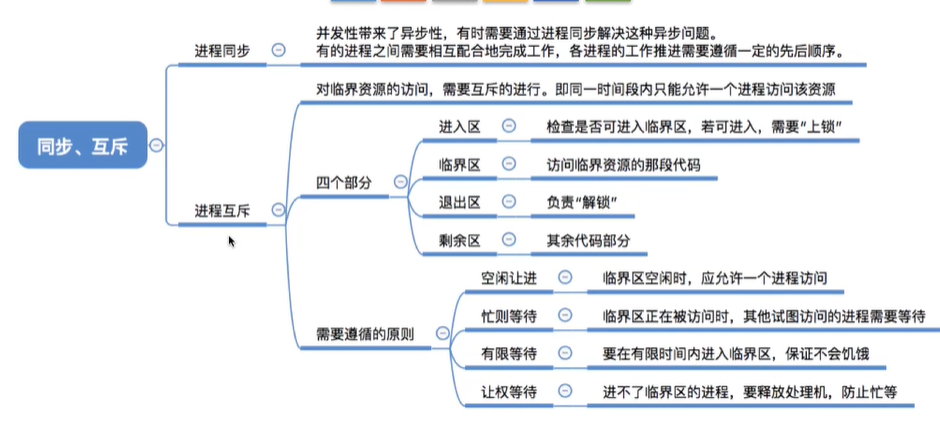

#### 1.3.3.2. 进程互斥的软件实现方法
**进入区的实现逻辑**：
- **单标志法**：一个进程访问完临界区把权限赋予另一个进程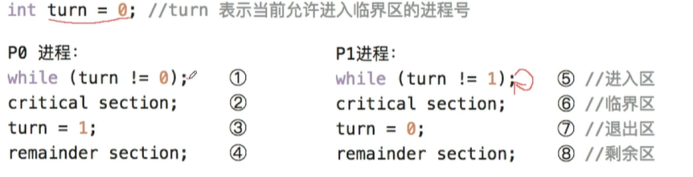
  - 缺点：**违背空闲让进规则**（虽然被赋予了权限，但是不用资源，导致资源空闲）
- **双标志先检查**：用一个数组flag[]标记各个进程是否想进入临界区，如果没有进程想进入，自己就进入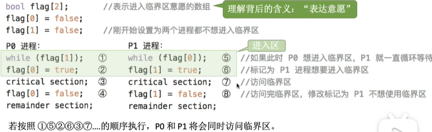
  - 缺点：**违反忙则等待原则**（执行顺序1，5，2，6，导致无法互斥访问）
- **双标志后检查**：用一个数组flag[]标记各个进程是否想进入临界区，但是是先上锁，再检查是否有进程想要进入临界区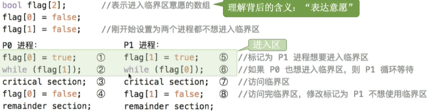
  - 缺点：**违背空闲让进和有限等待原则**（产生了死锁，饥饿现象）
- **Peterson算法**：结合单标志和双标志法，先设flag，再设turn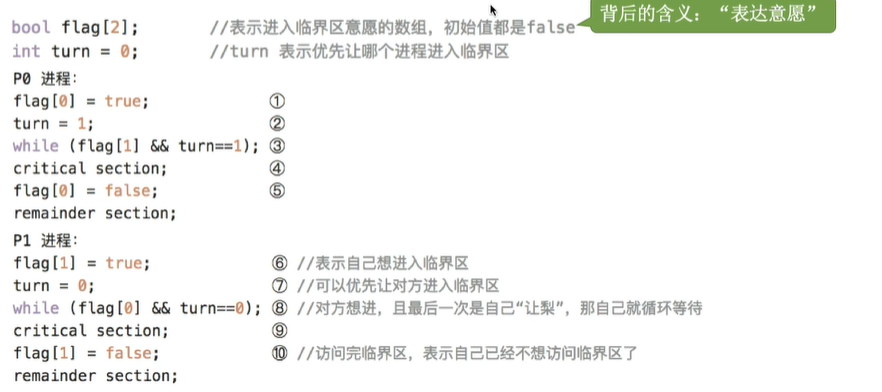
  - 优点：**满足了空闲让进，忙则等待，有限等待**
  - 缺点：**违背让权等待**（未进入临界区的进程会空循环，而不会让出处理机资源）
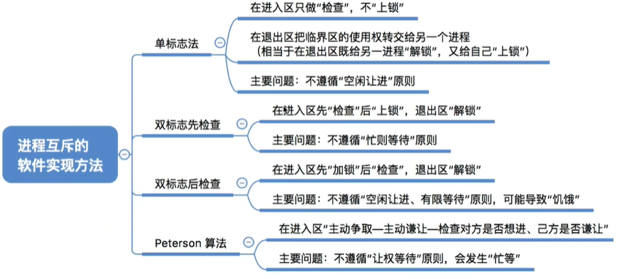
#### 1.3.3.3. 进程互斥的硬件实现方法
- **中断屏蔽方法**：使用临界区前后使用开中断/关中断指令
  - 优点：简单高效
  - 缺点：**不适用于多处理机**，**只适用于内核进程（特权指令）**
- **TestAndSet指令（TS指令）/TestAndSetLock指令（TSL指令）**：TSL指令是硬件实现的，且**不允许被中断**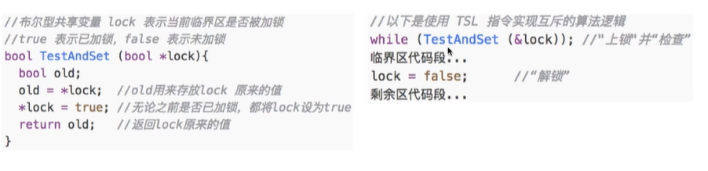
  - 优点：实现简单，适用多处理机
  - 缺点：**不满足让权等待原则**
- **Swap指令（XCHG指令）**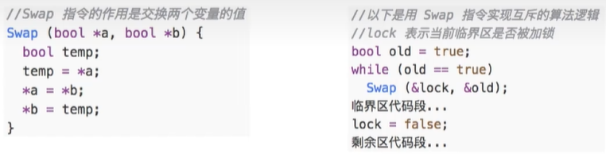
  - 优点：实现简单，适用多处理机
  - 缺点：**不满足让权等待原则**
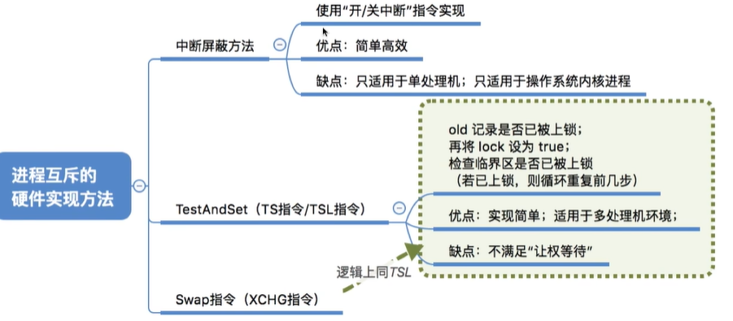
#### 1.3.3.4. 互斥锁（mutex lock)
函数acquire()上锁，release()解锁，变量available标识锁的状态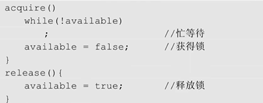
缺点：忙等待，**违反让权等待原则**

需要循环忙等待的互斥锁，都可以称为**自旋锁**
缺点：自旋锁都**违反让权等待原则**
优点：等待期间**无需切换进程上下文**，如果上锁时间很短则代价很低，**适用于多处理机**
#### 1.3.3.5. ※※信号量
**wait(S)原语（P操作）**，**signal(S)原语（V操作）**，P来源为proberen，意为尝试，测试，即尝试获取资源，失败就不断尝试直到成功，空闲资源--，V来源为Verhogen，意为增加，即将获取的资源释放出来，空闲资源++

信号量：
- **整型信号量**：标识资源的数量，**会发生忙等，不满足让权等待**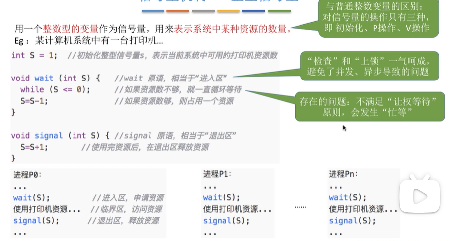
- **※※记录型信号量**：表示资源的数量和等待的队列，block(S.L)：阻塞进程并将进程加入阻塞队列，wakeup(S.L)：唤醒阻塞队列队头的进程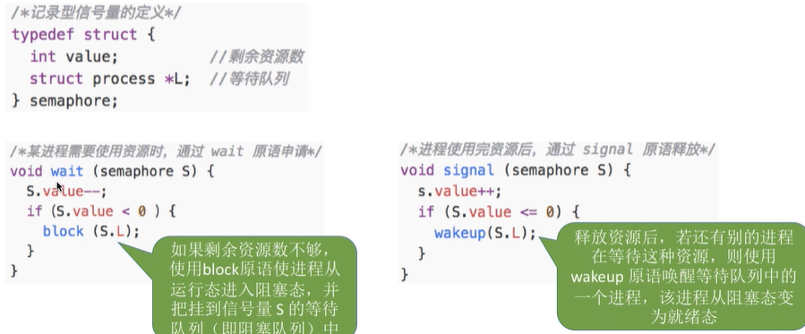
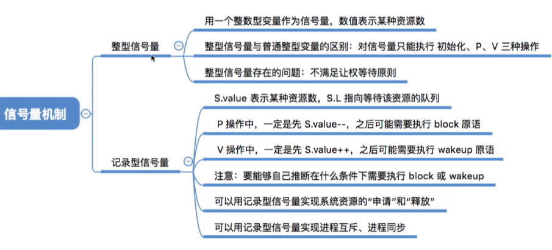
#### 1.3.3.6. ※※使用信号量实现进程的同步与互斥
**用信号量机制实现进程的互斥（前P后V）**:
- 资源本身存在，信号量初始不为0
1. P操作尝试获取资源，失败则阻塞
2. 获取完资源使用V操作释放资源
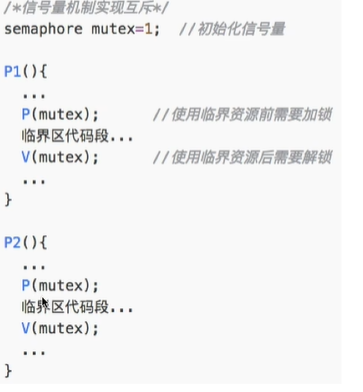

使用信号量实现互斥要注意：
1. 信号量mutex是**记录型信号量**
2. PV操作必须**成对出现**
3. **不同的临界资源使用不同的信号量**

**用信号量机制实现进程的同步（前V后P）**：例如，需要在进程1的代码1，2后执行进程2的代码4
-  信号量S代表进程1已经完成的结果，初始状态没有进程1完成的结果，S=0
-  进程1一旦完成结果（执行完代码12）就将信号量++
- 进程2尝试获取1完成的结果
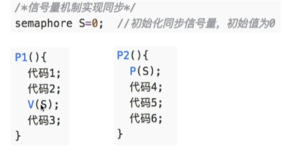

复杂的同步关系，每一个同步都需要单独设置一个信号量
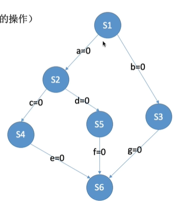
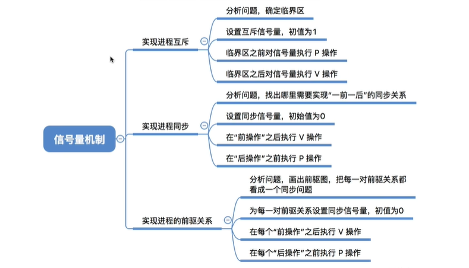

#### 1.3.3.7. 生产者，消费者问题：同步问题
问题：系统中有一组生产者进程和一组消费者进程，生产者进程每次生产一个产品**放入缓冲区**，消费者进程每次**从缓冲区中取出**一个产品并使用。(注:这里的“产品”理解为某种数据)生产者、消费者共享一个初始为空、**大小为n**的缓冲区。只有缓冲区没满时，生产者才能把产品放入缓冲区，否则必须等待。

分析：这是**两个同步问题+互斥问题**：
- 同步：**只有**缓冲区没满，生产者**才能**生产，**资源为缓冲区的空位**；
- 同步：**只有**缓冲区非空，消费者**才能**消费，**资源为缓冲区的资源**
- 互斥：生产者，消费者必须**互斥访问缓冲区资源**

方法：
1. **定义信号量**
   - 设置信号量**full**，用于标识“缓冲区的对象”资源，用于**喂给消费者**
   - 设置信号量**empty**，用于标识“缓冲区的空位”资源，用于**喂给生产者**
   - 设置信号量**mutex**,用于实现**互斥访问缓冲区**
2. **信号量的初始值**：
     - empty为n，full为0，mutex=1
3. **程序编写**：
    - 生产者每次生产一个产品，就将消耗一个空位资源，产生一个对象资源
    - 消费者每次消费一个产品，就会消耗一个对象资源，产生一个空位资源
    - **PV操作的时机是访问临界资源的前后，访问临界资源前要P，访问临界资源后要V**：否则会造成临界区过长，影响效率
      - 生产者生产产品 → **P (empty) → 将产品放入缓冲区 → V (full)**
      - **P (full) → 消费者从缓冲区拿出产品 → V (empty)** → 使用产品
    - **实现互斥访问的mutex必须放在最内层:如果先互斥P再同步P，会导致死锁，V的顺序不影响**
      - 生产者生产产品 → P (empty) → **P (mutex) → 将产品放入缓冲区 → V (mutex)** → V (full)
      - P (full) → **P (mutex) → 消费者从缓冲区拿出产品 → V (mutex)** → V (empty) → 使用产品
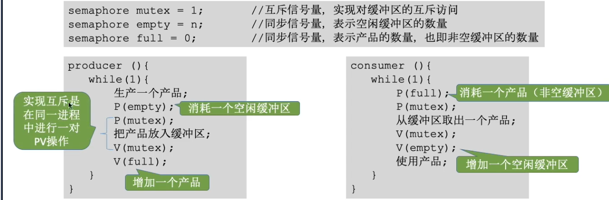
#### 1.3.3.8. 多生产者，多消费者问题：同步问题
问题：桌子上有一只盘子，每次只能向其中放入**一个水果**。爸爸专向盘子中放**苹果**，妈妈专向盘子中放**橘子**，儿子专等着吃盘子中的橘子，女儿专等着吃盘子中的苹果。只有盘子空时，爸爸或妈妈才可向盘子中放一个水果。仅当盘子中有自己需要的水果时，儿子或女儿可以从盘子中取出水果。用PV操作实现上述过程。

实质上为：**多种类型的资源共用一个缓冲区**

分析：这是**三个同步问题和一个互斥问题**
- 同步：只有盘子没满，爸爸妈妈才能放水果，资源是**盘子的空位**
- 同步：只有盘子里有苹果，女儿才能吃苹果，资源是**盘子里的苹果**
- 同步：只有盘子里有橘子，儿子才能吃橘子，资源是**盘子里的橘子**
- 互斥：对盘子的访问需要互斥访问

方法：
1. **定义信号量**
   - 设置信号量**apple**，用于标识“缓冲区的苹果”资源，用于**喂给女儿**
   - 设置信号量**orange**，用于标识“缓冲区的橘子”资源，用于**喂给儿子**
   - 设置信号量**empty**，用于标识“缓冲区的空位”资源，用于**喂给生产者**
   - 设置信号量**mutex**,用于实现**互斥访问缓冲区**
2. **信号量的初始值**：
     - empty为1，apple为0，orange为0，mutex为1
3. **程序编写**：
    - 生产者每次生产一个产品，就将消耗一个空位资源，产生一个对象资源
    - 儿子每次消费一个橘子，就会消耗一个橘子，产生一个空位资源
    - 女儿每次消费一个苹果，就会消耗一个苹果，产生一个空位资源
    - **PV操作的时机是访问临界资源的前后，访问临界资源前要P，访问临界资源后要V**：否则会造成临界区过长，影响效率
    - **实现互斥访问的mutex必须放在最内层:如果先互斥P再同步P，会导致死锁，V的顺序不影响**
      - 爸爸生产一个苹果 → P(empty) → P(mutex) → 将苹果放入盘子 → V(mutex) → V(apple)
      - 妈妈生产一个橘子 → P(empty) → P(mutex) → 将苹果放入盘子 → V(mutex) → V(orange)
      - P(apple) → P(mutex) → 女儿从盘子中拿走一个苹果 → V(mutex) → V(empty)
      - P(orange) → P(mutex) → 儿子从盘子中拿走一个橘子 → V(mutex) → V(empty)
    - **可以不用mutex实现互斥！原因为缓冲区的大小只为1，如果empty大于1，就必须使用mutex互斥访问了，但为了稳妥通通加上**

#### 1.3.3.9. 读者，写者问题：复杂的互斥问题
问题：有读者和写者两组并发进程，共享一个文件，当两个或两个以上的**读进程同时访问共享数据时不会产生副作用**，但若某个**写进程和其他进程(读进程或写进程)同时访问共享数据时则可能导致数据不一致的错误**。因此要求:①允许多个读者可以同时对文件执行读操作;②只允许一个写者往文件中写信息;③任一写者在完成写操作之前不允许其他读者或写者工作;④写者执行写操作前，应让已有的读者和写者全部退出。

同步互斥分析：
- 同步：只有没有写进程访问文件，才能读文件
- 同步：只有没有进程访问文件，才能写文件
- 不互斥：多个读者读文件，不互斥
- 互斥：多个写者写文件，互斥

状态分析，同一时刻可能：
- 既没有读进程，也没有写进程
- 只有读进程，**且有可能有多个读进程**
- 只有写进程

方法：
1. **定义信号量**
   - 设置变量**rc**，用于标识“读进程的数量”
   - 设置信号量**rc_mutex**，用于保证互斥访问rc
   - 设置信号量**mutex**，用户互斥访问缓冲区
2. **信号量与变量的初始值**：
     - rc为0，rc_mutex为1，mutex为1
3. 程序：
   - 方法1：
     - **读者**：
        ```
        reader(){
          P(rc_mutex);
          if(rc == 0) P(mutex);
          rc++
          V(rc_mutex);
          读文件
          P(rc_mutex);
          rc--;
          if(rc == 0) V(mutex);
          V(rc_mutex);
        }
        ```
     - 写者：
        ```
        writer(){
          P(mutex);
          写文件
          V(mutex);
        }
        ```
     - 缺点：**会导致写进程饿死，没有满足写优先**
   - **※方法2**：**添加信号量w = 1，实现读写平等**
     - **读者**：
        ```
        reader(){
          P(w); #实现读写平等
          P(rc_mutex);
          if(rc == 0) P(mutex);
          rc++
          V(rc_mutex);
          V(w); #实现读写平等
          读文件
          P(rc_mutex);
          rc--;
          if(rc == 0) V(mutex);
          V(rc_mutex);
        }
        ```
     - **写者**：
        ```
        writer(){
          P(w); #实现读写平等
          P(mutex);
          写文件
          V(mutex);
          V(w); #实现读写平等
        }
        ```

#### 1.3.3.10. 哲学家进餐问题
问题:一张圆桌上坐着5名哲学家，每两个哲学家之间的桌上摆一根筷子，桌子的中间是一碗米饭。哲学家们倾注毕生的精力用于思考和进餐，哲学家在思考时，并不影响他人。只有当哲学家饥饿时，才试图拿起左、右两根筷子(一根一根地拿起)。如果筷子已在他人手上，则需等待。饥饿的哲学家只有同时拿起两根筷子才可以开始进餐，当进餐完毕后，放下子继续思考。

难点：**避免死锁**

**设置**信号量chopsticks[5]={1,1,1,1,1}
**第i个哲学家左边的筷子为i，右边的筷子为(i+1)%5**

```
程序：
P(i){
  P(chopsticks[i]);
  P(chopsticks[(i+1)%5]);
  吃饭
  V(chopsticks[i]);
  V(chopsticks[(i+1)%5]);
}
```
**缺点：当五个进程同时运行，会发生死锁**

方法1：至多四个哲学家同时进餐（设置一个信号量，值为4）
方案2：奇数的哲学家优先拿左边的筷子，偶数的哲学家优先拿右边的筷子 
方案3：**拿筷子必须互斥**
```
方案3：
P(i){
  P(mutex);
  P(chopsticks[i]);
  P(chopsticks[(i+1)%5]);
  V(mutex);
  吃饭
  V(chopsticks[i]);
  V(chopsticks[(i+1)%5]);
}
```
#### 1.3.3.11. 管程
信号量机制编写困难，易出错，于是引入了管程

**※管程的特征**：
- 管程中的数据是静态的，也就是被对象所共享
- **外部进程只能通过管程的入口才能访问共享数据**
- 管程类似于一个类，但对于这个类中的同一方法，**同一时刻只能有一个管程在执行（等待操作不算做执行）**，只能互斥的执行


定义管程：monitor 类名 …… end moniter;

实现互斥访问缓冲区；由编译器保证完成，无需担心
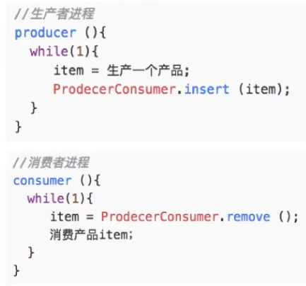

实现同步，需要在管程内设置条件变量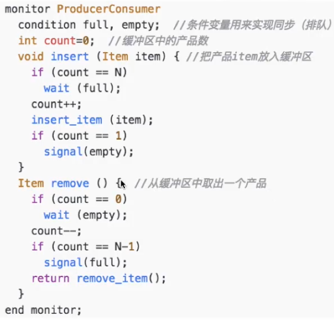

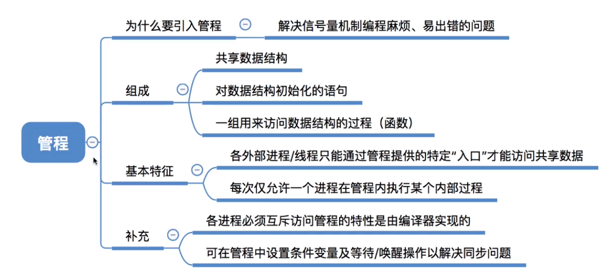

### 1.3.4. 进程的死锁
#### 1.3.4.1. 死锁的概念
**※死锁，饥饿，死循环的对比**：
- 死锁：各个进程因竞争资源，**互相等待对方手中的资源**，导致进程都阻塞
- 饥饿：**长期得不到资源**导致无法推进
- 死循环：由于bug进程无法跳出循环
对比：
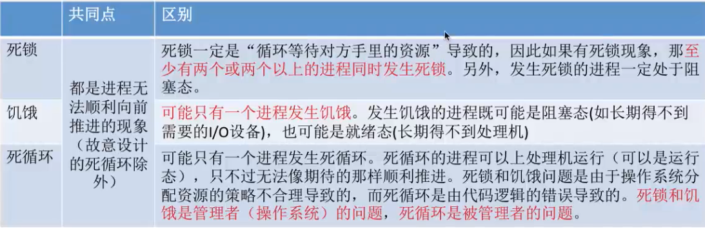

死锁发生的必要条件：
- **互斥条件**，资源互斥访问，需要竞争
- **不可剥夺条件**，未使用完不能被抢走
- **请求和保持条件**：已经保持拥有了至少一个资源，又去请求其他的资源
- **循环等待条件**：各个进程形成**资源的循环等待链**（但是发生**资源循环等待时不一定会发生死锁**（有替代资源））

发生死锁的时机：对不可剥夺的资源分配不合理，就会发生死锁
- 对不可剥夺资源的竞争
- 推进顺序非法
- 信号量使用不当

处理死锁的策略
- 预防死锁
- 避免死锁（银行家算法
- 死锁的检测和解除

#### 1.3.4.2. 处理死锁的策略：预防死锁
破坏死锁的四个必要条件：
1. **破坏互斥条件**：把互斥资源改造为允许共享使用的资源（**SPOOLing技术**）
2. **破坏不可剥夺条件**：缺点：**一般只适用于已保存和回复的资源，如CPU；实现复杂；反复申请和释放会增加系统开销**
   - 方案1：当进程请求的资源得不到满足时，必须立即释放所有的资源（缺点：**可能导致饥饿**）
   - 方案2：当进程需要的资源被占有时，可以由操作系统协助，将想要的资源强行剥夺（需要考虑进程的优先级）
3. **破坏请求和保持条件**：**静态分配方法**：进程在运行之前一次性申请完它所需要的全部资源（缺点：**可能造成饥饿；资源利用率低**）
4. **破坏循环等待条件**：采用**顺序分配法**：将系统资源进行编号，每个进程必须按照**系统资源编号从小到大**的顺序申请系统资源（缺点：**不方便增加新的设备；进程使用的资源顺序可能和编号顺序不一致，会导致资源浪费；用户编程麻烦**
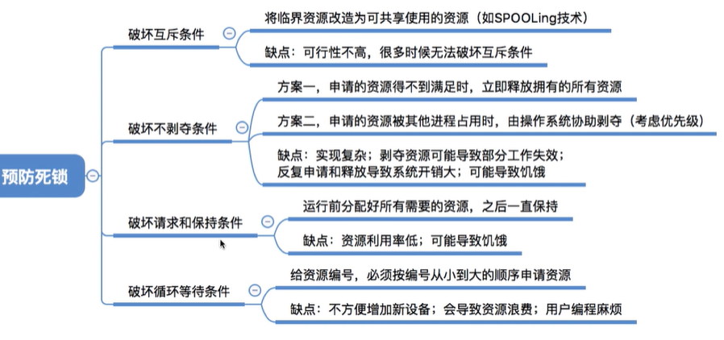
#### 1.3.4.3. ※处理死锁的策略：避免死锁
**安全性算法**：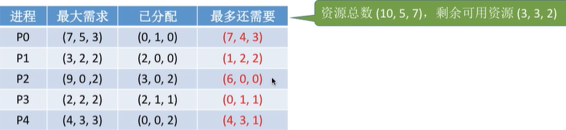
1. 当前资源可以满足P1，P3，将P1，P3加入安全序列
2. P1，P3使用完资源后归还资源，目前的资源总量为（7，4，3）
3. 资源归还够P0，P2，P4使用，将P0，P2，P4加入安全序列
4. 全部分配完成，安全序列为P1，P3，P0，P2，P4

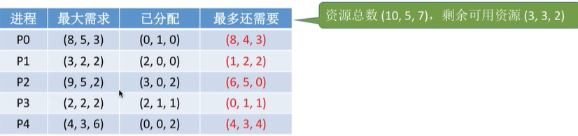
找不到安全序列，系统处于不安全状态

系统处于不安全状态不一定会死锁，**但是死锁一定处于不安全状态**，**安全状态一定不会死锁**

代码实现银行家算法：
长度为m的一维数组 Available 表示还有多少可用资源；n* m矩阵Max 表示各进程对资源的最大需求数；n*m矩阵 Allocation 表示已经给各进程分配了多少资源；Max-Allocation=Need矩阵表示各进程最多还需要多少资源；用长度为m的一位数组Request 表示进程此次申请的各种资源数
1. **检查此次申请是否超过了之前声明的最大需求数**
2. **检查此时系统剩余的可用资源是否还能满足这次请求**
3. **用安全性算法判断这次分配会不会使系统进入不安全状态**

#### 1.3.4.4. 处理死锁的策略：死锁的检测和解除
资源分配图：
- 进程结点和资源结点
- 进程结点指向资源结点（表示正在等待分配资源）；资源结点指向进程结点（表示已经分配）

可完全简化：能消除所有的边，此时一定没有发生死锁
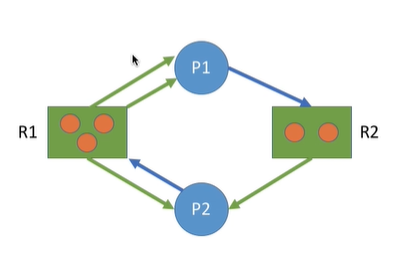
不能消除所有边：系统发生死锁
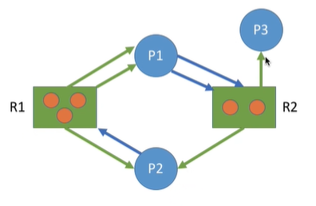

死锁：化简资源分配图，化简完仍连着边的就是死锁状态
解决方法：1.**资源剥夺法**；2.**撤销进程法**（终止进程法）3.**进程回退法**
选择对谁动手：考虑：进程优先级；已执行了多长时间；还有多长时间能完成；进程已经使用了多少资源；进程是交互式还是批处理式

---

## 1.4. 内存
### 1.4.1. 内存管理
#### 1.4.1.1. 内存的基础知识（学会即可）
内存的作用：程序执行前需要先放在内存中才能处理（目的是缓和CPU和硬盘之间速度的矛盾）

内存地址：
- 内存从0开始，**每个地址对应一个存储单元**；
- 如果计算机**按字节编址**,那么每个存储单元的大小就是一个字节（1B = 8b）
- 如果计算机**按字编址**,那么每个存储单元的大小就是一个字长，不同计算机的字长不同，大多为16b

**单位换算**：$1K=2^{10} B,1M=2^{20} B,1G=2^{30} B$
地址长度：如果内存大小为4GB，就有$2^{32}$个存储单位，需要**32个二进制位**才能唯一标识一个地址，也就是4字节（32位系统最多支持4GB内存，地址长度为4字节）

指令的工作原理：指令（指令代码，地址参数……）
指令就是通过地址找到要操作的对象

**逻辑地址**：程序经过编译、链接后生成的指令，指令的地址参数**是逻辑地址**而**不是固定的物理地址**，操作系统给进程分配内存，内存地址会经过虚拟化，程序操作的是虚拟地址而不是物理地址

根据将逻辑地址转换到虚拟地址的时间不同，分为：
- **绝对装入**：程序在**被编译时**，就已经确定了它在内存中的确切物理地址。例如，程序的指令地址为79，编译时将所有地址加100
  - 缺点：只适用于**单道程序环境**，灵活性很低
- **可重定位装入**（**静态重定位**）：地址的转换工作是在**程序装入内存**时**一次性**完成的。
  - 优点：支持了多道程序并发，适用于多道批处理系统
  - 缺点：作业一旦进入内存，**运行期间就不能移动**；要求分配空间连续
- **动态运行时装入**（**动态重定位**）：地址转换被**推迟到程序真正运行、CPU要访问某条指令或数据时**才进行。这种需要**重定位寄存器（基址寄存器）的支持**

编译：将一个个源代码文件编译为一个个含有机器代码的模块(.o文件)，模块按逻辑**地址寻址**
链接：将一个个模块链接为**装入模块**(.exe文件)
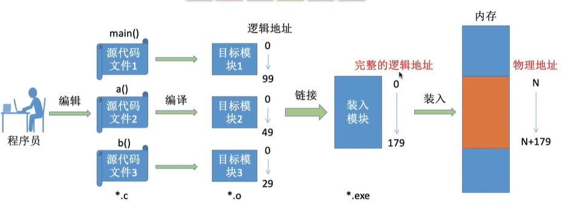

三种链接方式：
- **静态链接**：程序运行前就被链接为一个完整的装入模块（确定了逻辑地址）
- **装入式动态链接**：程序装入内存时将需要的模块装入内存再链接
- **运行时动态链接**：只有运行时需要某个模块才把需要的模块装入内存再链接
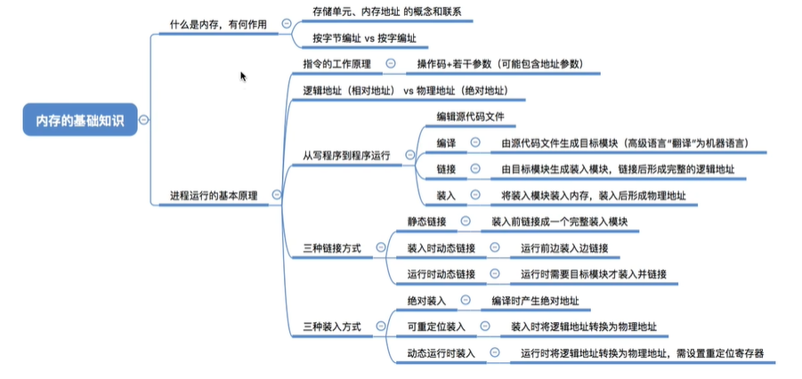
#### 1.4.1.2. 内存管理的概念
内存管理的功能：
1. 负责内存空间的**分配与回收**
2. **对内存空间进行扩充**
3. **地址转换**（三种装入方式）
4. **内存保护**：各个进程只能访问自己的内存空间
   
实现内存保护的两种方式：
1. 设置**上下限寄存器**，每次都判断指令的地址是否超过上下限
2. 设置**重定位寄存器（基址寄存器）**和**界地址寄存器（限长寄存器）**，指令的逻辑地址先与限长寄存器比较，合法再与基址寄存器计算出物理地址

#### 1.4.1.3. 进程的内存映像
进程的内存映像：系统给进程分配的内存长什么样

内核区-最高地址（1GB，0xFFFFFFFF~0xC0000000）
用户区
未使用区-最低地址

用户区包括：从高到低
- **用户栈**：局部变量，函数调用的相关信息
- **共享库的存储映射区**：如printf的代码
- **堆**：malloc分配的区域
- **读/写数据**：全局、静态变量
- **只读代码，数据**：程序指令、只读数据
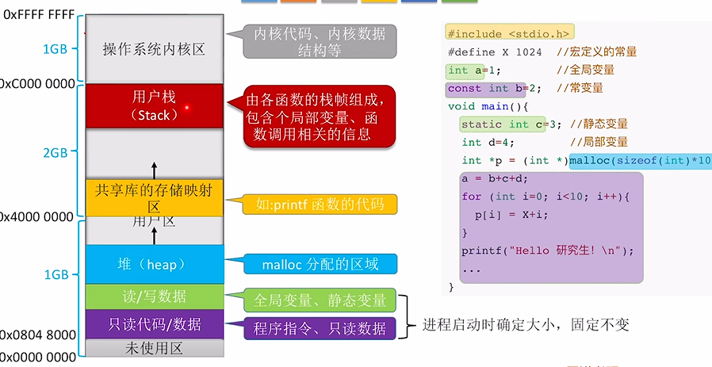

宏定义会在**编译阶段**替换变量
#### 1.4.1.4. 功能：内存空间的扩充（理解即可）
**覆盖技术**：解决程序大小超过物理内存总和
思想：将程序分为**多个段**，常驻的内存分入**固定区**，不常用的分入**覆盖区**
缺点：**对用户不透明**，增加用户编程负担

**交换技术/对换技术**：内存紧张时，将内存中的某些进程**换出外存**，外存中具备运行条件的进程**换入内存**（进程在内存和外存之间动态调度）
  - 暂时换出外存等待的进程状态为**挂起状态**
  - 具有对换功能的操作系统通常把磁盘空间划分为**对换区**和**文件区**，对换区的IO速度更快
  - 交换发生在多进程运行且内存吃紧时（**经常发生缺页**）
  - 优先换出**阻塞进程**，**低优先级进程**，还会考虑驻留时间
  - **PCB会常驻内存**
  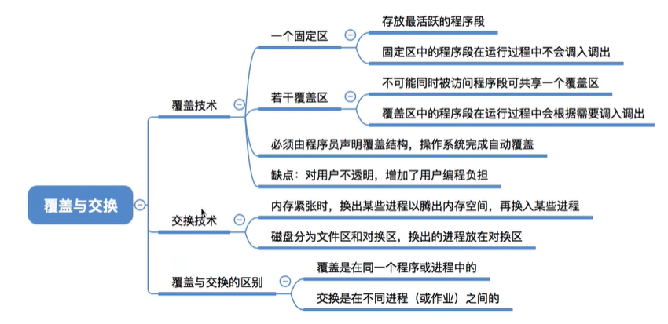

#### 1.4.1.5. 连续分配管理方式
**内部碎片**是指**分配给进程的内存**由部分没有用上
**外部碎片**是指内存中的某些**空闲分区太小**而难以利用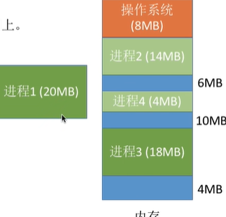
**解决外部碎片**：**拼凑/紧凑技术**（**动态重定位的装入技术**最适合

**连续分配管理方式**：分配的是连续的内存
- **单一连续分配**：内存会被分为**系统区，用户区**，内存中**只有一道用户程序**
  - 优点：简单，**无外部碎片**，可以用覆盖技术扩充内存，不一定采取内存保护
  - 缺点：只适用于单用户单任务操作系统，**由内部碎片**，存储器利用率极低
- **固定分区分配方式**：将**用户空间**分为**若干个固定大小的分区**，每个分区只能装入**一道作业**，分区大小可以相等，可以不等
  - 可以建立一个**分区说明表**的数据结构，用来记录：分区号，大小，起始地址，分配状态等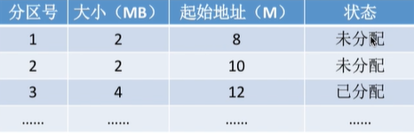
  - 优点：简单，**无外部碎片**
  - 缺点：程序太大，可能所有分区都无法满足要求；**会产生内部碎片**
- **动态分区分配（可变分区分配）**：进程装入内存时才会根据进程的大小动态建立分区
  1. 使用什么数据结构记录内存的使用情况？
       - **空闲分区表**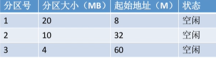
       - **空闲分区链**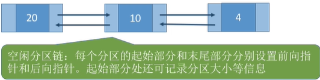
  2. **※当多个空闲分区都可以满足需求，应该选择哪个分区分配？**
     - **按照动态分区分配算法**
       - **首次适应算法**：找到第一个合适的（实现：空闲分区表/分区链按地址排序）（**缺点**：会在低地址留下越来越多的外部碎片）（优点：保留了高地址的大分区）
       - **最佳适应算法**：找到符合条件最小的（**实现**：表/链按照**容量递增排序**）（**缺点**：会留下越来越多的**外部碎片**）
       - **最坏适应算法**：使用容量最大的空闲分区（**实现**：按照**容量递减排序**）（**缺点**：大进程可能无分区可用）
       - **临近适应算法**：首次适应算法，但每次从上一次检索结束的位置开始查找（适合**空闲分区链**）（优点：低地址不会出现大量外部碎片）（缺点：大进程可能无分区可用）
       - 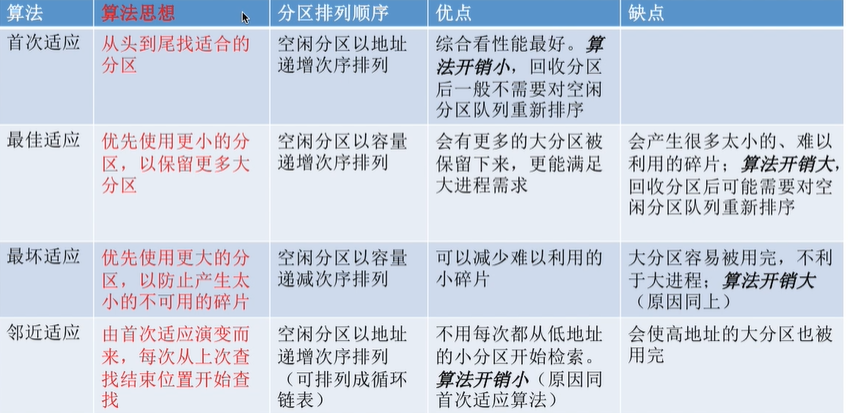
  3. 如何进行分区的分配和回收？假设使用的是空闲分区表
     - **分配在一个大分区**：从一个分区中摘出一部分：修改对应分区大小和起始地址
     - **分配在一个刚好的分区**：把一个分区全部分配给这一个进程：删除对应的表项
     - **回收一个后面有相邻分区的分区**：需要合并后面相邻的分区
     - **回收一个前面有相邻分区的分区**：需要合并前面相邻的分区
     - **回收一个前面和后面都有相邻分区的分区**：需要合并前面和后面相邻的分区，由两个空闲分区变为一个空闲分区
     - **回收一个前面和后面都没有相邻分区的分区**：需要添加一个表项（表项不一定要按照地址从小到大排序）
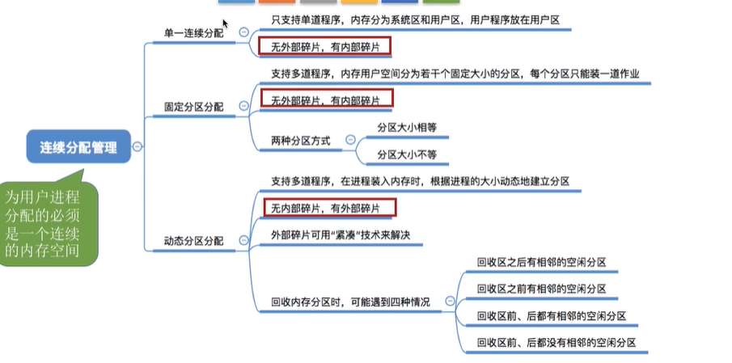
#### 1.4.1.6. ※离散分配管理方式：基本分页存储管理
**分页存储**：
- **页框**：系统将**内存**划分为**一个个大小相等的分区**，每个分区就是一个**页框**，页框号从0开始
- **页框=页帧=内存块=物理块=物理页面**
操作系统也会把**进程的逻辑地址**划分为**与页框大小相等**的一个个部分，每个部分称为一个**页/页面**
- 进程的每个页放入一个页框中，**页与页框是一一对应的**（页框是用于装载页的框架）
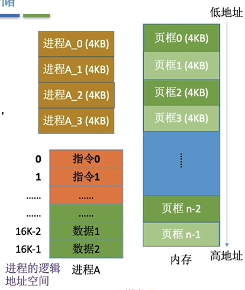

- **页表**：为**每个进程**创建的，用于标识进程的**页与页框的映射关系**，页表项由**页号**（进程的页）与**内存块号/页框号**（内存的块）组成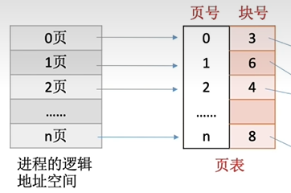
- **页表占用的空间**：假设页面大小为4KB，32位系统中，4GB内存共计$2^{20}$个页框，需要20b来标识，也就是需要3B来标识内存块号，页号不需要占内存空间（**块号在内存中连续存放**），进程有n个页面，页表就要占用3n(B)的空间
- **计算内存地址**：块号*块大小
- **逻辑地址与物理地址的转换**：如果要访问逻辑地址A=110，块大小为50B，进程的逻辑地址空间大小为200B：
  1. 确定A的页号（确定页表的左项）110/50=2，页号为2
  2. 根据页表的映射关系确定页框号
  3. 确定A的页内偏移量：110%50=10，页内偏移量为10
  4. 物理地址 = 块号*块大小+页内偏移量
- **如果页大小为$2^k$，那么逻辑地址的后k为就是偏移量，前n-k位就是页号**
- **如果偏移量为k位，那么页大小就为$2^k$，页号为m位，则最多允许$2^m$个页面**
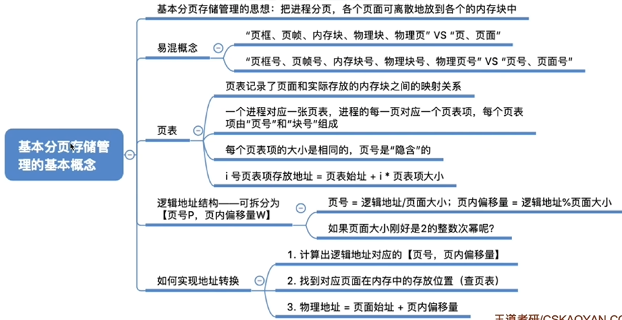
#### 1.4.1.7. ※※基本地址变换机构
在分页存储的模式下，用于实现逻辑地址到物理地址映射的**硬件机构**
系统会设置一个**页表寄存器**（**PTR**），存放当前**运行的进程**的页表的位置，包括**起始地址（物理地址）**和**页表长度**。页表的地址和长度被**存放在PCB中**，只有在被调度时才会被放入页表寄存器中。

**※※转换过程**：
1. **进程调度前**：PCB存放在内存的系统区中
2. **进程被调度**：把PCB中的页表信息放入**页表寄存器**，页表信息包括**页表起始地址（物理地址）**和**页表长度**；下一条要运行的**指令的逻辑地址**放入**程序计数器PC**
3. 逻辑地址被切分为**逻辑地址的页号**和**逻辑地址的页内偏移量**
4. **检查页号的合法性**： 如果逻辑地址的页号**大于等于（页号从0开始）**页表寄存器的页表长度，则逻辑地址非法，抛出**越界中断**
5. 如果页号合法，**根据PTR中的页表起始地址找到页表，通过页表将页号进行映射，找到块号**
6. **将块号与页内偏移量进行重组**，得到指令的**物理地址**
**这一过程一共访问了两次内存**
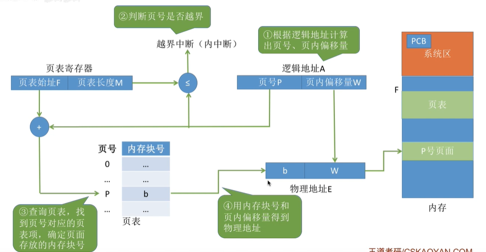

**※注意区分**：
- **※页表长度**：页表的长度，即页表共有多少项，**这一个页表指向了多少个块**（页表的纵向）
- **※页表项长度**：页表项是指向块号的指针，长度代表了**操作系统的支持的块总数/块指针的大小**（页表的横向/地址的前半）
- **页面大小**：代表了**块的大小**和**页内地址**（地址的后半）

**例**:若页面大小L为1K字节，页号2对应的内存块号b=8，将逻辑地址A=2500转换为物理地址E
**解答：2500对应的页号为2，没有越界，偏移量为2500-2048=452，页号对应的内存块号为8，物理地址为8 * 1K + 452 = 8 * 1024 + 452 = 8644**

**页式管理中地址是一维的**
为了方便方便页表的查询，通常会让一个页表项占更多字节，**使得每个页面恰好装得下整数个页表项**，例如，如果页面大小/块大小为4KB，4GB内存需要20个二进制位才能唯一确定块，如果用3B存储指针，一个块（4KB）存储指针会剩余1B的内碎片（4KB%3B），为了消除内碎片，让指针变为4B
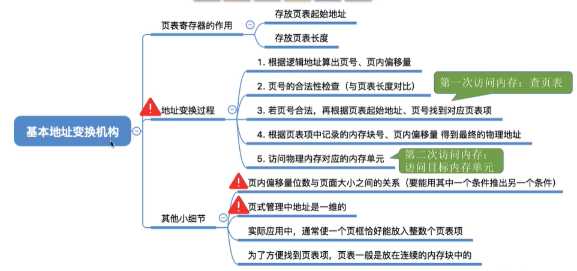

#### 1.4.1.8. ※具有快表的地址变换机构：改进的基本地址变换机构
**快表（联想寄存器/相联存储器/TLB）**是一种访问速度比内存快得多的**高速缓存（特殊的Cache）**，用来存放**最近访问的页表项的副本**,**内存中的页表**通常称为**慢表**
TLB中只有页表项的副本，是专用的，而普通的Cache是通用的

**引入快表后地址变换的步骤**：
1. **进程切换时，快表中的内容会被清空**
2. 如果页号不越界，在TLB中查询页号对应的内存块号
3. 如果命中，则将块号与偏移量直接拼接得到物理地址（**如果快表命中，只需要一次访存**（访问内存））
4. 如果未命中则进行完整的查询慢表步骤（**如果TLB未命中，需要两次访存**）
5. 查询过的块号回放入TLB中方便下次查询
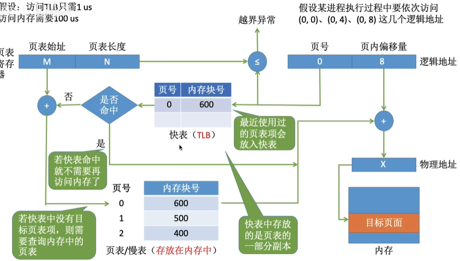
 
**查表的平均耗时计算**：某系统使用基本分页存储管理，并采用了具有快表的地址变换机构。访问一次快表耗时1us，访问一次内存耗时 100us。若快表的命中率为 90%，那么访问一个逻辑地址的平均耗时是多少?
解答：命中情况下，需要访问一次快表，一次内存，即$(1+100)*0.9$，未命中的情况下，需要访问一次快表，两次内存，即$(1+100+100)*0.1$，共计111.3us
有的系统支持同时查询快表和慢表，此时时间为：100*0.9+200*0.1=110us
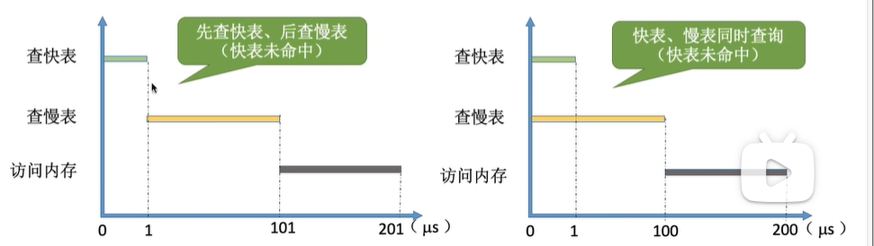

引入快表机制后，查表速度大大加快，原因是**局部性原理**
- **时间局部性**：如果执行了某条指令，访问过某个数据，则**不久后该数据/指令很可能会再次访问**
- **空间局部性**：访问了某个存储单元，不久后其**附近的存储单元**也很可能被访问
#### 1.4.1.9. ※两级页表
**一级页表的局限性**：
- **页表太大，需要占用很多连续的内存块**
- 根据局部性原理，**没有必要在内存中常驻整个页表**

解决问题一的方法：将页表项分块，块离散分布在内存中，为其建立新的表，叫做**页目录表/外层页表/顶层页表**

例如：32位操作系统逻辑地址空间为32位，页内地址（块大小为4KB）为12位，则页表长度（页表项的数量/块的数量）高达$2^{20}$，每一个页表项为4B，则页表总大小就为$4*2^{20}=2^{22}B=4MB$，这个页表会分布在4MB/4K=1K个内存块中，形成1024个小页表，就像这样：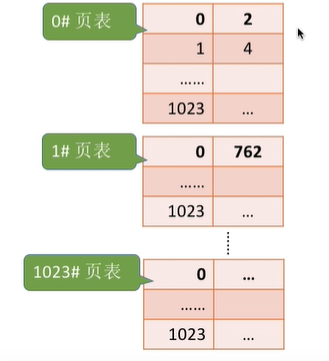
再对小页表建立**页目录表/外层页表/顶层页表**，记录每个页存放在哪个内存块中，就像这样：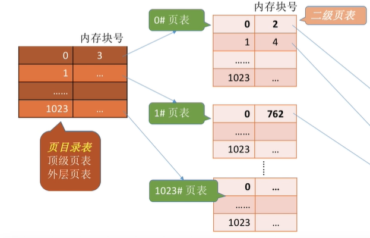
页目录表的大小为小页表数 * 块指针大小=1K * 4B=4KB，刚好能放入一个内存块中

**如何通过二级页表实现地址变换**：
- **逻辑地址可以直接拆分成一级页号，二级页号，页内偏移量**：如块大小为4KB，页内地址为**12位**，块指针为4B，则每个块可以存放$2^{10}$个块指针，需要**10位**索引，32位系统一共需要存放32 - 12 = 20位个块指针，则需要20 - 10 = **10位**存放二级指针，则拆分方法为10位|10位|12位
- 从PCB中读出**页目录表的初始地址**，根据一级页号映射找到**二级页表的位置**
- 根据二级页号从找到的二级页表查表，映射到最终想要访问的**内存块号**
- 将内存块号与页内偏移量拼接得到物理地址
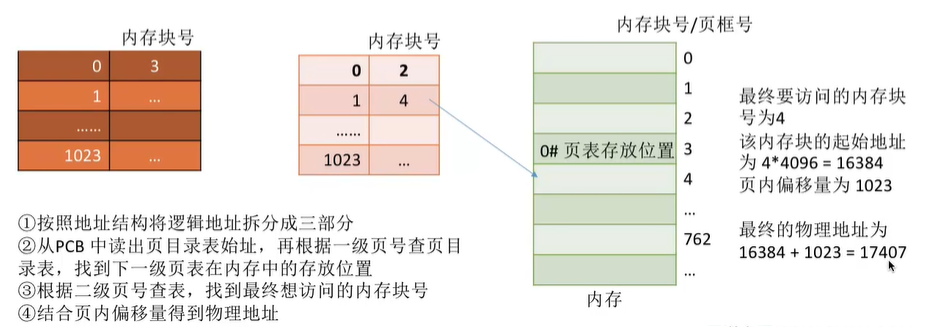

解决问题二的方法：可以在需要访问页面时才把页面调入内存(**虚拟存储技术**)。可以在页表项中增加一个标志位，用于表示该页面是否已经调入内存

**注意的问题**：
1. **※若采用多级页表机制，则各级页表的大小不能超过一个页面**：
   1. 例如:某系统按字节编址，采用40位逻辑地址，页面大小为4KB，页表项大小为4B，假设采用纯页式存储，则要采用()级页表，页内偏移量为()位?
   2. 解答：页面大小/块大小为4KB，页内地址长度为12位，共有$2^{28}$个内存块，需要32b=4B才能唯一标识内存块；页面大小为4KB，内存块指针为4B，每个页面只能存放1K个指针，共10位，还需18位才能唯一标识这一级内存块；同理，最终得到的划分方法为**8|10|10|12**，需要**三级页表**，页内偏移量为**12位**
2. **二级页表的访存次数：3次访存**

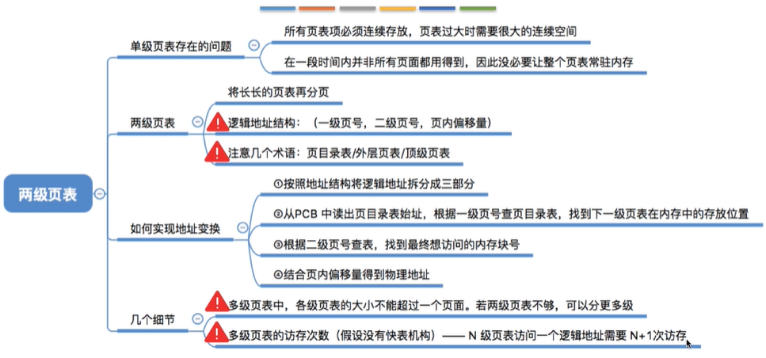

#### 1.4.1.10. ※离散分配管理方式：基本分段存储管理
程序按照**逻辑功能**划分为不同的段，每段有一个段名（由用户定义），编译程序会把段名转换为段号，每段从0编址；段在内存中占用连续的存储空间，各个段之间**不相邻**

每个进程都拥有**自己的段表**

分段系统的逻辑地址由段号和段内地址组成：
**段号决定了每个进程可以划分为多少个段**，**段内地址决定了每个段最长的长度**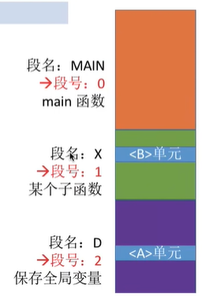

段表：段表项包括**段号**，**段长**和**基址**
注意：**段表项的长度相同**；**段号可以隐含，不占空间**

**分段存储的地址变换**：例如：段号为2，段内地址为1024
1. 进程切换时，会将PCB中的段表载入**段表寄存器**，包含了指向段表的地址和段表长度
2. 根据逻辑地址得到段号和段内地址
3. 如果段号没有越界，就从段表寄存器指向的段表中查询出对应段的段长和基址
4. **将段内地址与段长进行对比，判断是否越界，如果越界就产生越界中断**（与分页管理的不同之处）
5. 将段的基址与段内地址进行拼接，得到物理地址

分段与分页的对比：
- 分页：是信息是**物理单位**，目的是实现离散分配，提高资源利用率；对用户**不可见**，长度固定
- 分段：是信息的**逻辑单位**，对用户可见，长度不固定
分段的用户地址是**二维**的，标识地址时，既需要给出段名，又需要给出段内地址
分段的优点：**分段更容易实现信息的共享和保护**，允许进程规定哪些段可以共享使用，哪些不可以
不能被修改的代码称为**纯代码或可重入代码**（例如 printf("Hello world")），**纯代码不是临界资源，可以被并发访问**
分段和分页都需要两次访存，都可以引入快表机构
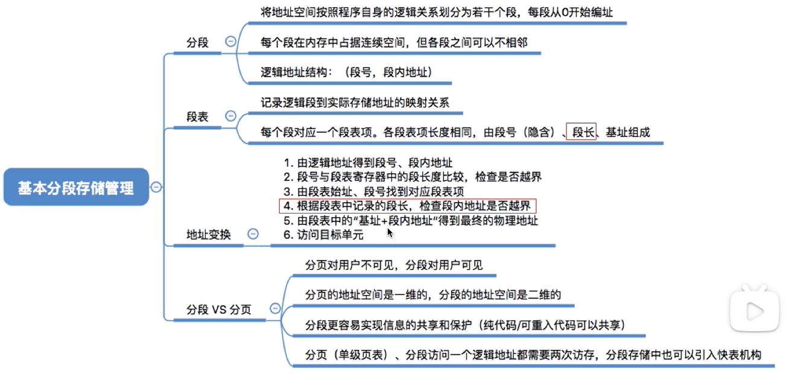

#### 1.4.1.11. 段页式管理
- 分页的优缺点：空间利用率高，没有外部碎片；不能根据逻辑信息实现信息的共享和保护
- 分段的优缺点：方便根据逻辑信息实现信息的共享和保护；如果段长过大，分配连续的空间不方便，且会产生很多的外部碎片

段页式管理：先分段，再把段分页
段页式管理的逻辑地址由段号，页号，页内地址组成
段号的位数决定了**每个进程最多分几个段**，页号位数决定了**每个段最多有多少页**
段页式管理地址结构是**二维**的

为每个进程建立一个段表，**段页式管理的段表**包括：**段号**，**页表长度**，**页表存放块号（页表起始地址）**

段页式管理的逻辑地址转换过程：
1. 进程切换时，将PCB中的段表信息加载到段表寄存器，包括段表基址和段表长
2. 逻辑地址需要转换时，如果段号超过段表长，就进行越界中断，处理中断程序
3. 否则，根据基址指向的段表用段号查询（**第一次访存**），得到页表基址和页表长度，如果页号超过页表长，就进行越界中断，处理越界程序
4. 根据页表基址指向的页表用页号进行查询，得到物理块号（**第二次访存**）
5. 将物理块号与页内偏移量进行拼接，得到物理地址，再根据物理地址访问（**第三次访存**）
**共三次访存**

可以**引入快表**，用**段号和页号作为关键字在快表中直接查找**，如果命中就直接得到块号，只需访问**一次内存**

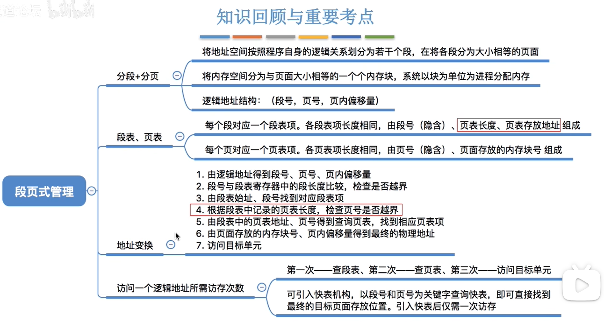

### 1.4.2. 虚拟内存
#### 1.4.2.1. 虚拟内存的概念
虚拟内存：实现内存空间扩充的技术

传统存储管理方式：连续分配+非连续分配
- **特征**：**一次性**（作业需要一次性装入内存）；**驻留性**（被装入内存就会一直驻留到内存中）
- 解决：虚拟存储技术，基于局部性原理

**局部性原理**：**时间局部性**（重复使用）；**空间局部性**（相邻使用）
- **时间局部性**：如果执行了某条指令，访问过某个数据，则**不久后该数据/指令很可能会再次访问**
- **空间局部性**：访问了某个存储单元，不久后其**附近的存储单元**也很可能被访问

**虚拟内存的定义和特征**：
**虚拟内存**：基于局部性原理，可以将很快用到的部分先装入内存，暂时用不到的留在外存，程序执行过程中如果内存中没有再由操作系统负责**调入内存**；如果内存不足，就将**内存中暂时用不到的部分调入外存**
**特性**：
- **多次性**（作业可以被分成多次调入内存）；
- **对换性**（无需常驻内存，允许再运行过程中换入换出）；
- **虚拟性**（看起来拓充了内存容量）

**如何实现虚拟内存技术**：
- 需要建立在**离散分配**的内存管理方式上：基本分段，基本分页，基本段页式
- 引入虚拟内存技术，就变为了**请求分页式**，**请求分段式**，**请求段页式**
- 需要添加：
  - **请求调页（调段）功能**（调入内存）；
  - **页面置换（段置换）功能**（调出外存）
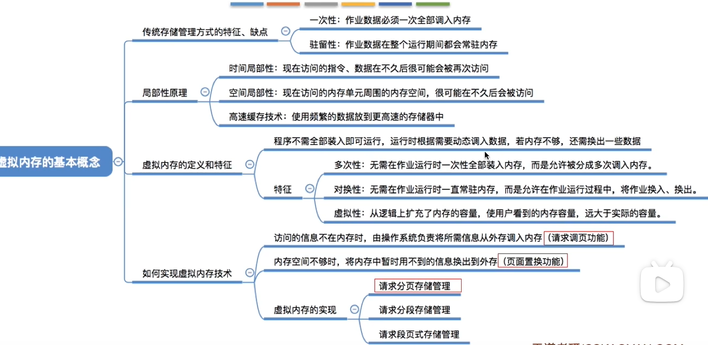

#### 1.4.2.2. 请求分页管理方式：升级的基本分页管理
**请求页表**：在**基本页表**的基础上，为了满足请求调页和页面置换功能,除了块号外，页表增加了：
- **状态位**:描述页面是否调入内存块
- **访问字段**：描述使用频率，方便调出外存
- **修改位**：调入内存后是否被修改过，方便调出外存时判断要不要覆盖原页面


**缺页中断机构的工作流程**：假设要访问逻辑地址(0,1024)，页表如下：
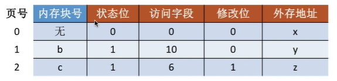
1. 查询请求页表，发现状态为0，页表不在内存中
2. 请求分页系统产生一个**缺页中断**，由操作系统的中断处理程序处理中断
3. **将缺页的进程阻塞**，放入**阻塞队列**
4. 如果内存中**有空闲块**，就为进程分配一个空闲块，从请求页表项指示的外存地址中取出页面，将其放入分配的内存块，再修改页表的数据 
6. 如果内存中**没有空闲块**，需要由**页面置换算法**选择一个页面淘汰，如果选中的页面在内存期间被修改过，就将内存中的页面**写回外存（覆盖）**，否则不用写回
7. 调页完成，将进程唤醒，放入**就绪队列**
- 请求分页管理方式同样有**越界判断**和**快表机制**
- 注意：**快表中的页面一定在内存中，如果页面被换出内存也要修改快表，防止访问出错。因此如果快表命中，可以直接访问物理地址，无需担心不在内存中。**

注意：
- 缺页中断属于**内中断中的故障(fault)**
- 一条指令执行期间可能会发生**多次缺页中断**（如copy指令由两个地址参数）

请求分页管理方式与基本分页管理方式的不同在于：
- 新增：**请求调页**
- 新增：**页面置换**
- 新增：**需要修改请求页表表项**

补充：
- 只有**写指令**才需要修改请求页表的**修改位**
- 缺页中断同样需要**保留CPU现场**
- 需要用**页面置换算法**决定要换出的页面
- 换入换出操作是**IO操作**，不能太频繁
- 页面调入内存后，需要修改慢表，同时把慢表项**复制到快表中**
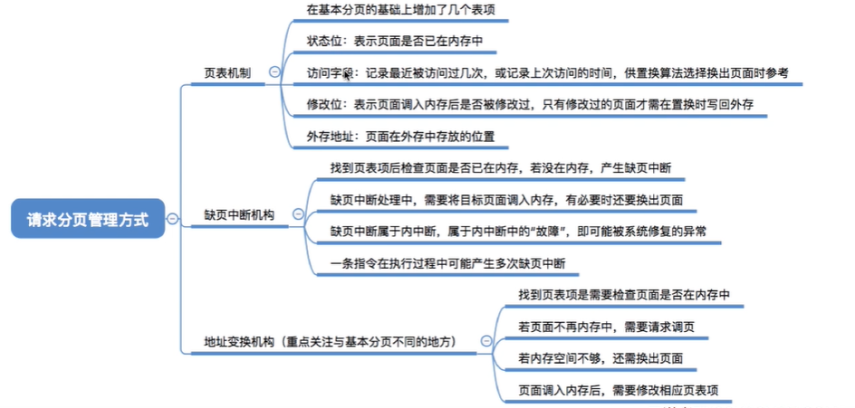

#### 1.4.2.3. 页面置换算法
页面置换算法：若内存不够，内存中暂时不用的信息要换出外存

页面置换算法的评价指标：**更少的缺页率**
$缺页率=\frac{缺页次数}{访问内存次数}$
**发生缺页不一定会导致页面置换**，发生缺页并且内存空间不足才会

五种页面置换算法：
- **最佳置换算法（OPT）**
- **先进先出置换算法（FIFO）**
- **最近最久未使用置换算法（LRU）**
- **时钟置换算法（CLOCK）或最近未用算法（NRU）**
- **改进的时钟置换算法**

**最佳置换算法（OPT）**：淘汰以后永不使用，或者**最长时间内不再被访问的页面**（**向后看**，向后一个个看当前内存中的页面在后续最晚被使用）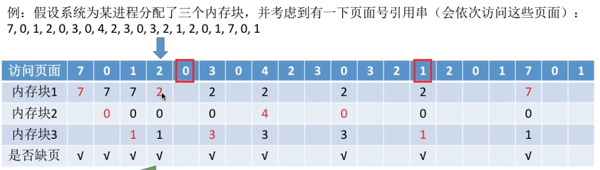淘汰七号页面
- 缺点：**需要提前知道后续页面的访问序列**，因此无法实现页面置换算法

**先进先出置换算法（FIFO）**：淘汰最早进入内存的页面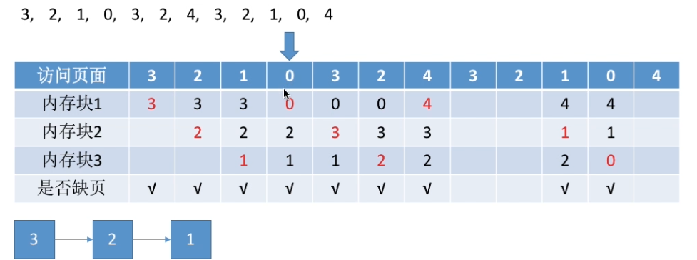淘汰三号页面
缺点：**Belady异常**（增加进程的页面数反而使缺页率增加），**只有FIFO会产生Belady异常，算法性能差**

**最近最久未使用置换算法（LRU）**：淘汰最近最久未使用的页面（**向前看**，向前一个个看当前内存中哪个页面最久未使用）
实现方法：在页表项中的**访问字段**记录自上次使用的时间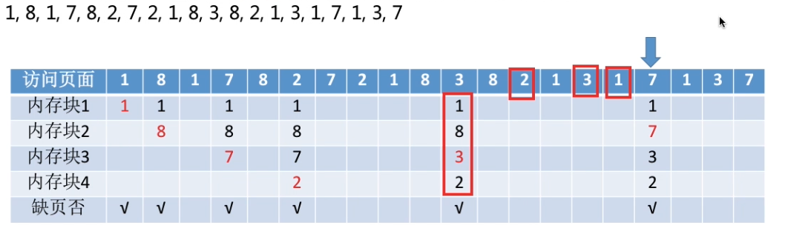
缺点：虽然性能好，但是需要**硬件支持，实现困难，开销大**
优点：**性能最接近OPT**

**时钟置换算法（CLOCK）或最近未用算法（NRU）**：页表中设置**访问位**，访问过的页面置1，淘汰页面时按照循环链表循环检查，如果是1就置为0，如果是0就置换这个页面（置换后的元素访问位置1），指针指向下一个元素等待下一轮页面置换
优点：**均衡性能和开销**

**改进的时钟置换算法**:只有被淘汰的页面**被修改过时**，才需要写回外存。
访问字段为（访问位，修改位）二元组
1. **扫描（0，0）的页面**进行替换，此轮不修改标志位
2. 若未扫描到（还有01，10，11三种可能），**扫描（0，1）的页面**进行替换，此轮将扫描过的访问位**置为0**
3. 若未扫描到（还有10，11两种可能，访问位被置为0，只有00，01两种可能），**扫描（0，0）的页面**进行替换，此轮不修改标志位
4. 若未扫描到（只剩01一种可能），**扫描（0，1）的页面**进行替换

最多进行扫描的次数：
- 时钟置换算法（CLOCK）或最近未用算法（NRU）：**两次**
- 改进的时钟置换算法：**四次**

#### 1.4.2.4. 页面分配策略
**驻留集**：**给进程分配的页框/物理块的集合**
- 如果驻留集太小，会**频繁导致缺页**
- 如果驻留集太大，会**降低系统资源的利用率**

**两种分配方式**：
- 固定分配：**驻留集分配后就不变**
- 可变分配：**驻留集可以动态调整**

**两种页面置换方式**：
- 局部置换：**缺页时只能选择自己的页框进行置换**，要根据缺页频率**动态调整进程的物理块**
- 全局置换：**缺页时既可以选择系统保留的空闲物理块，也可以选择其他进程持有的物理块**，**只要缺页就会分配新的物理块**

由此可见有三种分配置换策略：**固定分配+局部置换**；**可变分配+局部置换**；**可变分配+全局置换**
- **固定分配局部置换**：缺点：很难提前确定需要分配多少物理块，灵活性差
- **可变分配全局置换**：缺点：很难提前确定需要分配多少物理块，灵活性差
可变分配全局置换的进程发生缺页时，一定会被分配一个新的内存块，不管是空闲的物理块还是其他进程的，这样会导致**其他进程的缺页率增加**
- **可变分配+局部置换**：只允许与自身的物理块进行置换，如果缺页率太高，系统会多分配几个物理块来缓解，如果缺页率太低，会减少分配几个物理块

应该在何时**调入**页面？
- **预调页策略**：预测不久后可能访问的页面，提前调入内存。缺点：**预测成功率低**。适合：**进程的首次调入**
- **请求调页策略**：缺页时才调页。缺点：**频繁IO操作，开销大**

从何处**调入**页面?
**对换区**的读写速度**更快**，采用**连续分配**方式
**文件区**的读写速度**更慢**，采用**离散分配**方式
- 进程运行前，先将**文件区**内进程的相关数据**调入对换区**
- 进程运行过程中，页面的调入调出都是在**内存和对换区之间**进行的
- 当对换区空间不足，**不会修改的数据直接从文件区调入**，这些页面在调出时不会写回内存
UNIX方式：初始时都从文件区调入，当页面置换时，写回内存的页面放入对换区，需要时再从对换区换出

**抖动（颠簸）现象**：刚换出的页面马上要换入内存，刚换入的页面马上要换出内存
产生抖动的原因是：频繁使用的页面数高于页框数（**分配的页框数不够**）

**工作集**：某段时间间断内，实际访问页面的集合
根据**窗口尺寸**算出工作集：
局部性好的进程工作集小于窗口尺寸
可以根据**工作集的大小**决定分配的**驻留集的大小**，并且驻留集的大小一般不能小于工作集的大小，否则会频繁缺页
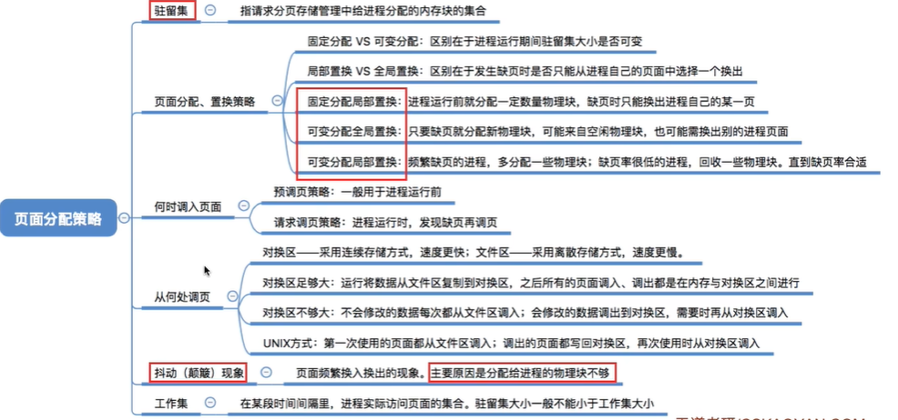

#### 1.4.2.5. 内存映射文件
内存映射文件：是一个**系统调用**，可以**更方便访问文件数据和共享文件**


**内存映射文件的原理**：
- 进程通过**系统调用**，将文件映射到进程的虚拟地址空间
- **以访问内存的方式读写文件**
- 缺页时，按照缺页的处理方式进行调入内存
- 进程关闭文件，**操作系统负责将文件数据写入磁盘，并解除内存映射**
- **多个进程可以映射同一个文件**，方便共享

内存映射文件的优点：
- **编程更简单，按照内存的方式读写即可**
- 读入读出完全由操作系统负责，IO效率由操作系统优化（预读入，缓写出等）
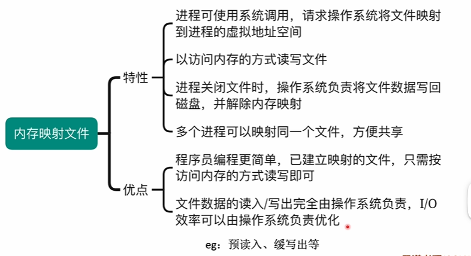


## 1.5. 文件管理
### 1.5.1. 文件管理系统
#### 1.5.1.1. 文件管理的概览
文件的属性：**文件名**，**标识符**，**文件类型**，**文件的路径/在外存中存放的位置**，**文件的大小**，**文件的保护信息**……

**文件内部的数据组织方式**：**文件的逻辑结构**
- **无结构文件/流式文件**（由**二进制或字符流**组成）
- **有结构文件/记录式文件**

文件之间的组织方式：依靠**目录**进行树状的组织（**目录也是一种特殊的有结构文件**）

**操作系统为上层提供的功能**：
- **create系统调用**：创建文件
- **read系统调用**：读文件
- **write系统调用**：写文件
- **delete系统调用**：删除文件
- **open系统调用**：打开文件，**读写文件之前需要使用**
- **close系统调用**：关闭文件，**读写文件之后需要使用**

文件存放在硬盘（外存）的方式：外存会分为一个个**块/磁盘块/物理块**，每个磁盘块大小相等，占2的整数幂大小
- 操作系统会以块为单位进行空间分配（最小为一个块的大小）
- 文件存放在硬盘中的块可以是连续的或者离散的（**文件的物理结构**）

操作系统还需要提供：
- **文件共享**
- **文件保护**

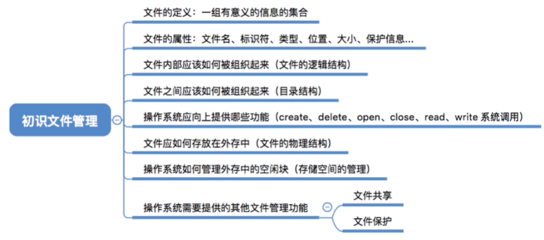

#### 1.5.1.2. 文件的逻辑结构
文件的逻辑结构：
- 无结构文件/流式文件
- 有结构文件
  - 由定长记录组成
  - 由可变长记录组成

**有结构文件的逻辑结构**：

（一）**顺序文件**：文件的记录逻辑上**顺序排列**，
  1. 记录是**定长或者可变长**，
  2. 记录在物理上可以**顺序存储**或**链式存储** 
  3. **串结构**或**顺序结构**：是否按**关键字顺序**排列

**顺序文件的随机存取性**：
  - **链式存储**：无论是定长或不定长，**×**
  - **顺序存储**：
    - **可变长记录**：**×**
    - **定长记录**：**√**
      - **串结构**：**无法快速检索**
      - **顺序结构**：**可以快速检索**

因此：只有**定长记录，顺序存储的顺序文件**才能**随机存取**，只有**定长记录，顺序存储，顺序结构的顺序文件**才能**快速检索**
一般来说，题目中提到的顺序文件都是顺序存储的
缺点：**增删一个记录困难**

（二）**索引文件**：
索引表本身是定长记录的顺序文件，因此可以可以快速查找索引项
索引文件适合用于对信息处理的**及时性要求高**的场合
可以根据不同的数据建立多张索引表
缺点：若每个记录对应一个索引表项，那么索引表可能非常大，**空间利用率太低**

（三）**索引顺序文件**：
**把记录进行分组，一组记录对应一个索引表项**
计算平均查找次数：10000条记录分为100组，每组100个记录，平均查找次数为50+50=100次

（四）**多级索引顺序文件**：
进一步减少查找次数：
$10^6$个表项按照100，100，100的分组方法，平均查找次数为50+50+50=150次查找，而只有一级索引平均需要1000次查找

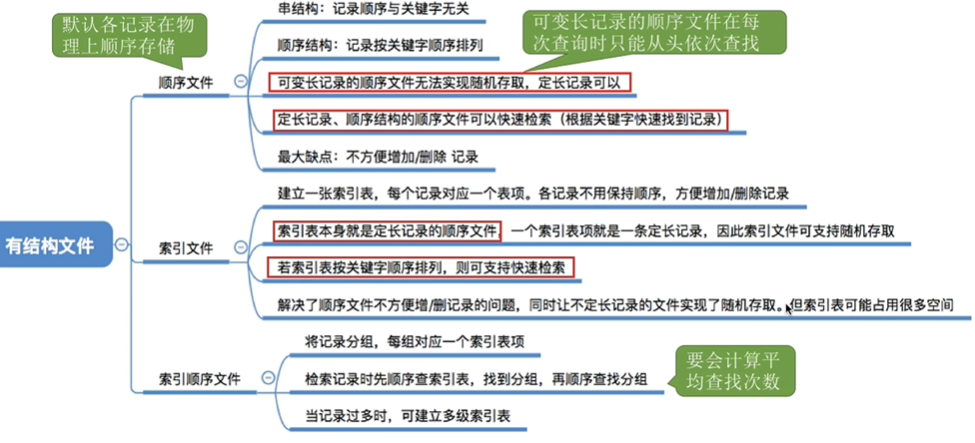

#### 1.5.1.3. 文件目录
**目录文件**由**文件控制块**（File Control Block, FCB）组成：
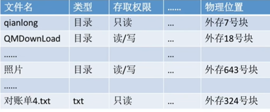
FCB中包含了文件的元数据：基本信息（文件名，物理地址，逻辑结构，物理结构），存取控制信息（权限信息等），使用信息（修改时间等）
**FCB建立了文件名与文件地址之间的映射关系**

需要对目录表进行的操作：
**搜索，创建，删除，显示，修改**

**单级目录结构**：整个系统只有一张目录表
缺点：不允许文件重名，不适合多用户操作系统

**两级目录结构**：一级主文件目录记录用户名和其拥有的目录表，二级用户文件目录记录具体的文件信息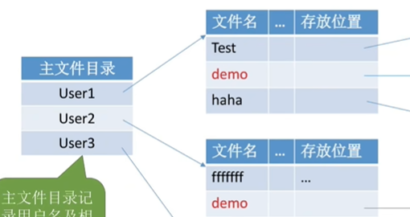

**多级目录结构/树形目录结构**：
从根目录开始的路径称为**绝对路径**
从当前目录开始的路径称为**相对路径**
**缺点**：**不方便实现文件的共享**
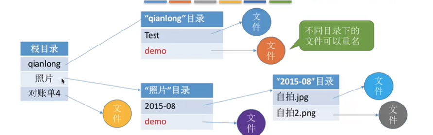

**无环图目录结构**：在树形目录结构基础上，不同的文件名指向同一个文件，可以设置一个**共享计数器**，计数器为0才删除文件实体

**索引结点inode**（对文件控制块的优化）：**FCB只有文件名和inode指针**
好处：缩减目录表的大小，提升检索效率

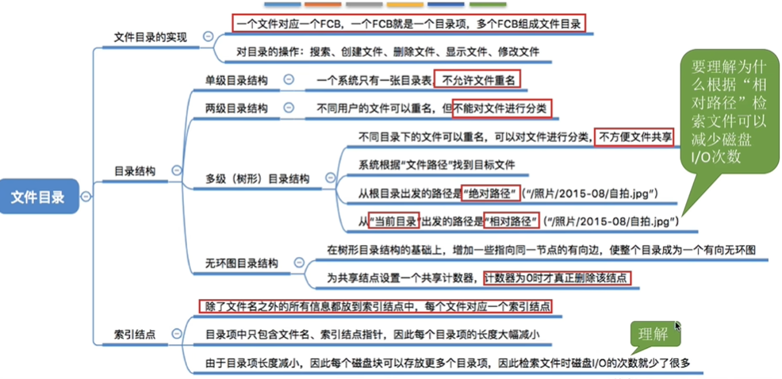
#### 1.5.1.4. ※文件的物理结构（文件的分配方式）
操作系统需要对**非空闲磁盘块**和**空闲磁盘块**进行管理

很多操作系统中，**磁盘块大小与内存块，页面块的大小相同**

与内存块相似，文件的逻辑地址空间也被分配为了一个个文件块，文件的逻辑地址可以表示为（**逻辑块号**，**块内地址**）

如何将文件的逻辑地址转换为物理地址，就是**文件的物理结构**（**文件的分配方式**）

**文件的物理结构**（**文件的分配方式**）
- **连续分配**：逻辑上连续的块，物理上也连续
- **链接分配**
  - **隐式链接（链接分配）**
  - **显式链接**
- **索引分配**

（一）**连续分配分配实现逻辑块号到物理块号的转换**：
用户给出要访问的文件和要访问的逻辑块号，由操作系统根据这个文件的FCB找到起始块号，起始块号+逻辑块号就找到了要访问的文件块
- 优点1：连续分配支持**随机访问（直接访问）**
- 连续分配方式要求**每个文件在磁盘占有一组连续的块**
- 优点2：**连续分配的文件在顺序时读写速度最快**
- 缺点1：**拓展文件不方便**
- 缺点2：**空间利用率低，会产生难以利用的磁盘碎片**（可以用紧凑来处理碎片）

（二）**隐式链接分配实现逻辑块号到物理块号的转换**：
FCB中存有起始块号和结束块号，每个块保留有指向下一个块的指针，每次读下一个块都要先把这一个块加载进内存，读入第i号逻辑块，需要i+1次的IO操作
- 缺点1：只支持顺序访问，不支持随机访问，**查找效率低**
- 缺点2：每个块都要保留一个指向下一个块的指针，**需要浪费一定空间**
- 优点1：**方便文件拓展**
- 优点2：**没有磁盘碎片**，空间利用率高

（三）**显式链接分配实现逻辑块号到物理块号的转换**：
指针显式存放在一张表，**文件分配表**（**FAT**）中，FCB中只需要记录起始块号
例如，两个文件：
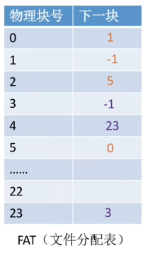
**一个磁盘仅需设置一张FAT**，开机时FAT载入内存，并常驻内存
**转换过程**：用户给出逻辑块号，根据FCB找到起始块号，查询FAT，找到往后i号逻辑块对应的物理块号
- 优点：方便文件拓展；没有碎片问题，外存利用率高；支持随机访问。地址转换时无需访问磁盘，文件访问效率高
- 缺点：FAT需要占用一定存储空间

（四）**索引链接分配实现逻辑块号到物理块号的转换**：
系统会为**每个文件**建立一张**索引表**，索引表记录了各个文件的逻辑块对应的物理块
索引表存放的磁盘块称为**索引块**，文件存放的磁盘块称为**数据块**
**转换过程**：操作系统找到文件对应的FCB，FCB中存放指向索引表的指针，索引表读入内存后查找索引表第i号位置逻辑块对应的物理块号
- 优点：**支持随机访问**；**逻辑拓展方便**
- 缺点：**索引表需要占用一定空间**

**如果索引表太大，一个索引表无法存放一个文件，解决方法：**
- **链接方案**：多个索引表链接起来
  - 缺点：**访问后面的索引块必须先读入前面的索引块**，有大量IO操作，**效率太低**
- **多层索引**：一层索引指向二层索引
  - 查找方式：如一个磁盘块能存放256个索引，如果要查询1026号逻辑块，1026/256=4,1026%256=2，读取顶级索引的4号，二级索引表的2号，再读取数据块，**共3次磁盘IO**
  - 最大文件大小：256 * 256 * 1KB
- **混合索引**：顶级索引表中既包含直接地址，也包含一级间接索引，还包含二级间接索引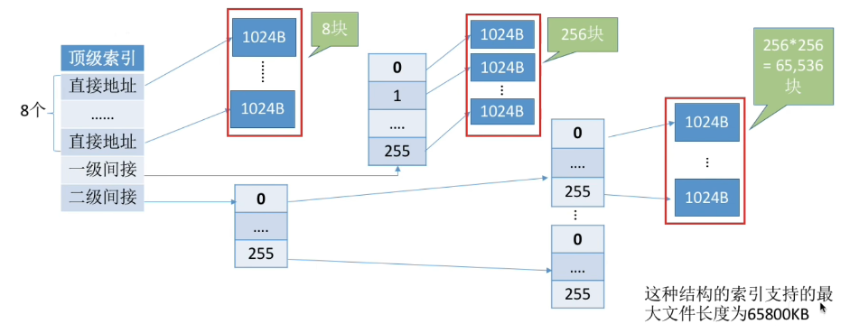
0-7号：两次读磁盘；8-263号：三次读磁盘；后面：四次读磁盘
**※重点：索引分配最大的文件大小；读取某个逻辑块需要访问磁盘次数（要注意题目是否已经将顶级索引调入内存）**
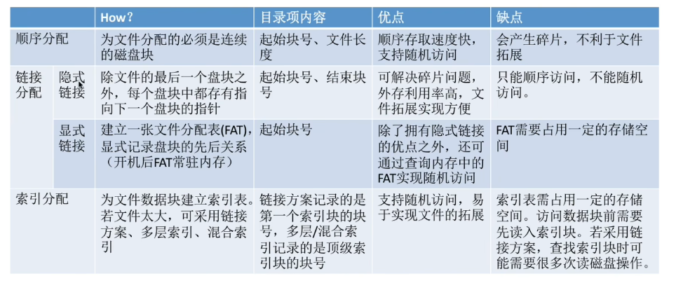

**注意区分：逻辑结构与物理结构**：逻辑结构由用户定义，物理结构由操作系统定义
- 顺序文件是逻辑结构，顺序分配是物理结构
- 顺序文件的链式结构是用户定义，链式分配是物理结构，由操作系统定义
- 索引文件是逻辑结构，索引分配是物理结构
- 用户视角的空间永远连续，根据使用方式的不同分为无结构，有结构，顺序文件，索引文件等等

#### 1.5.1.5. 文件存储空间管理：对空闲磁盘空间的管理

存储空间的划分与初始化：
划分一个个**文件卷**，将各个文件卷划分为**目录区**，**文件区**，目录区存放**FCB，磁盘存储空间管理的信息**，文件区存放文件数据，**一个文件卷可以跨越多个物理磁盘**

（一）**空闲表法**：记录空闲盘号和空闲盘块数，适用于**连续分配方式**，同样可以使用**首次适应、最佳适应、最坏适应**等等算法，回收时同样需要注意前后相邻的情况（**注意合并**）

（二）**空闲链表法**：分为**空闲盘块链和空闲盘区链**

**空闲盘块链**：以**磁盘块为单位**组成空闲链，每个盘块记录下一个盘块的**指针**
- 操作系统保留**链头链尾指针**
- **分配**：从链头开始分配n个盘块
- **回收**：回收的盘块依次挂到链尾
- 适合**离散分配**的物理结构

**空闲盘区链**：以**空闲磁盘区**为单位组成空闲链，每个盘区记录下一个盘区的**指针和长度**
- 操作系统保留**链头链尾指针**
- **分配**：可以采用最佳适应，首次适应等方法，如果没有找到合适的盘区，也可以分配不同的空闲盘区
- **回收**：需要注意**合并问题**
- 既适用于离散分配，也适用于连续分配
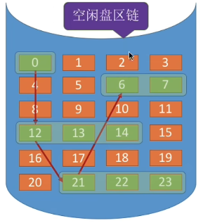

（三）**位示图法**：每个二进制代表一个盘块，0代表空闲1代表已分配，因此，也可以**通过（字号，位号）二元组**对应一个盘块号
- **连续，离散分配方式都适配**
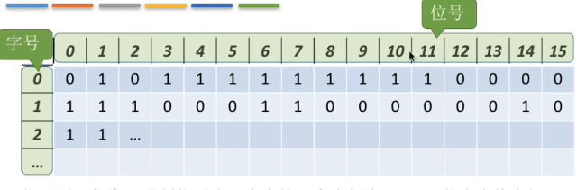

（四）**成组链接法**：UNIX中采用的方法，在**文件卷的目录区**有一个超级块，系统启动时将超级块读入内存，且会保证外存和内存的超级块数据一致。

**结构**：超级块有两个变量，一个栈记录了这个超级块记录的空闲块int s_free[4];，一个整数记录这个超级块剩余的有效块数s_count，数组的第一个块记录了指向的下一个链接块，链接块的结构与超级块一致

**分配过程**：
- 系统从栈顶取出一个空闲块，s_count--
- 如果刚刚的块是最后一个块（s_count=0）就进行磁盘IO，用最后一个有效块指向的链接块覆盖超级块

**回收过程**：
- 系统将空闲块放入栈内
- 如果栈满，就将这个超级块拷贝到刚刚空闲的块内，这个空闲块变为一个链接块，同时栈清空，将链接块压入栈内，更新s_count

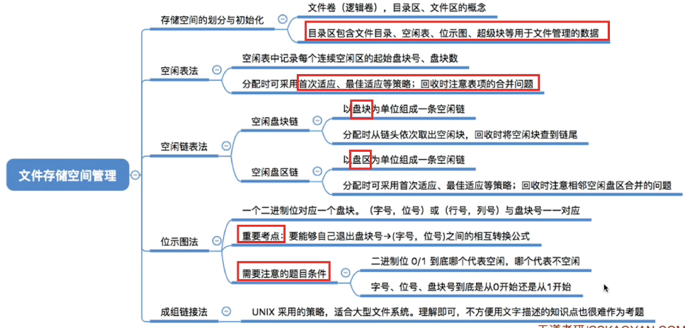

#### 1.5.1.6. 文件的基本操作
**操作系统为上层提供的功能**：
- **create系统调用**：创建文件
  - 需要提供的参数：**需要的外存大小**，**存放路径**，**文件名**
  - 系统需要做的事情：1.在外存中找到文件所需的空闲盘块；2.创建该文件对应的目录项
- **read系统调用**：读文件
  - 需要提供的参数：打开文件表的索引号，读入多少数据，需要放在内存中哪个位置
  - 系统需要做的事情:从读指针指向的外存中，将用户指定的数据大小读入指定的内存区域中
- **write系统调用**：写文件
  - 需要提供的参数：打开文件表的索引号，写入多少数据，使用内存中哪个位置
  - 系统需要做的事情:从写指针指向的外存中，将用户指定的数据大小的内存写入指定的外存中
- **delete系统调用**：删除文件
  - 需要提供的参数：**存放路径**，**文件名**
  - 系统需要做的事情：1.根据目录表找到该文件对应的目录项；2.根据目录项的内容找到该文件占用的磁盘块，回收这些磁盘号；3.删除目录项
- **open系统调用**：打开文件，**读写文件之前需要使用**
  - 提供的参数：路径，文件名，操作类型（wr）
  - 系统做的事情：1.找到目录项；2.根据目录项检查操作权限；3.将目录项放入**打开文件表**中，并将表中的编号返回用户，之后用户根据打开目录表的编号来操作

- **close系统调用**：关闭文件，**读写文件之后需要使用**
  - 系统做的事情：1.将**进程的打开文件表**中的对应**表项删除**；2.回收分配给该文件的内存空间；3.系统的打开文件表的**打开次数-1**，如果**减到0就删除对应表项**

**打开文件表**：系统自身会维护**系统的打开文件表**（**只有一张**），同时**每个进程**会有自身的打开文件表，进程的打开文件表表项指向系统打开文件表的表项，系统的打开文件表还有一个**打开次数**的表项。进程的打开文件表还有读写指针和访问权限
  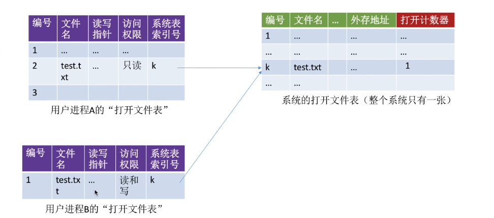
  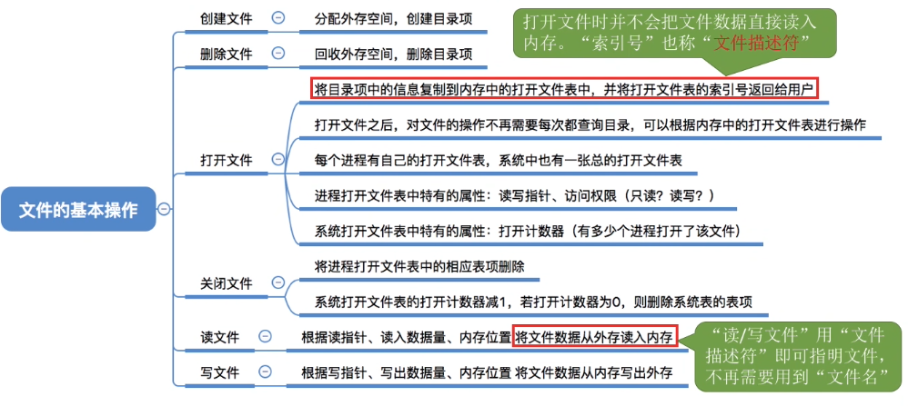

####  1.5.1.7. 文件共享
基于**索引结点**的共享方式：**硬链接**
基于**符号链**的共享方式：**软连接**

**复制与共享的区别**：**复制有多个文件实体**，**共享只有一个文件实体**

**硬链接**：多个FCB指向一个inode，inode指向一个文件实体，inode由有指向的次数，次数为0就删除文件
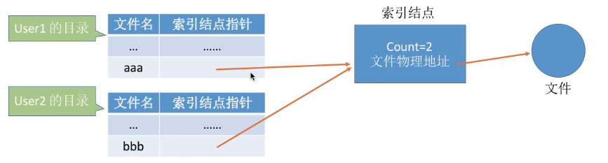

**软链接**：inode指向的是Link类型的文件，文件记录了另一个文件的路径
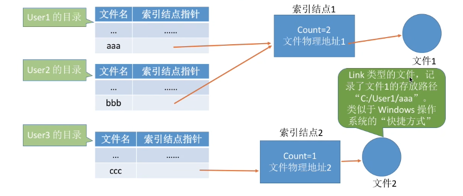
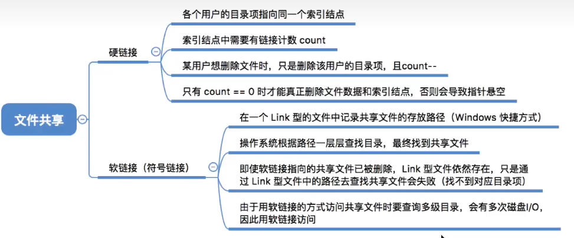

#### 1.5.1.8. 文件保护
**口令保护**：口令放在FCB或inode中，系统会将用户提供的口令进行比对，正确才能访问文件
  - 优点：开销小
  - 缺点：口令存放在系统内部，不安全

**加密保护**：用密码对文件进行加密，使用正确的密码才能解密  
  - 优点：安全，保密性强
  - 缺点：开销大，需要编码/译码

**访问控制**：FCB或inode中增加一个访问控制表（ACL），记录各个用户可以对这个文件进行的操作（读，写，执行等）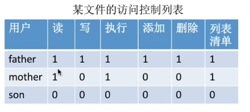
  - 缺点：有的计算机可能有多个用户，访问控制表可能很大
  - 解决：**精简的访问控制表**（分组）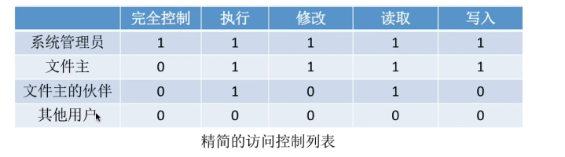

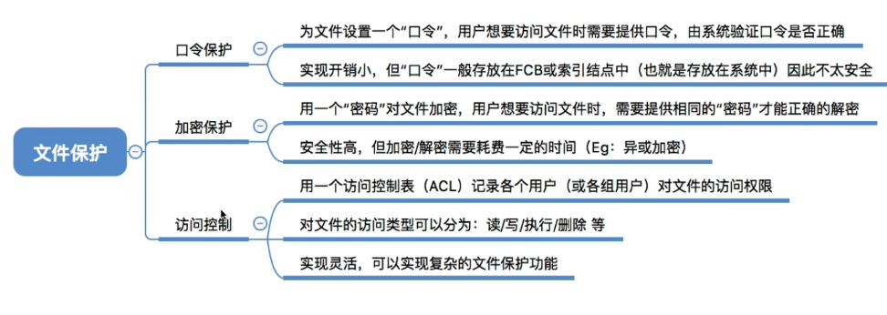

### 1.5.2. 文件系统
#### 1.5.2.1. 文件系统的层次结构
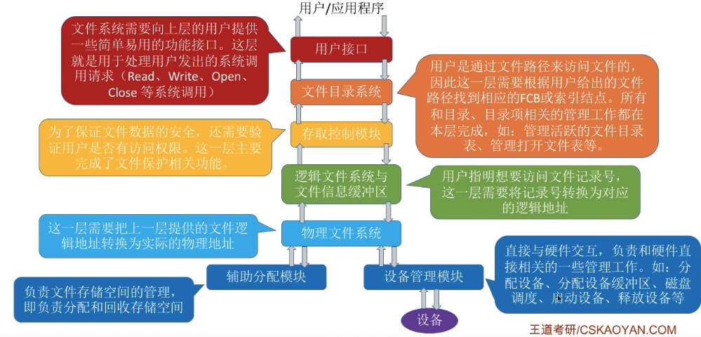
用一个例子来辅助记忆文件系统的层次结构:假设某用户请求删除文件“D:/工作目录/学生信息.xlsx"的最后100条记录。
1. 用户需要通过操作系统提供的接口发出上述请求--**用户接口**
2. 由于用户提供的是文件的存放路径，因此需要操作系统一层一层地查找目录，找到对应的目录项--**文件目录系统**
3. 不同的用户对文件有不同的操作权限，因此为了保证安全，需要检査用户是否有访问权限--**存取控制模块**(存取控制验证层)
4. 验证了用户的访问权限之后，需要把用户提供的“记录号”转变为对应的逻辑地址--**逻辑文件系统与文件信息缓冲区**
5. 知道了目标记录对应的逻辑地址后，还需要转换成实际的物理地址--**物理文件系统**
6. 要删除这条记录，必定要对磁盘设备发出请求--**设备管理程序模块**
7. 删除这些记录后，会有一些盘块空闲，因此要将这些空闲盘块回收--**辅助分配模块**

#### 1.5.2.2. 文件系统的全局结构
**文件系统在外存中的结构**：
1. **低级格式化**（**物理格式化**）：检测坏的扇区，用好的备用扇区替换坏扇区
2. **高级格式化（逻辑格式化）**：将磁盘进行分区（分卷Volume）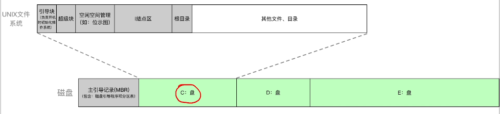

**文件系统在内存中的结构**：
1. 目录的缓存
2. 系统打开文件表
3. 进程打开文件表
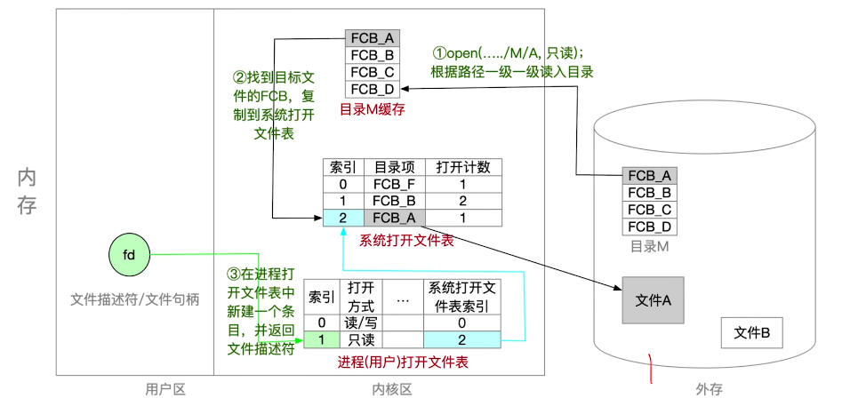

#### 1.5.2.3. 虚拟文件系统和文件系统的挂载
如果没有虚拟文件系统，**不同的外存设备文件格式不同**，有的是UFS，有的是NTFS，有的是FAT，不同的文件系统接口不同，因此需要**虚拟文件系统（VFS）**

**虚拟文件系统的特点**：
1. 向上层用户进程提供**统一标准的系统调用接口**，屏蔽底层具体文件系统的实现差异
2. **VFS要求下层的文件系统必须实现某些规定的函数功能**，如:open/read/write，一个新的文件系统想要在某操作系统上被使用，就必须满足该操作系统VFS的要求
3. 每打开一个文件，**VFS就在主存中新建一个vnode**，用**统一的数据结构**表示文件，无论该文件存储在哪个文件系统。
4. 打开文件后，创建vnode，并将文件**信息复制到vnode中**，**vnode的功能指针指向具体文件系统的函数功能**。

**vnode只存在于主存，inode存在于主存与外存中**

**文件系统的挂载**：
文件系统挂载要做的事:
1. 在VFS中注册新挂载的文件系统。内存中的**挂载表**(mount table)包含每个文件系统的相关信息，包括文件系统类型、容量大小等。
2. 新挂载的文件系统，要向VFS提供一个**函数地址列表**
3. 将新文件系统加到**挂载点**(mountpoint)，也就是**将新文件系统挂载在某个父目录下**（Windows与CDEF平级，Mac挂载到Volume文件夹内）

### 1.5.3. 磁盘
#### 1.5.3.1. 磁盘的结构
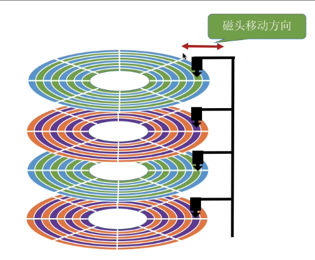
**盘片**-**盘面**-**磁道**（圆环）-**扇区**（磁盘块）
纵向的一列磁道称为**柱面**
各个扇区存放的**数据量相同**
磁头只能**共进退**

**磁盘的物理地址**：可以用（**柱面号，盘面号，扇区号**）来定位任意磁盘块

编址采用（**柱面号，盘面号，扇区号**）的好处：连续的地址在不同的盘面上，更改盘面无需寻道，减少了寻道时间
如果是（**盘面号，柱面号，扇区号**），连续的地址需要更改柱面，就需要再次寻道

**读写数据**：磁头移动-激活磁头-读取扇区
1. 根据柱面号移动磁头到对应柱面
2. 激活指定盘面的磁头
3. 旋转磁盘，完成读写

磁盘分类：
- **活动头磁盘**，**固定头磁盘（每个磁道都有一个）**
- **固定盘磁盘**，**可换盘磁盘**

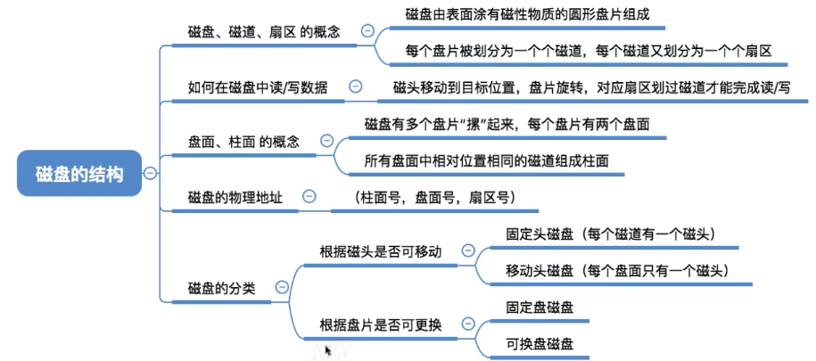

#### 1.5.3.2. 磁盘调度算法
完成一次读写的时间：
- **寻道时间$T_S$**：启动磁头臂时间s，移动磁头时间m * n，$T_S=s + m * n$
- **延迟时间$T_R$**:旋转到对应扇区时间$T_R=\frac{1}{2r}$，r为转速
- **传输时间$T_t$**：需要读写b个字节，每个磁道上字节数为N，$T_t=\frac{1}{r}*\frac{b}{N}$

操作系统可以使用不同的**磁盘调度算法优化寻道时间**$T_S$（减少跨越磁道的个数）

**磁盘调度算法**：
- **先来先服务（FCFS）**
  - 优点：公平
  - 缺点：大量进程竞争使用时**磁道很分散，性能差，寻道时间长**
- **最短寻找时间优先（SSTF）**：贪心
  - 优点：性能好，寻道时间短
  - **缺点**：可能产生**饥饿现象**
- **扫描算法/电梯算法（SCAN）**：寻道只能朝一个方向移动，到底才能切换方向
  - 优点：性能好，且**不会产生饥饿现象**
  - 缺点：死板，必须到底才能切换方向，会浪费时间；对不同位置的磁道**响应频率不平均**
- **LOOK调度算法**：在**SCAN的基础上**，如果**前方没有请求**就**改变方向**
  - 优点：比SCAN算法性能更高
- **循环扫描算法（C-SCAN）**：扫描完一端，返回起始端（0号磁道）不处理任何请求，快速归位
  - 优点：**响应频率很平均**
  - 缺点：**平均寻道时间更长**
- **C-LOOK算法**：在LOOK算法的基础上，到底后直接返回到最前面一个请求（最小的）

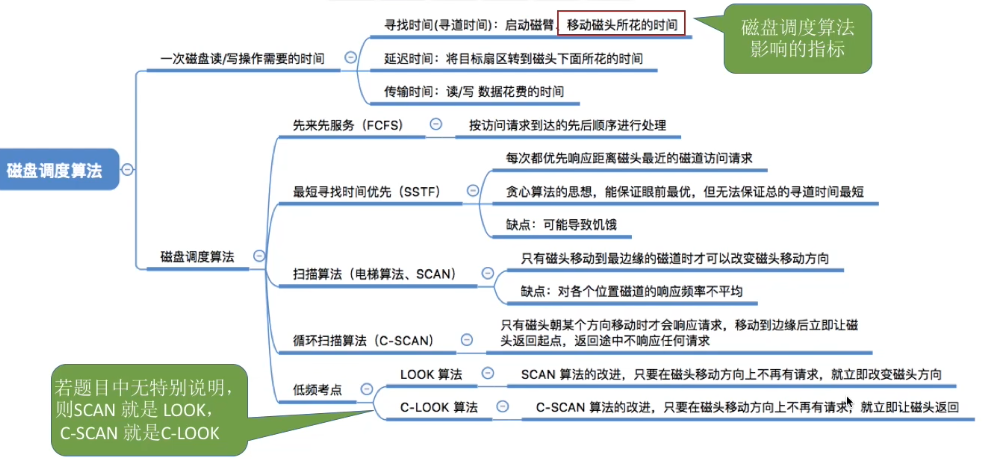

#### 1.5.3.3. 减少磁盘延迟时间的方法
减少延迟时间的方法：

问题1：由于读取一个扇区后磁盘旋转不能停止，因此读取**多个物理上连续的扇区**可能会有**很长的延迟时间**
解决方法：**交替编号**：让逻辑上相邻的扇区在物理上间隔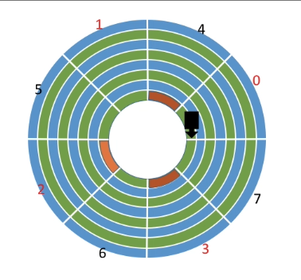

问题2：读取逻辑上连续的地址可能跨越多个盘面，如果切换盘面，需要多旋转一圈（不能连续读取）（从0，111到1，000）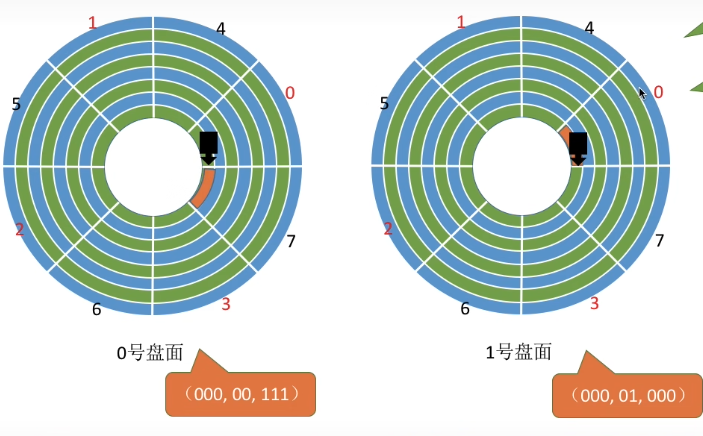
解决方法：**错位命名**；逻辑上高地址的盘面向高扇区错位一格扇区
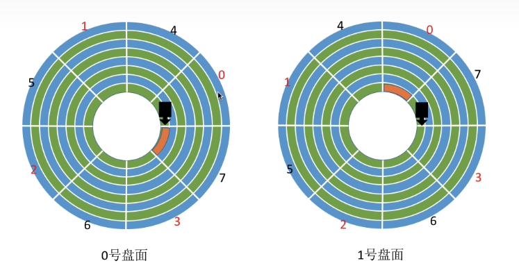

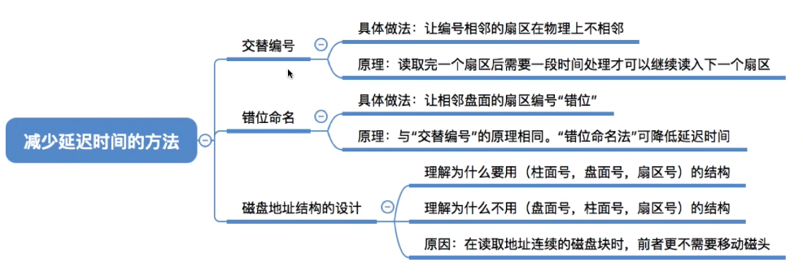

#### 1.5.3.4. 磁盘管理
**磁盘初始化**
1. **低级格式化**（物理格式化）：将各个磁道**划分为扇区**，一个扇区可以分为**头，尾，数据区域**。**管理扇区所需的数据结构**一般放在**头尾**，包括**扇区校验码**
2. **磁盘分区**：每个分区由若干相邻的柱面组成
3. **逻辑格式化**：**创建文件系统**，包括创建根目录，初始化空闲分区表，位示图等等

**引导块**：ROM中存放很小的自举装入程序，完整的自举程序放在磁盘的启动块（引导块/启动分区）

**坏块的管理**：
- 简单的磁盘：在逻辑格式化时进行坏块检查，在FAT表中标明哪些是坏块（**对操作系统不透明，可见**）
- **扇区备用**：复杂的磁盘，**磁盘控制器**会维护一个**坏块链表**，磁盘出厂前进行低级格式化就对坏块链表格式化。同时会保留一些**备用扇区**（**对操作系统透明，不可见**）
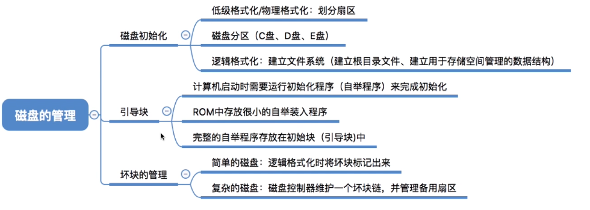

#### 1.5.3.5. 固态硬盘（SSD）
原理：基于闪存技术，属于电可擦除ROM

组成：
- **闪存翻译层**：负责翻译逻辑块号，找到物理页，
- **存储介质**：多个闪存芯片，芯片包含多个块，每个块包含多个页
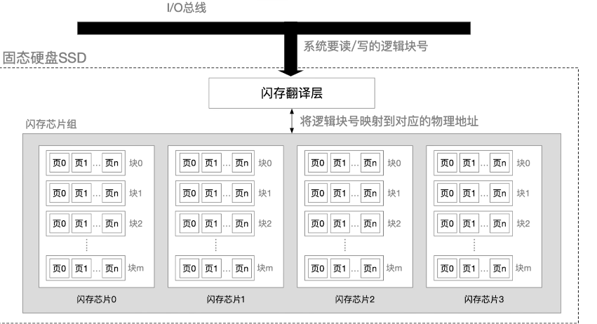

**读写特性**：
- SSD**读写以页为单位**，而不是以块为单位
- SSD**擦除以块为单位**，擦除干净的块，每个页可以**写一次，读无限次**
- **读快，写满**：要写的页如果有数据，不能写入，需要将原数据写入到新的块，再写入新的页
- **支持随机访问**

与机械硬盘相比的特点：
- SSD随机读写性能强
- 安静无噪音
- **※SSD的一个块被擦除次数过多，可能会坏掉**

**磨损均衡技术**：将擦除平均到每个块
- **动态磨损均衡**：**写入时优先选择擦除次数少的块**
- **静态磨损均衡**：**将读多写少的数据迁移到老的块**

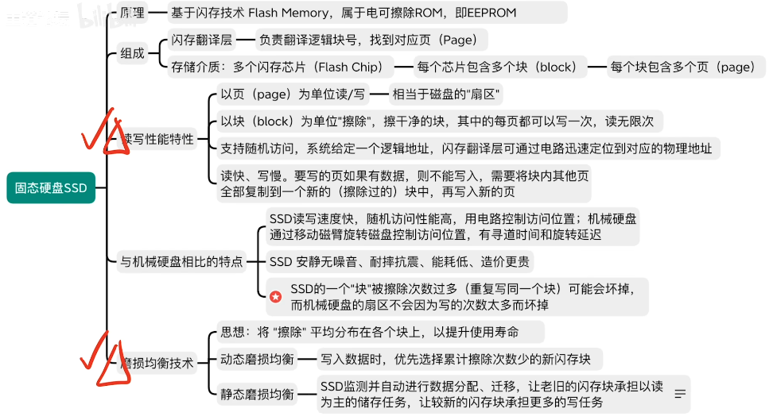

## 1.6. 设备管理
### 1.6.1. I/O设备
#### 1.6.1.1. I/O设备的概念和分类
**I/O设备**：**输入/输出设备**
输入设备：键盘，鼠标
输出设备：显示器
既可以输入又可以输出的设备：移动硬盘

UNIX系统将外部设备**抽象为一种特殊的文件**，用户使用操作文件的方式对外部设备进行操作
操作方式：**Write操作**（**写出数据**），**Read操作**（**读入数据**）

IO设备的分类：
- **按使用类型**：**人机交互类外部设备**（传输速度慢），**存储设备**（传输速度快），**网络通信设备**（速度介于二者之间）
- **按传输速率分类**：**低速设备**，**中速设备**，**高速设备**
- **按信息交换的单位分类**：**块设备**（传输速率快，可以寻址，即可以随机读写），**字符设备**（传输速率慢，不可寻址，输入输出采用**中断驱动方式**）

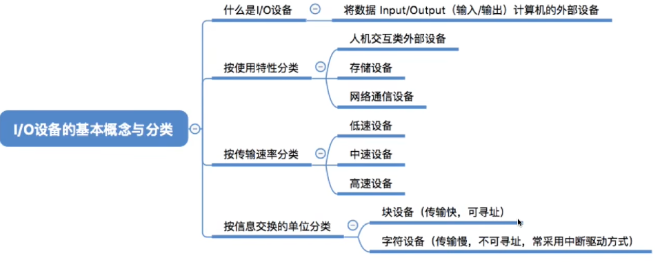
#### 1.6.1.2. I/O控制器
I/O设备由**机械部件**和**电子部件**组成
**电子部件**是CPU与机械部件的中介，这个电子部件就是**I/O控制器**，又称**设备控制器**

**I/O控制器的功能**：
- 接受和识别CPU发出的命令：I/O控制器中有**控制寄存器**，存放命令和参数
- 向CPU报告设备的状态：I/O控制器中有**状态寄存器**，存放设备的状态，如忙碌和空闲
- 数据交换：I/O控制器有**数据寄存器**，可以暂存数据
- 地址识别：**将I/O控制器的寄存器进行编址**，判断CPU使用的是哪个寄存器

**I/O控制器的组成**：
- **CPU与控制器的接口**
- I/**O逻辑**：**负责接收和识别CPU的命令，并对设备发出命令**
- **控制器与设备的接口**

**CPU操作设备的过程**：
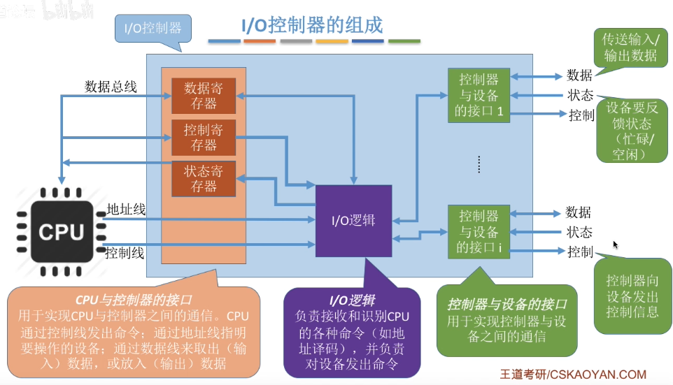
注意：
1. 一个I/O控制器可能会对应多个设备
2. 一个I/O控制器可能会有多个寄存器，也会进行不同的编址
3. 有两种编址方式：**内存映像I/O**（作为内存地址的一部分），**寄存器独立编址**（有独立的地址）

内存印象I/O与寄存器独立编址：
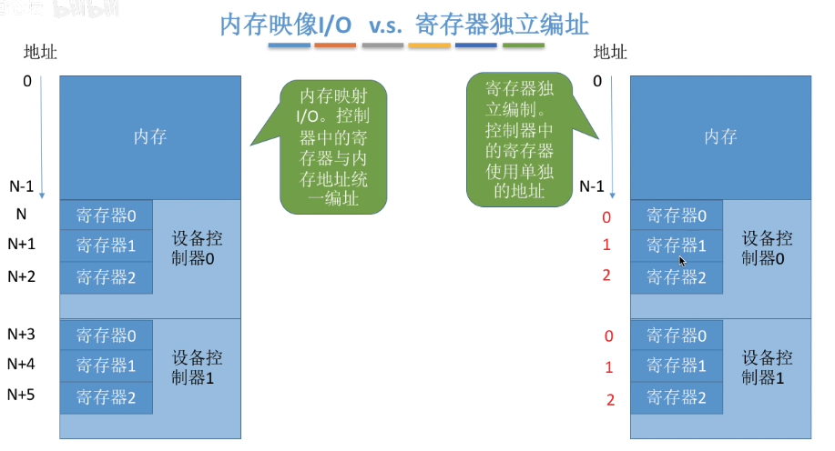
独立编址的缺点：需要设置**专门的指令**来实现对控制器的操作，不仅**要指明寄存器的地址还要指明控制器的编号**

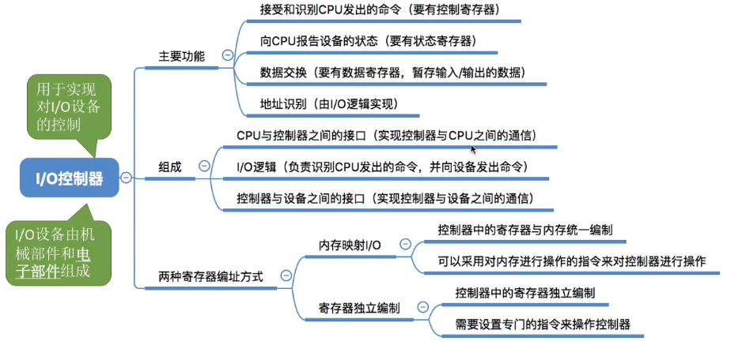

#### 1.6.1.3. ※I/O控制方式
完成一次读写的流程
CPU干预的频率
数据传输的单位
数据的流向
缺点与优点

（一）**程序直接控制方式**
- 完成一次读操作的流程：**重点：轮询**
  - **流程**：发送指令（CPU→IO） → 轮询检查（IO→CPU） → 读入寄存器（IO→CPU） → 存入主存（CPU→主存） → 结束或重复
  - **寄存器状态**：状态寄存器表示设备是否准备好数据；控制寄存器保存命令，地址寄存器表示要访问的设备号；数据寄存器保存要交给CPU的数据
  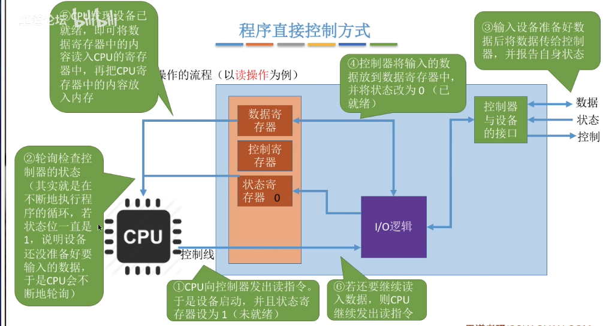
- CPU干预的频率：**很频繁**，开始前，完成后需要CPU介入，**等待过程中需要轮询检查**
- 数据传输的单位：**字**
- 数据的流向：读入：IO到CPU到内存；写出：内存到CPU到IO
- 缺点与优点
  - 优点：**实现简单**，读写指令加循环检查即可
  - **缺点**：**CPU与IO只能串行工作**，CPU需要轮询检查，处于忙等状态，CPU利用率低
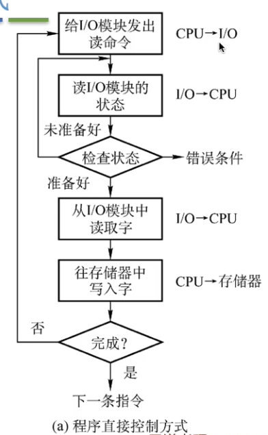

（二）**中断驱动方式**
- 完成一次读操作的流程：**重点：中断**
  - **流程**：发送指令（CPU→IO） → **阻塞原进程 & 调度新进程 → 并行工作 → 检测到中断信号 → 处理中断** → 读入寄存器（IO→CPU） → 存入主存（CPU→主存）→ 恢复进程 → 结束或重复
- CPU干预的频率：每次IO之前，完成之后
- 数据传输的单位：**字**
- 数据的流向：读入：IO到CPU到内存；写出：内存到CPU到IO
- 缺点与优点
  - **优点**：CPU与IO设备可以**并行工作**，利用率得到提升
  - **缺点**：以字为单位，需要**频繁的中断处理**，消耗较多的CPU时间
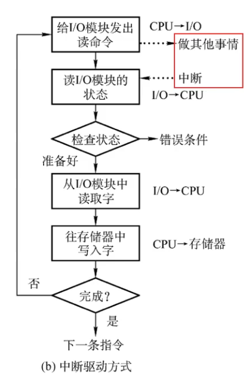

（三）**DMA方式（直接存储器存取）**
DMA控制器依然有三个部分：**主机-控制器接口**，**I/O控制逻辑**，**块设备/控制器接口**
为了**实现主机-控制器接口**，需要有**DR**（**数据寄存器**），**MAR**（**内存地址寄存器**），**DC**（**数据计数器**，存放还需读写多少数据），**CR**(**命令/状态寄存器**)
系统总线会将内存和DMA控制器链接起来，便于内存和DMA控制器直接通信
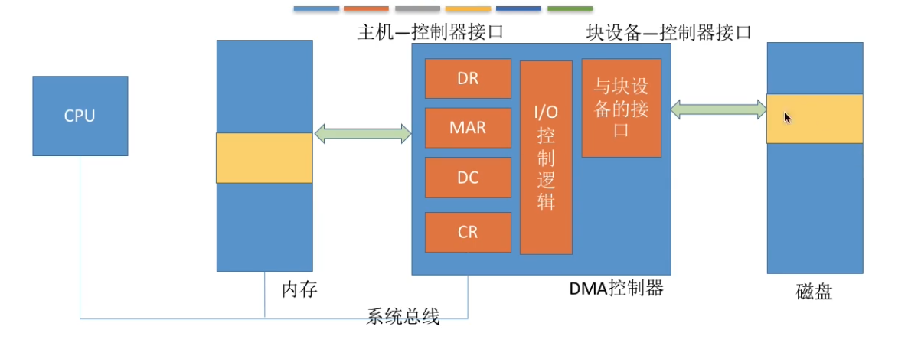

- CPU干预的频率：**传送一个或多个数据块的开始和结束时**
- 数据传输的单位：**一个块或多个连续块**
- 数据的流向：读入：**IO设备到内存**；写出：**内存到IO设备**
- 缺点与优点
  - **优点**：以块为单位，CPU介入频率进一步降低，CPU与IO设备并行性得到提升
  - **缺点**：每发出一次IO指令只能读写一个或多个连续的数据块 
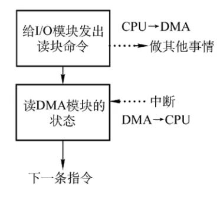

（四）**通道控制方式**
通道是一种**硬件**，可以也只能识别并执行一系列**通道指令**
- 完成一次操作的流程：
  1. CPU向通道发出IO指令，指明通道在内存中的位置和要操作的设备
  2. CPU切换到其他进程
  3. 通道执行内存的通道程序，程序包含读写多少，存放在什么位置等
  4. 通道执行完毕向CPU发出中断信号
- CPU干预的频率：**极低，一组数据块完成才会干预**
- 数据传输的单位：**一组数据块**
- 数据的流向：读入：IO设备到内存；写出：内存到IO设备
- 缺点与优点
  - **优点**：CPU，通道，IO设备可以并行工作，**资源利用率很高**
  - **缺点**：实现复制，需要专门的通道硬件
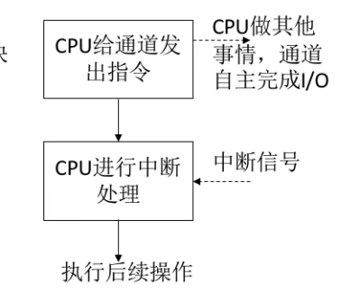

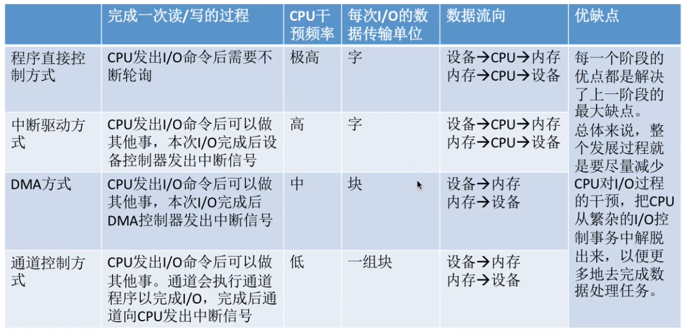

#### 1.6.1.4. IO软件的层次结构
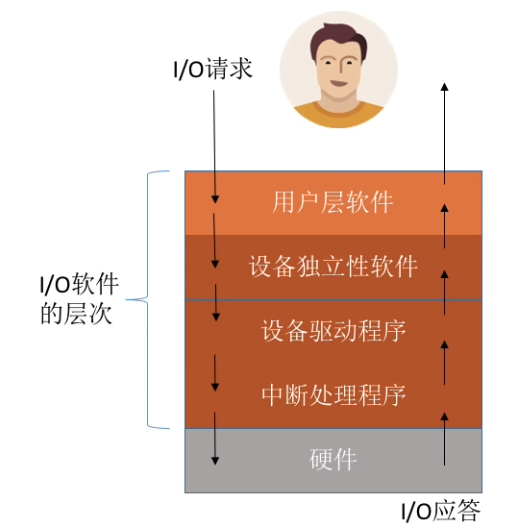
其中：**设备独立性软件（系统调用处理层），设备驱动程序，中断处理程序**属于内核部分，即**I/O系统**，或者称为**I/O核心子系统**

**用户层软件功能**：
- 向上**实现了用户交互的接口**
- 向下通过请求**系统调用**请求操作系统内核的服务

**设备独立性软件（系统调用处理层）功能**：
- 向上提供系统调用接口，
- 设备保护
- 差错处理
- 设备的分配与回收（临界资源的管理）
- 数据缓冲区管理
- **建立逻辑设备名到物理设备名的映射关系**；根据设备类型选择**相应的驱动程序**（通过逻辑设备表（LUT）实现）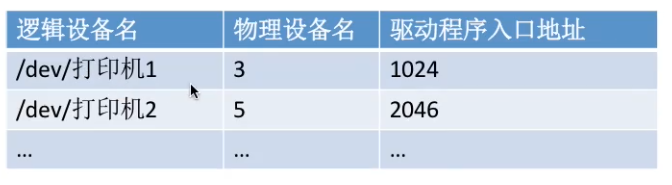
  - **LUT的两种管理方式**：**整个系统只设置一张LUT**（适用于单用户操作系统）；**每个用户设置一个LUT**

**设备驱动程序的功能**：可以和硬件直接打交道
**功能**：主要负责对硬件设备的具体控制，将上层发出的一系列命令(如read/write)转化成特定设备“能听得懂”的一系列操作。包括设置设备寄存器;检查设备状态等

**中断处理程序的功能**：也可以和硬件直接打交道
**功能**：首先根据IO控制器的设备状态判断IO是否正常结束，如果正常则从设备中读出一个字并经由CPU放入内存缓冲区中，调用驱动程序处理，否则根据异常原因做相应处理

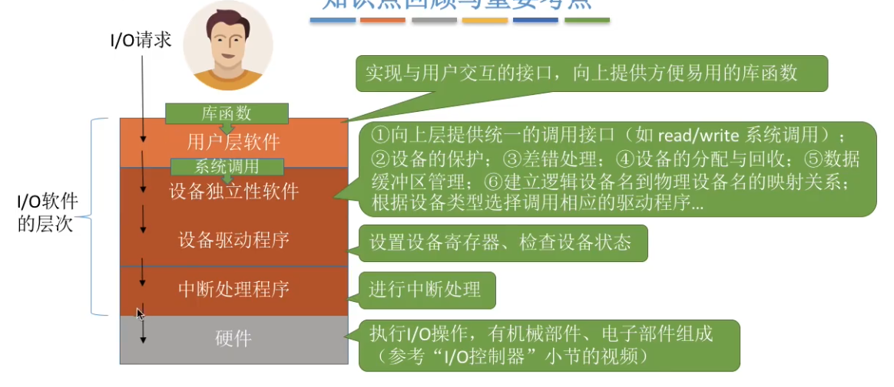

#### 1.6.1.5. I/O应用程序接口，设备应用程序接口
用户层的应用程序无法用一个统一的系统调用接口来完成所有类型设备的I/O（键盘，磁盘，网卡，不能用同一个read系统调用）

**字符设备接口**：get，put系统调用，以字符为单位
**块设备接口**：read/write系统调用，seek系统调用（用于修改指针位置）
**网络设备接口**（**网络套接字(Socket)接口**）：socket系统调用（参数需指明网络协议），bind系统调用：将socket绑定到一个端口，connect系统调用：需要提供ip和端口参数，read/write系统调用：从套接字读，写数据

socket是一个对连接的封装与抽象，用于保存连接状态和连接收发的数据
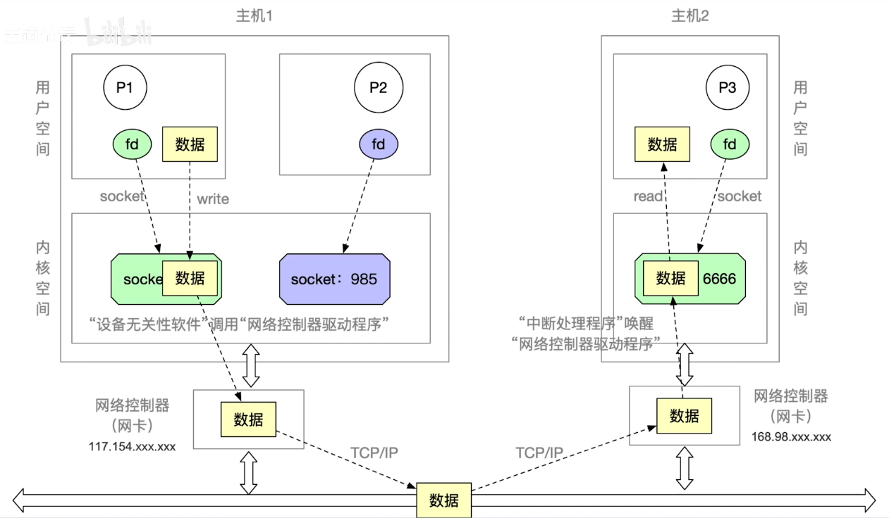

**阻塞IO**：发出IO调用进程需要阻塞等待（如键盘）
**非阻塞IO**：发出IO调用进程无需阻塞等待（如硬盘）

**设备驱动程序接口**：操作系统会统一标准，将驱动程序的接口统一

### 1.6.2. IO核心子系统的功能实现
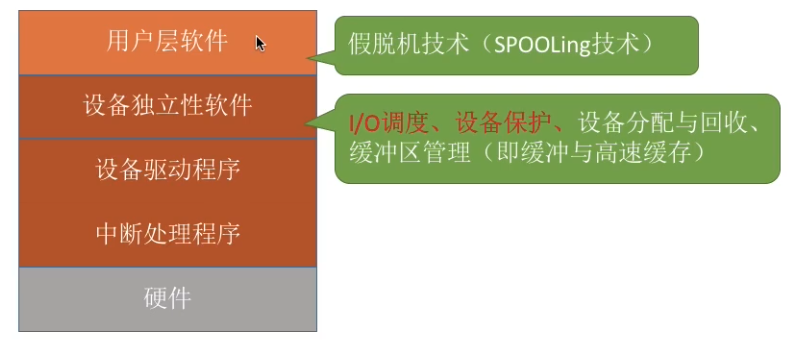
#### 1.6.2.1. IO调度、设备保护的实现
**IO调度**：**确定一个好的顺序处理各个IO请求**

如:磁盘调度(先来先服务算法、最短寻道优先算法、SCAN算法、C-SCAN算法、LOOK算法C-LOOK算法)。当多个磁盘I/O请求到来时，用某种调度算法确定满足I/O请求的顺序。
同理，打印机等设备也可以用先来先服务算法、优先级算法、短作业优先等算法来确定I/0调度顺序。

**文件保护功能**：**不同的用户对各个文件有不同的访问权限**
实现：在UNIX系统中，**设备被看做是一种特殊的文件**，可以通过文件保护实现设备保护

#### 1.6.2.2. 假脱机技术（SPOOLing技术）的实现
**脱机技术**：在外围控制机的控制下，慢速输入设备的数据先被输入到更快速的磁带上。之后主机可以从快速的磁带上读入数据，从而**缓解了速度矛盾**。另一方面，即使CPU在忙碌，也可以提前将数据输入到磁带;即使慢速的输出设备正在忙碌，也可以提前将数据输出到磁带

**假脱机技术**（**SPOOLing技术**）：通过软件实现脱机功能
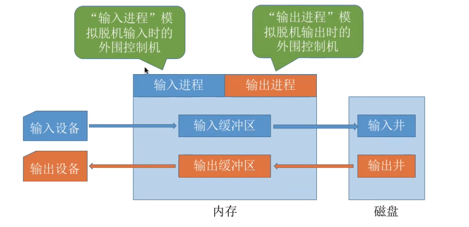

例如：打印机是种“**独占式设备**”，但是可以用SPOOLing 技术改造成**共享设备**
当多个用户进程提出输出打印的请求时，系统会答应它们的请求，但是并不是真正把打印机分配给他们,而是由**假脱机管理进程**为每个进程做两件事:
(1)在**磁盘输出井**中为进程申请一个**空闲缓冲区**(**磁盘上**)，并将要打印的数据送入其中:
(2)为用户进程申请一张空白的**打印请求表**，并将用户的打印请求填入表中(其实就是用来说明用户的打印数据存放位置等信息的)，再将该表挂到**假脱机文件队列**上。当打印机空闲时，**输出进程**会从文件队列的队头**取出一张打印请求表**，并根据表中的要求将要打印的数据从输出井传送到**输出缓冲区**，再输出到打印机进行打印。用这种方式可依次处理完全部的打印任务
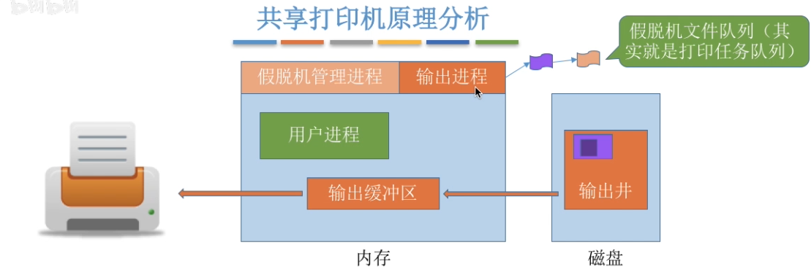
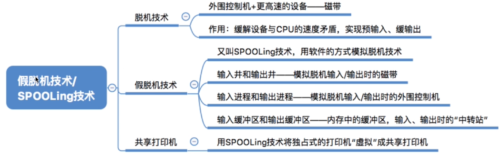

#### 1.6.2.3. 设备的分配与回收的实现
设备分配需要考虑的属性：**固有属性**，**分配算法**，**分配的安全性**

**固有属性**：**独占设备**，**共享设备**，**虚拟设备**
**分配安全性**：
- **安全分配方式**：为进程分配一个设备后就将进程阻塞，本次I/O完成后才将进程唤醒
  - 优点：破坏了**请求与保持条件**，不会导致死锁
  - 缺点：CPU与IO设备只能串行工作
- **不安全分配方式**:进程发出I/O请求后，系统为其分配I/O设备，进程可继续执行，之后还可以发出新的I/O请求。只有某个IO请求得不到满足时才将进程阻塞。
  - 优点：进程的计算任务和IO任务可以并行处理
  - 缺点：可能导致死锁

**设备分配方式**：
- **静态分配**:进程运行前为其分配全部所需资源，运行结束后归还资源
  - 优点：破坏了“请求和保持”条件，不会发生死锁
- **动态分配**:进程运行过程中动态申请设备资源

设备、控制器、通道的关系：
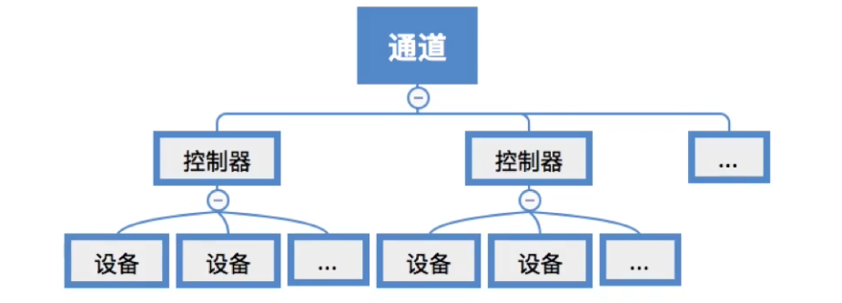

**设备分配管理中的数据结构**：
- **设备控制表(DCT)**:系统为**每个设备**配置一张DCT，用于记录设备情况
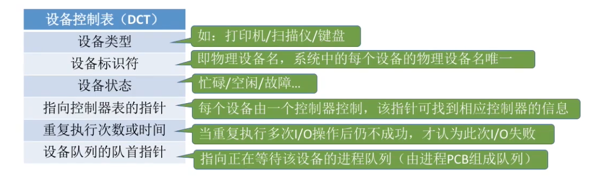
- **控制器控制表(COCT)**:**每个设备控制器**都会对应一张COCT。操作系统根据COCT的信息对控制器进行操作和管理。
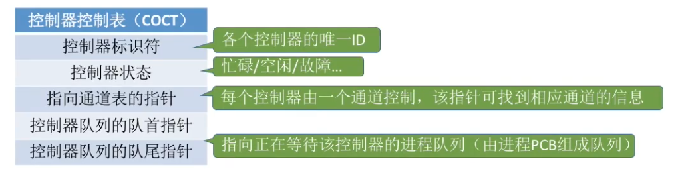
- **通道控制表(CHCT)**:**每个通道**都会对应一张CHCT。操作系统根据CHCT的信息对通道进行操作和管理。
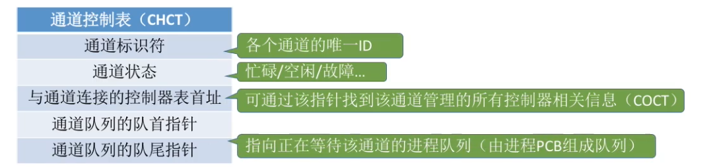
- **系统设备表(SDT)**:记录了系统中**全部设备**的情况，每个设备对应一个表目。
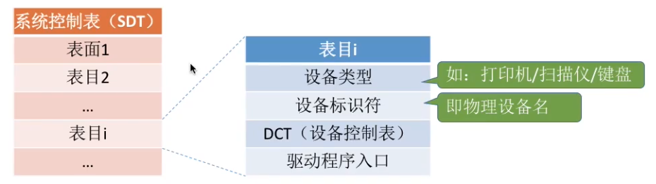

**设备分配的步骤**：查SDT → 查DCT → 查COCT → 查CHCT
1. 根据进程请求的**物理设备名**查找SDT(注:物理设备名是进程请求分配设备时提供的参数)
2. 根据SDT找到DCT，若设备忙碌则将进程PCB挂到设备等待队列中，不忙碌则将设备分配给进程。
3. 根据DCT找到COCT，若控制器忙碌则将进程PCB挂到控制器等待队列中，不忙碌则将控制器分配给进程。
4. 根据COCT找到CHCT，若通道忙碌则将进程PCB挂到通道等待队列中，不忙碌则将通道分配给进程。

根据物理设备名分配设备的缺点：
1. 用户编程时必须使用“物理设备名”，底层细节对用户不透明，**不方便编程**
2. 若**换了一个物理设备**，则程序无法运行
3. 若进程请求的物理设备正在忙碌，则即使系统中还有**同类型的设备**，进程也必须阻塞等待
解决：建立逻辑设备名（设备类型）到物理设备名的映射（逻辑映射表LUT）

改进后的流程：
- 根据进程请求的逻辑设备名査找SDT
- **查找SDT，找到用户进程指定类型的、并且空闲的设备**，将其分配给该进程。**操作系统在逻辑设备表(LUT)中新增一个表项**。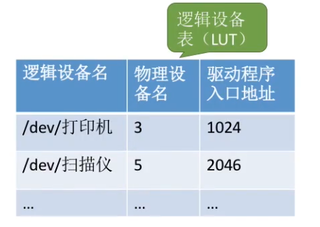
- 下同
SDT的表目需要添加设备类型（逻辑设备名）

**逻辑设备表LUT的功能**：
- 建立映射
- 第一次使用设备，需要分配
- 后续使用，直接查表

**逻辑设备表LUT的设置**：
- 整个系统只有一个
- 每个用户一个

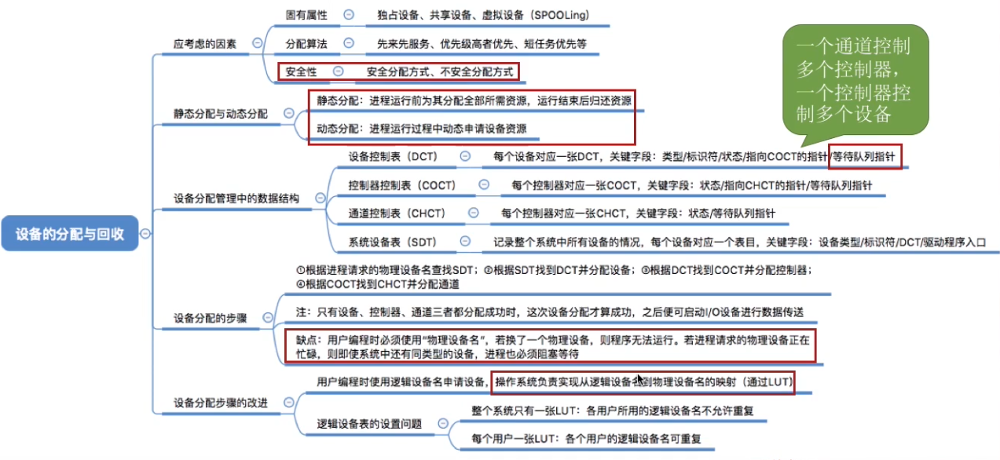
#### 1.6.2.4. 缓冲区管理
缓冲区可以使用**内存**，也可以使用**硬件**作为缓冲区
更多是利用内存作为缓冲区

**缓冲区的作用**：
- 缓和CPU与IO设备之间速度不匹配的问题
- 减少CPU中断频率，放宽对CPU中断响应时间的限制
- 解决数据颗粒度不匹配的问题
- 提高CPU与IO设备之间的并行性

缓冲区的数据传输：如果输入，就要输入到满，如果输出，就要输出到空

**缓冲区管理策略**：
- **单缓冲**：一般在内存中开辟一个块作为缓冲区
- **双缓冲**：分配两个缓冲区
- **循环缓冲区**：分配多个缓冲区，链接成循环队列，in指针指向下一个可以冲如数据的空缓冲区，out指针指向下一个满缓冲区
- **缓冲池** ：缓冲池内部有空缓冲队列，输入队列（装满了输入数据），输出队列（装满了输出数据）。当需要使用时从队头取出一个缓冲区，作为收容输入的缓冲区hin、提取输出的缓冲区sin、收容输出的缓冲区hout、提取输出的缓冲区sout 

**计算**：**处理一块数据的平均用时**：

(一)**单缓冲**
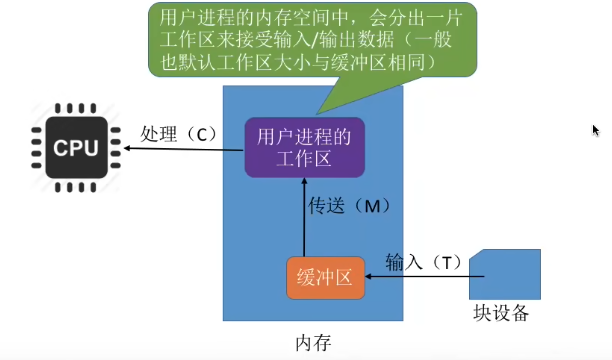

若T>C，则时间为T+M
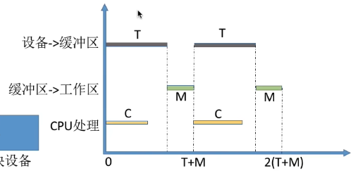

若T<C，则时间为C+M
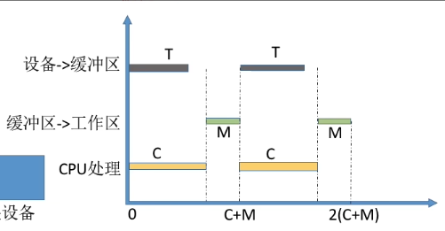

（二）**双缓冲**
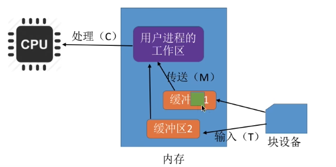

若T>M+C，则时间为T
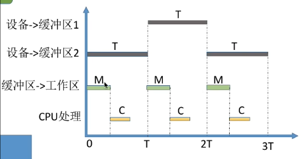

若T<M+C，则时间为M+C
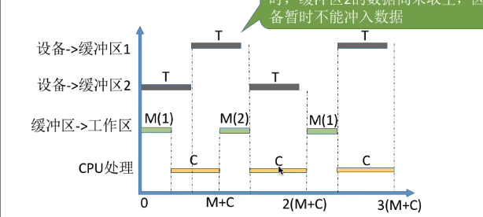

单/双缓冲区在通信应用：
单缓冲：同一时刻只能单向传输
双缓冲（输入与输出缓冲）：可以双向数据传输

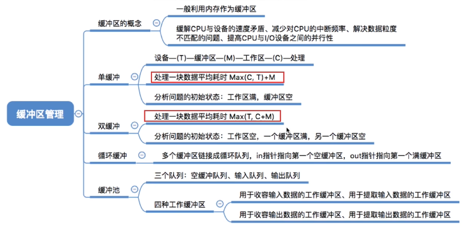