- [1. 计算机系统概述](#1-计算机系统概述)
  - [1.1. 计算机系统层次结构](#11-计算机系统层次结构)
    - [1.1.1. 计算机硬件的基本组成](#111-计算机硬件的基本组成)
    - [1.1.2. 各个硬件的原理](#112-各个硬件的原理)
    - [1.1.3. 计算机软件](#113-计算机软件)
    - [1.1.4. 计算机系统的多级层次结构](#114-计算机系统的多级层次结构)
    - [1.1.5. 计算机系统的基本工作原理](#115-计算机系统的基本工作原理)
  - [1.2. 计算机的性能指标：](#12-计算机的性能指标)
- [2. 数据的表示与运算](#2-数据的表示与运算)
  - [2.1. 数制与编码](#21-数制与编码)
    - [2.1.1. 进位计数制](#211-进位计数制)
    - [2.1.2. ※定点数的表示](#212-定点数的表示)
    - [2.1.3. C语言的定点整数强制转换](#213-c语言的定点整数强制转换)
    - [2.1.4. 零扩展与符号扩展](#214-零扩展与符号扩展)
  - [2.2. 运算方法和运算电路](#22-运算方法和运算电路)
    - [2.2.1. 加法器](#221-加法器)
    - [2.2.2. 算数逻辑单元(ALU)](#222-算数逻辑单元alu)
    - [2.2.3. 定点数的移位运算](#223-定点数的移位运算)
    - [2.2.4. 定点数的加减运算](#224-定点数的加减运算)
    - [2.2.5. 无符号数的加减运算](#225-无符号数的加减运算)
    - [2.2.6. 用电路实现补码加减运算](#226-用电路实现补码加减运算)
  - [2.3. 乘法与除法](#23-乘法与除法)
    - [2.3.1. 无符号整数的乘法原理](#231-无符号整数的乘法原理)
    - [2.3.2. 带符号整数的乘法原理](#232-带符号整数的乘法原理)
    - [2.3.3. 实现无符号和带符号乘法的三种方式](#233-实现无符号和带符号乘法的三种方式)
    - [2.3.4. 无符号整数的除法运算原理](#234-无符号整数的除法运算原理)
  - [2.4. 浮点数的表示和运算](#24-浮点数的表示和运算)
    - [2.4.1. ※浮点数的表示：IEEE 754](#241-浮点数的表示ieee-754)
    - [2.4.2. ※IEEE 754浮点数的表示范围，特殊状态](#242-ieee-754浮点数的表示范围特殊状态)
    - [2.4.3. 数据的存储与排列](#243-数据的存储与排列)
- [3. 存储系统](#3-存储系统)
  - [3.1. 存储系统概览](#31-存储系统概览)
  - [3.2. 主存，SRAM，DRAM，ROM，多模块存储器](#32-主存sramdramrom多模块存储器)
    - [3.2.1. 主存储器的基本组成](#321-主存储器的基本组成)
    - [3.2.2. SRAM和DRAM](#322-sram和dram)
    - [3.2.3. ROM](#323-rom)
    - [3.2.4. 提升主存的速度：多模块存储器](#324-提升主存的速度多模块存储器)
    - [3.2.5. 主存与CPU的连接](#325-主存与cpu的连接)
  - [3.3. 外存储器](#33-外存储器)
    - [3.3.1. 磁盘存储器](#331-磁盘存储器)
    - [3.3.2. 固态硬盘(SSD)](#332-固态硬盘ssd)
  - [3.4. ※Cahce](#34-cahce)
    - [3.4.1. Cache的基本原理](#341-cache的基本原理)
    - [3.4.2. Cache与主存的映射](#342-cache与主存的映射)
    - [3.4.3. Cache替换算法](#343-cache替换算法)
    - [3.4.4. Cache写策略](#344-cache写策略)
- [4. 指令系统](#4-指令系统)
  - [4.1. 基本格式](#41-基本格式)
    - [4.1.1. 指令的基本格式与分类](#411-指令的基本格式与分类)
    - [4.1.2. 扩展操作码指令格式](#412-扩展操作码指令格式)
  - [4.2. 寻址方式](#42-寻址方式)
    - [4.2.1. 指令寻址](#421-指令寻址)
    - [4.2.2. 数据寻址](#422-数据寻址)
  - [4.3. 高级语言程序与机器级代码之间的对应](#43-高级语言程序与机器级代码之间的对应)
    - [4.3.1. 汇编语言基础](#431-汇编语言基础)
    - [4.3.2. 常用的x86指令](#432-常用的x86指令)
    - [4.3.3. AT\&T格式：Unix、Linux的常用格式](#433-att格式unixlinux的常用格式)
    - [4.3.4. 选择语句的机器级表示](#434-选择语句的机器级表示)
    - [4.3.5. 循环语句的机器级表示](#435-循环语句的机器级表示)
    - [4.3.6. 函数调用的机器级表示](#436-函数调用的机器级表示)
  - [4.4. CISC和RISC](#44-cisc和risc)
- [5. 中央处理器](#5-中央处理器)
  - [5.1. CPU的功能和基本结构](#51-cpu的功能和基本结构)
  - [5.2. 指令执行过程](#52-指令执行过程)
  - [5.3. 数据通路](#53-数据通路)
    - [5.3.1. 单总线结构](#531-单总线结构)
    - [5.3.2. 专用数据通路](#532-专用数据通路)
  - [5.4. 控制器的功能和工作原理](#54-控制器的功能和工作原理)
    - [5.4.1. 硬布线控制器](#541-硬布线控制器)

---

# 1. 计算机系统概述
## 1.1. 计算机系统层次结构
### 1.1.1. 计算机硬件的基本组成

**在计算机系统中，软件和硬件在逻辑上是等效的**（硬件能实现的，软件也能实现）

（一）**冯诺依曼结构**：
- 结构：**输入输出设备+存储器，运算器，控制器**
- 指令与数据**同等地位**存储在存储器中
- 指令数据用**二进制**表示
- 指令由**操作码和地址码组**成
- **以运算器为中心**（输入输出设备与存储器之间的**数据交换由运算器完成**）
控制器收到存储器的指令，控制所有部件

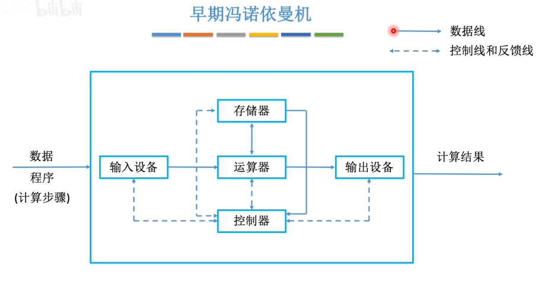
（二）**现代计算机结构**
- **以存储器为中心**
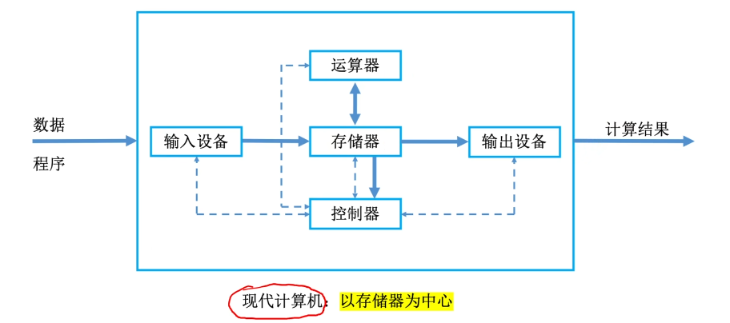

**CPU = 运算器（ALU） + 控制器（CU）+ 中断系统 + 寄存器组**
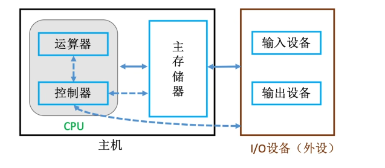

存储器分为**主存和外存**，**主存+CPU构成了主机**

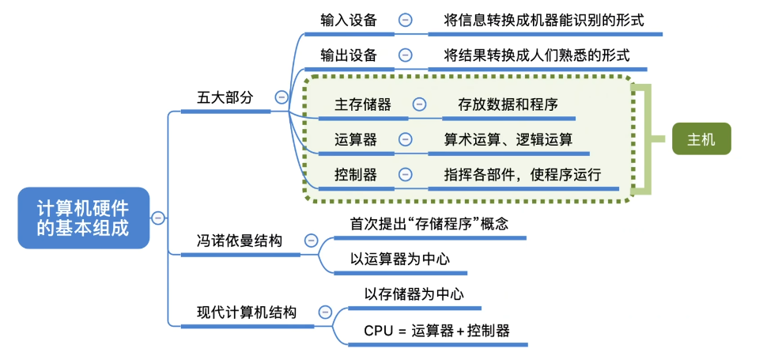

### 1.1.2. 各个硬件的原理
（一）**主存储器的基本组成**
**存储体** + **MAR**（**存储地址寄存器**） + **MDR**（**存储数据寄存器**）

存储器由一个个**存储单元**组成，每个单元存放一串二进制代码
存储代码中二进制代码的组合称为**存储字**（word）
**存储字长**：存储单位中二进制位数，通常是8bit的整数倍
**存储元**：存储二进制的**电子元件**，存储1bit

**MAR的位数**决定了并等于存储单元的个数
**MDR的位数**：位数等于存储单元的位数，也就是字长，如果字长为16bit，MDR也是16位

注意区分：字，字节。字节（Byte/B）固定为8bit，字的大小不固定
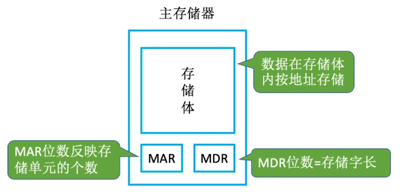

（二）**运算器的基本组成**
**运算器**：实现算数运算、逻辑运算

运算器包括：
- ACC:累加器，用于存放操作数，或运算结果。
- MQ:乘商寄存器，在乘、除运算时，用于存放操作数或运算结果。
- X:通用的操作数寄存器，用于存放操作数
- **ALU**:算术逻辑单元，通过内部复杂的电路实现算数运算、逻辑运算

（三）**控制器的基本组成**
控制器包括：
- **CU**:控制单元，分析指令，给出控制信号
- IR:指令寄存器，存放当前执行的指令
- PC:程序计数器，存放下一条指令地址，有自动加1功能

**执行指令的具体过程**：

完成一条指令：取址（PC+IR） - 执行（CU）
1. 取指令：PC
2. 分析指令：IR
3. 执行指令：CU

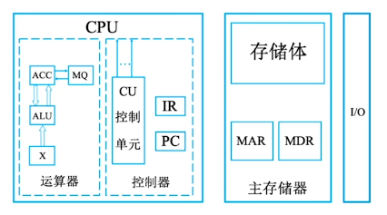

**【例】**：
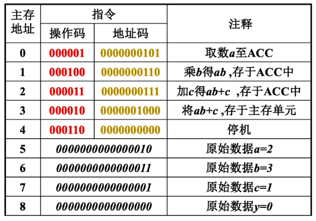
计算机的工作过程：机器码保存在主存中
**第一条取数指令**（将内存中的数取入CPU寄存器）
```
1.  起始状态(PC)=0，指向第一条指令的存储地址，(PC)→MAR，则(MAR)=0
2.  查找
3. M(MAR)→MDR，第一条指令寄存到MDR
4. （MDR）→IR，指令送入指令寄存器
5. OP(IR)→CU，IR中的操作数（前面几位）送入CU，CU分析得知指令类型是取数
6. Ad(IR)→MAR，MAR=指令参数地址（地址码）
7. 查找
8. M(MAR)→MDR，找到参数值a
9. (MDR)→ACC（累加寄存器），ACC=a
```
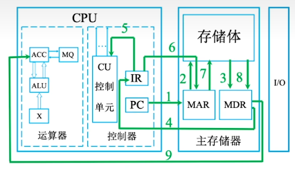

**第二条乘法指令**：
```
第一条指令执行结束，PC自动+1，(PC=1)
1.  (PC)→MAR，则(MAR)=1
2.  查找
3. M(MAR)→MDR，指令寄存到MDR
4. （MDR）→IR，指令送入指令寄存器
5. OP(IR)→CU，IR中的操作数（前面几位）送入CU，CU分析得知指令类型是乘法
6. Ad(IR)→MAR，MAR=指令参数地址（地址码）
7. 查找
8. M(MAR)→MDR，找到参数值b
9. **(MDR)→MQ（乘商寄存器）**
10. **(ACC)→X，ACC=ab**，
11. **CU控制ALU执行乘法操作，(MQ)*(X)→ACC，如果乘积太大，需要MQ辅助存储**
```
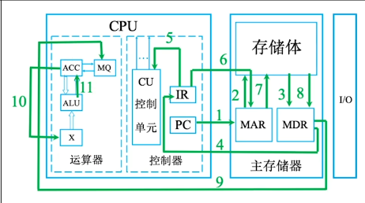

**第三条加法指令**：
```
PC自动+1，(PC=2)
1.  (PC)→MAR，则(MAR)=2
2.  查找
3. M(MAR)→MDR，指令寄存到MDR
4. （MDR）→IR，指令送入指令寄存器
5. OP(IR)→CU，IR中的操作数（前面几位）送入CU，CU分析得知指令类型是加法
6. Ad(IR)→MAR，MAR=指令参数地址（地址码）
7. 查找
8. M(MAR)→MDR，找到参数值c
9.  **(MDR)→X**
10. CU控制ALU执行加法操作 **(ACC)+(X)=(ACC),ACC=ab+c**
```
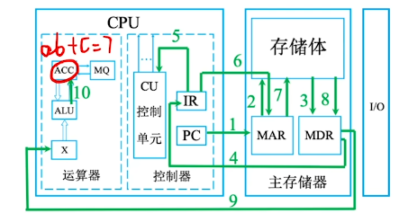

**第四条存数指令**：
```
PC自动+1，(PC=3)
1.  (PC)→MAR，则(MAR)=3
2.  查找
3. M(MAR)→MDR，指令寄存到MDR
4. （MDR）→IR，指令送入指令寄存器
5. OP(IR)→CU，IR中的操作数（前面几位）送入CU，CU分析得知指令类型是存数
6. Ad(IR)→MAR，MAR=指令参数地址（地址码）
7. **(ACC)→MDR，MDR=ab+c**
8. **CU通过控制总线控制MDR中的数据放入MAR的地址中**
```
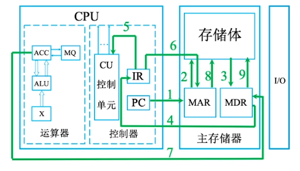

**第五条停机指令**：
```
PC自动+1，(PC=4)
1.  (PC)→MAR，则(MAR)=3
2.  查找
3. M(MAR)→MDR，指令寄存到MDR
4. （MDR）→IR，指令送入指令寄存器
5. OP(IR)→CU，IR中的操作数（前面几位）送入CU，CU分析得知指令类型是存数
6. 后续指令通过中断机制，通知操作系统终止进程
```

总结：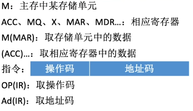

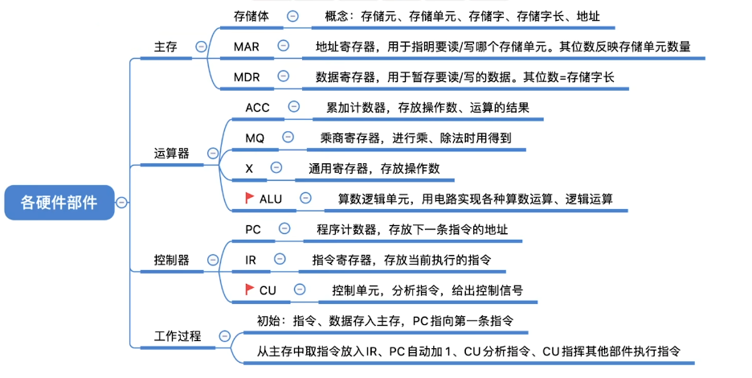

### 1.1.3. 计算机软件
- 应用软件
- 系统软件：操作系统，数据库管理系统，标准程序库（std），网络软件，语言处理软件，服务程序 

**三种级别的语言**：
1. 高级语言 --编译-- 汇编语言：助记符 --汇编--机器语言 
2. 高级语言 --编译-- 机器语言
3. 高级语言（Python等） --解释器（解释程序）-- 机器语言
编译器，汇编器，解释器可统称为**翻译程序**

**软件与硬件的逻辑功能具有等价性**
- 使用硬件实现：性能高成本高
- 使用软件实现：性能低成本低

**指令集体系结构**（ISA）：定义计算机支持哪些指令，每条指令的作用，用法

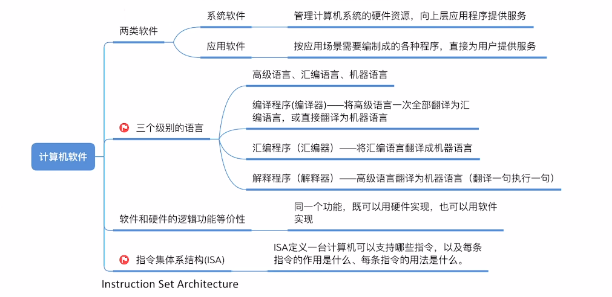

### 1.1.4. 计算机系统的多级层次结构

- 虚拟机器M4（高级语言机器）：需要用编译程序翻译成汇编语言
- 虚拟机器M3（汇编语言机器）：需要用汇编程序翻译成机器语言程序
- 虚拟机器M2（操作系统机器）：向上提供**广义指令**（**系统调用**）
- 传统机器M1（用机器语言的机器）：执行二进制**机器语言**
- 微程序机器M0（微指令机器）：由硬件直接执行**微指令**

### 1.1.5. 计算机系统的基本工作原理

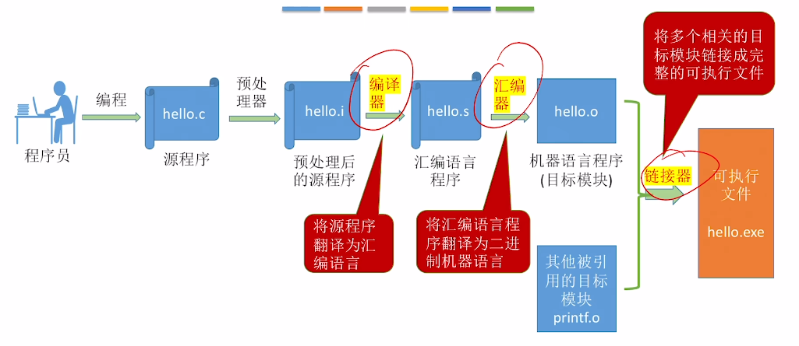

## 1.2. 计算机的性能指标：
（一）存储器
**存储器容量** = **MAR位数 * MDR位数**

（二）CPU
- **CPU主频**
- **CPU的时钟周期 = $\frac{1}{CPU主频}$**
- **CPI**：执行一条指令平均需要多少时钟周期
- **IPS**：每秒执行多少指令，**IPS = $\frac{主频}{CPI}$**
- **FLOPS**：每秒执行多少次浮点数运算

（三）系统整体
- **数据通路带宽**：数据总线的传送信息宽度
- **吞吐量**：系统单位时间内处理请求的数目
- **响应时间**：从发出请求到做出响应的等待时间

动态测试：使用**基准程序**测量计算机处理速度

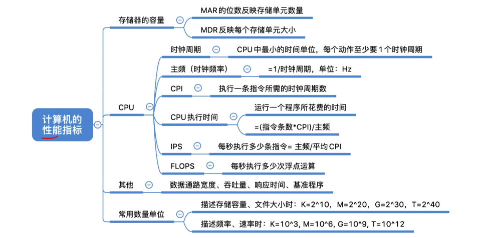

# 2. 数据的表示与运算
## 2.1. 数制与编码
### 2.1.1. 进位计数制
r进制：$K_nK_{n-1}K_{n-2}K_{n-3}...K_{0}K_{-1}K_{-2}K_{-m}=K_n*r^n+K_{n-1}*r^{n-1}...$

基数：每个数码位需要用到不同符号的个数，r进制基数为r

十进制转任意进制：取商，取模，循环
73 - 36 - 18 - 9 - 4 - 2 - 1
1  - 0  - 0  - 1 - 0 - 0 - 1

**低位 --------------------- 高位**

1001001

75 - 37 - 18 - 9 - 4 - 2 - 1
1  - 1  - 0  - 1 - 0 - 0 - 1

1001011

小数部分计算：乘法，取模，循环

.3 - .6 - .2 - .4 - .8 - .6
      0    1    0    0    1

.0100100100100....

真值：实际的数
机器数：将正负号数字化的数

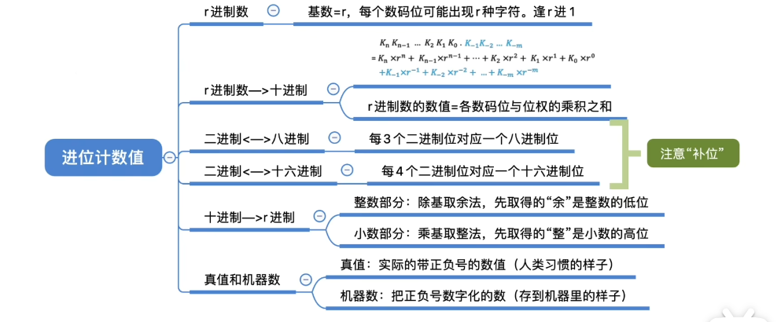


### 2.1.2. ※定点数的表示

**定点数**：小数点的位置固定
**浮点数**：小数点的位置不固定，使用科学计数法

**定点数的表示**：
- **定点整数**
  - **无符号整数**：无符号位，表示范围为$0到2^n-1$
  - **有符号整数**
    - **原码**：**最高位是符号位，0代表正数，1代表负数**，其余n-1位是数值的绝对值。n位原码表示范围为$[-(2^{(n-1)} - 1), 2^{(n-1)} - 1]$。映射方式：$0 → 2^{n-1}-1 → 0 → -2^{n-1}-1$ 
      - **问题**：**0的表示不唯一**；加减法运算复杂，需要根据符号位判断是加法还是减法
    - **反码**：正数与原码相同，负数的符号位为1，其余位置在原码基础上**逐位取反**。反码的表示范围为$[-(2^{(n-1)} - 1), 2^{(n-1)} - 1]$。映射方式：$0 → 2^{n-1}-1 → -2^{n-1}-1 → 0$ 
      - **问题**：**0的表示不唯一**；解决了减法问题（可以用加法实现），但会产生**循环进位**问题
    - **补码**：等于其**反码在末位加1**。表示范围为$-2^{n-1}到2^{n-1}-1$。循环方式：$0 → 2^{n-1}-1 → -2^{n-1} → -1$ 
    - **移码**：等于**补码的首位取反（相当于加$2^{n-1}$）**。表示范围为$-2^{n-1}到2^{n-1}-1$。循环方式：$-2^{n-1} → -1 → 0 → 2^{n-1}-1$ 
      - **优点**：**方便对比大小**

移码的偏置值：**偏置值+十进制真值=移码值**

**练习：计算50用8位原码、反码、补码、移码表示：**

解答：50的无符号2进制：110010
原反补：0011 0010
移码：1011 0010

**练习：计算-100用8位原码、反码、补码、移码表示：**

解答：100用二进制：64 32 4
原：1110 0100
反：1001 1011
补：1001 1100（+1）
移：0001 1100

**练习：求1000 1101对应的真值**

如果是原码：-13
如果是反码：11110010（原）=-114
如果是补码：13+128=141（无符号）-256=-115（二进制数值减256）
如果是移码：补码为0000 1101，13

88：64 16 8：0101 1000（补码）
-66：190：128 32 16 8 4 2：1011 1110（补码）

1011 1110+
0101 1000
0001 0110（补）=6+16=22

### 2.1.3. C语言的定点整数强制转换
**无符号数与有符号数的转换**：**不改变数据内容，只改变解释方式**（short转换为unsigned short）
长整数转换为短整数：**高位截断，保留低位**
短整数转换为长整数：符号拓展，负数添1，正数添0
短无符号转换为长无符号：直接添0

### 2.1.4. 零扩展与符号扩展
**零扩展**：适用于**无符号整数**，用0扩展高位
**符号扩展**：适用于**带符号整数**，用符号位扩展

## 2.2. 运算方法和运算电路
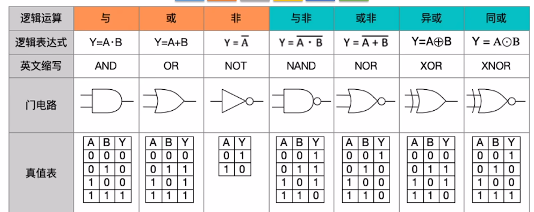
MUX：多路选择器
三态门：三极管
三态非门：三极管结果取反
### 2.2.1. 加法器
（一）**一位加法器**
**一位全加器（FA）**
$S_i=A_i\oplus B_i\oplus C_{i-1}$
$C_i=A_iB_i+(A_i\oplus B_i)C_{i-1}$

（二）**并行加法器**
**串行进位加法器**
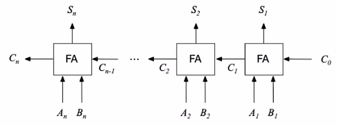
**缺点**：进位信息串行产生，计算速度取决于进位速度，**位数越多，运算速度越慢**
特点：**串行进位的并行加法器**（并行指支持允许并行输入）  
注：串行进位又叫**行波进位**

**并行进位加法器**：进位信息**并行产生**，**几乎没有延迟**

（三）**带标志位的加法器**
1. 溢出：**OF标志位**，判断**带符号加减**是否溢出。**CF标志位**，判断**无符号数**是否溢出
2. 运算结果是否为0：**ZF标志位**，判断加减操作是否为0
3. 结果为正还是负：**SF标志位**，判断**带符号加减结果正负**

标志位实现：
**OF**：$C_n\oplus C_{n-1}$
**SF**：$S_n$
**ZF**：$\overline{S_n+S_{n-1}...+S_1}$
**CF**：$C_n\oplus C_0$

### 2.2.2. 算数逻辑单元(ALU)
（一）**ALU在计算机中的作用**

- 运算器包括**各类寄存器，算数逻辑单元（ALU），PSW寄存器（程序状态字寄存器）**，其中**ALU是运算器的核心**
- ALU的核心是**加法器**

（二）**ALU的功能**

- **算术运算**：加减乘除
- **逻辑运算**：与或非，移位，异或等
- **其他**：求补码，直送等

ALU：有输入信号和A，B（n bit）；控制信号op（m bit）；输出F（n bit）

（三）**ALU的实现原理（了解即可）**
最简单的方法：多个功能电路+MUX

（四）**ALU的图示**
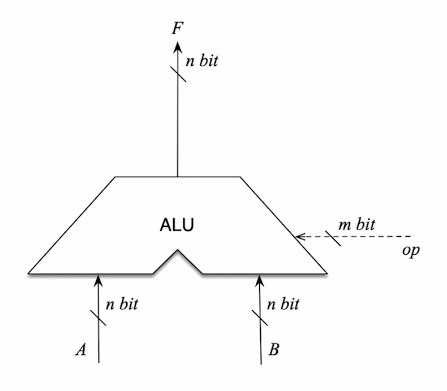
- 控制信号的位数与**ALU支持的功能数**相关
- ALU的A，B，F的位数决定了**计算机的字长**
- ALU的标志位（ZF，SF，OF，CF等）通常会被送入**程序状态字寄存器PSW**中
- 有的计算机把PSW称为FR
- Cin：进位输入信号；Cout：进位输出信号

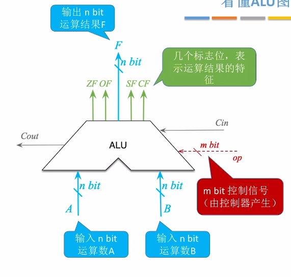

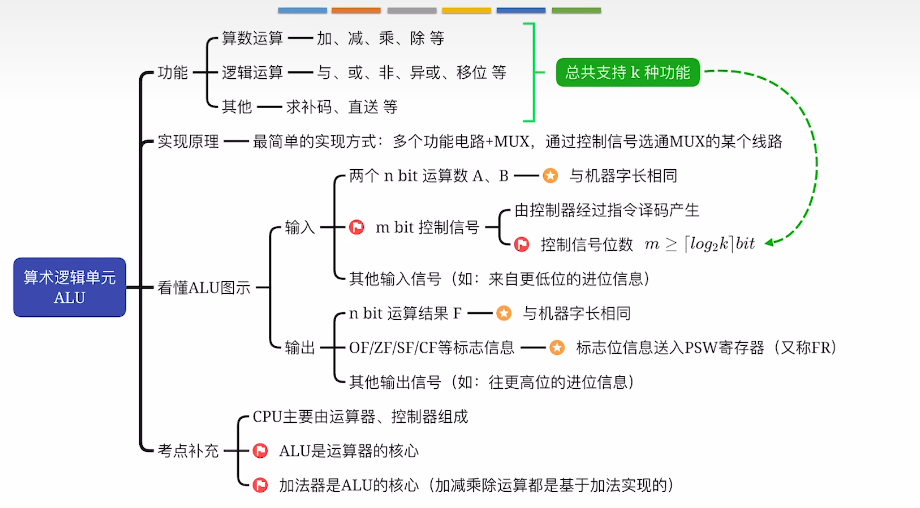

### 2.2.3. 定点数的移位运算
移位运算：左移k位，等于乘以n^k

定点数的移位运算：
- **逻辑移位**：适用与**无符号整数**
- **算数移位**：适用于**带符号整数**

（一）**逻辑移位**
- **逻辑左移**：高位移出丢弃，低位补0。如果左移丢弃的位=1，会导致**溢出**
- **逻辑右移**：低位移出丢弃，高位补0。如果右移丢弃的位=1，会导致**丢失精度**

（二）**算数移位**
- **算数左移**：高位移出丢弃，低位补0。如果**符号位发生改变**，会导致溢出
- **算数右移**：低位移出丢弃，高位**补符号位**。如果右移丢弃的位=1，会导致丢失精度

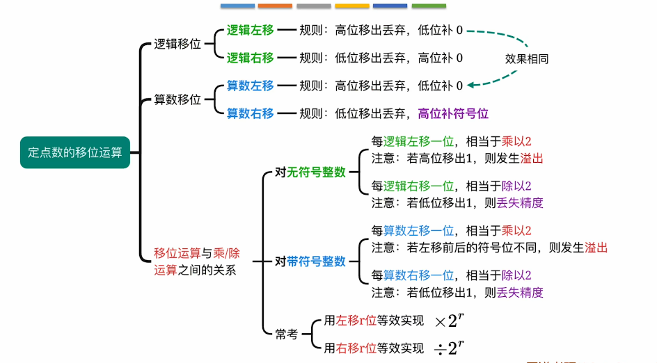

### 2.2.4. 定点数的加减运算
（一）原码的加减（了解）：分为正正，负负，正负。减法：转换为加法。正正负负需要考虑到溢出

（二）**补码的加减**：加法直接加，减法取相反数（取反+1）相加

- **溢出**：正数加正数可能正溢，负数可能负溢
- 判断溢出方法：
  - **符号位发生改变**（$A_SB_S\overline{S_S}+\overline{A_S}·\overline{B_S}{S_S}=1$
  - **根据符号位的进位和数值位的进位情况**：如果符号位和数值位同时进位：0000 - 1111没有溢出。只有当**符号位和数值位不同时进位**，才会发生溢出：$C_S\oplus C_1=1$。下溢：符号位进位为1。上溢：数值位进位为1。
  - **采用双符号位法**：正数符号位为00，负数符号位为11，计算结果符号位为01，发生上溢，符号位为10，发生负溢。$S_{S1}\oplus S_{S2}=1$

双符号位补码：**模四补码**。单符号位补码：**模二补码**
双符号位存储时只会保存一个，计算时复制一个符号位

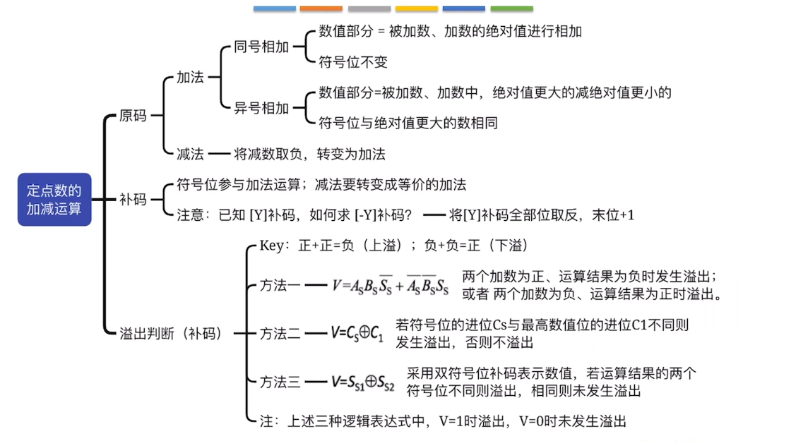

### 2.2.5. 无符号数的加减运算
加法：直接相加
减法：把减数求补数再相减

判断溢出：
**加法**：**最高位产生进位**，则溢出（100+100=1000，溢出）
**减法**：变成加法后**最高位没有进位**，则溢出（001-010=001+110=111，没有产生进位，溢出）

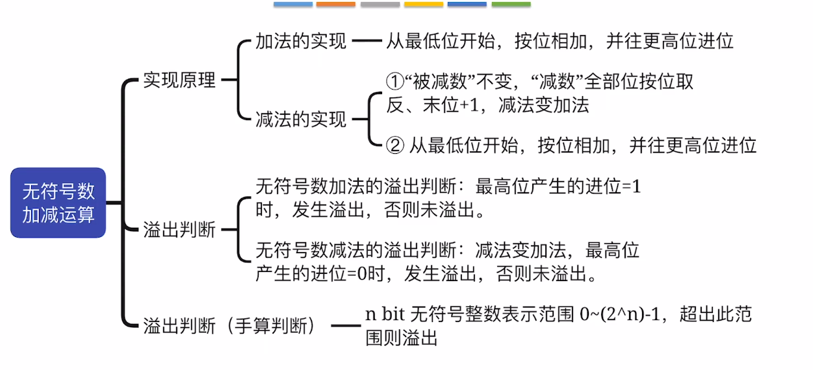

### 2.2.6. 用电路实现补码加减运算
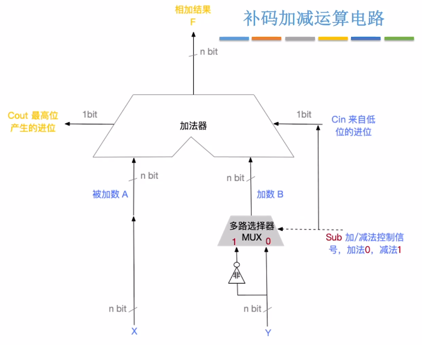

相减时，被减数全部取反，进位信息实现+1

标志位：
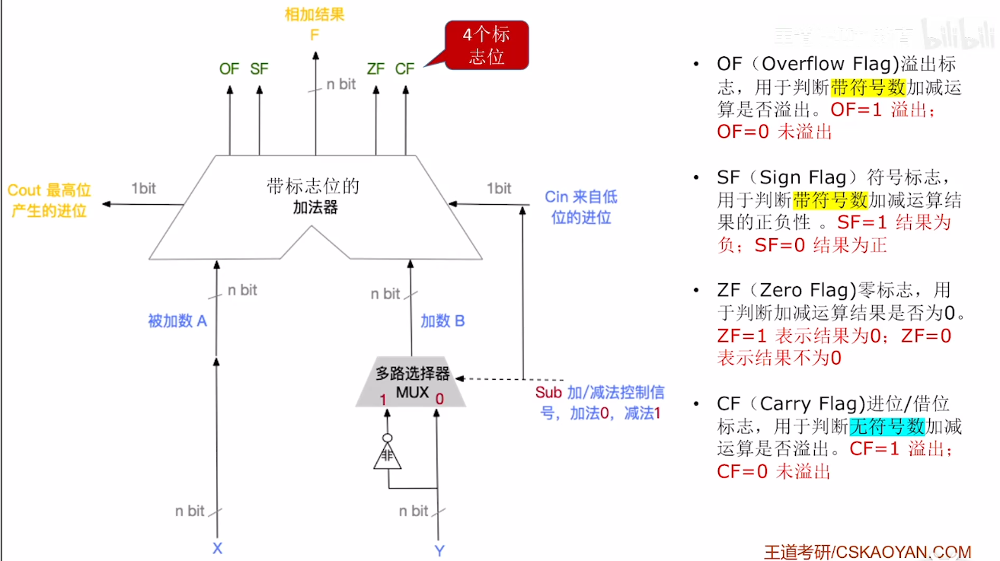

## 2.3. 乘法与除法
### 2.3.1. 无符号整数的乘法原理
方法：逐位相乘（移位），得到部分积，**叠加**得到乘积结果

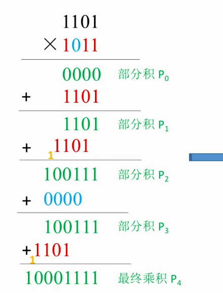

※**硬件实现**：关键词：**加法，移位，循环**
硬件：**乘积寄存器P和乘数寄存器Y组成2n位**，被乘数寄存器X为n位
1. 开始时，被乘数，乘数放入寄存器中，乘积寄存器置为0，控制逻辑计数器置为n
2. 控制逻辑检查被乘数和乘数是否全零，如果全0则结果为0
3. 重复n轮移位，加法运算：
   1. 最低位送入控制逻辑
   2. 控制逻辑进行判断，如果最低位为1，**执行加法P+X，运算结果写回P**，进位放入单独的一位**进位触发器C**中;如果最低位为0，什么也不做
   3. 控制逻辑发出右移信号，**CPY整体右移一位**
   4. **控制逻辑计数器$C_n$减一**
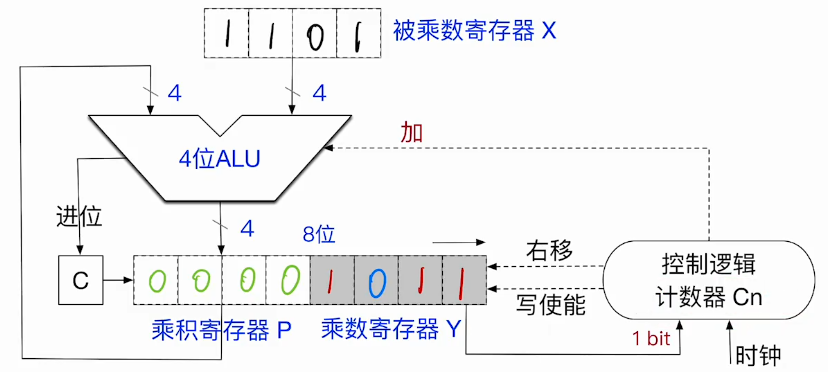

在很多计算机中，只会用低n个比特保留计算结果，可能会发生**溢出**
判断方法：如果**高n位不全为0**，则发生了溢出
处理方法：1.忽略；2.处理溢出异常：执行乘法指令后执行一条**溢出自陷指令**，指令会**检查OF标志位**，如果溢出就执行**异常处理程序** 
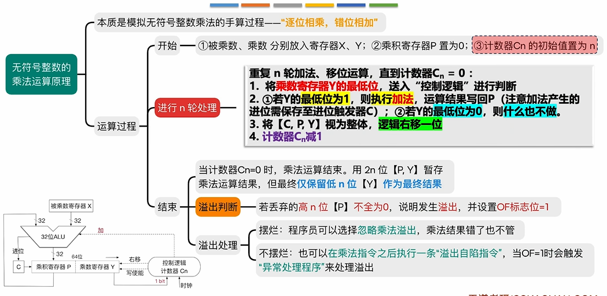

### 2.3.2. 带符号整数的乘法原理
与带符号整数的乘法，电路不同：
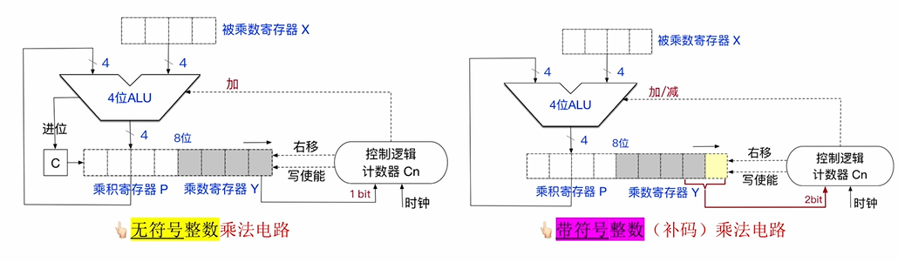
区别：
1. 乘数寄存器低位新增一位**辅助位**
2. 控制逻辑一次取两个bit（辅助位+乘数末位）
3. 不保存最高位的进位信息

※**硬件实现**：关键词：**取两位，加或减**
硬件：**乘积寄存器P，乘数寄存器Y和辅助位组成2n+1位**，被乘数寄存器X为n位
1. 开始时，被乘数，乘数放入寄存器中，乘积寄存器置为0，控制逻辑计数器置为n
2. 控制逻辑检查被乘数和乘数是否全零，如果全0则结果为0
3. 重复n轮移位，**加减运算**：
   1. **最低两位（Y的最低位+辅助位）**送入控制逻辑
   2. 控制逻辑进行判断，如果最低位为**01**，执行**加法P+X**，运算结果写回P，如果最低位为**10**，执行**减法P-X**，运算结果写回P，如果最低位为**00或11**，不操作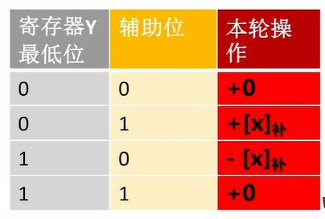
   3. 控制逻辑发出右移信号，PY+辅助位，整体右移一位，空出的位用**原符号补齐**
   4. **控制逻辑计数器$C_n$减一**

溢出判断：**取前n+1位**（例如4位*4位，取结果的前5位）如果前n+1位**都为0或都为1**，则**没有溢出**，如果**不完全相同**，则**溢出**
处理：与无符号相同，1.忽略；2.处理溢出异常：执行乘法指令后执行一条**溢出自陷指令**，指令会**检查OF标志位**，如果溢出就执行**异常处理程序** 
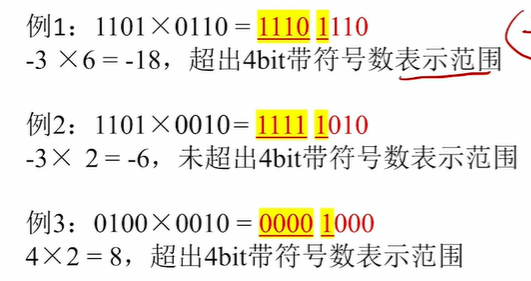

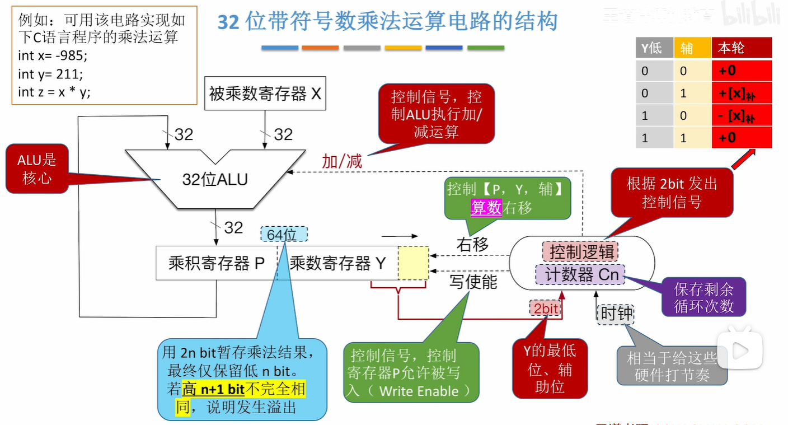

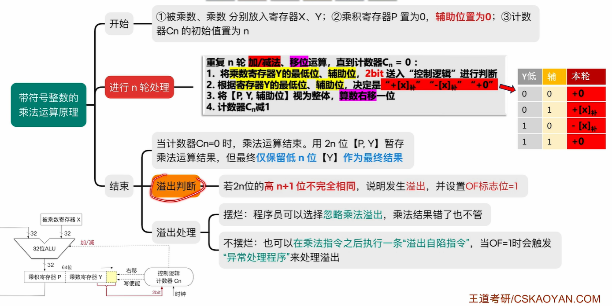

### 2.3.3. 实现无符号和带符号乘法的三种方式
（一）由**ALU，移位器，寄存器，控制逻辑**实现的乘法电路
实现n bit无符号数相乘，**至少需要n个时钟**
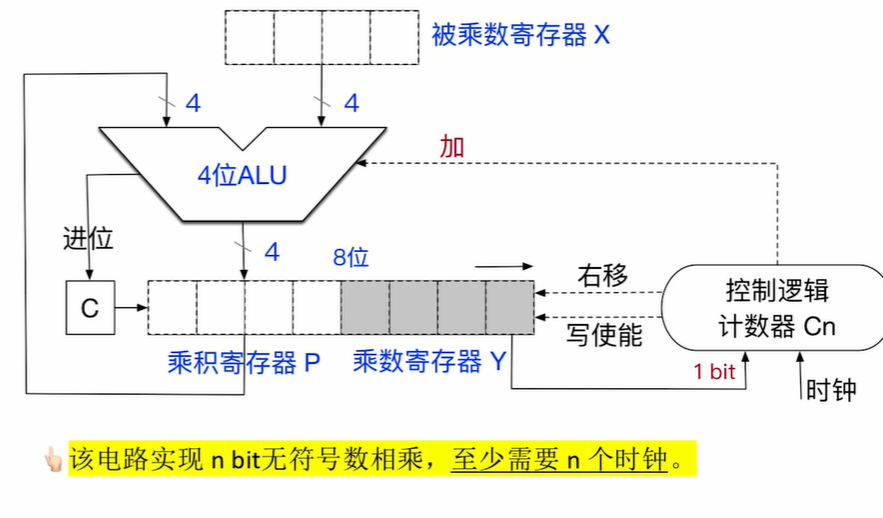

改进方案：一次乘两个bit，时钟缩短为n/2

（二）**阵列乘法器**
特点：可以在**一个周期**内完成乘法运算
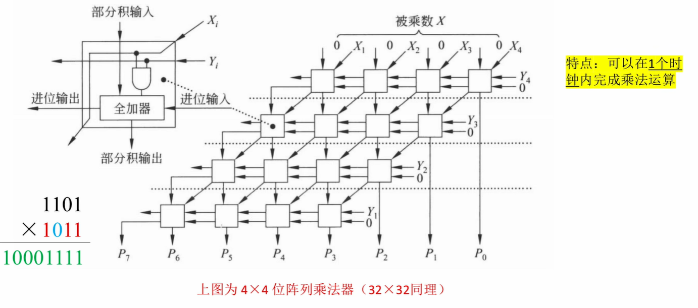

**阵列乘法器**是**快速乘法器**的一种，快速乘法器能在一个周期内完成乘法运算

（三）**使用逻辑运算（位运算，移位运算等）、加减运算等效实现乘法**
优点：在没有乘法运算电路，不支持乘法指令的计算机中可以等效实现乘法运算，**兼容性好**
缺点：**运算速度很慢**，在非流水线计算机每条指令至少需要一个时钟

### 2.3.4. 无符号整数的除法运算原理
（一）手算方法：
二进制上商规则：**中间余数大于等于除数，上商1，否则上商0**
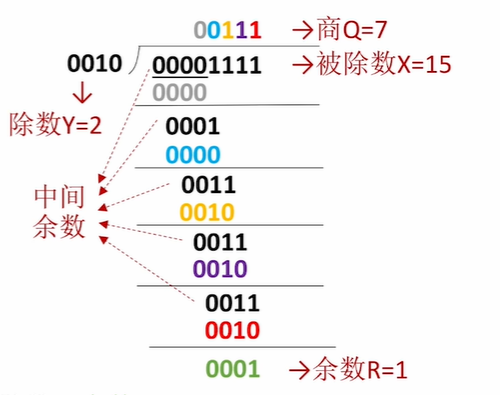

（二）除法电路的基本结构，基本原理，**重点关注：开始状态，结束状态，除法异常判断**

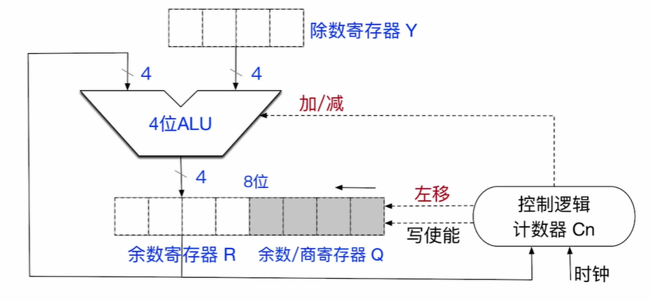
**支持2n bit除以n bit，得到n bit商和n bit余数**

※**硬件实现**：
硬件结构：除数寄存器Y，余数寄存器R与余数/商寄存器Q，组成2n bit，控制逻辑控制ALU的加减和RQ的左移和写使能
1. 开始
   1. 将数据放入寄存器：**除数放入Y；被除数放入RQ，完成零扩展；Cn置为n**
   2. 检查特殊情况：
      1. **除数0判断**：如果除数为0，发生“除数为0”异常，停止除法运算，调出操作系统的异常处理程序
      2. **商0判断**：被除数的绝对值小于除数的绝对值，直接**商0，余数等于被除数**，不必除法
2. 运算过程，进行**n+1轮**处理：上商规则与手算相同，**中间余数大于等于除数，上商1，否则上商0**
   1. 第一轮**特殊处理**：
      1. 直接上商，如果第一位商1，发生“**商溢出**”异常，停止除法运算
      2. 如果第一位商0，无事发生（这一位**不会保存**，**Cn也不会--**）
   2. 后n轮循环处理
      1. 左移，RQ最低位空出用于保存商
      2. 上商，同样按照上商规则，背后可能进行加法/减法
      3. 计数器Cn--，Cn=0时除法运算结束
3. 结果：
   1. R：**最终的余数**，Q：**最终的商**
      

注意**恢复余数法**：试减的时候中间余数会先减除数，如果错减就**再加上除数**，所以控制逻辑需要控制ALU进行加运算和减运算

（三）除法异常：除数为0，商溢出

关于除法商溢出：
  - 该除法器支持：双精度除法，单精度除法
  - 2n bit/n bit称为**双精度除法**，可能发生商溢出；
  - n bit/n bit称为**单精度除法**，**不可能发生商溢出**

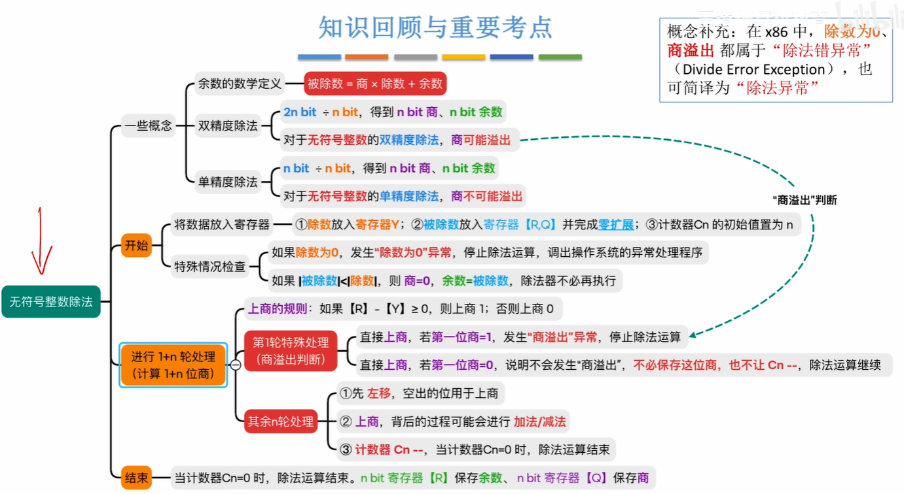

## 2.4. 浮点数的表示和运算
### 2.4.1. ※浮点数的表示：IEEE 754
float：32bit；double：64 bit
（一）科学计数法
科学计数法：**符号+尾数*基数^阶码**， $\plusmn尾数*基数^{阶码}$
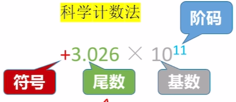
**规格化**：尾数的**最高非0数位**刚好在小数点前
尾数决定了**浮点数的精度**，阶码决定了**浮点数的表示范围**

（二）**IEEE 754浮点数的存储格式**：单精度/双精度
保存二进制的浮点数，需要保存：**符号位、阶码、尾数**，阶数固定为2

- float型：**1bit符号位+8bit阶码位+23bit尾数位**
- double型：**1bit符号位+11bit阶码位+52bit尾数位**
- long double型：80位扩展精度浮点型；16bit半精度浮点型；128bit四倍精度浮点型

1. **float单精度型**：
   - 符号位：0正1负
   - 尾数：默认存储规格化的浮点数，**小数点前的1省略**（1.尾数）
   - 阶码：用**移码**表示，偏置为**127**
     - **E全0为-127**，当尾数为0时代表无穷小（0），尾数不为0时代表是非规格化数，隐含的整数位为0
     - **E全1为128**，当尾数为0时代表无穷大，尾数不为0代表NaN
     - **E=1000 0000为1**
1. **double双精度型**：
   - 符号位：0正1负
   - 尾数：默认存储规格化的浮点数，小数点前的1省略（1.尾数）
   - 阶码：用移码表示，偏置为**1023**
     - **E全0为-1023**，当尾数为0时代表无穷小（0），尾数不为0时代表是非规格化数，隐含的整数位为0
     - **E全1为1024**，当尾数为0时代表无穷大，尾数不为0代表NaN
     - **E=100 0000 0000为1**


（三）题型：**真值转浮点数；浮点数转真值**

**真值 → 浮点**

【例1】：-8.25转换为float型：
解：符号位为1，1000.01科学计数法表示为1.00001*2^3，尾数为0000100 00000000 00000000，阶码真值为3，移码为1000 0010。浮点数为1100 0001 0000 0100 0000 0000 0000 0000 = C104 0000（HEX）

**浮点 → 真值**

【例2】：C640 0000H转换为真值：
解：1 10001100 10000000000 0000 0000 0000，符号为负，阶码为1100+1=1101=13，尾数为0.5，因此为$-1.5*2^{13}$
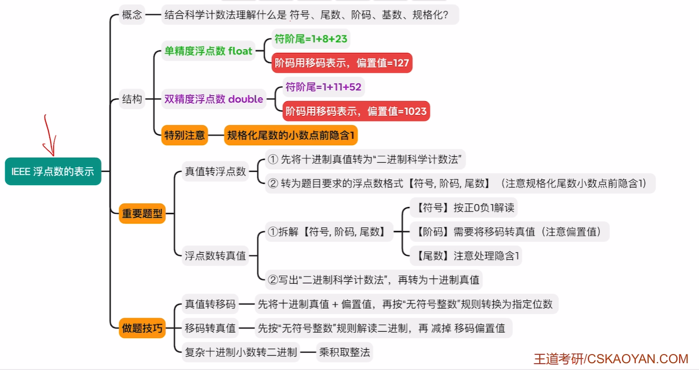

### 2.4.2. ※IEEE 754浮点数的表示范围，特殊状态
（一）**规格化浮点数**表示范围
**阶码不全为0，也不全为1，表示这是一个规格化的浮点数**
阶码全为0或全为1用于特殊解读

**表示范围**：
1. 阶码的表示范围为(1~254)-127 = -126~127
2. 最小绝对值为0 0000 0001 0000……=$1.0*2^{-126}$
3. 最大的绝对值为0 1111 1110 1111……=$1.1111……*2^{127}$ = $(2-2^{-23})*2^{127}$
4. 不在范围内的，被表示为0或无穷
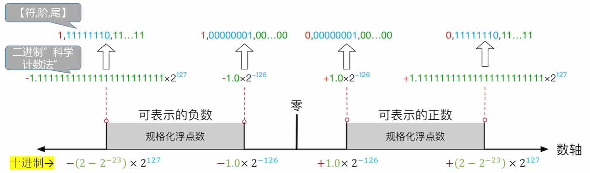

（二）**超出规格化的表示范围的解决方法**

①**上溢的处理**：
**正上溢**：运算结果大于最大规格化正数
**负上溢**：运算结果小于最小的规格化负数
正上溢与负上溢统称为上溢（Overflow）/溢出
**溢出的处理方法**：运算结果设为$+\infin或者-\infin$（0/1 11111111 0000……）
默认不响应浮点数溢出异常，不中断程序，可手动开启

②**下溢的处理**：
  1. 落入非规格化区间，用**非规格化浮点数**存储
  2. 若下溢至机器零，运算结果设为**正0或负0**(1/0 00000000 0000……)
  3. 设置浮点数下溢异常标志位（如x86的FPU的UE标志位），默认不响应浮点数下溢异常，不中断程序，可手动开启
  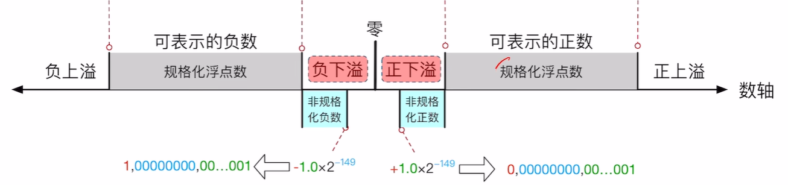

**注**：非规格化浮点数：0/1 00000000 f（非0），表示$0.f*2^{-126}$，
**非规格化浮点数绝对值最小为$2^{-149}$**(0/1 00000000 000……0001)
**非规格化浮点数绝对值最大为$2^{-126} - 2^{-149}$**
$0/1 00000000 1111…1111 = 0.1111……1111(23个1)*2^{-126} = (1 - 2^{-23}) × 2^{-126} = 2^{-126} - 2^{-149})$

【例】：float类型8020 0000H的值为
解答：1 00000000 01000000000000000000000，是一个非规格化浮点数，$-0.25*2^{-126}=-2^{-128}$

（三）**几种特殊状态**
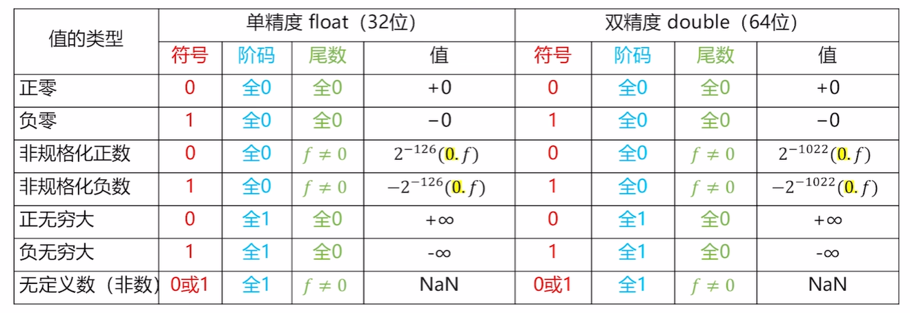

NaN：0除0，负数开根号，无穷减无穷
特别的，非0浮点数除浮点数0，结果为无穷（$1.0f/0.0f=\infty$)

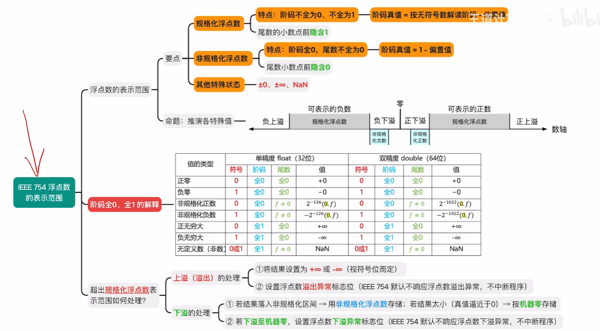

### 2.4.3. 数据的存储与排列
如4B的int：01 23 45 67H
**最高有效字节MSB**：01
**最低有效字节LSB**：67

**大小端模式**：
多字节的数据在内存内一定是**连续存放**的
- **大端模式**：低地址存放最高有效字节（人类的阅读方式）
- **小端模式**：低地址存放最低有效字节（便于机器处理）
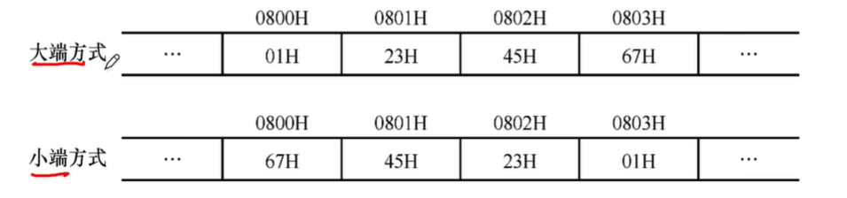

**边界对齐**：
现代计算机通常按字节编址，通常也支持**按字/按半字寻址**
假设字长为32位，半字=16bit，**每次访存只能读写一个字**

- **边界对齐方式**：一个变量不会被字的边界切分（无切分）
- **边界不对齐方式**：有切分，访问一个小于字长的变量可能需要**多次访存**
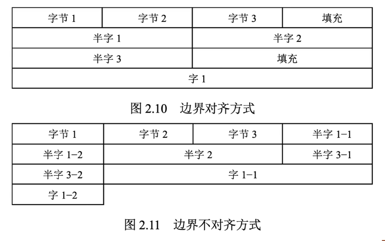

# 3. 存储系统
## 3.1. 存储系统概览
（一）存储器的层次化结构：
**寄存器 - Cache（高速缓冲存储器） - 主存（内存） - 辅存（硬盘） - 外存（磁带，光盘等）**
从前到后：**速度越来越慢，容量越来越小，造价越来越低**
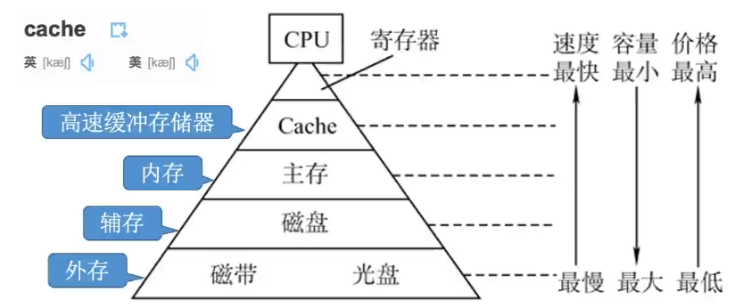

**存储器的调入调出关系图**：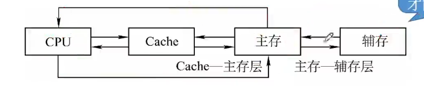
（**CPU，Cache，主存**互相读写，由硬件自动完成，**主存与辅存**相互读写,由操作系统与硬件负责（页面置换算法））

Cache-主存的作用：**缓解CPU与主存之间的速度矛盾**
主存-辅存的作用：**实现虚拟存储系统，解决主存容量不够的问题**

（二）存储器的分类：

（1）按存储介质分类
- **半导体存储器**：主存，Cache
- **磁表面存储器**：磁盘，磁带
- **光存储器**：光盘

（2）按存取方式分类
- **随机存取存储器（RAM）**：读写任一单元**时间都相同**，与物理位置无关
- **顺序存取存储器（SAM）**：读写一个存储单元的时间**取决于物理位置**
- **直接存取存储器（DAM）**：既有随机存取的特性，又有顺序存取的特性
- **相联存储器（CAM）**：**按照内容**检索到存储为止进行读写，如**快表**

SAM与DAM统称**串行访问存储器**

（3）按信息的可更改性
- **读写存储器**：磁盘，内存，Cache
- **只读存储器（ROM）**：如光盘

（4）按信息的可保存性
- **易失性存储器**（主存，Cache）：断电后信息消失
- **非易失性存储器**（磁盘，光盘）
- **破坏性读出**（如DRAM芯片）
- **非破坏性读出**（如SRAM、磁盘、光盘）

（三）存储器的性能指标：
**存储容量**：存储字长 * 字长
**单位成本**：每位价格 = 总成本 / 总容量
**存储速度**：**数据传输率** = 数据宽度（**存储字长**）/存储周期  

注：
1. 存储字长 = MDR的位数
2. **存取时间**：启动存取到完成一次存取所需要的时间，分为读出时间和写入时间
3. **存取周期**：两次独立存取之间的最小时间，包括存取时间和恢复时间
4. **主存带宽**又称为数据传输率，也就是存储速度
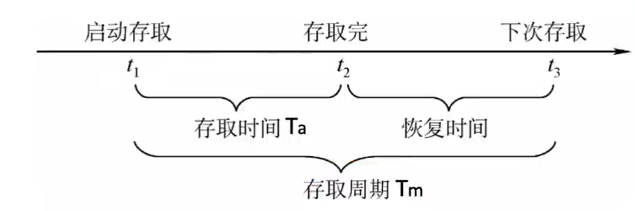

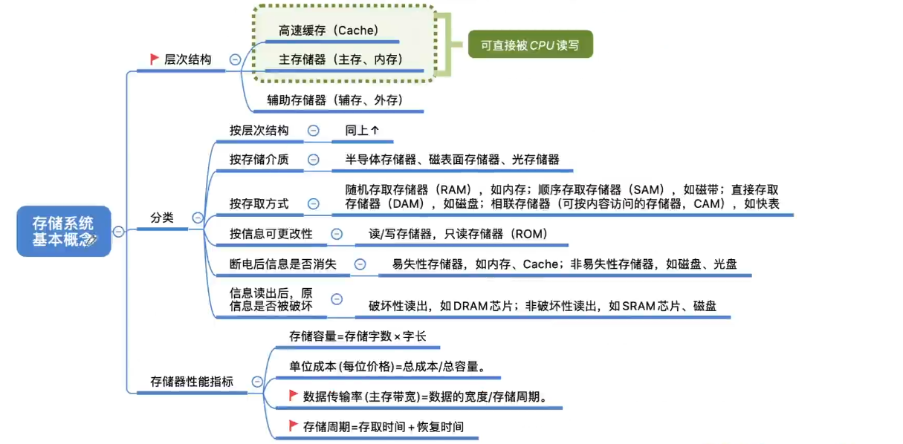

## 3.2. 主存，SRAM，DRAM，ROM，多模块存储器
### 3.2.1. 主存储器的基本组成
（一）**半导体元件的原理**
一个**存储元**包括一个**电容**和一个**MOS管**
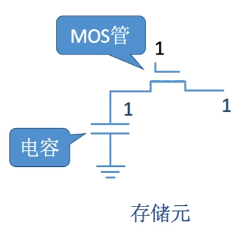
**MOS管**：电压达到阈值就可以被导通，是一个**半导体元器件** 

存储元组织起来形成**存储单元**（**存储字**）
存储单元组织起来形成**存储体**
总容量 = 存储单元个数 * 存储字长
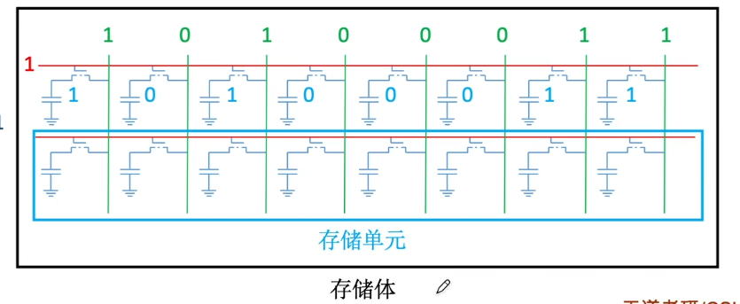

（二）**存储芯片的基本原理**

**译码器**：
1. 根据MAR的地址转换为某一条**字选线**一个高电平信号，实现**读出指定的一个字**
2. 数据通过**数据线**（**位线**）送入**MDR**中。
3. CPU通过数据总线从MDR中取走这一个字的数据
  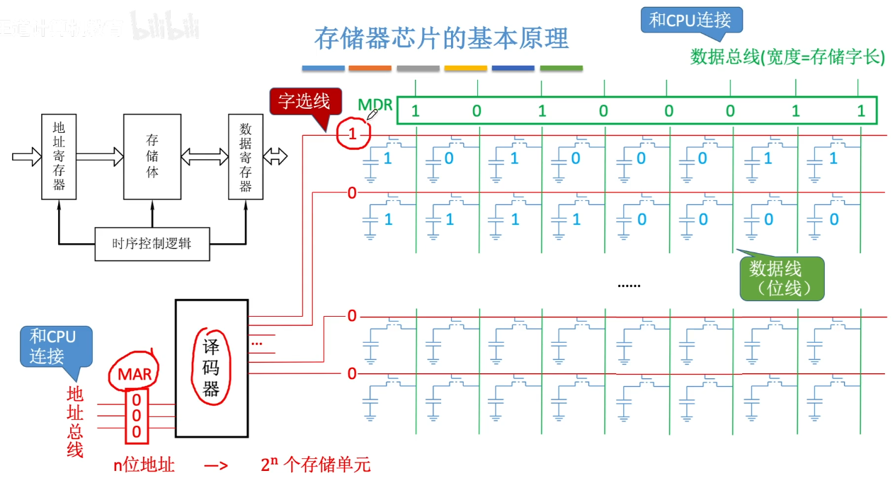

**控制电路**：控制MAR与MDR，MAR稳定才会打开译码器。MDR稳定才给数据总线输出数据。

**对外提供的线路**：
1. $\overline{CS}或\overline{CE}$（上横线表示低电平有效）：**片选线**，意为芯片选择信号/芯片使能信号，是**总开关**
2. **读控制线**$\overline{OE}$
3. **写控制线**$\overline{WE}$

**注**：读写控制线可以**合二为一**，$\overline{WE}$**低电平写，高电平读**

**整体来看**：
存储器芯片内部由**存储矩阵，译码驱动电路，读写电路**组成，
对外暴露**地址线（接地址总线），数据线（接数据总线），片选线，读写控制线**
另外，还会有供电引脚，接地引脚
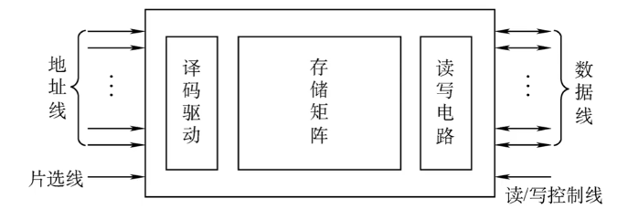

常见的描述:
8Kx8位，即2^13x8bit
8Kx1位，即2^13x1bit
64Kx16位，即2^16x16bit

（三）**不同的寻址方式的实现**
现代计算机通常**按字节编址**，每个字节对应一个地址

假设有1KB的存储器
- 若按字节寻址：有1K个地址
- 若按字寻址：有256个单位
- 若按半字寻址：有512个单位

字地址与字节地址的转换方式：**字地址左移两位**得到该字的首个字节的字节地址
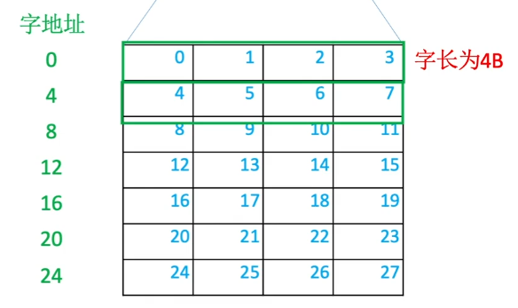

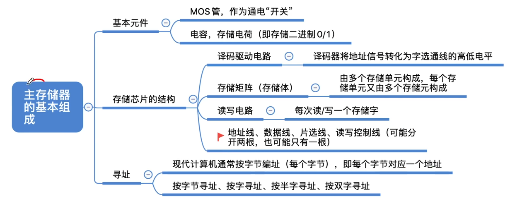

### 3.2.2. SRAM和DRAM
RAM：随机访问存储器
SRAM：静态RAM，**用于Cache**
DRAM：动态RAM，**用于主存**

（一）元件的特性差异
①DRAM使用**栅极电容**存储信息，而SRAM使用**双稳态触发器**存储信息，数据线有两条

SRAM：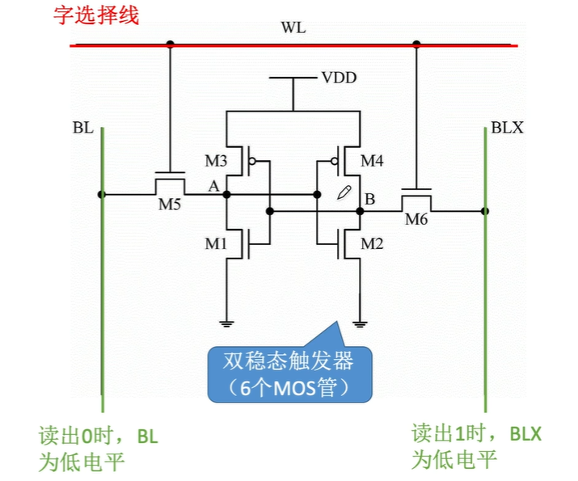
有六个MOS管，两种状态：A高B低和A低B高
读出0时BL为低电平，读出1时，BLX为低电平，写同理

②DRAM会**破坏性读出**，读后应有**重写**操作；SRAM会**非破坏性读出**，无需重写

③DRAM读写速度**更慢**，SRAM读写速度**更快**

④DRAM制造**成本低**，**集成度高**；SRAM制造**成本高**，**集成度低**

⑤DRAM**功耗低**，SRAM**功耗高**

⑥DRAM**需要刷新**，SRAM**不需要刷新**

⑦DRAM的**行列地址同时送**，SRAM**分两次送**

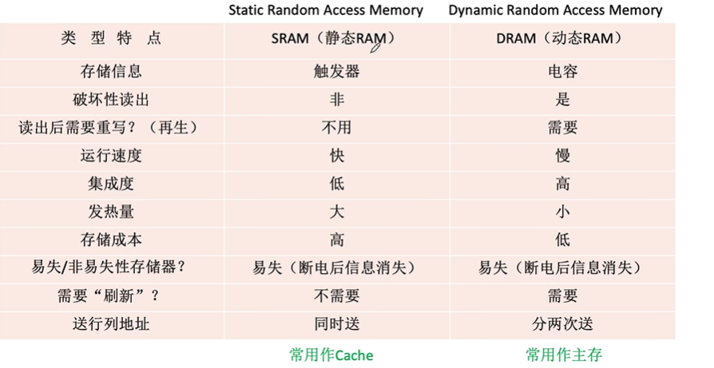

（二）DRAM的刷新
1. 周期：一般为2ms
2. 每次刷新的存储元：**每次刷新一行**存储单元
3. 刷新方式：硬件支持，**读出一行**的信息后**重新写入**，需要**占用一个读写周期**
4. 什么时候刷新：假设DRAM内部排列成128*128，读写周期为0.5us，2ms占4000个周期
   1. **分散刷新**：每次读写完都刷新一行，前0.5us用于读写，后0.5us用于刷新某一行。缺点：**存取周期变为1us**
   2. **集中刷新**：2ms内集中安排一段时间刷新，这段时间内无法访问存储器，称为**死区**，存取周期还是0.5us
   3. **异步刷新**：将死时间分散，2ms内每行刷新一次即可，2ms内共需要128次刷新，**间隔为15.6us**，则每隔15.6us有0.5us的死时间。可以在CPU进行译码的时间进行刷新

注：
1. 将地址分为**行地址和列地址**，分为行地址译码器和列地址译码器，每个译码器所接片选线的根数从$2^n$根减少为$2^{\frac{n}{2}}$条，共$2*2^{\frac{n}{2}}$
2. 译码的操作：前n/2位送给行地址译码器，后n/2位送给列地址译码器


（三）DRAM的地址线复用技术
只用n/2个针脚接n/2条地址线，先把行地址送入**行地址缓冲器**，再把列地址送入**列地址缓冲器**，由缓冲器将行地址和列地址送入译码器
优点：减少地址线的数目，从而**减少芯片引脚的数目**

### 3.2.3. ROM
ROM：非易失性，断电后数据不会消失

1. **MROM**（掩模式只读存储器）：**生产过程中直接写入**，只能读出，可靠性高，灵活性差，生产周期长，只适合批量定制
2. **PROM**（可编程只读存储器）：用户可用专门的写入器写入信息，**写了一次就不可更改**
3. **EPROM**（可擦除可编程只读存储器）：可进行**多次读写**
   1. **UVEPROM**：用紫外线照射**擦除所有信息**
   2. **EEPROM**：可用电擦除技术，**擦除特定的字**
4. **闪存**：如U盘，SD卡，可进行多次快速读写，特点是**写速度比读速度更慢**，且每个存储元只需要单个MOS管，**位密度比RAM高**
5. **SSD**（固态硬盘）：由控制单元+存储单元（Flash芯片）构成，存储介质类似，与闪存的不同是**控制单元不同**。特点是速度快，功耗低，价格高

注：位密度：相同体积和工艺**位密度高，存储容量就高**

计算机内的重要ROM：**BIOS芯片**，装入**自举装入程序**
逻辑上，**BIOS看做主存的一部分**，也就是说，主存由RAM+ROM组成，二者通常**统一编址**

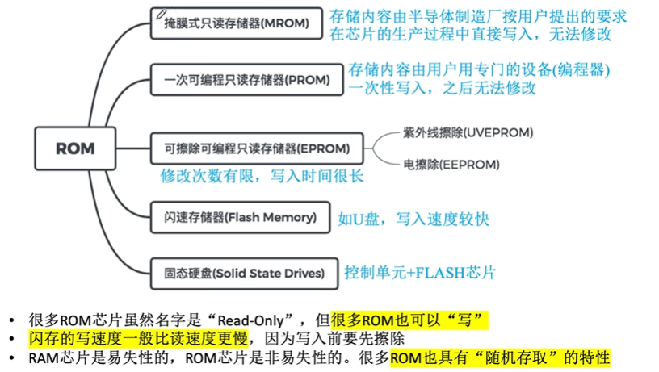

### 3.2.4. 提升主存的速度：多模块存储器
（一）多体并行存储器：

**高位交叉编址**：最高的几位决定选择哪个存储器（**体号+体内地址**）
**低位交叉编址（流水线式并行存取）**：最低的几位决定选择哪个存储器（**体内地址+体号**）

※**低位交叉编址的好处**：
- 假设每个存储体存取周期为T=4r，存取时间为r，恢复时间为3r

- 高位交叉编址，每次读写都要**等待恢复时间**,耗时为nT
- 低位交叉编址，**不需要等待恢复时间**，可以访问下一个存储器，读取四个字的耗时为T+（n-1）r
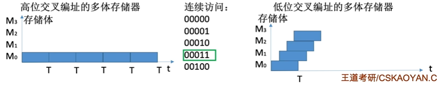
- 由此可见，**连续读取**时，**低位交叉编址读取效率高**

- 为了保证流水线不间断（CPU无需等待）需要模块数$m\geq\frac{T}{r}$
- 为了保证模块不闲置浪费，需要$m\leq\frac{T}{r}$
- 换一种说法：存取周期为T，**总线传输周期为r**

（二）单体多字存储器：将多体进行合并  
每个**存储单元**存储m个字，**总线宽度**也为m个字，一次**并行读出**m个字
缺点：**灵活性差，每次必须读出m个字**

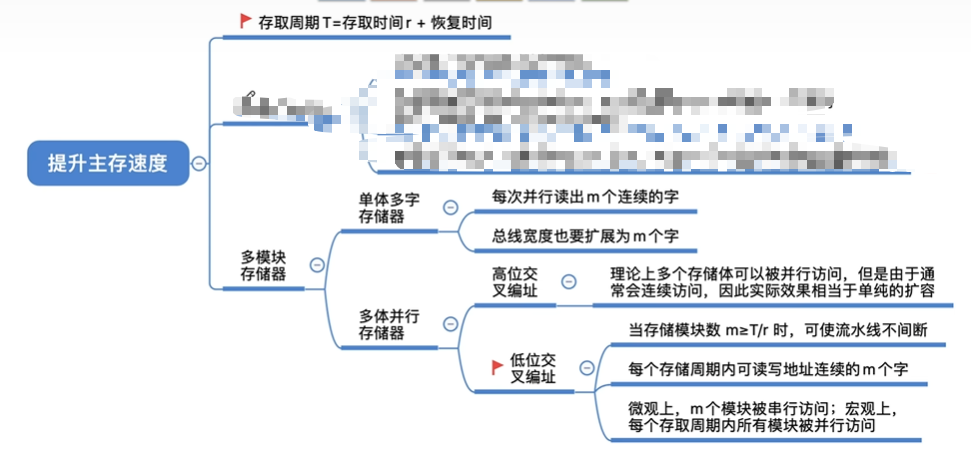

### 3.2.5. 主存与CPU的连接
（一）单块主存芯片与CPU的连接
3.2.1中，已经了解到：
存储器芯片内部由**存储矩阵，译码驱动电路，读写电路**组成，
对外暴露**地址线（接地址总线），数据线（接数据总线），片选线CS/CE，读写控制线WE/OE**

（二）多块主存芯片与CPU的连接

一个主存芯片就是内存条上的一个小方块

- 想要扩展**主存的字数（主存的容量，将地址总线映射满）**：**字扩展法**
  - 字扩展，多个存储芯片连接相同的低位地址线和数据线，片选线通过**译码器**连接高位地址线
- 想要扩展**一次存取的位数**：**位扩展法**
  - 位扩展，多个存储芯片连接**相同的地址线，不同的数据线**
- 两者的结合：**字位扩展**

**①【位扩展例】**：
某个主存芯片为**8K*1位**，也就是说，这个芯片有**13根地址线$A_0到A_{12}$，一根数据线$D_0$**，还有一根WE和CS，想要连接**数据总线宽度为8**的CPU：

方法：用8个8K*1位芯片，每个芯片$A_0到A_{12}$连接总线$A_0到A_{12}$，芯片地址线分别连接地址总线$D_0到D_{8}$


**②【字扩展例】**：
某个主存芯片为**8K*8位**，也就是说，这个芯片有13根地址线$A_0到A_{12}$，一根数据线$D_8$，还有一根WE和CS，想要连接数据总线宽度为8，**地址总线宽度为16位**的CPU：

方法：用8个8K*8位芯片，每个芯片$A_0到A_{12}$连接总线$A_0到A_{12}$，芯片地址线分别连接地址总线$D_0到D_{8}$，地址总线$A_{13}到A_{15}$通过**3-8译码器**连接每个芯片的片选线

**③【字位扩展例】**：
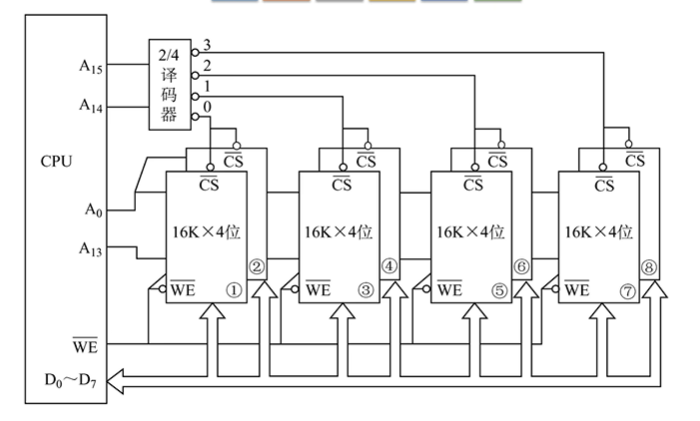

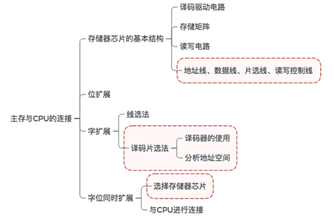

（三）译码器的补充
译码器有两种，一种适用于高电平有效的芯片，一种适用于低电平有效的芯片，注意区分
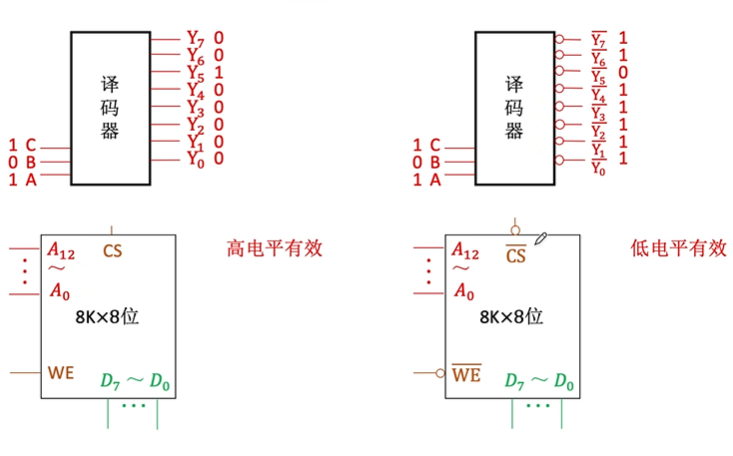

译码器还有**EN使能端**，有的译码器有多个使能端
使能端的目的：CPU都有$\overline{MREQ}$，是主存请求的信号，$\overline{MREQ}$连接使能端实现控制

RAM的读周期时序图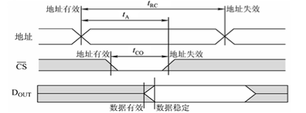

## 3.3. 外存储器
### 3.3.1. 磁盘存储器

**磁表面存储器**：
磁表面存储器只能以1bit位单位读写（**串行读写**），并且同一时刻**只能读或写**
优点：容量大，价格低；介质可重复利用；长期保存不丢失；非破坏性读出
缺点：速度慢；机械结构复杂；工作环境禁止强磁场
磁盘设备：包括机械部分和电子部分

①磁盘的组成：存储区域+**硬盘存储器**
硬盘存储器由**磁盘驱动器、磁盘控制器和盘片组成**
磁盘驱动器：磁头组件和盘片组件
磁盘控制器：硬盘存储器和主机的接口
磁头数 = 盘面数，柱面数 = 每个盘面上的磁道数，扇区数 = 每个磁道上的扇区数
柱面号

**②磁盘的性能指标**：
- 磁盘的容量：有**格式化和非格式化**的区分，格式化容量更小
- 记录密度：分为**道密度**：单位半径的道数，**位密度**：磁道单位长度记录的信息；**面密度**：道密度和位密度的乘积
- ※**平均存取时间**：磁盘控制器延迟时间+寻道时间+旋转延迟时间（按转半圈的时间）+传输时间（按一个扇区的时间）
- 数据传输率：单位时间内传送的字节数，传输率=转速*单位磁道存储的数据数

**③磁盘的地址**：**驱动器号+柱面号+盘面号+扇区号**

④磁盘的工作过程：寻址+读盘/写盘
由于磁盘一定会串行读写，因此需要并-串变换电路和串-并变换电路

**RAID**（廉价冗余磁盘阵列）是将多个独立的物理磁盘组成一个独立的逻辑盘，数据在多个物理盘上分割交叉存储、并行访问，具有**更好的存储性能、可靠性和安全性**

RAID0:**无冗余和无校验**的磁盘阵列。
RAID1:**镜像**磁盘阵列。（容量减少一半）
RAID2:采用纠错的**海明码**的磁盘阵列。
RAID3:位交叉奇偶校验的磁盘阵列。
RAID4:块交叉奇偶校验的磁盘阵列。
RAID5:无独立校验的奇偶校验磁盘阵列。

RAID的优点：通过同时使用多个磁盘，提高了传输率;通过在多个磁盘上并行存取来大幅提高存储系统的数据吞吐量;通过镜像功能，可以提高安全可靠性;通过数据校验，可以提供容错能力。

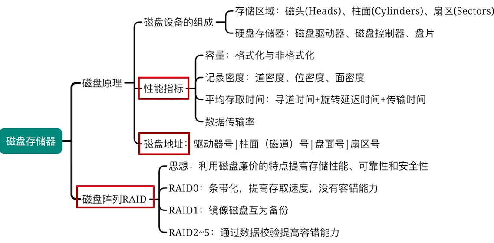

### 3.3.2. 固态硬盘(SSD)
请前往操作系统：1.5.3.5. 固态硬盘（SSD）
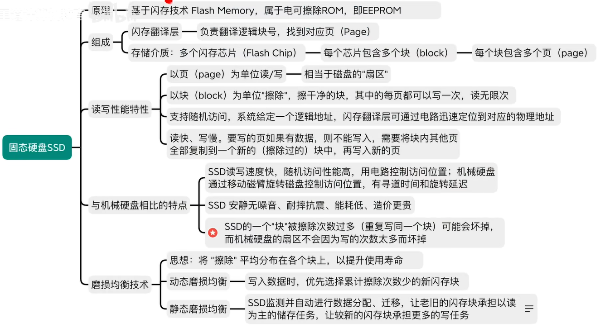

## 3.4. ※Cahce
### 3.4.1. Cache的基本原理
（一）Cache的原理
Cache的作用：**缓和CPU与内存之间的速度矛盾**
Cache使用SRAM实现，集成在CPU内部，**速度快，成本高**
Cache基于**局部性原理**

（二）局部性原理
- **时间局部性**：如果执行了某条指令，访问过某个数据，则**不久后该数据/指令很可能会再次访问**
- **空间局部性**：访问了某个存储单元，不久后其**附近的存储单元**也很可能被访问
例：按照列优先访问二维数组，因为空间局部性差，导致性能不如行优先

Cahce的原理：可以把CPU目前访问的地址“周围’的部分数据放到Cache中

（三）Cache的性能分析
**Cache的性能分析**：已知CPU访问一次Cache耗时$T_C$，访问内存耗时$T_M$，命中率为$H$，缺失率为$1-H$
先查找Cache，再查找内存：则这个系统的平均访问时间为$T=HT_C+(1-H)(T_C+T_M)$
内存和Cache同时查找：则这个系统的平均访问时间为$T=HT_C+(1-H)(T_M)$

**【例】** 假设Cache的速度是主存的5倍，且Cache的命中率为95%，则采用Cache后存储器性能提高多少(设Cache和主存同时被访问，若Cache命中则中断访问主存)?

解答：设访问Cache的时间为t，主存为5t，平均时间为$0.95*t+0.05*5t=1.2t$，性能为原来的$\frac{5t}{1.2t}=4.17倍$
若先访问Cache再访问主存，平均访问时间为1.25t

（四）如何界定周围？
将访问的一个**内存块**放入Cache，Cache也被划分为块
Cache的块也被称为**行**，内存块与行**大小相同**
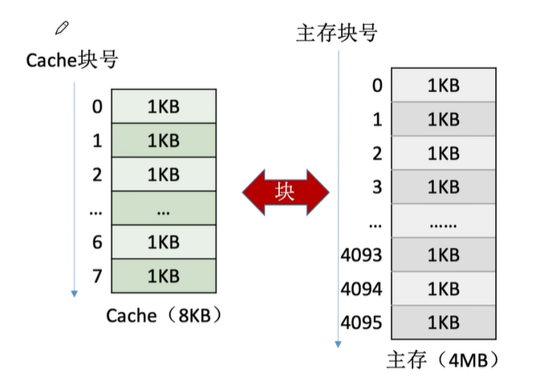

每次访问的主存块，一定会被立即调入Cache

### 3.4.2. Cache与主存的映射
保存映射的方法：**标记位+有效位**
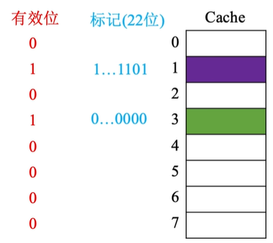

**映射方法**：

（一）**全相联映射**：主存块可以放在**Cache的任一位置**
优点:Cache存储**空间利用充分，命中率高**
缺点:查找“标记”**最慢**，有可能需要对比所有行的标记

**访问方法**：CPU访问一个内存地址
1. CPU先将块号与Cache的标记位进行比对查找
2. 若标记匹配且有效位为1，则命中，直接访问
3. 若未命中，正常访问主存

（二）**直接映射**:Cache块号=内存块号%Cache总块数
**标记位保存优化**：**标记舍弃块号后n位**（n=log2（行数）），只保留前几位，因为在Cache内的位置已经隐含块号后几位
优点:对于任意一个地址，只需对比一个“标记”，**速度最快**
缺点:Cache存储**空间利用不充分，命中率低**

**访问方法**：CPU访问一个内存地址
1. CPU先取块号后n位，确定行号
2. 查找对应行号，若标记匹配且有效位为1，则命中，直接访问
3. 若未命中，正常访问主存

（三）**组相联映射**：组号=内存块号%Cache**总分组数**，内存块可以放在**该组的任一位置**
**标记位保存优化**：块号舍弃后n位（n=log2（**分组数**）），只保留前几位，因为在Cache内的位置已经隐含块号后几位

**访问方法**：CPU访问一个内存地址
1. CPU先取块号后n位，确定组号
2. 将块号前几位与**对应组内**的标记位进行比对查找
3. 若标记匹配且有效位为1，则命中，直接访问
4. 若未命中，正常访问主存

注：**n路组相联映射**，意为**每组有n行**

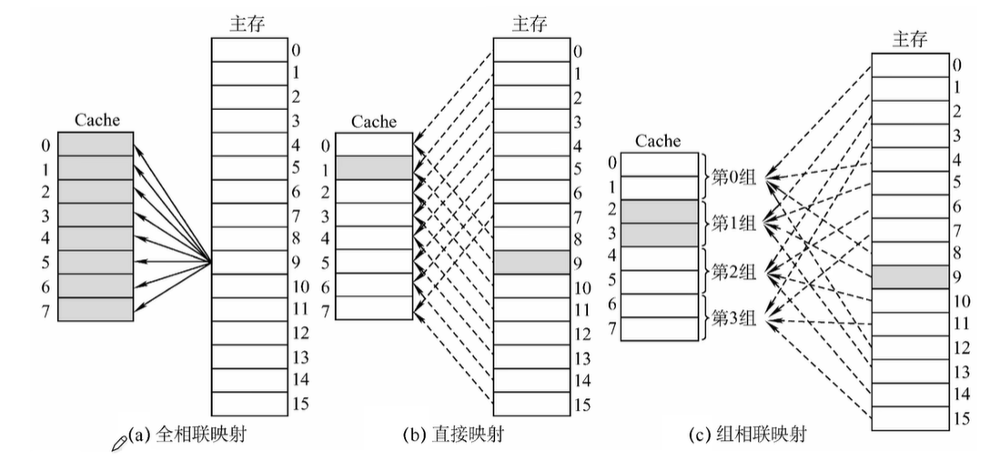

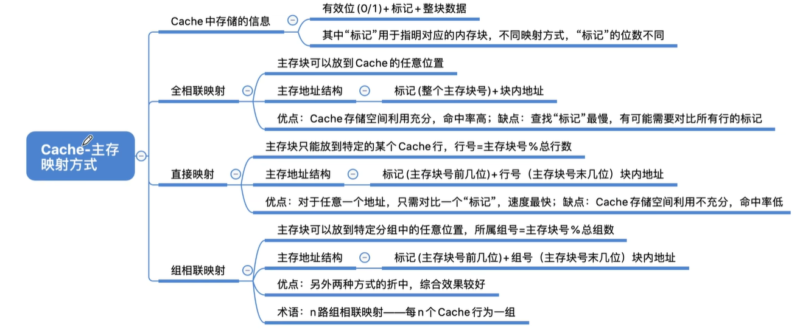

### 3.4.3. Cache替换算法
全相联映射：**完全满**了才需要考虑替换
直接映射：毫无选择直接替换
组相联映射：对应**分组满了**才需要考虑**组内替换**

替换算法：
- **随机算法**（RAND）
- **先进先出**（FIFO）
- **近期最少使用**（LRU）
- **最近不经常使用**（LFU）

①随机算法（RAND）：
【例】：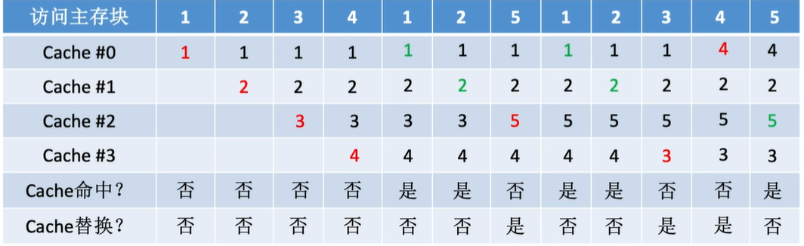
优点：实现简单
缺点：命中率低，效果不稳定，没有考虑局部性原理

②先进先出（FIFO）
【例】：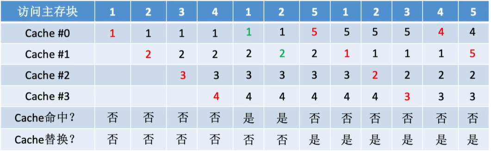
会发生**抖动现象**
抖动现象:频繁的换入换出现象(刚被替换的块很快被调入）
优点：实现简单
缺点：没有考虑局部性原理，先被调入Cache的块也可能是频繁访问的

**③近期最少使用**（LRU/Least Recently Used）：为每一个Cache块设置“计数器”，用于记录一个每个Cache块已经有**多久没被访问了**。当Cache满后**替换“计数器”最大的**

优点：**命中率高**
缺点：频繁访问的主存块数大于Cache行数量时，可能会发生**抖动**

计数器规则：
①命中时，所命中的行的计数器清零，**比其低的计数器加1**（好处是，**计数器的值不会超过Cache数（只需n位），且计数器的值一定不会重复**），其余不变:
②未命中且还有空闲行时，新装入的行的计数器置0，其余非空闲行全加1;
③未命中且无空闲行时，计数值最大的行的信息块被淘汰，新装行的块的计数器置0，其余全加1

【例】：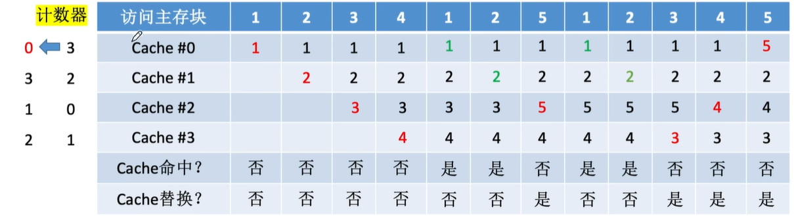

④最近不经常使用算法（LFU/Least Frequently Used）：每个Cache设置一个计数器，记录**访问过多少次**。Cache满后替换**计数器最小的**，有多个最小的可以淘汰行号最小的或者按照FIFO的顺序。

缺点：计数器可能很大；曾经经常访问的内存块在未来不一定会用到，没有很好遵循局部性原理

【例】：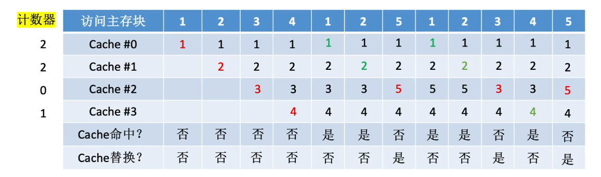

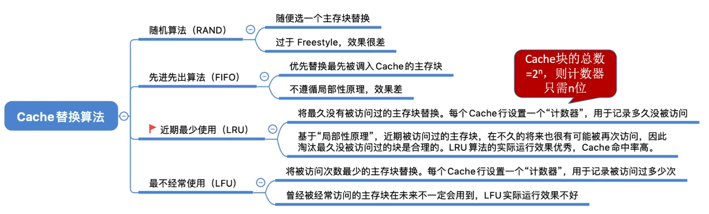

### 3.4.4. Cache写策略
怎样保证Cache中的副本与主存中母本的数据一致性？

情况1：**写命中**

**①全写法**（写直通法）：写命中时，必须把数据**同时写入Cache和主存**，一般会使用**写缓冲（SRAM实现的FIFO队列）**来优化
使用写缓冲后，如果**写操作不频繁**，则效果很好；如果写操作很频繁，可能会因为**缓冲饱和而阻塞**

**②写回法**：只修改Cache的内容，不立即写入主存，只有当**此块被换出才写回主存**。为了实现，需要添加一个**脏位**，表示是否被写过
特点：减少了访存次数，但是存在数据不一致的隐患


情况2：**写不命中**

**①写分配法**：把主存中的块**调入Cache，在Cache中修改**；通常搭配**写回法**使用。

**②非写分配法**：只写入主存，**不调入Cache**，一般搭配**全写法**使用。

多级缓存可以采用不同的策略：
各级Cache之间采用**全写法+非写分配法**，保证数据一致性
Cache与主存之间采用**写回法+写分配法**，提高效率

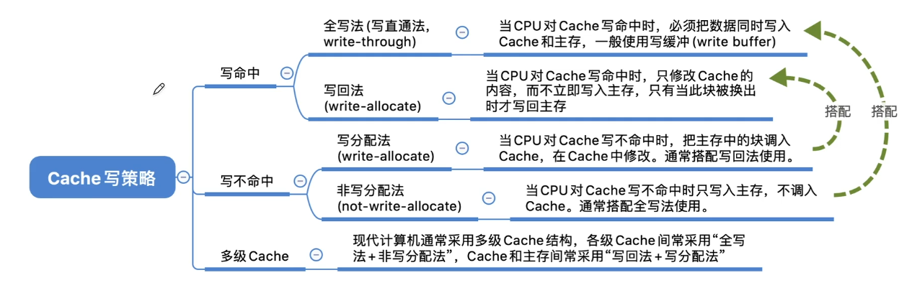

# 4. 指令系统
## 4.1. 基本格式
### 4.1.1. 指令的基本格式与分类
（一）操作码，地址码：一条指令由**操作码（OP）和地址码（A）组成**

（二）**指令的分类**

①根据地址码的数目
1. **零地址指令**：
   - 不需要操作数（**空操作、停机指令、关中断指令**）
   - 堆栈计算机：**两个操作数隐含放在栈顶和次栈顶**，计算结果压回栈顶（后缀表达式）
2. **一地址指令**：
   - 只需要一个操作数，如OP（A1）→A1：需要**三次访存**，取指令，读地址内容，写回地址
   - 需要两个操作数，如（ACC）OP（A1）→ACC，但是**其中一个操作数隐含在某个寄存器中**（如乘法指令）：需要**两次访存**，取指令，读地址内容，无需写回原地址，**结果留在寄存器**
3. **二地址指令**
   - 需要两个操作数，如（A1）OP（A2）→A1：需要**四次访存**
4. **三地址指令**
   - 需要三个操作数，如（A1）OP（A2）→A3：需要**四次访存**
5. **四地址指令**
   - 需要四个操作数，如（A1）OP（A2）→A3，A4=下一条指令的地址：需要**五次访存**

指令的长度一定，**地址码的数目越多，寻址能力越差**

②根据指令长度
**指令字长**:指令的位数（有可能会变）；**机器字长**:ALU的位数；**存储字长**:MDR的位数
1. 半字长：指令字长是机器字长的一半
2. 单字长：指令字长等于机器字长
3. 双字长：指令字长是机器字长二倍
指令字长会影响到**取指令的时间**（双字长指令需要两次访存）

**定长指令字结构**:指令系统中所有指令的长度都相等
**变长指令字结构**:指令系统中各种指令的长度不等

③根据操作码的长度
1. **定长操作码**:指令系统中所有指令的操作码长度都相同
   - 操作码的长度决定了**最多支持的指令数**
   - 优点：译码电路设计简单
   - 缺点：灵活性低

2. **可变长操作码**:指令系统中各指令的操作码长度可变
   - 优点：灵活性高
   - 缺点：译码电路设计复杂

④根据操作类型：**数据传送类；运算类；程序控制类；输入输出类**
1. 数据传送
   - LOAD：存储器→寄存器
   - STORE：寄存器→存储器
2. 算数逻辑操作
   - 算数操作：加减乘除；自加自减；求补；浮点运算；十进制运算
   - 逻辑运算：与或非同或异或；位操作；位测试；位清除；位求反
3. 移位操作：算术移位；逻辑移位；循环移位（带进位，不带进位）
4. 转移操作：**执行该类操作后，PC的值发生改变**
   - 无条件转移JMP
   - 条件转移：JZ，JO，JC
   - 调用和返回：CALL，RETURN
   - 陷阱（TRAP）与陷阱指令
5. 输入输出操作
   - CPU寄存器与IO端口之间的数据传送

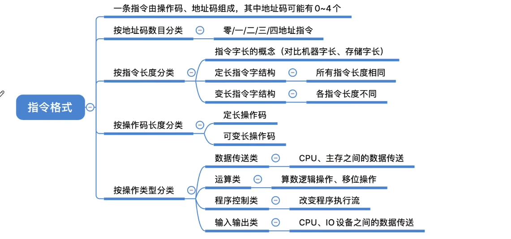

###  4.1.2. 扩展操作码指令格式
**定长指令字结构+可变长操作码**：扩展操作码指令格式（**不同地址数的指令，操作码长度不同**）

需要注意：
- 不允许短码是长码的前缀（类比哈夫曼树）
- 各个指令的操作码不重复

通常给**使用频率高的指令分配更短的操作码**，频率低的指令分配更长的操作码，以**减少译码和分析的时间**
地址长度为n，如果上一层留出m种状态，**下一层可以扩展出$m*2^n$种状态**

【例】指令字长为16位，每个地址码4位

①可采用如下扩展方式：
15条三地址指令（保留1111……），15条二地址指令（保留1111 1111……），15条一地址指令（保留1111 1111 1111……），16条零地址指令

②或者这样的扩展方式：
15条三地址指令（保留1111……），12条二地址指令（保留1111 11xx……），62条一地址指令（保留1111 1111 111x……），16条零地址指令
CPU的解析方法：先检查前四位，再检查前6位，再检查前11位
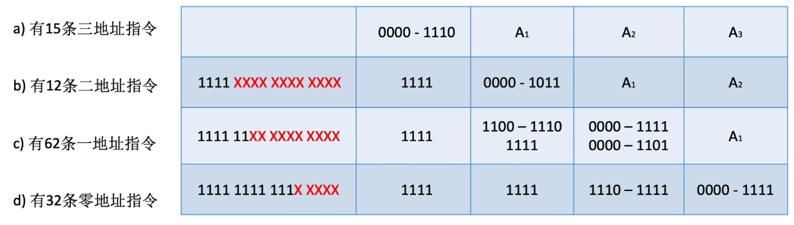

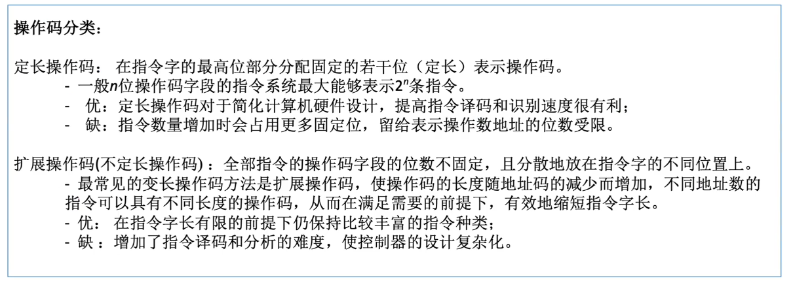

## 4.2. 寻址方式
### 4.2.1. 指令寻址
如何确定下一条指令的存放位置？
（一）顺序寻址：PC顺序指向下一条指令的地址
1. 定长指令字结构；指令字长=存储字长=2B；主存按字编址，则确定下一条指令的方式：**PC = PC + 1**
2. 定长指令字结构；指令字长=存储字长=2B；主存按**字节**编址，则确定下一条指令的方式：**PC = PC + 2**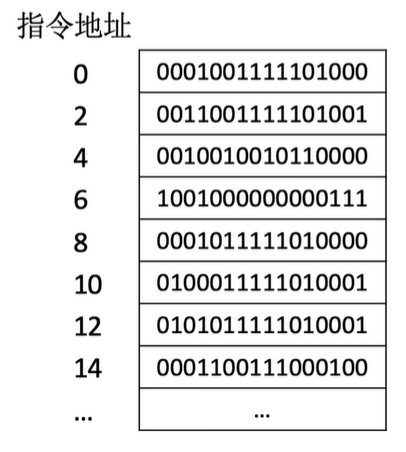
3. **变长指令字结构**；指令字长=存储字长=2B；主存按**字节**编址，则确定下一条指令的方式：先入出一个字，根据操作码判断**这条指令的总字节数n**，**PC = PC + n**（**需要三次访存**）


（二）跳跃寻址：由**转移指令**指出，直接改变PC的值
定长指令字结构；指令字长=存储字长=2B；主存按字编址：
例如：JMP 7，执行到这条指令时，PC先自动+1，执行这条指令，再把PC更改为7

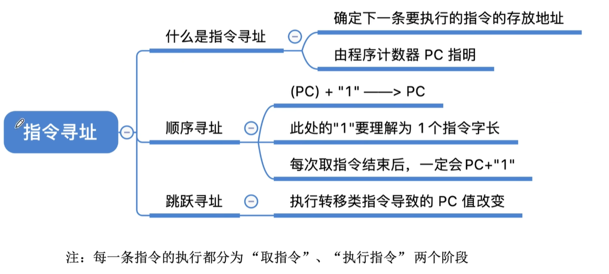

### 4.2.2. 数据寻址
数据寻址：确定本条指令的**地址码**指明的真实地址

数据寻址方式：数据可以有很多种寻址方式，为了标明使用的是哪种方式，可以在地址前加上**寻址方式位**（OP + 寻址特征 + 形式地址）
一般用**EA**表示真实地址/有效地址，用**A**表示形式地址
多地址指令，每个地址都可以标明各自的寻址特征（OP + 寻址特征1 + 形式地址1 + 寻址特征2 + 形式地址2）

各种寻址方式：
1. **直接寻址**：**EA = A**；
   1. 优点：简单，指令执行阶段仅访问**一次主存**，不需要专门计算操作数的地址
   2. 缺点：地址不易修改
2. **间接寻址**：一次间址**EA = (A)**；二次间址**EA = ((A))**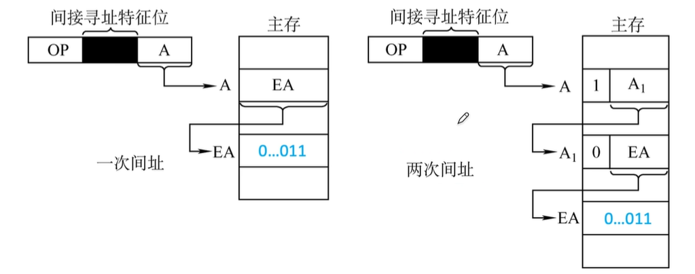
   1. 优点:可扩大寻址范围(有效地址EA的位数大于形式地址A的位数)。便于编制程序(用间接寻址可以方便地完成子程序返回)。
   2. 缺点:指令在执行阶段要**多次访存**(一次间址需两次访存，多次寻址需根据存储字的最高位确定几次访存)。
3. **寄存器寻址**：**EA = R**
   1. 优点:指令在执行阶段**不访问主存**，只访问寄存器，指令字短且执行速度快，支持向量/矩阵运算
   2. 缺点:寄存器价格昂贵，计算机中寄存器个数有限。
4. **寄存器间接寻址**：**EA = (R)**
   1. 优点：与一般间接寻相比速度更快，但指令的执行阶段**需要访问主存**(因为操作数在主存中)。
5. **隐含寻址**：如加法指令，隐含另一个操作数在ACC
   1. 优点:有利于缩短指令字长。
   2. 缺点:需增加存储操作数或隐含地址的硬件
6. **立即寻址**：操作数不是地址，而是**操作数本身**，又叫**立即数**，一般用**补码**表示，**寻址特征为#**
   1. 优点:指令执行阶段不访问主存，**指令执行时间最短**
   2. 缺点:A的位数限制了立即数的范围。如A的位数为n，且立即数采用补码时，可表示的数据范围为$-2^{n-1}~2^{n-1}-1$
7. **基址寻址**:**EA = (BR/R) + A**，BR为**基址寄存器/重定位寄存器**，有的计算机没有BR，需要显式指明使用了哪个寄存器。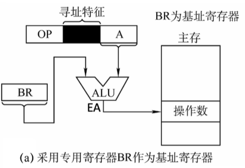
   1. 注:基址寄存器是**面向操作系统**的，其内容由操作系统或管理程序确定。在程序执行过程中，基址寄存器的内容不变(作为基地址)，形式地址可变(作为偏移量)。
   2. 当采用通用寄存器作为基址寄存器时，可由用户决定**哪个寄存器**作为基址寄存器，但其**内容仍由操作系统确定**
   3. 优点:可**扩大寻址范围**(基址寄存器的位数大于形式地址A的位数);用户不必考虑自己的程序存于主存的哪一空间区域，故有利于**多道程序设计**，以及可用于编制**浮动程序**(**整个程序在内存里**边的浮动)
8. **变址寻址**：**EA = (IX/R) + A**，IX为**变址寄存器**，有的计算机没有IX，需要显式指明使用了哪个寄存器。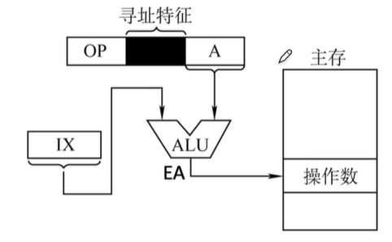
   1. 注:变址寄存器是**面向用户**的，在程序执行过程中，变址寄存器的内容**可由用户改变**，(**IX作为偏移量**)，形式地址A不变(作为基地址)
   2. 优点:在数组处理过程中，可设定A为数组的首地址，不断改变变址寄存器X的内容，便可很容易形成数组中任一数据的地址，特别适合**编制循环程序**。
9.  **相对寻址**：**EA = (PC) + A**，A用**补码**表示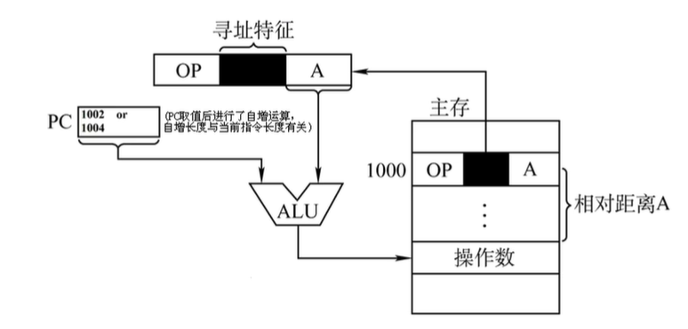
    1.  注意，执行到这条指令，PC会自动+1，实际上会加A+1
    2.  优点:操作数的地址不是固定的，它随着PC值的变化而变化，并且与指令地址之间总是相差一个固定值，因此便于**程序浮动**(**一段代码在程序内部**的浮动)。相对寻址广泛应用于**转移指令**。
10. **堆栈寻址**：操作数放在堆栈中，隐含使用**堆栈指针（SP/Stack Pointer）**作为操作数地址，如**POP A，PUSH A**，就是隐含栈顶地址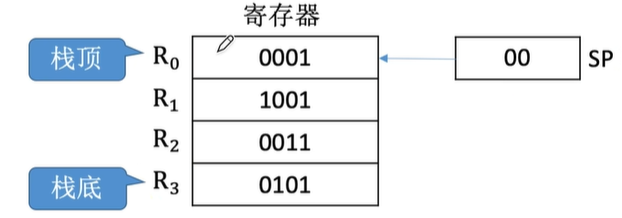
    1.  栈顶可能在大地址，则PUSH指令SP++，POP指令SP--；可能在小地址，则PUSH指令SP--，POP指令SP++
    2.  堆栈可以用**寄存器组**实现（**硬堆栈**），也可以是**内存**中的一片区域（**软堆栈**），软堆栈效率低，成本低，因为需要额外的**一次访存**
    3.  堆栈可以用于**函数调用**时，**保存当前函数的相关信息**

注：
- 相对寻址，基址寻址，变址寻址统称为**偏移寻址**。相对寻址适合转移指令，基址寻址适合多道程序，变址寻址适合循环程序，数组问题
- 程序在内存中被划分为**程序段，数据段**，这样更方便寻址
- 注意:取出当前指令后，PC会指向下一条指令，**相对寻址是相对于下一条指令的偏移**

补充：PSW（标志寄存器/程序状态字寄存器）中有几个比特位记录上次运算的结果
进位/借位标志CF:最高位有进位/借位时CF=1
零标志 ZF:运算结果为0则 ZF=1，否则ZF=0
符号标志SF:运算结果为负，SF=1，否则为0
溢出标志OF:运算结果有溢出OF=1否则为0
条件跳转指令实际上是先进行运算，再判断PSW中的比特位

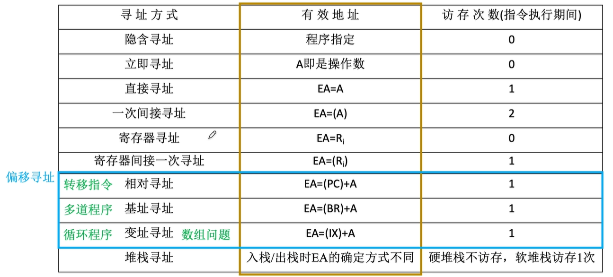
## 4.3. 高级语言程序与机器级代码之间的对应
- 只需关注x86汇编语言;若考察其他汇编语言题目会详细注释
- 题目给出某段简单程序的C语言、汇编语言、机器语言表示能结合C语言看懂汇编语言的关键语句(**看懂常见指令、选择结构、循环结构、函数调用**
- 汇编语言、机器语言 一一对应，要能结合汇编语言分析机器语言指令的格式、寻址方式
- 不会考:将C语言人工翻译为汇编语言或机器语言
### 4.3.1. 汇编语言基础
指令的作用：处理数据；控制执行流
以mov指令为例：mov d,s，表示s → d
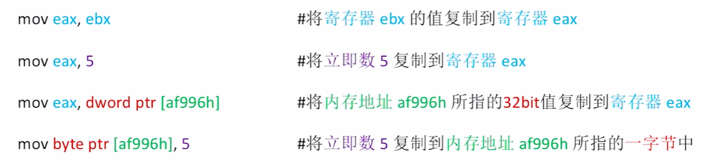
**蓝色表示寄存器地址，紫色表示立即数，红色表示类型，中括号内表示内存地址**
类型包括：**dword ptr** - 双字（32b）；**word ptr** - 字（16b）；**byte ptr** - 字节（8b），**未指明类型默认32位**

x86的寄存器：**以E开头，总长为32bit**，包括：
- **通用寄存器**：eax，ebx，ecx，edx，
  - 如果想使用低16位，可以去掉e：ax，bx，cx，dx
  - 如果想使用低8位：al，bl，cl，dl
  - 如果想使用8~15位：ah，bh，ch，dh
- **变址寄存器**（i=index）：esi，edi（s=source, d=destination)
- **栈指针寄存器**：ebp（base pointer，栈基指针），esp（stack pointer，栈顶指针）

特殊例：
1. mov eax, dword ptr [**ebx**] #将ebx所指主存地址的32bit复制到eax寄存器中
2. mov dword ptr [**ebx**], eax #将eax的内容复制到ebx所指主存地址的32bit
3. mov eax, byte ptr [**ebx**] #将ebx所指的主存地址的8bit复制到eax
4. mov eax, [**ebx**] #未指明长度默认32bit
1. mov [**af996hl**], eax #将eax的内容复制到af996h所指的地址
2. mov eax, dword ptr [**ebx+8**] #将ebx+8所指主存地址的32bit复制到eax寄存器中
3. mov eax, dword ptr [**af996-12h**] #将af996-12所指主存地址的32bit复制到eax寄存器中

### 4.3.2. 常用的x86指令
d表示destination，**不能是立即数**；**不允许两个操作数都来自主存**

常见的**算术运算**指令：
- 加 add d,s
- 减 sub d,s : d-s
- 乘 mul d,s（无符号数） imul d,s（有符号数，i代表int）
- 除 div s ；idiv s : edx:eax/s，冒号代表扩展到64位，**商存在eax，余数存在edx**
- 取负数 neg d
- 自增 inc d
- 自减 dec d

常见的**逻辑运算**指令
- 与 and d,s
- 或 or d,s
- 非 not d
- 异或 xor d,s
- 左移 shl d,s (shift left)
- 右移 shr d,s (shift right)

其他指令：
- 实现**分支结构、循环结构**：cmp，test，jmp，jxxx
- 实现**函数调用**的指令：push，pop，call，ret
- 实现**数据转移**的指令：mov

### 4.3.3. AT&T格式：Unix、Linux的常用格式
|不同|AT&T格式|intel格式|
|---|---|---|
|目的操作数|op s,d|op d,s|
|寄存器的表示|op **%ebx,%eax**|op eax,ebx|
|立即数的表示|mov **$985** %eax|mov eax,985|
|主存地址的表示|mov %eax,(af996h)|mov [af996h],eax|
|读写长度表示|movb（byte），movw（word），movl（double word）|byte ptr；word ptr；dword ptr|
|主存地址偏移量的表示|4(%ebx,%ecx,32):偏移（基址，变址，缩放）|[ebx+ecx*32+4]：[基址+变址*缩放+偏移]|
### 4.3.4. 选择语句的机器级表示
程序计数器PC，也可称为IP

**无条件跳转指令**：jmp
- jmp 123
- jmp eax
- jmp [999]
- 使用标号：jmp NEXT；**NEXT:** 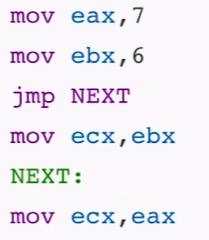
**有冒号，说明是一个标号**

**条件跳转指令**：要**配合cmp指令**一起使用，包括je（equal），jne，jg（greater），jge，jl（less），jle
cmp eax,ebx（实际上进行了eax-ebx，标志放入PSW待条件转移指令使用）
jg NEXT（若eax大于ebx跳转） 

使用条件转移指令实现选择语句：
【例】
C语言：
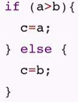
汇编语言：
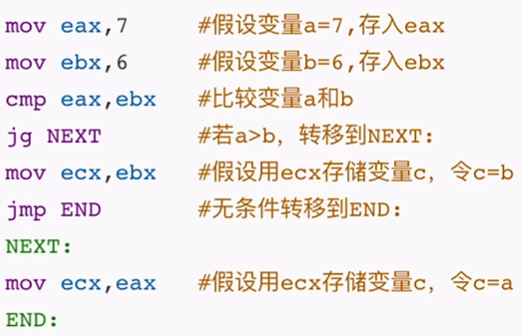

### 4.3.5. 循环语句的机器级表示
【例】求1+2+3+……+100
C语言：
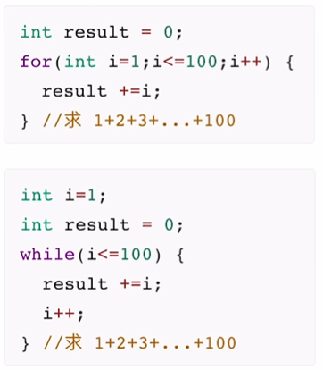
汇编语言：
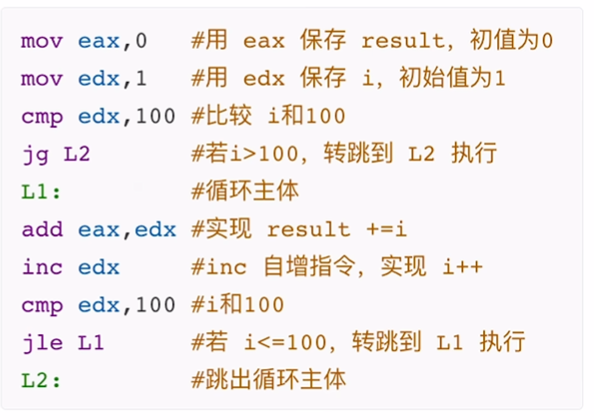

用条件转移指令实现循环，需要四个部分：
1. 循环前的初始化
2. 是否直接跳过循环？
3. 循环体
4. 是否继续循环？
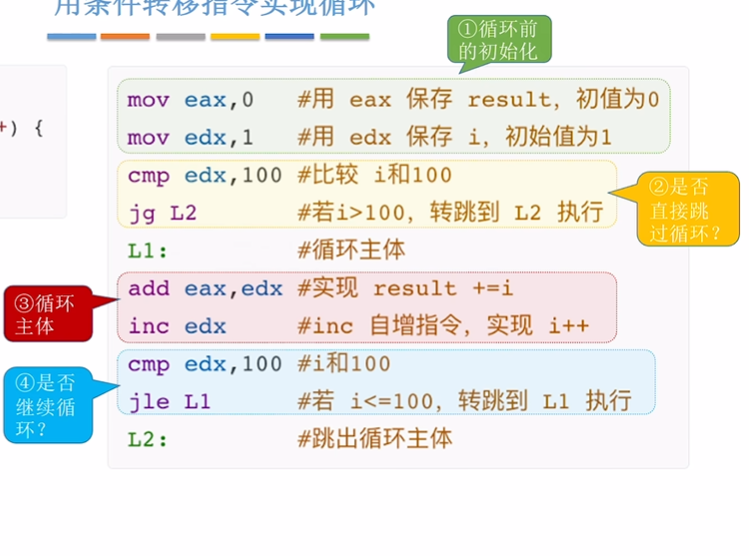

**loop指令**：变量值自减，判断变量值是否为0，如果不为0就跳转到标号
loop等价于dec → cmp → jne
loop默认使用ecx寄存器进行判断
使用loop指令来实现循环：
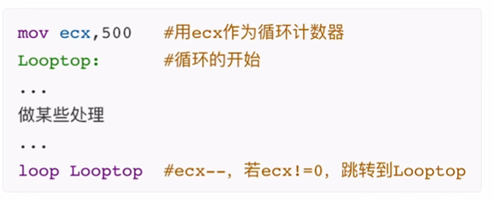

还有loopz，loopnz……指令，表示ecx不为零且ZF为1/为0时跳转

### 4.3.6. 函数调用的机器级表示
**函数调用指令**：call <函数名>
**函数返回指令**：ret
用一个标号加冒号表示函数名，标志函数开始，用ret表示函数结束
call指令和ret都会改变IP寄存器（Instruction Pointer，也就是PC）

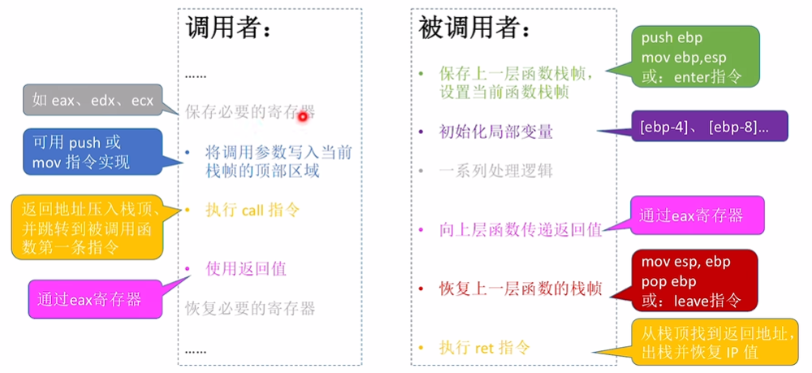

函数调用需要解决的问题：
①**过得去+回得来**
- call指令：
  1. 将IP的旧值压栈保存
  2. 设置IP新值
- ret指令：
  1. 从函数栈帧顶部找到IP旧值，恢复IP寄存器
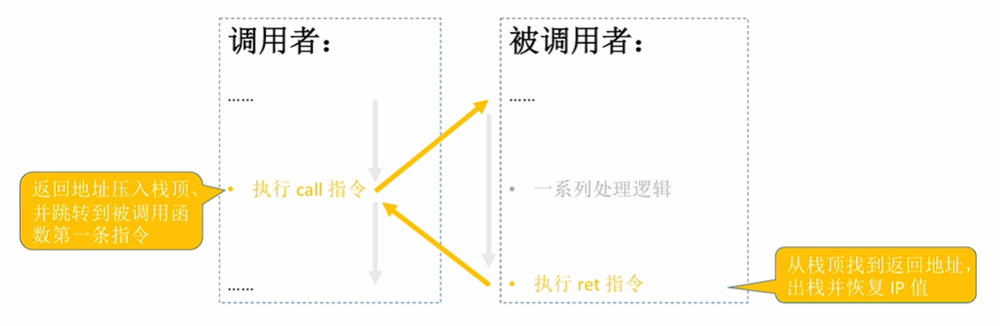
  
②**如何传递参数，返回值**
传参：调用函数把参数放在栈顶，调用后被调用函数从ebp前取用
返回值：通常只有一个返回值，因此直接写到eax寄存器中


③ **如何访问栈帧里的数据**
**栈底在高地址，栈顶在低地址**
**CPU中有EBP**（栈基寄存器），**ESP**（栈顶寄存器）
EBP指向当前调用函数的**栈帧底**，ESP指向**栈顶**

可以使用push，pop指令压栈和出栈，push会使esp-4，pop会使esp+4
可以使用mov指令来偏移访问栈帧的其他数据（ebp+4，ebp-8……）
可以使用sub，add随意修改esp，ebp的值来

**④如何切换栈帧**
每一次函数调用都要包括：

（1）call指令：
  1. 将IP的旧值压栈保存（push IP（旧），esp指向旧IP）
  2. 设置IP新值（相当于jmp add）
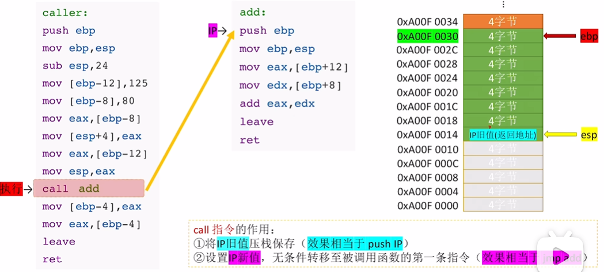

（2）enter指令：切换到被调用函数之后，需要例行建立新栈帧：

执行前：
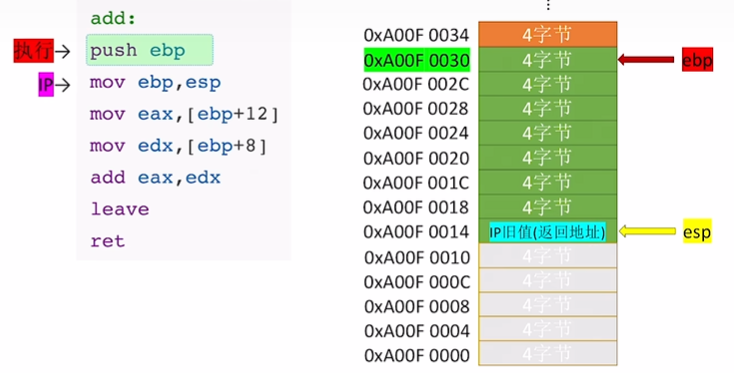
1. push ebp（目前esp指向原ebp地址）
2. mov ebp,esp（新的ebp指向的内容为原ebp地址）

执行后：
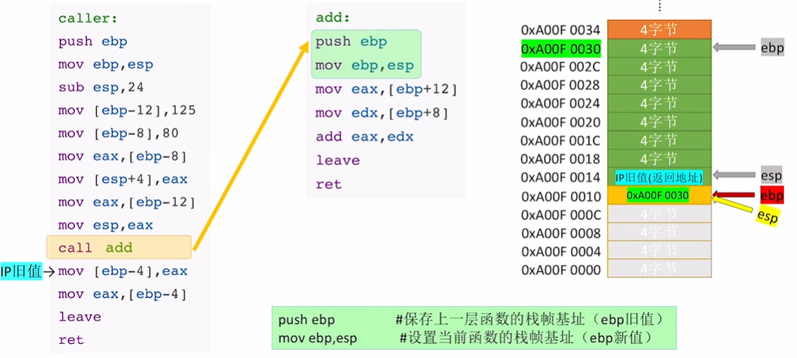
每个被调用函数的开头都要这样执行，因此，**每个函数的栈帧底部一定存放上一个函数基地址**
这两条指令等价于**enter指令**

（3）leave指令：返回之前，需要例行恢复原栈帧：

执行前：
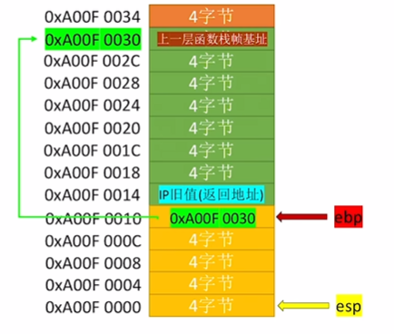
1. mov esp,ebp
2. pop ebp

执行后：
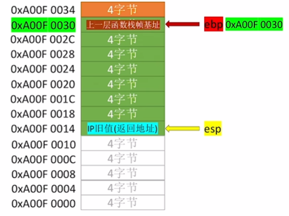
每个被调用函数的结尾都要这样执行，因此，**每个等待返回的函数的栈帧顶部一定存放上一个函数的旧IP**
这两条指令等价于**leave指令**


（4）ret指令：
  1. 从函数栈帧顶部找到IP旧值，恢复IP寄存器
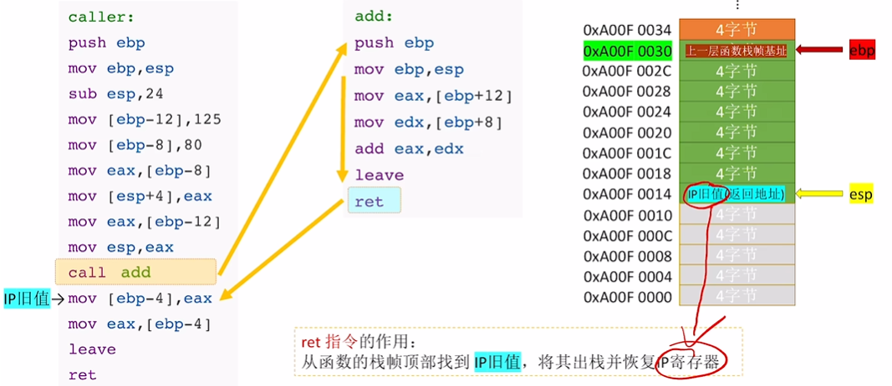

**⑤栈帧里有哪些内容**
- 底部是**上一层的栈帧的ebp**
- **局部变量**：栈帧**靠近底部**的位置。访问方法：ebp负偏移（ebp-4，ebp-8……），访问此栈帧的帧底
- 空闲区域（gcc规定**栈帧大小为16B的整数倍**）
- **部分寄存器的中间值**
- **调用参数**：栈帧**靠近顶部**的位置。访问方法：ebp正偏移（ebp+4，ebp+8……），访问上一个栈帧的帧顶
- 顶部是**返回地址（旧IP）**
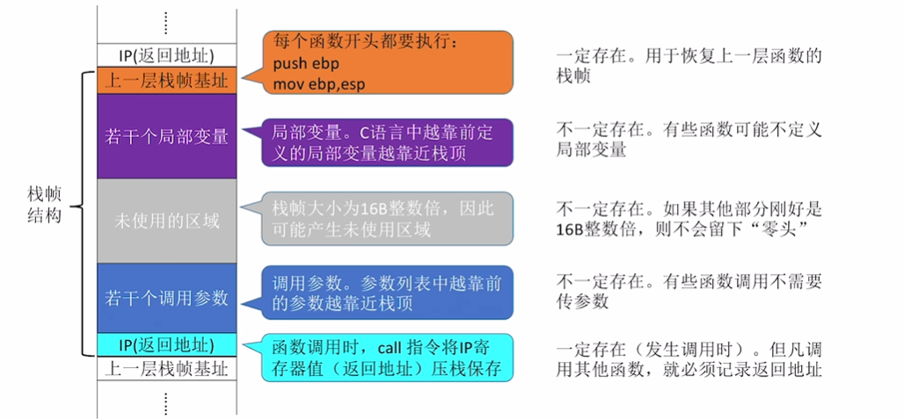

局部变量。C语言中越靠前定义的局部变量越靠近栈顶
调用参数。参数列表中越靠前的参数越靠近栈顶

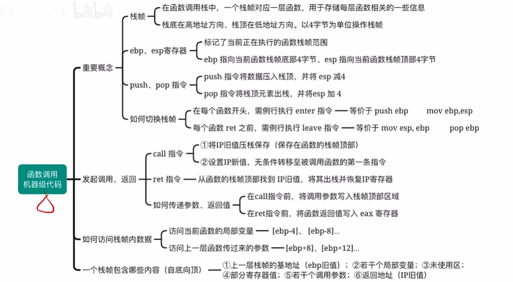

## 4.4. CISC和RISC
CISC：复杂指令集的计算机系统，代表：x86
RISC：精简指令集的计算机系统，代表：ARM

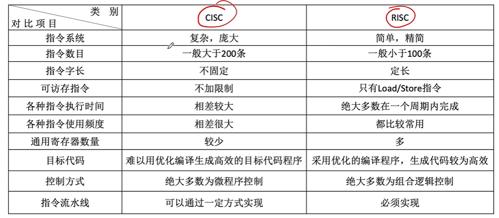

# 5. 中央处理器
## 5.1. CPU的功能和基本结构
CPU = 运算器（ALU） + 控制器（CU）+ 中断系统 + 寄存器组

ALU的功能：加工数据
CU的功能：取指→分析（操作码和地址）→执行（形成操作序列，控制各部件）→中断处理

CPU需要完成的功能：
- **指令控制**：取指，分析，执行
- **操作控制**：分析指令后，向ALU，主存，IO等部件发出控制
- **时间控制**：提供同一的时间基准
- **数据加工**：ALU
- **中断处理**：并发与实时

（一）**ALU内部的基本结构**：
- **算数逻辑单元**
- **通用寄存器组**
- **暂存寄存器**：其他寄存器需要通过CPU内部总线连接ALU，暂存寄存器组直接与ALU相连，用来暂存从主存或通用寄存器读入的数据
- **PSW程序状态字寄存器**：保留状态信息，包括OF，ZF，SF，CF等。PSW的位**参与并决定了微操作的形成**。
- **移位器**
- **计数器**


注：
**专用数据通路方式**：两个可能交流的部件之间直接连接线路
   - 缺点：部件多，结构负责，成本高；多个寄存器可能同时输入数据（解决方法：**MUX多路选择器或三态门**（相当于开关））
   - 优点：基本不存在数据冲突，且性能高

**CPU内部单总线方式**：寄存器的输入输出都接到公共的通路上
   - 优点：结构简单，容易实现
   - 缺点：数据传输存在较多冲突的情况，性能较低（解决方法：暂存寄存器）

（二）**CU内部的基本结构**
- **PC程序计数器**：有自增功能
- **IR指令寄存器**
- **指令译码器**：翻译操作码
- **微操作发生器**：根据译码器的信号和PSW标志位形成微操作序列
- **时序系统**：产生各种时序信号，都是由**统一时钟（CLOCK）分频**得到的
- **MAR存储器地址寄存器**
- **MDR数据寄存器**
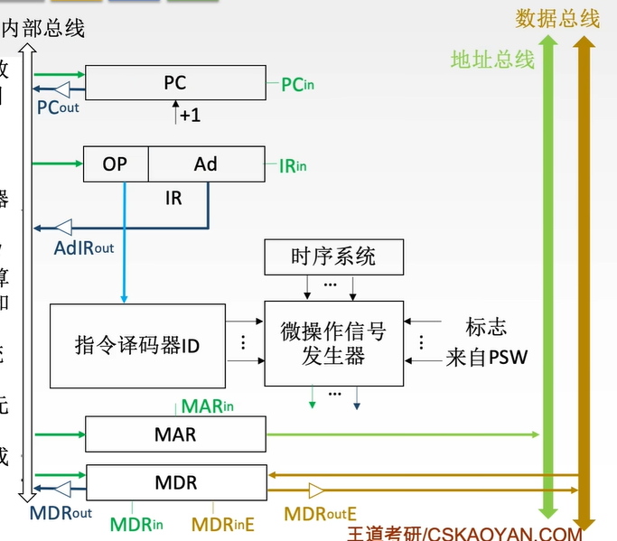

（三）**CPU内部结构图**：
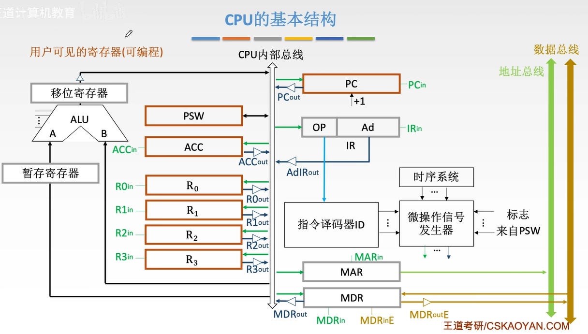
橙色代表对用户可见：PSW，通用寄存器Rx，ACC，PC都对用户可见

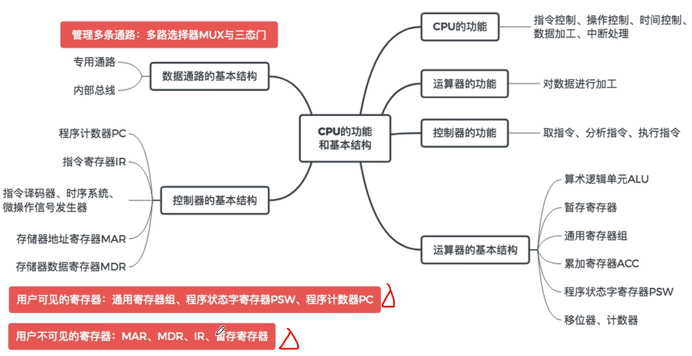

## 5.2. 指令执行过程
指令周期：取出一条指令并执行需要的时间
指令周期 = 取指周期（取指令 + 译码） + 执行周期
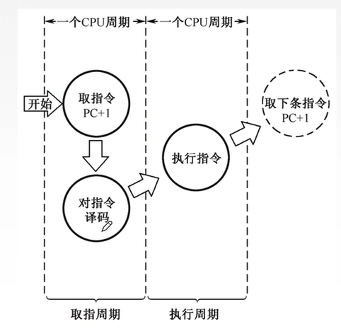

一个指令周期由若干**机器周期/CPU周期**组成
一个机器周期又包含若干**时钟周期（节拍/T周期/CPU时钟周期）**，是CPU操作**最基本的单位**
**机器周期**：周期内完成的操作可以是取指令、取有效地址、执行指令等子工作。每个机器周期会完成若干微操作。
**定长机器周期**：每个机器周期所**消耗时钟周期相同**
**不定长机器周期**：每个机器周期所**消耗时钟周期不同**
**不同的指令，指令周期内的机器周期数可以不等**
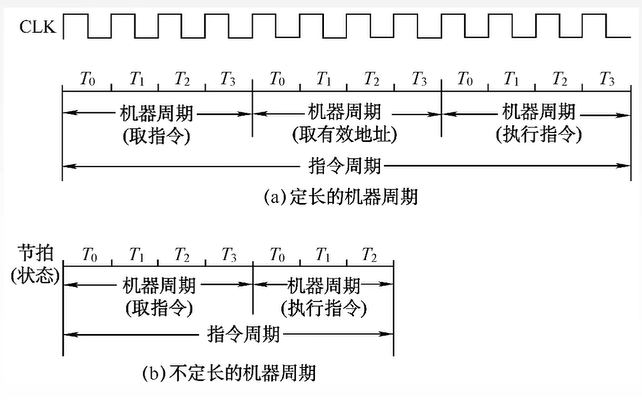

【例】
NOP空指令：一个机器周期（取指+译码）
ADD加法指令：两个机器周期（取指+执行），执行周期时间消耗的时钟周期短
MUL加法指令：两个机器周期（取指+执行），执行周期时间消耗的时钟周期长
间接寻址指令：三个机器周期（取指+间址+执行）
带中断周期指令：四个机器周期（取指+间址+执行+中断检查）
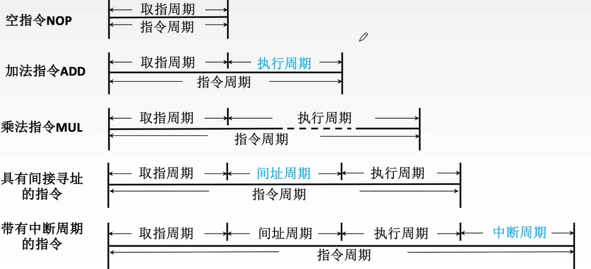

**指令周期的状态转换**：
包括四个周期：**取指周期，间址周期，执行周期，中断周期**
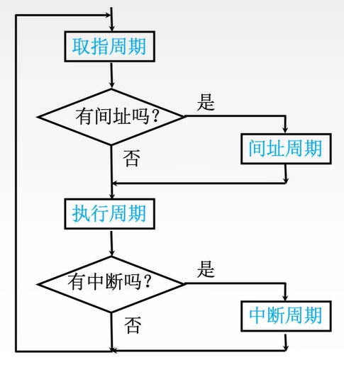
周期转换是状态转移的过程，需要四个触发器来标识：FE，IND，EX，INT
四个工作周期**都有CPU访存**操作，只是访存的目的不同，取指周期是为了取指令，间址周期是为了取有效地址，执行周期是为了取操作数，中断周期是为了保存程序断点。

**各个周期的数据流**：

（1）**取指周期**：
```
1. (PC) → MAR
2. CU通过控制总线：1 → R（向Read发送高电平）
3. 通过地址总线：M(MAR) → MDR，数据过数据总线
4. (MDR) → IR
5. PC = PC + 1
```
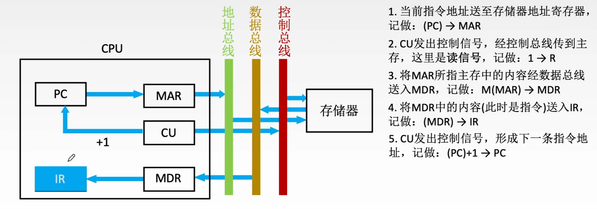

（2）**间址周期**：
```
1. Ad(IR) → MAR 或者 Ad(MDR) → MAR
2. CU通过控制总线：1 → R
3. 通过地址总线：M(MAR) → MDR，数据过数据总线
4. (MDR) → Ad(IR)（有的没有这一步，EA直接存在MDR里）
```
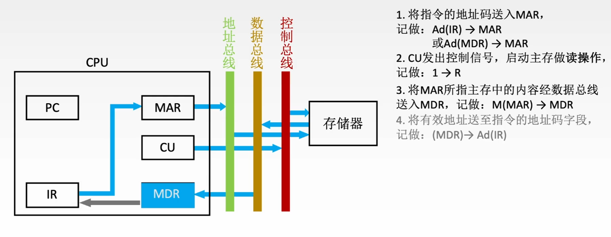

**执行周期**：没有统一的数据流向

（3）**中断周期**：暂停去完成其他任务，需要保存当前任务（PC），通常是用**堆栈保存**的
```
1. CU：SP = SP - 1， (SP) → MAR
2. 1 → w
3. (PC) → MDR
4. 向量地址 → PC
```

**指令执行方案**：
- **单指令周期**：指令周期时间相等，各个指令**串行执行**，周期取决于最长的指令。优点：控制电路设计简单。缺点：短指令需要更长时间执行，效率低
- **多指令周期**：不同指令周期可以不等，各个指令**串行执行**，周期数不同。需要复杂的电路设计
- **流水线方案**：每一个时钟周期启动一条指令，尽量多条指令同时运行，但各自处在不同的执行步骤。指令之间**并行执行**。（同时有指令在取指，执行……等等，类比传送带上的工人）

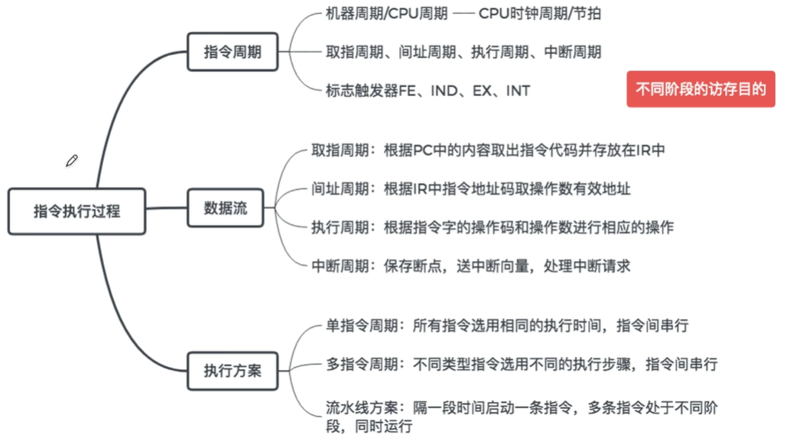

## 5.3. 数据通路
### 5.3.1. 单总线结构
**数据通路**：各个部件之间数据传送的路径
关心：不同的指令执行阶段，数据流动怎么实现？控制信号如何发出？

总线（Bus）：
- **内部总线**：同一部件如CPU内部连接各个寄存器和运算单元之间的总线
- **系统总线**：连接各个部件，如CPU，内存，通道，IO的总线

**数据通路**的基本结构：
- **CPU内部单总线**
- **CPU内部多总线**
- **专用数据通路**

数据流动分为三类：
1. 寄存器 - 寄存器 （PC - MAR）
2. 主存 - 寄存器（主存 - MDR）
3. 寄存器 - ALU（ALU - MDR）

**数据传送：CPU内部单总线**：
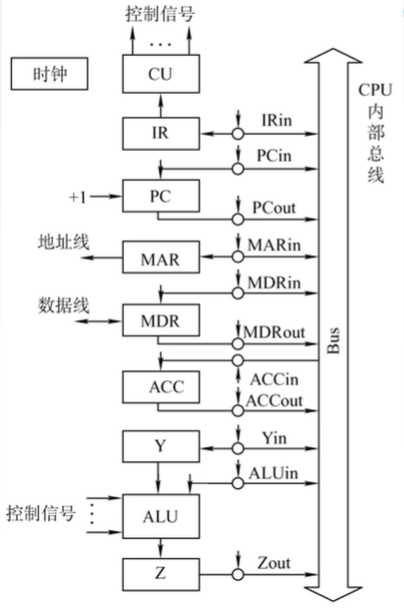

微操作序列（每次微操作只有一个数据通过内部总线）：

（1）**寄存器 - 寄存器**，如PC - MAR
```
1. (PC) → Bus (PCout 有效)
2. Bus → MAR (MAR 有效)
```

（2）**主存 - 寄存器**，如取指令：主存 - MDR
```
1. (PC) → Bus → MAR（PCout，MARin有效）
2. 1 → R（CU向主存通过控制总线发送读信号）
3. M(MAR) → MDR（MDRinE有效，数据通过外部数据总线进入MDR）
4. (MDR) → Bus → IR（MDRout，IRin有效）
```

（3）**寄存器 - ALU**，如执行加法指令
```
1. Ad(IR) → Bus → MAR（MDRout，MARin有效）
2. 1 → R（CU发送读命令）
3. M(MAR) → 数据线 → MDR（MDRinE有效）
4. MDR → Bus → Y（MDRout，Yin有效，操作数→Y）
5. (ACC) + (Y) → Z（ACCout，ALUin有效，CU向ALU发送加命令）
6. (Z) → ACC（Zout，ACCin有效） 
```

【例】设有如图所示的单总线结构，分析指令ADD (R0)，R1 的指令流程和控制信号。
注：不带括号表示操作数在寄存器中，带括号表示操作数在内存中，寄存器保存地址，需要**间接寻址**；结果需要**送回内存**中（R0中的地址）
即：((R0))+(R1)→(R0)
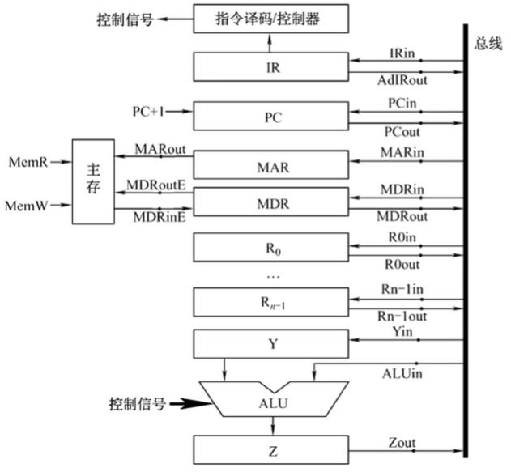

解答：
分为取指周期，间址周期，执行周期
（一）取指周期：
|时序|微操作|有效控制信号|
|---|---|---|
|1|(PC) → MAR|PCout,MARin|
|2|MEM(MAR) → MDR,**PC = PC + 1**|MemR,MARout,MDRinE|
|3|(MDR) → IR|MDRout,IRin|
|4|**指令译码**||

（二）间址周期
|时序|微操作|有效控制信号|
|---|---|---|
|1|R0 → MAR|R0out,MARin|
|2|MEM(MAR) → MDR|**MARout**,MDRin,MemR|
|3|(MDR) → **Y**|MDRout,Yin| 

（三）执行周期
|时序|微操作|有效控制信号|
|---|---|---|
|1|(Y) + (R1) → Z|R1out,ALUin,ALU的Add控制信号|
|2|(Z) → MDR|Zout,MDRin|
|3|(MDR) → MEM(**MAR**)|MDRoutE,**MARout**,MemW|

### 5.3.2. 专用数据通路

IR：
出:微操作发生器（生成微操作序列），MAR（取操作数），PC（跳跃寻址）
入：MDR（从内存中取指令）

MAR：
出：主存
入：PC（取指令），MDR（间址），IR（取操作数），通用寄存器（寄存器间接寻址），ALU（变址寻址，需要计算）

MDR：
出：MAR（间址），ALU的输入暂存寄存器（执行指令），内存（存数据），IR（取指令），通用寄存器（LOAD指令存寄存器）
入：主存（取数据），ALU的输出暂存寄存器（存结果），通用寄存器（STORE指令存内存）

PC：
出：MAR（取指令）
入：+1，IR（跳跃寻址），ALU的输出暂存寄存器（条件跳转，相对寻址），MDR（响应中断）

【例】：完成指令LDA X（(X) → ACC），ADD Y（(ACC) + (Y) → ACC)，STA Z（(ACC)  → Z）

解答：
（1）LDA X：
```
Ad(IR) → MAR
M(MAR) → MDR
(MDR) → ALU → ACC
```

（2）ADD Y：
```
Ad(IR) → MAR
M(MAR) → MDR
(MDR) → ALU;ACC → ALU
ALU → ACC
```

（3）STA Z：
```
Ad(IR) → MAR
(ACC) → MDR
(MDR) → M(MAR)
```

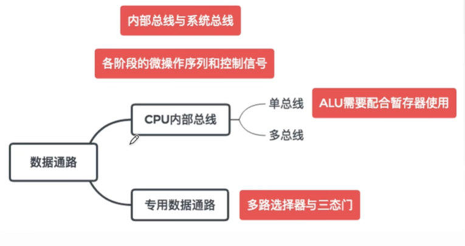

## 5.4. 控制器的功能和工作原理
### 5.4.1. 硬布线控制器
取指周期：**FE**=1
间指周期：**IND**=1
执行周期：**EX**=1
中断中期：**INT**=1

CU发出一个**微命令**，完成对应的**微操作**，微操作和微命令是等价的，操作是命令的结果
- **一个节拍**内，**相容的微操作**可以**并行进行**
- 同一微操作可能在不同指令不同阶段被使用
- 不同指令需要不同的节拍数，为了简化设计选择定长的机器周期，以可能出现的最大机器周期为准（通常是**涉及访存**）
- 如果所需节拍数少于机器周期的节拍数，通常安排在**机器周期的末尾**执行

根据：**指令的操作码，机器周期，节拍信息，机器状态条件**，即可确定在这个节拍下应该发出哪些微命令

**硬布线控制器**：

输入：
- 操作码信息：IR的n位操作码 → 操作码译码器 → CU
- 机器周期信息：FE，IND，EX，INT → CU（触发器实际上集成在CU内部）
- 节拍信息：节拍发生器 → CU，每个周期有几个节拍就几个信号输入，**节拍信息循环输入CU**
- 标志：可能来自PSW，ACC的符号位，IO设备，主存……

输出：k位表示微命令/微操作
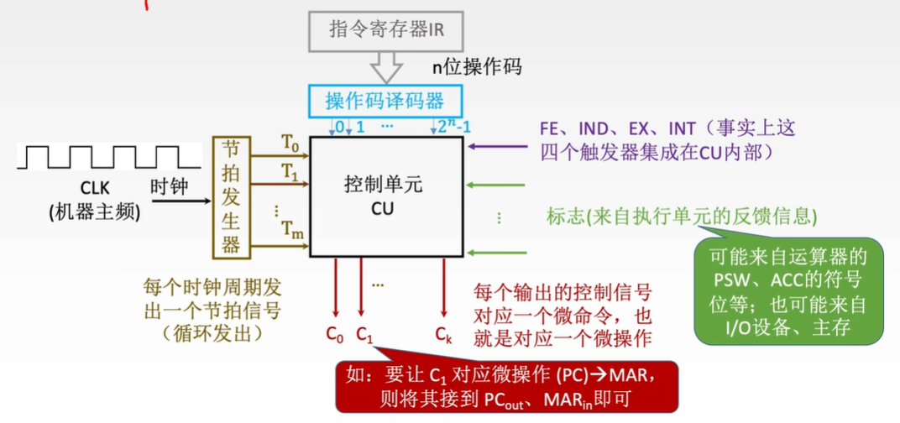

通过确定**微命令操作的逻辑表达式**，就可以确定电路

**硬布线控制器的特点**：
- 指令越多，设计和实现就越复杂，因此一般**用于RISC**(精简指令集系统)
- 如果扩充一条新的指令，则控制器的设计就需要大改，因此**扩充指令较困难**。
- 由于使用纯硬件实现控制，因此**执行速度很快**。微操作控制信号由组合逻辑电路即时产生

**硬布线控制器设计步骤**：
1. 分析每个阶段的微操作序列（分为取指，间址，执行，中断 四个阶段）
2. 选择CPU的控制方式（定长机器周期/不定长机器周期，周期长几个节拍）
3. 安排微操作时序（如何在规定的周期内完成所有微操作）
4. 电路设计（确定逻辑表达式）

（一）**确定微操作序列**
**①取指周期**：所有指令相同
```
PC → MAR
1 → R
M(MAR) → MDR
MDR → IR
OP(IR) → ID（指令译码器/Instruction Decoder）
PC + 1  → PC
```

**②间址周期**：所有指令相同
```
Ad(IR) → MAR
1 → R
M(MAR) → MDR
MDR → Ad(IR)（找到EA）

```
**③执行周期**：不同指令各不相同
如：
CLA指令清空ACC：
```
0 → AC
```

LDA X指令加载到ACC:
```
Ad(IR) → MAR
1 → R
M(MAR) → MDR
MDR → AC
```

JMP X指令跳转：
```
Ad(IR) → PC
```

BAN X指令，条件转移指令，ACC为负时发生转移，ACC的符号位为A0

$A_0·Ad(IR) + \overline{A_0}·PC → PC$

（二）**选择CPU的控制方式**：选择**定长机器周期**，机器周期为**3个节拍数**

（三）**安排微操作时序**：
**原则**：
- 先后顺序不得随意更改
- 被控对象不同的微操作尽量放在一个节拍内
- 占用时间较短的微操作安排在一个节拍内完成
- CPU内部的部件流动快，多个微操作可以在同一节拍内完成；涉及主存的IO微操作需要保证一个完整节拍

**①取指周期**：
|序号|微操作|先后顺序|时序|
|---|---|---|---|
|1|PC → MAR||T0|
|2|1 → R|存储器空闲即可|T0|
|3|M(MAR) → MDR|1之后|T1|
|4|MDR → IR|3之后|T2|
|5|OP(IR) → ID（指令译码器/Instruction Decoder）|4之后|T2|
|6|PC + 1  → PC|1之后|T1|

**②间址周期**
|序号|微操作|先后顺序|时序|
|---|---|---|---|
|1|Ad(IR) → MAR||T0|
|2|1 → R|内存空闲|T0|
|3|M(MAR) → MDR|1之后|T1|
|4|MDR → Ad(IR)（找到EA）|3之后|T2|

**③执行周期**
非访存指令：如CLA，COM，SHR，CSL，STP，节拍数小于机器周期长，放在机器周期末尾
如CLA：
|序号|微操作|先后顺序|时序|
|---|---|---|---|
|1|-||T0|
|2|-||T1|
|3|0 → AC||T2|

…………

访存指令，跳转指令…………

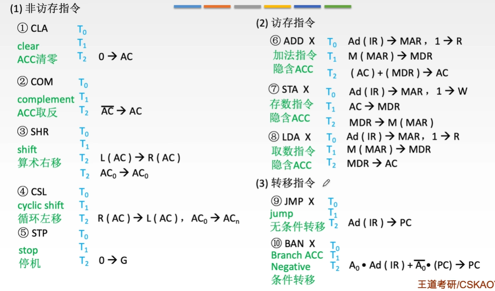

（四）**电路设计**：
**设计步骤**：
1. 列出操作时间表
2. 写出微操作命令的最简表达式
3. 画出逻辑图

（1）列出**操作时间表**：
①取指阶段：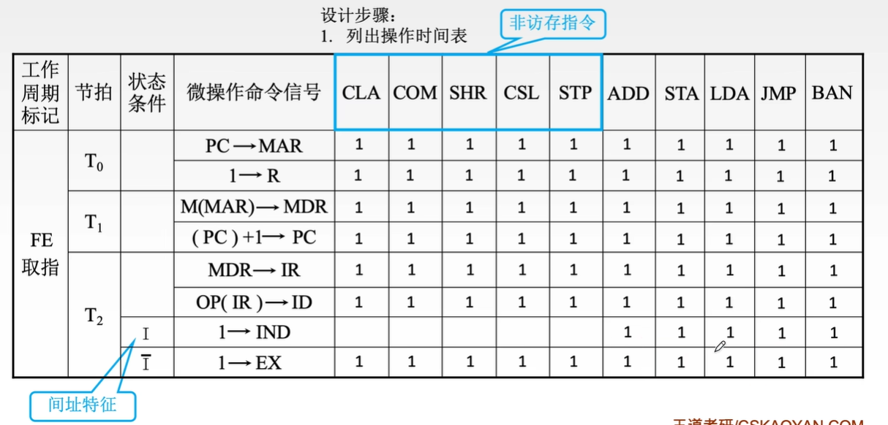
②间址阶段：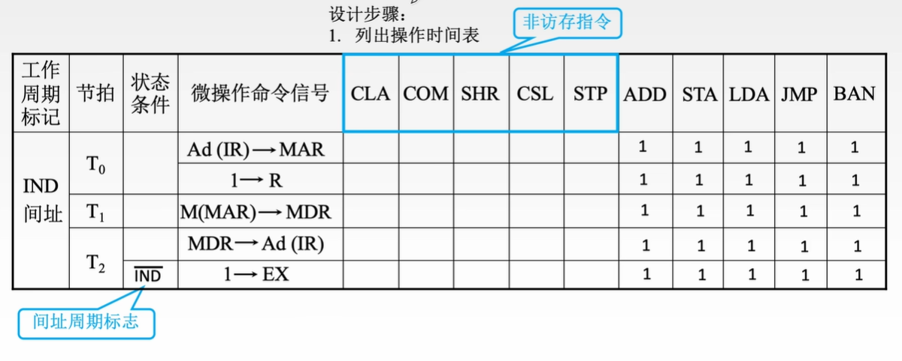
③执行阶段：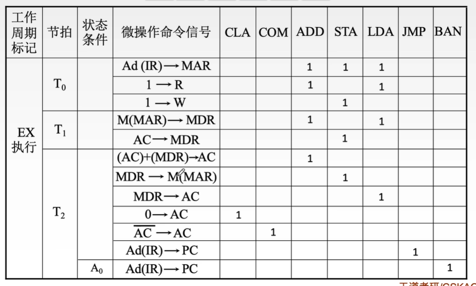

（2）写出微操作命令的**最简表达式**
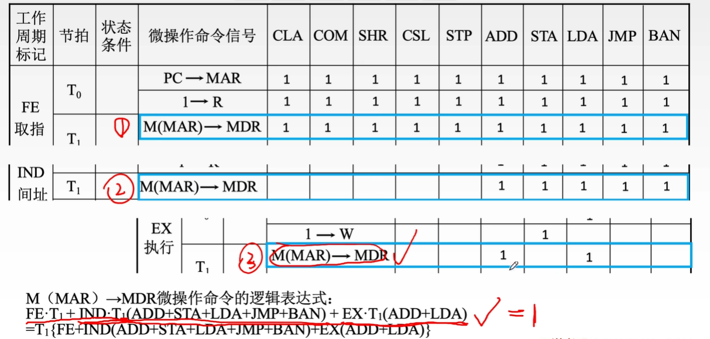

（3）画出逻辑图：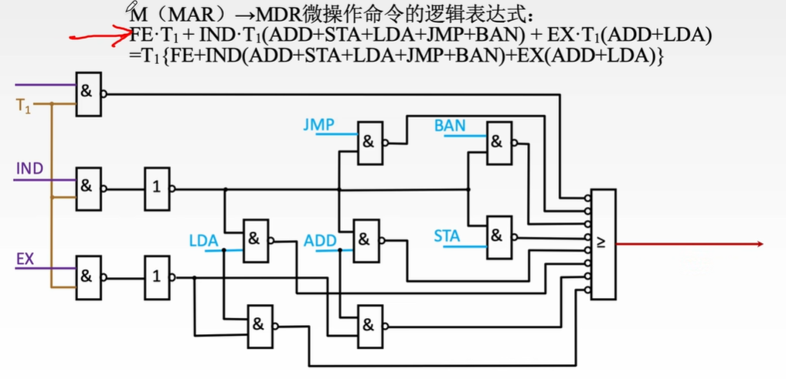

### 微程序控制器

**微程序**：由**微指令**序列组成，**每一种指令对应一个微程序**
CPU在出厂前，将所有指令的微程序存入**控制器存储器**中，CM由**ROM**构成。

※注意区分：**程序，微程序，指令，微指令，微操作，微命令，微周期**
- 一个程序 = 若干指令的集合
- 一条指令 = 若干微指令的集合 -组成→ 微程序
- 一条微指令 = 若干微操作的集合 = 若干微命令的集合
- 微操作 = 微命令
- 微周期 = 微指令周期（从CM中取指令并执行的周期）
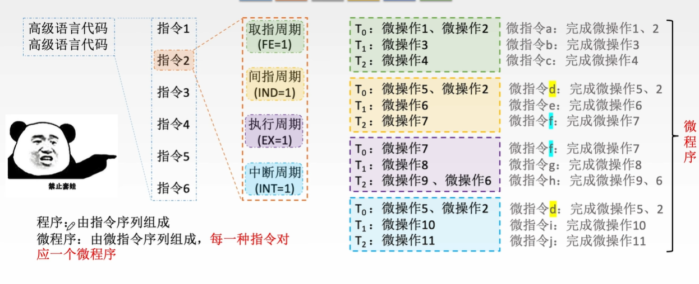

微指令的基本格式：操作控制码+顺序控制码
操作控制码指明**微操作的种类**
顺序控制码指明下一条微指令的地址（存放在控制器存储器中）


**微程序控制器的基本结构**：
CU = 控制存储器 +  微地址寄存器 + 地址译码器 + 微指令寄存器 + 微地址形成部件 + 顺序逻辑
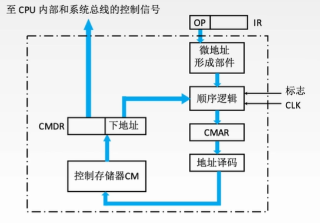

**控制存储器/CM**，存放全部微程序的核心部件。它是一个只读存储器（ROM）s
**微地址寄存器/CMAR/$\mu PC$/$\mu AR$**，存放下一条要执行的微指令在CM中的地址。
**微指令寄存器/CMDR/$\mu IR$**，存放从CM中取出的当前正在执行的微指令。
地址转移逻辑 = 微地址形成部件 + 顺序逻辑，决定下一条微指令的地址

**CM内部的存储结构**：
取指周期微程序；间址周期微程序；中断周期微程序；各种指令执行周期的微程序
所有的指令**共享取指，间址，中断周期微程序**
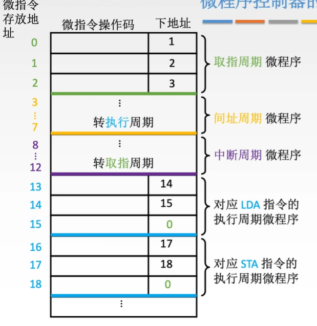
判断是否需要间址周期：根据**指令地址码的寻址特征位**判断是否要跳过间址周期
判断是否需要间断周期：根据**中断信号判断**

如取数指令，执行序列为：
取指周期:#0、#1、#2
间址周期:#3、#4…… #7
执行周期:#13、#14、#15
中断周期:#8、#9…… #12

注：
- 取指周期的微程序段是**共用的**，如果有n条指令，至少有**n+1**个微程序段（有的CPU不支持间址和终断）
- 一条指令对应一个微程序

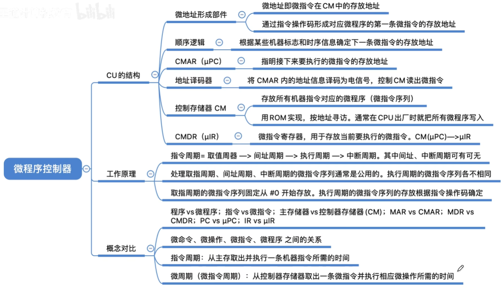

### 微指令的设计

（一）微指令的格式：
- 水平型微指令：一条微指令定义**多个可并行**的微命令
  - 格式：操作控制+顺序控制
  - 优点：**微程序短**，执行速度快。
  - 缺点：**微指令长**，编写微程序麻烦
- 垂直型微指令：一条微指令定义**一个**微命令
  - 格式：微操作码+目的地址+原地址
  - 优点：**微指令短**，简单规整，方便编写微程序
  - 缺点：**微程序长**，执行速度慢，工作效率低
- 混合型微指令：在垂直型的基础上增加一些不太复杂的并行操作。
  - 优点：微指令较短，仍便于编写;微程序也不长，执行速度加快。 

注：
- 一个微命令**对应一根输出线**
- 有的微命令可以**并行执行**，因此微指令可以包含多个微命令
- 可以并行完成的微命令叫做**相容型微命令**，不能的叫做**互斥型微命令**

（二）**※微指令的编码方式**
微指令的编码方式 = 微指令的控制方式
目标：在保证速度的情况下尽可能缩短微指令长

编码方式：
- **直接编码方式**：**每一位**代表一个微操作
  - 优点：简单直观，执行速度快，并行性好
  - 缺点：指令字长过长，**n个微指令就有n位**
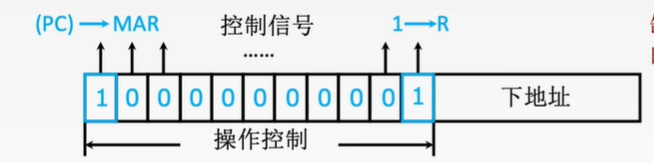
- **字段直接编码**：把微指令的控制字段分成**若干段**，**每段**经译码后发出各自的控制信号
  - 编码原则：
    - **互斥型微命令**放在**同一个段**中，**相容型微指令**放在**不同段**中
    - 每一个段的位数不能太多
    - ※每一个段需要留出**空闲状态**，表示不发出控制信号，通常用000表示
  - 优点：**缩短微指令字长**
  - 缺点：要通过译码电路，比直接编码方式**慢**
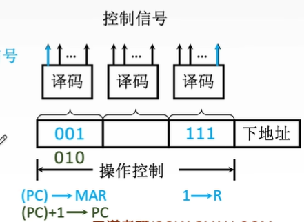
- 字段间接编码方式/隐式编码：一个字段的某些微命令需由另一个字段中的某些微命令来解释，由于不是靠字段直接译码发出的微命令。
  - 优点：字长进一步减少
  - 缺点：译码次数增多，效率更低，且并行程度低
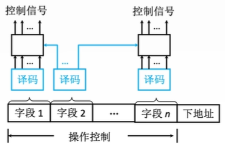

【例】某计算机的控制器采用微程序控制方式微指令中的操作控制字段采用**字段直接编码**法，共有33个微命令，构成5个互斥类，分别包含7、3、12、5和6个微命令，则操作控制字段至少有多少位?

【解答】
分别需要表示：8，4，13，6，7种状态，分别需要3，2，4，3，3位，共**15位**

（三）微指令的地址形成方式
- **※断定方式**：直接由**微指令的下地址字段**指定
- **※增量计数法**：CMAR = CMAR + 1
- 根据指令的操作码生成：由微地址形成部件生成
- 分支转移：微指令包括操作控制字段，**转移方式，转移地址**。转移方式指明判别条件，转移地址指明转移成功的去向
- 通过测试网络：顺序逻辑接受标志信息决定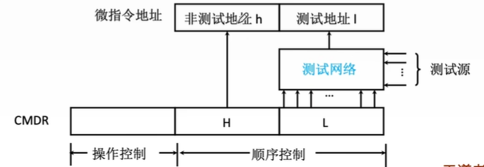
- 由硬件产生入口地址：取指和中断周期的首地址

【例】某计算机采用微程序控制器，共有32条指令，公共的取指令微程序包含2条微指令，各指令对应的微程序平均由4条微指令组成，采用断定法(下地址字段法)确定下条微指令地址，则微指令中下地址字段的位数至少是多少位?

【解答】32条指令共32*4+2=130条微指令，需要8位记录地址

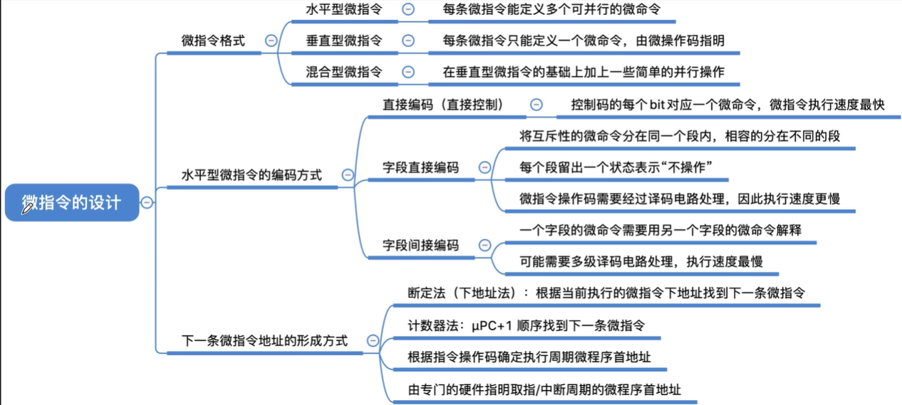

### 微程序控制单元的设计
设计步骤:
1. 分析每个阶段的微操作序列
2. 写出对应机器指令的微操作命令及节拍安排
3. 确定微指令格式
4. 编写微指令码点

