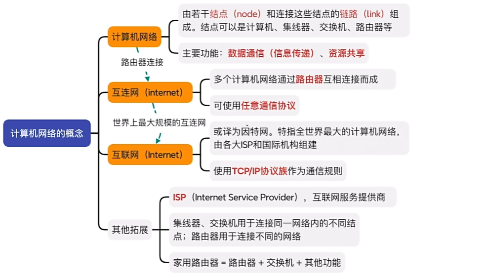
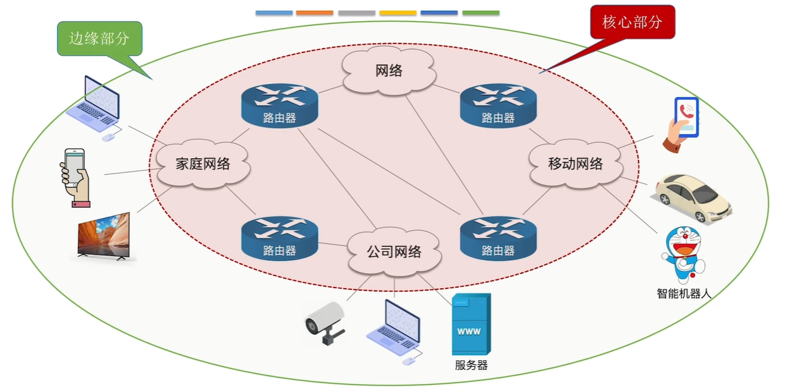
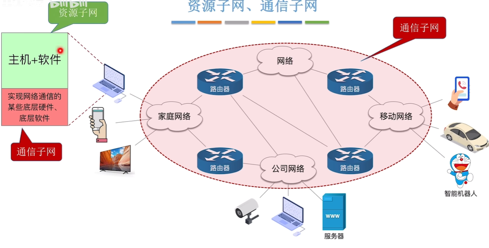
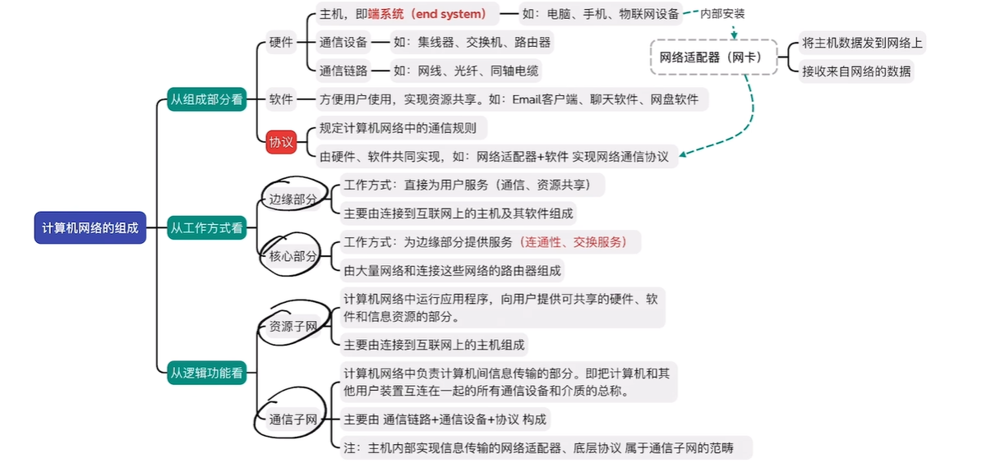
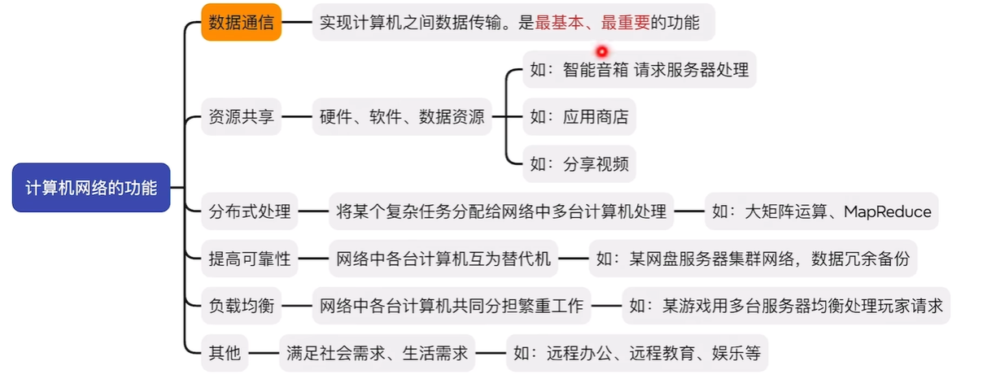
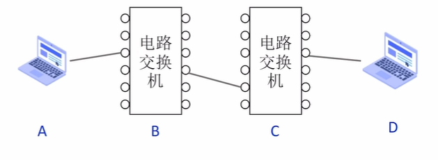
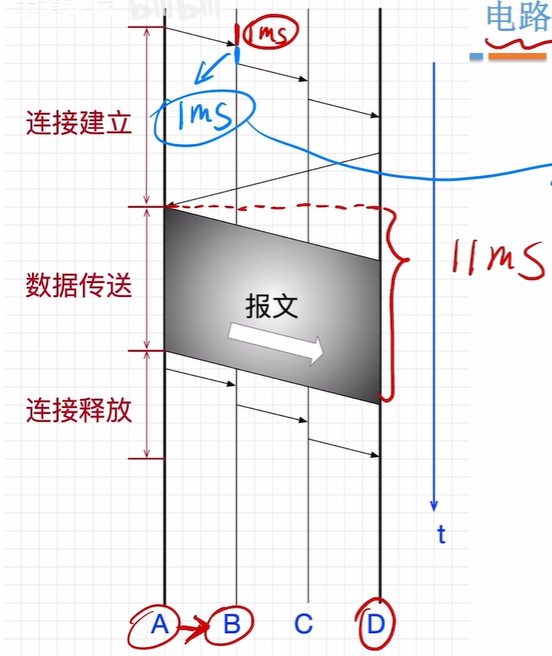
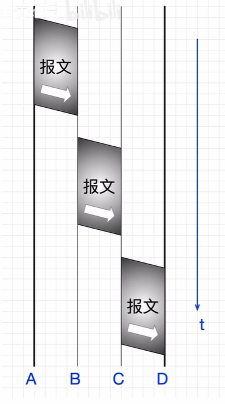
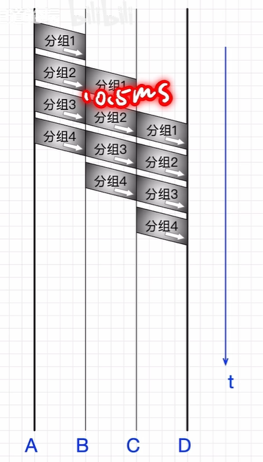
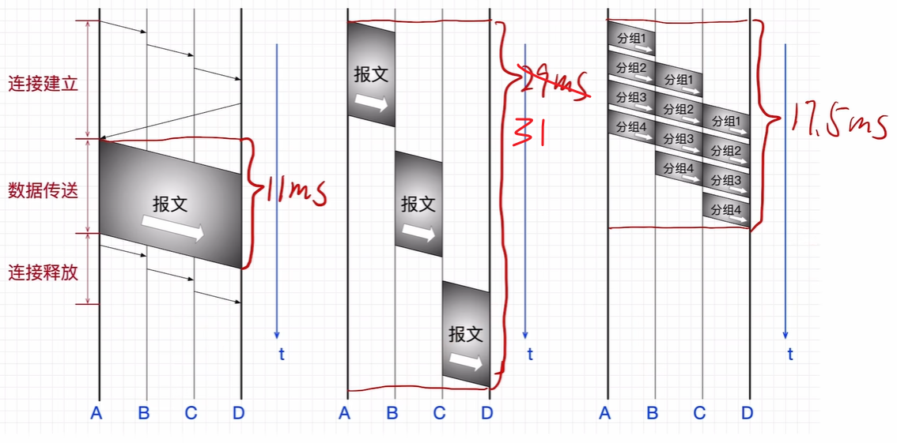

- [1. 计算机网络概述](#1-计算机网络概述)
  - [1.1. 计算机网络基本概念](#11-计算机网络基本概念)

---
# 1. 计算机网络概述
## 1.1. 计算机网络基本概念
### 计算机网络的定义
- 计算机网络（网络）：**结点**（**node**）和连接结点的**链路**（**link**）组成计算机网络
- 互连网：通过**路由器**，把多个计算机网络连接起来，形成互连网
- 互联网：覆盖全球的互连网，形成互联网

通信设备：集线器（Hub，工作在第二层物理层）、交换机（Switch，工作在第三层数据链路层）、路由器（Router，工作在第四层网络层）
家用路由器 = 路由器 + 交换机 + 其他功能

互联网必须使用TCP/IP协议通信，互连网可以使用任意协议通信

ISP：互联网服务提供商

### 计算机网络的组成与功能（理解）
（一）计算机网络的组成
①从**组成部分**看：计算机网络=硬件+软件+协议
- **硬件**
  - **主机**（端系统）：内部安装**网络适配器（网卡）**，实现通信协议
  - **通信设备**：如集线器，交换机，路由器
  - **通信链路**：网线、光纤……
- **软件**
- **协议**：由硬件和软件共同实现

②从**工作方式**看
- **边缘部分**：直接为用户服务，由主机和主机上的软件组成
- **核心部分**：为边缘部分提供**连通性和交换性服务**，由大量网络和连接网络的路由器组成

③从**逻辑功能**看
- **资源子网**：为用户提供资源，由主句组成
- **通信子网**：负责信息传输的部分，由通信链路+通信设备+协议构成

注：主机内部的**网络适配器、底层协议**属于**通信子网**的范畴

（二）计算机网络的功能
- **数据通信**：最基本，最重要的功能
- 资源共享：硬件、软件、数据资源共享
- 分布式处理：复杂的任务分派给其他计算机，如矩阵运算
- 提高可靠性：各台计算机互为互补替代机，提高可靠型，如云网盘
- 负载均衡：多台计算机分担繁重的任务，如游戏服务器
……

### 三种数据交换技术
- **电路交换**：通过**物理线路**的连接，**动态**地分配传输线路资源，用于**电话网络**
  - 过程：建立连接（尝试占用通信资源） - 通信（一直占用通信资源） - 释放连接（归还通信资源  
  - 优点：独占专用物理通路，通信过程始终占用，**传输速率高**
  - 缺点：需要建立释放连接，需要额外的**时间开销**；线路被独占，**利用率低**；线路分配的**灵活性差**；不支持**差错控制**（无法发现数据错误）
  - 适用于：**低频次，大量传输数据**
- **报文交换**：报文包括**控制信息**+**用户数据**，控制信息指明发送方接受方，用于**电报网络**
  - 过程：**存储转发**
  - 优点：通信前**无需建立连接**；报文存储转发，**灵活分配线路**；用**户不独占**物理线路，利用率高；支持**差错控制**
  - 缺点：**报文不定长**，不方便存储转发管理；长报文的**时间开销和缓存开销大**；长报文容易出错，**重传代价高**
- **分组交换**：解决报文不定长的问题，长报文切分为定长的若干分组，用于**现代网络**
  - **分组**(**Packet**)的结构：**首部**（**Header**）（原地址，目的地址，**分组号**） + 数据
  - 优点：无连接，分组存储转发，不独占，差错控制
  - 相比报文交换，分组定长方便存储转发；分组转发时间开销小，缓存开销小；分组不易出错，重传代价低
  - 缺点：**控制信息增加**；相比电路交换，存在存储转发**时延**；分组可能**失序、丢失**
- 虚电路交换：基于分组交换，会先建立连接

### 三种交换技术的性能分析

**电路交换的性能分析**：A→B→C→D
假设:每一跳传播时延=1ms，电路交换机建立、释放下一跳连接耗时=1ms，接收方处理连接请求需要2ms，数据传输速率=0.5kb/ms，报文大小=4kb

- 建立连接：消耗$3*1+2*1+2+3=10ms$
- 数据传送：发送端消耗$4/0.5=8ms$，
- 释放连接：消耗$3+2=5ms$

纵向一格表示1ms
传送共消耗11ms

**报文交换的性能分析**
假设:每一跳传播时延=1ms，数据传输速率=0.5kb/ms，报文大小=4kb，报文存储转发时延=2ms
注：中间节点接收完**整个报文**才能解析并转发
- A到B：总共消耗$8+1=9ms$
- B处理：2ms
- B到C：9ms
- C处理：2ms
- C到D：9ms

报文交换共计消耗31ms

**分组交换的性能分析**：
假设：每一跳传播时延=1ms，数据传输速率=0.5kb/ms，报文大小=4kb，分组大小=1kb，分组存储转发时延=0.5ms
注：中间节点接收完**整个报文**才能解析并转发

- 每组的发送时间：$(1+2)*3+0.5*2=10ms$
- 第四组开始发送的时间：$2*3+0.5*3=7.5ms$

共计消耗17.5ms

**性能对比**：
||电路交换|报文交换|分组交换|
|---|---|---|---|
|传输时间|最少|最多|较少|
|时延|无|高|低|
|建立连接|是|否|否|
|缓存开销|无|高|低|
|差错控制|不支持|支持|支持|
|报文有序到达|是|是|否|
|额外控制信息|无|少|多|
|线路分配灵活性|不灵活|灵活|非常灵活|
|线路利用率|低|高|非常高|

总结：
