- [1. 计算机网络概述](#1-计算机网络概述)
  - [1.1. 计算机网络基本概念](#11-计算机网络基本概念)
    - [1.1.1. 计算机网络的定义](#111-计算机网络的定义)
    - [1.1.2. 计算机网络的组成与功能（理解）](#112-计算机网络的组成与功能理解)
    - [1.1.3. 三种数据交换技术](#113-三种数据交换技术)
    - [1.1.4. 三种交换技术的性能分析](#114-三种交换技术的性能分析)
    - [1.1.5. 计算机网络的分类](#115-计算机网络的分类)
    - [1.1.6. 计算机网络的性能指标](#116-计算机网络的性能指标)
  - [1.2. 计算机网络体系结构](#12-计算机网络体系结构)
    - [1.2.1. 计算机网络分层结构](#121-计算机网络分层结构)
    - [1.2.2. OSI参考模型](#122-osi参考模型)
    - [1.2.3. TCP/IP模型](#123-tcpip模型)
- [2. 物理层](#2-物理层)
  - [2.1. 通信基础](#21-通信基础)
    - [2.1.1. 通信基础的基本概念](#211-通信基础的基本概念)
    - [2.1.2. 信道的极限容量](#212-信道的极限容量)
    - [2.1.3. 编码技术](#213-编码技术)
    - [2.1.4. 调制技术](#214-调制技术)
  - [2.2. 传输介质](#22-传输介质)
  - [2.3. 物理层设备](#23-物理层设备)
- [3. 数据链路层](#3-数据链路层)
  - [3.1. 数据链路层的功能](#31-数据链路层的功能)
  - [3.2. 功能1：组帧](#32-功能1组帧)
  - [3.3. 功能2：差错控制](#33-功能2差错控制)
    - [3.3.1. 检错编码：奇偶校验、CRC校验](#331-检错编码奇偶校验crc校验)
    - [3.3.2. 纠错编码：海明码/汉明码](#332-纠错编码海明码汉明码)
  - [3.4. 功能3、4：流量控制、可靠传输](#34-功能34流量控制可靠传输)
    - [3.4.1. 流量控制、可靠传送与利用滑动窗口机制](#341-流量控制可靠传送与利用滑动窗口机制)
    - [3.4.2. 停止-等待协议（S-W）](#342-停止-等待协议s-w)
    - [3.4.3. 后退N帧协议（GBN）](#343-后退n帧协议gbn)
    - [3.4.4. 选择重传协议（SR）](#344-选择重传协议sr)
    - [3.4.5. 三种协议的信道利用率：](#345-三种协议的信道利用率)
  - [3.5. 功能5：介质访问控制](#35-功能5介质访问控制)
    - [3.5.1. 信道划分法](#351-信道划分法)
    - [3.5.2. 随机访问法](#352-随机访问法)
      - [3.5.2.1. ALOHA协议](#3521-aloha协议)
      - [3.5.2.2. CSMA协议](#3522-csma协议)
      - [3.5.2.3. ※※CSMA/CD协议](#3523-csmacd协议)
      - [3.5.2.4. ※CAMA/CA协议](#3524-camaca协议)
    - [3.5.3. 轮询访问法：令牌传递协议](#353-轮询访问法令牌传递协议)
  - [3.6. 局域网](#36-局域网)
    - [3.6.1. 局域网的基本概念与体系结构](#361-局域网的基本概念与体系结构)
    - [以太网与 IEEE 802. 3](#以太网与-ieee-802-3)

---
# 1. 计算机网络概述
## 1.1. 计算机网络基本概念
### 1.1.1. 计算机网络的定义
- 计算机网络（网络）：**结点**（**node**）和连接结点的**链路**（**link**）组成计算机网络
- 互连网：通过**路由器**，把多个计算机网络连接起来，形成互连网
- 互联网：覆盖全球的互连网，形成互联网

通信设备：集线器（Hub，工作在第二层物理层）、交换机（Switch，工作在第三层数据链路层）、路由器（Router，工作在第四层网络层）
家用路由器 = 路由器 + 交换机 + 其他功能

互联网必须使用TCP/IP协议通信，互连网可以使用任意协议通信

ISP：互联网服务提供商

### 1.1.2. 计算机网络的组成与功能（理解）
（一）计算机网络的组成
①从**组成部分**看：计算机网络=硬件+软件+协议
- **硬件**
  - **主机**（端系统）：内部安装**网络适配器（网卡）**，实现通信协议
  - **通信设备**：如集线器，交换机，路由器
  - **通信链路**：网线、光纤……
- **软件**
- **协议**：由硬件和软件共同实现

②从**工作方式**看
- **边缘部分**：直接为用户服务，由主机和主机上的软件组成
- **核心部分**：为边缘部分提供**连通性和交换性服务**，由大量网络和连接网络的路由器组成

③从**逻辑功能**看
- **资源子网**：为用户提供资源，由主句组成
- **通信子网**：负责信息传输的部分，由通信链路+通信设备+协议构成

注：主机内部的**网络适配器、底层协议**属于**通信子网**的范畴

（二）计算机网络的功能
- **数据通信**：最基本，最重要的功能
- 资源共享：硬件、软件、数据资源共享
- 分布式处理：复杂的任务分派给其他计算机，如矩阵运算
- 提高可靠性：各台计算机互为互补替代机，提高可靠型，如云网盘
- 负载均衡：多台计算机分担繁重的任务，如游戏服务器
……

### 1.1.3. 三种数据交换技术
- **电路交换**：通过**物理线路**的连接，**动态**地分配传输线路资源，用于**电话网络**
  - 过程：建立连接（尝试占用通信资源） - 通信（一直占用通信资源） - 释放连接（归还通信资源  
  - 优点：独占专用物理通路，通信过程始终占用，**传输速率高**
  - 缺点：需要建立释放连接，需要额外的**时间开销**；线路被独占，**利用率低**；线路分配的**灵活性差**；不支持**差错控制**（无法发现数据错误）
  - 适用于：**低频次，大量传输数据**
- **报文交换**：报文包括**控制信息**+**用户数据**，控制信息指明发送方接受方，用于**电报网络**
  - 过程：**存储转发**
  - 优点：通信前**无需建立连接**；报文存储转发，**灵活分配线路**；用**户不独占**物理线路，利用率高；支持**差错控制**
  - 缺点：**报文不定长**，不方便存储转发管理；长报文的**时间开销和缓存开销大**；长报文容易出错，**重传代价高**
- **分组交换**：解决报文不定长的问题，长报文切分为定长的若干分组，用于**现代网络**
  - **分组**(**Packet**)的结构：**首部**（**Header**）（原地址，目的地址，**分组号**） + 数据
  - 优点：无连接，分组存储转发，不独占，差错控制
  - 相比报文交换，分组定长方便存储转发；分组转发时间开销小，缓存开销小；分组不易出错，重传代价低
  - 缺点：**控制信息增加**；相比电路交换，存在存储转发**时延**；分组可能**失序、丢失**
- 虚电路交换：基于分组交换，会先建立连接

### 1.1.4. 三种交换技术的性能分析

**电路交换的性能分析**：A→B→C→D
假设:每一跳传播时延=1ms，电路交换机建立、释放下一跳连接耗时=1ms，接收方处理连接请求需要2ms，数据传输速率=0.5kb/ms，报文大小=4kb

- 建立连接：消耗$3*1+2*1+2+3=10ms$
- 数据传送：发送端消耗$4/0.5=8ms$，
- 释放连接：消耗$3+2=5ms$

纵向一格表示1ms
传送共消耗11ms

**报文交换的性能分析**
假设:每一跳传播时延=1ms，数据传输速率=0.5kb/ms，报文大小=4kb，报文存储转发时延=2ms
注：中间节点接收完**整个报文**才能解析并转发
- A到B：总共消耗$8+1=9ms$
- B处理：2ms
- B到C：9ms
- C处理：2ms
- C到D：9ms

报文交换共计消耗31ms

**分组交换的性能分析**：
假设：每一跳传播时延=1ms，数据传输速率=0.5kb/ms，报文大小=4kb，分组大小=1kb，分组存储转发时延=0.5ms
注：中间节点接收完**整个报文**才能解析并转发

- 每组的发送时间：$(1+2)*3+0.5*2=10ms$
- 第四组开始发送的时间：$2*3+0.5*3=7.5ms$

共计消耗17.5ms

**性能对比**：
||电路交换|报文交换|分组交换|
|---|---|---|---|
|传输时间|最少|最多|较少|
|时延|无|高|低|
|建立连接|是|否|否|
|缓存开销|无|高|低|
|差错控制|不支持|支持|支持|
|报文有序到达|是|是|否|
|额外控制信息|无|少|多|
|线路分配灵活性|不灵活|灵活|非常灵活|
|线路利用率|低|高|非常高|

总结：

### 1.1.5. 计算机网络的分类
（一）按分布范围分类
- **广域网**（WAN）：跨省/国/洲
- 城域网（MAN）：采用**以太网技术**，城市
- **局域网**（LAN）：采用**以太网技术**，企业学校家庭
- 个域网（PAN）：也常称为无线个域网，采用无线技术

（二）按传输技术分类
- 广播式网络：广播范围内计算机都会收到数据包，通过检查目的地址决定是否接受
- 点对点网络：点对点发送给接收方

注：无线网络都是广播式的，路由器转发是点对点

（三）按拓扑结构分类
- **总线型结构**：**广播式传输**，存在**总线争用**问题，如**集线器**连接设备
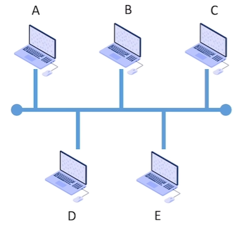
- **环形结构**：**广播式传输**，通过**令牌**解决总线争用问题，如**令牌环网**
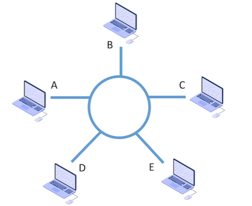
- **星型结构**：由**中央设备**实现**点对点传输**，不存在总线争用问题，如**以太网交换机**，常见与局域网
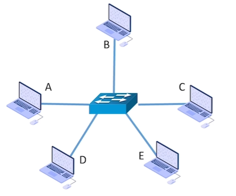
- **网状结构**：点到点传输，如**路由器构建的广域网**
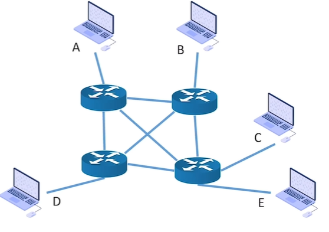

（四）按使用者分类
- 公用网：对公众开放
- 专用网：组织内部的网络

（五）按传输介质分类
- 有线网络
- 无线网络

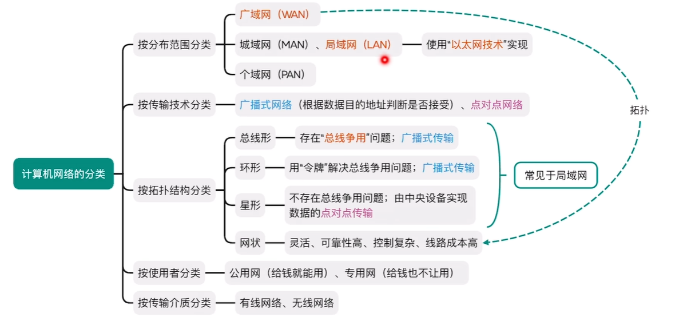

### 1.1.6. 计算机网络的性能指标

1. **速率**（数据率、比特率、数据传输速率）：节点在信道上传输数据的速率，单位为bit/s|b/s|bps，注意1Bps=8bps。1k=10^3，1M=10^6，与操作系统、计组不同……
2. **带宽**：信道的**最高传输率**
3. **吞吐量**：单位时间内通过的**实际数据量**（**包含上行和下行**）
4. 另一种含义的带宽：允许通过的信号频率范围（香农定理）,单位Hz
5. ※**时延、延迟、迟延**（Delay）：数据（一个报文或分组）从网络的一段传送到另一端所需的时间
   - $总时延 = 发送时延（传输时延） + 传播时延 + 处理时延 + 排队时延$
   - $发送时延=\frac{数据长度(bit)}{发送速率(bit/s)}$
   - $传播时延=\frac{信道长度(m)}{电磁波传播速度(m/s)}$
   - 排队时延、处理时延由诸多因素影响
6. **时延带宽积**：$时延带宽积=时延*数据传输率$，表示信道内残存的数据量，时延带宽积用于设计**最短帧长**
7. **往返时延（RTT）**：$往返时延=2*传播时延+发送方传输时延+处理时间$发送方发送完数据，到发送方接收到接收方发来的确认需要的时间，如游戏时延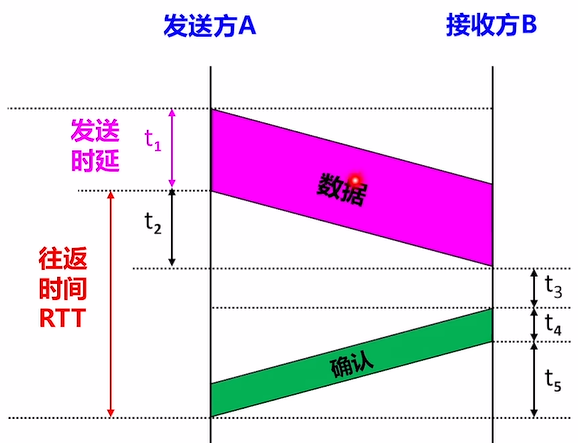
8. **信道利用率**：$信道利用率=\frac{有数据通过的时间}{总时间}$，信道利用率不能太低（浪费），也不能太高（容易拥堵）

注：
信道（Channel）：向某一方向信息传送的通道，一条通信信道在逻辑上往往对应一条**发送信道和接收信道**

【例】假设主机 A和B之间的链路带宽为 100Mbps，主机A的网卡速率为 1Gbps，主机B的网卡速率为 10Mbps，主机A给主机B发送数据的最高理论速率为(B)。
A. 1Mbps 
B. 10Mbps
C.100Mbps
D. 1Gbps

【例】H1给H2发送一个数据分组。分组大小=1000B，H1往链路A发送数据的速率为100Mbps，路由器往链路B发送数据的速率为80Mbps。链路A传播时延为0.01ms链路B传播时延为 0.05ms。不考虑路由器的处理时延、排队时延，求传输整个分组的总时延

【解】注意有**两个传输时延**，$传输时延1=1000B/1000Mbps=8*10^-5=0.08ms$ ，$传输时延2=1000B/80Mbps=8000b/80*10^6Mbps=10^-4s=0.1ms$，总时延=0.08+0.1+0.01+0.05=0.24ms
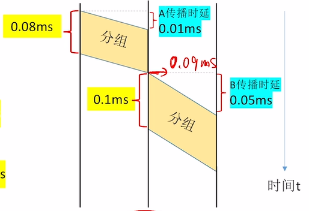

【例】在下图所示的分组交换网络中，主机 H1和 H2通过路由器互连,2 段链路的带宽均为 100Mbps、时延带宽积(即单向传播时延x带宽)均为1000bits。若H1向H2发送1个大小为 1MB 的文件，分组长度为1000B，则从 H1开始发送时刻起到H2收到文件全部数据时刻止，所需的时间至少是()。

【解】传输时延为1MB/100Mbps=8Mb/100Mbps=80ms，延时为1000bit/100Mbps=10^-5ms=0.01ms，总传播延迟为0.02ms，传送一个分组的时间为1000B/100Mbps=0.08ms，共计80.1ms
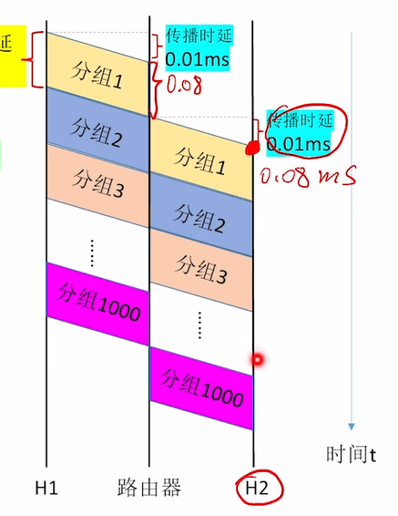

## 1.2. 计算机网络体系结构
### 1.2.1. 计算机网络分层结构
三种常见的网络体系结构：OSI参考模型、TCP/IP模型、教学用五层模型

**网络的体系结构**(Network Architecture)是计算机网络的**各层及其协议**的集合，就是这个计算机网络及其构件所应完成的**功能的精确定义**(**不涉及实现**)。
体系结构是**抽象**的，而实现是具体的

**实体**：第n层的活动元素（软件+硬件）称为第n层实体
**对等层**：不同机器上的相同层称为对等层
**对等实体**：不同机器上的同一层的实体称为对等实体
**协议**：控制**对等实体**之间进行通信的规则的集合，是**水平**的
**接口**：**相邻两层的实体**交换信息的逻辑接口，又称为**服务访问点**（SAP）
**服务**：**下层为紧邻的上层**提供功能调用，它是**垂直**的

**协议数据单元**（PDU）：**对等层次**之间传输的数据单位，由服务数据单元（SDU）和协议控制信息（PCI）组成，第n层的PDU记为**n-PDU**
**服务数据单元**（SDU）：**高一层次**传来的需要打包的信息
**协议控制信息**（PCI）：**本层添加**的打包协议信息
※$n-PDU=n-SDU+n-PCI=(n-1)-SDU$

协议的三要素：语法、语义、同步
**语法**：数据与控制信息的**格式**
**语义**：操作
**同步（时序）**：操作的条件，时序关系等

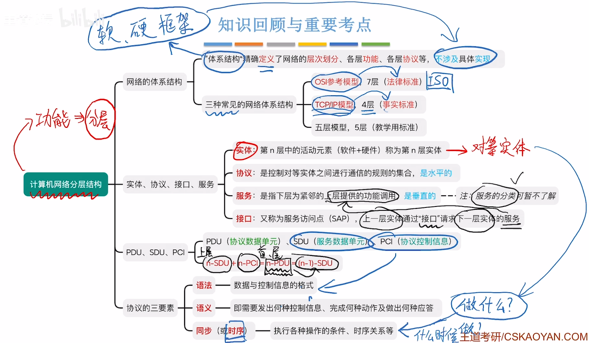

### 1.2.2. OSI参考模型
OSI参考模型从高到低：
- 7.**应用层**
- 6.**表示层**
- 5.**会话层**
- 4.**传输层**
- 3.**网络层**
- 2.**数据链路层**
- 1.**物理层**

常见的网络设备的功能层次（了解）
主机：1~7层
集线器：只实现物理层
交换机：实现物理层、数据链路层
路由器：实现物理层、数据链路层、网络层
各层通过物理传输媒体通信
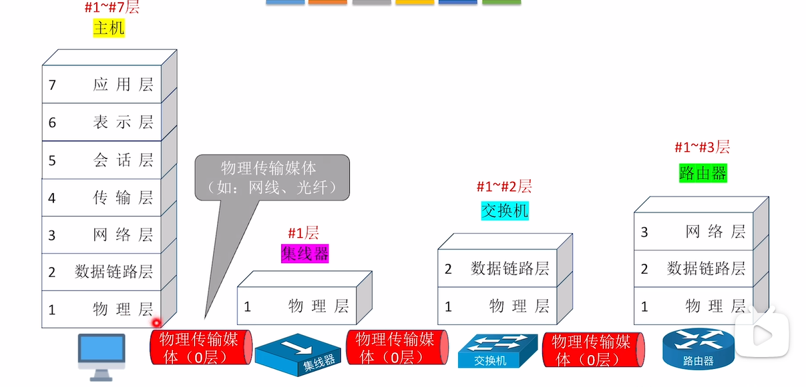

各层的功能（了解）：
- 1.**物理层**：定义接口参数、传输信号的含义、电器特征
- 2.**数据链路层**（链路层）：
  - 保障逻辑上无差错，因此需要**差错控制**（检错+纠错+重传），使用校验编码技术；
  - **流量控制**功能（以**帧**为单位，只能保证**局部正确**）
- 3.**网络层**：传输单位为**数据报/分组**（Packet）
  - **路由选择**（选择最佳路径）；
  - **分组转发**；
  - 拥塞控制（发现并缓解拥塞）；
  - 网际互连（异构网络互连）；
  - 差错控制（与数据链路层不同的是，都是以**分组**为单位，保证了整组正确）、流量控制、连接建立与释放（确保有序）、可靠传输管理（需返回分组确认消息）等
  - 可向上层提供**有连接可靠的服务**（虚电路）和**无连接不可靠的服务**（数据报）
- 4.**传输层**：实现**端到端**的通信（每个端绑定一个进程），传输单位为**报文段**（Segment）
  - 传输层复用：发送方多个端口通过传输层
  - 传输层分用：接收方将接收的数据分发给不同端口
  - 差错控制（同理，以**报文段**为单位）、流量控制、连接建立与释放、可靠传输管理
  - **只能向上层提供有连接可靠的服务**
- 5.会话层
  - 会话管理：采用检查点机制，可恢复链接
- 6.表示层
  - 解决信息表示不一致（如编码格式不同，压缩格式不同）
- 7.应用层
  - 功能繁多，根据应用需求设计（如http协议）

各层的传输单位：
||单位|
|---|---|
|7.应用层|报文Message|
|4.传输层|报文段Segment|
|3.网络层|分组/数据报Packet|
|2.数据链路层|帧Frame|
|1.物理层|比特bit|

向下的过程称为数据的**分段**，向上的过程称为数据的**重装**

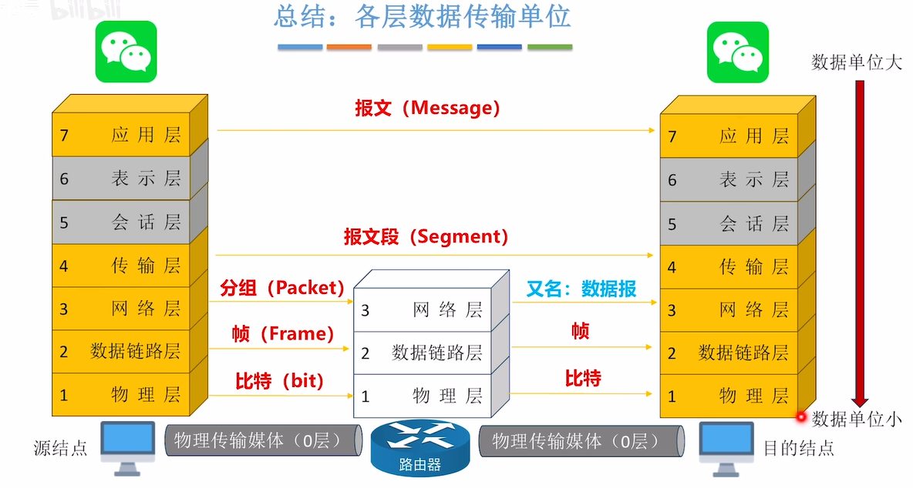

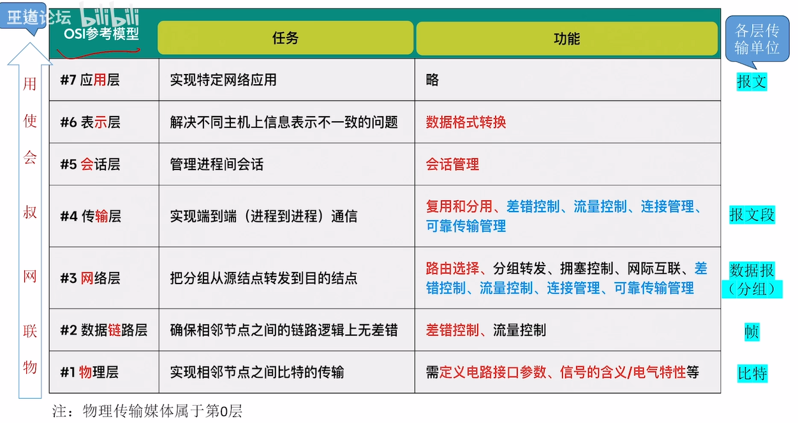

### 1.2.3. TCP/IP模型
TCP/IP模型从高到低：
- 4.**应用层**
- 3.**传输层**
- 2.**网络层**
- 1.**网络接口层**

TCP/IP模型与OSI参考模型的区别：
1. 并不是所有网络应用都需要表示层和会话层，因此将表示层和会话层的功能交给应用层的特定协议去实现
2. 网络接口的任务是为网络层传输Packet，但具体怎么传输不规定，提高灵活性和适应性
3. 网络层**去除**差错控制、流量控制、连接建立与释放、可靠传输管理的功能，提供的是**无连接不可靠的服务**（Segment）
4. 传输层进行复用和分用、差错控制、流量控制、连接建立与释放、可靠传输管理（把Segment拼接后检查），可提供**有连接可靠的服务**（**TCP协议**）和**无连接不可靠的服务**（**UDP协议**）

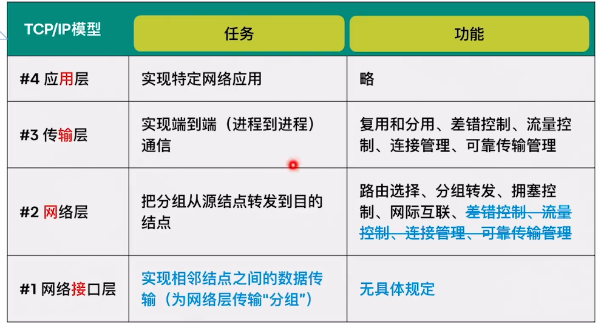

||OSI|TCP/IP|
|---|---|---|
|传输层|**有连接可靠的服务**|**有连接可靠的服务**（**TCP协议**）和**无连接不可靠的服务**（**UDP协议**）|
|网络层|**有连接可靠的服务**（虚电路）和**无连接不可靠的服务**（数据报）|**无连接不可靠的服务**（数据报）|

# 2. 物理层
## 2.1. 通信基础
### 2.1.1. 通信基础的基本概念
物理层的任务：实现相邻节点比特的传输

信源：信源的发送方（source）
信宿：信号的归宿（destination）
信道：信号通道
一条物理信道通常包含两条信道，**发送信道，接收信道**
信号：数据的载体
   - **数字信号**：信号的值是离散的
   - **模拟信号**：信号的值是连续的

**码元**：每一个信号就是一个码元
**码元宽度**：信号周期

**码元携带多个数据**：如果一个码元可能出现多种信号，就可能对应多个bit：如2，1,0，-2V对应00，01，10，11
- 优点：每个码元传输更多信息
- 缺点：需要加强信号功率，对信道要求更高

一个码元携带2bit数据，称为**四进制码元**
一个码元携带n bit数据，称为2^n进制码元
一个码元携带的比特数$n=\log_2{K} bit$，K为一个周期内可能出现的信号数

**速率**：
- **波特率**：每秒钟传输几个**码元**，单位码元/s，或**波特**（Baud）
- **比特率**：每秒钟传输几个bit
- **一个码元携带n bit数据，则M Baud=nM bps**
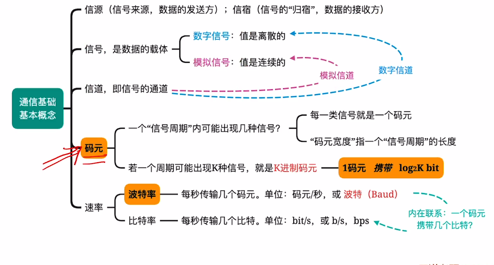

### 2.1.2. 信道的极限容量
信道的极限容量为**信道的速率上限**

信道带宽：**允许通过的信号频带范围，单位Hz**
噪声：对信道造成干扰，影响信道的信号传输效率

（一）
**奈奎斯特定理**：**理想低通信道**（**无噪声**，带宽有限信道）的**极限波特率**
- 如果信道带宽为W，则极限波特率为**2W**
- 一个码元携带K种信号，则**极限比特率**为$2W*\log K bps$

奈奎斯特定理说明：
- 如果波特率太高，会导致**码间串扰**，接收方无法识别码元
- 带宽越大，传输码元能力越强
- 奈奎斯特定理未对一个码元最多携带多少比特做出解释

（二）
**香农定理**：**有噪声信道**的**极限比特率**
- 如果信道带宽为W，信噪比为S/N，则**极限比特率**为$W\log_2{(1+S/N)}$
- **信噪比**$S/N = \frac{信号的功率}{噪声的功率}$
- **分贝记录信噪比**=$10\log_{10}S/N$，单位dB

香农定理说明：
- **提升带宽、加强信号功率，降低噪声功率**可以提高信道的极限比特率
- 结合奈奎斯特定理，可知，在带宽、信噪比确定的信道上，一个码元可以携带的比特数是有上限的

【例】若连接 R2和 R3链路的频率带宽为 8kHz，信噪比为30dB，该链路实际数据传输速率约为理论最大数据传输速率的50%，则该链路的实际数据传输速率约是()。

【解答】信噪比S/N=$10^{\frac{30}{10}}=1000$，根据香农定理，极限比特率为$8k*\log_2(1+1000)=80kbps$，则实际传输速率为40kbps

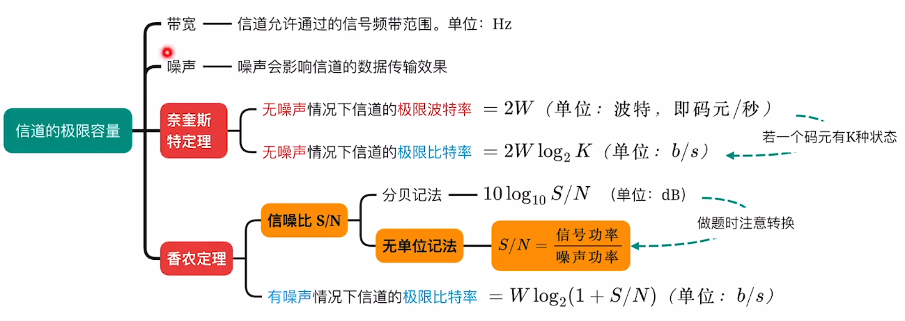

### 2.1.3. 编码技术
变换器：二进制数据转换为信号
反变换器：信号转换为二进制数据

**编码**：二进制数据→数字信号
**解码**：数字信号→二进制数据
编码-解码使用**编码-解码器**进行变换-反变换，如有线网络适配器，把网线的数字信号与二进制数据转换

**调制**：二进制数据→模拟信号
**解调**：模拟信号→二进制数据 
调制-解调使用**调制-解调器**进行变换-反变换，如光猫，把光纤的模拟信号与二进制数据转换

（一）常用的编码技术：
假设二进制数据为：1111 00101
- **不归零编码(NRZ/Non-Return-to-Zero)**：低0高1，信号周期中间不变
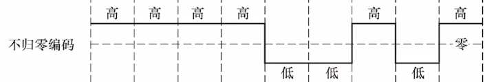
- **归零编码(RZ/Return-to-Zero)**：低0高1，信号周期中间**归零**（归零的目的：**制造节拍，进行信号同步**）
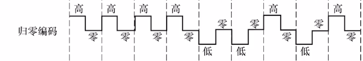
- **反向非归零编码(NRZI/Non-Return-to-Zero Inverted)**：**变0不变1**，信号周期中间不变
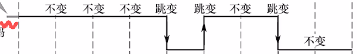
- **曼彻斯特编码**：**看中间**，信号周期中间一定跳变，正跳变0。反跳变1
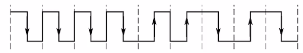
  - (更常用)上跳0，下跳1：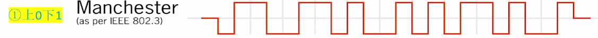
  - 下跳0，上跳1：
- **差分曼彻斯特编码**：**看起点**，0跳变，1不跳变，信号周期中间一定跳变
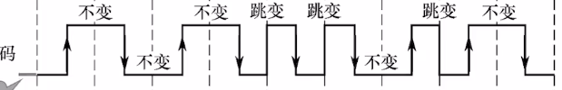

注意：曼彻斯特编码是**以太网的默认编码模式**

||01判别|周期中间|自同步能力|浪费带宽|抗干扰能力|
|---|---|---|---|---|---|
|NRZ|0低1高|不变|无|不浪费|弱|
|RZ|0低1高|归零|有|浪费|弱|
|NRZI|0跳变1保持|不变|增加冗余位实现自同步|稍微浪费|弱|
|曼彻斯特编码|**看中间**，0上跳1下跳|一定跳变|有|浪费|强|
|差分曼彻斯特编码|**看开头**，0跳变1保持|一定跳变|有|浪费|强|

【例】使用两种编码方案对比特流 01100111进行编码的结果如下图所示，编码1和编码2分别是()。
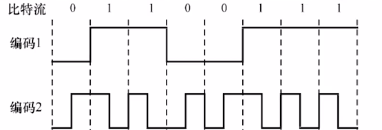

【解答】编码1为NRZ，编码2为曼彻斯特编码

【例】若下图为一段差分曼彻斯特编码信号波形，则其编码的二进制位串是()
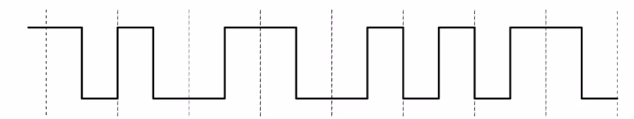

【解答】1011 1001

### 2.1.4. 调制技术
调制：用模拟信号表示二进制信息

常用的调制方法：
- **调幅(AM)**/**幅移键控（ASK）**
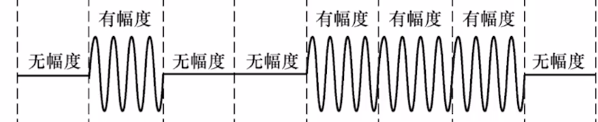
- **调频(FM)**/**频移键控（FSK）**
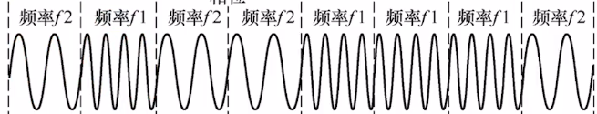
- **调相(PM)**/**相移键控（PSK）**
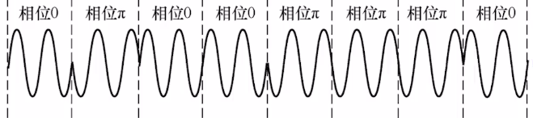
- **正交幅度调制（QAM）**：将AM，PM的信号叠加
  - **若设计出m种幅值，n种相位，则$1码元=\log_2mn\ bit$**
  - QAM-n表示有n种码元

【例】在一条带宽为 200kHz的无噪声信道上，若采用4个幅值的 ASK 调制，则该信道的最大数据传输速率是

【解答】根据奈奎斯特定理，1s最多400k个码元，每个码元表示log4=2bit，1s最多800kbit即800Kbps

【例】在无噪声情况下，若某通信链路的带宽为3kHz，采用4个相位，每个相位具有4种振幅的QAM调制技术，则该通信链路的最大数据传输速率是()。
A. 12kbps
B.24kbps
C.48kbps
D.96kbps

【解答】根据奈奎斯特定理，1s最多传输6k个码元，每个码元最多携带log2(4*4)=4bit数据，最大传输速率为24kbps

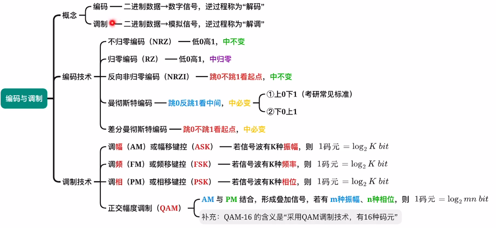

## 2.2. 传输介质
（一）常用的传输介质
**①导向型传输介质**：信号朝固定方向传播，一般为有线传输
- **双绞线**
  - 主要构成：**两条导线绞合而成**，分为有屏蔽层的**屏蔽双绞线**（STP）和没有屏蔽层的**非屏蔽双绞线**（UTP）
  - 网线内部包含**四条双绞线**
  - 屏蔽双绞线通过提高绞合度，增加屏蔽层，提升**抗电磁干扰能力**，**提升信噪比**
  - 特点：抗干扰能力较好，绞合、屏蔽层可以提升抗电磁干扰能力
  - 代表应用：局域网，早年电话线
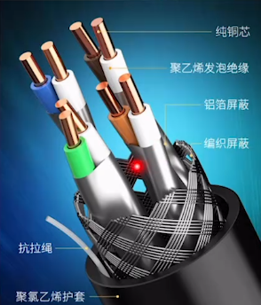
- **同轴电缆**
  - 主要构成：**内导体**（传输信号） + **外导体屏蔽层**（屏蔽干扰）
  - 特点：抗干扰能力好
  - 代表应用：早期局域网、早期有线电视
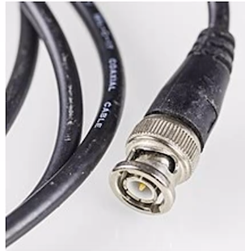
- **光纤**：
  - 主要构成：**纤芯（高折射率） + 包层（低折射率）**
  - 原理：光的**全反射**特性
  - 特点：**抗干扰能力非常好**
  - 其他优点：信号传输损耗小，长距离传输使用中继器少，很细很省空间
  - 类别：
    - **单模光纤**：只有**一条光线**在一根光纤中传输
      - 特点：纤芯更细，直径小于一个波长，只能传输一条光线，信号传输损耗低，适合**远距离传输**
    - **多模光纤**：**多条光线**在一根光纤中传输
      - 特点：纤芯更粗，同属传输多条光线，信号传输损耗更高，适合**近距离传输**

注：以太网对有线传输介质的命名规则：**速度+Base+介质信息**
例：**10Base5**：10Mbps，**同轴电缆**，最远传输500m
**10BaseF *（fiber）**：10BaseFL、10BaseFB、10BaseFP等，10Mbps，**光纤**
**10BaseT *（twisted）**：10BaseT1L等，10Mbps，双绞线

**②非导向性传输介质（无线传输介质）**：四面八方传播 ，一般为无线传输
- **无线电波**：**波长更长**
  - 特点：穿透能力强，传输距离长，信号指向性弱
  - 如手机信号，WIFI
- **微波通信**：**波长更短**
  - 特点:频率带宽高、信号指向性强、保密性差（容易被窃听）
  - 如:卫星通信(卫星作为信号中继器，传播时延较大)

注：
- 波长、频率呈反比关系
- **频率越高**，数据**传输能力**越强
- **波长越短**，信号**指向性**越强
- **波长越长**，信号的绕射性越好，穿墙能力越强
- 电磁波通信，**长波**更适合**长距离，非直线通信**，短波更适合**短距离，高速通信**，如果短波用于长距离通信，需要建立**中继站**。例：同步卫星通信，特点为传播时延较大，可用近地卫星群解决

（二）**物理层接口**的特性
- **机械特性**：指明接口所用接线器的形状和尺寸、引脚数目和排列、固定和锁定装置等
- **电气特性**：指明在接口电缆的各条线上出现的电压的范围传输速率、距离限制等
- **功能特性**：指明某条线上出现**的某一电平的电压的意义**
- **过程特性**(**规程特性**)：指明对于不同功能的各种可能事件的出现顺序

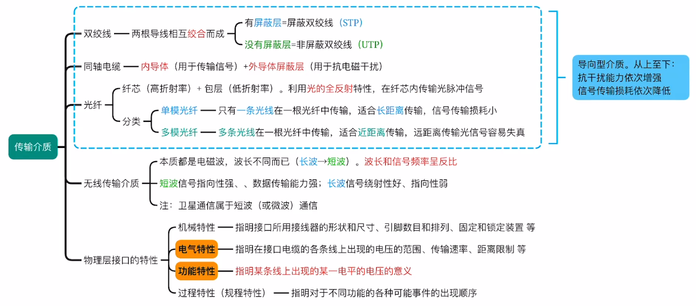

## 2.3. 物理层设备
**中继器（Repeater）**：
- 中继器只有两个端口，一个端口收到信号后，会将信号**整形再输出到另一个端口**
- 只支持**半双工通信**（两个端口不可同时发送数据）
- 中继器的两个端口对应两个**网段**

**集线器（Hub）**：
- 本质为**多端口中继器**，将其中一个端口的信号整形再生后转发到**其他所有端口**
- 各端口不可同时发送数据
- N个端口对应N个网段，各网段属于同一个**冲突域**

**冲突域（碰撞域）**：如果主机同时发送数据会导致冲突，则处于冲突域中。
- 处于同一冲突域的注意发送数据前需要**信道争用**
- 如果将三个集线器连接到同一个集线器，则会合并为一个**更大的冲突域**。
- 因此**集线器不能隔离冲突域**
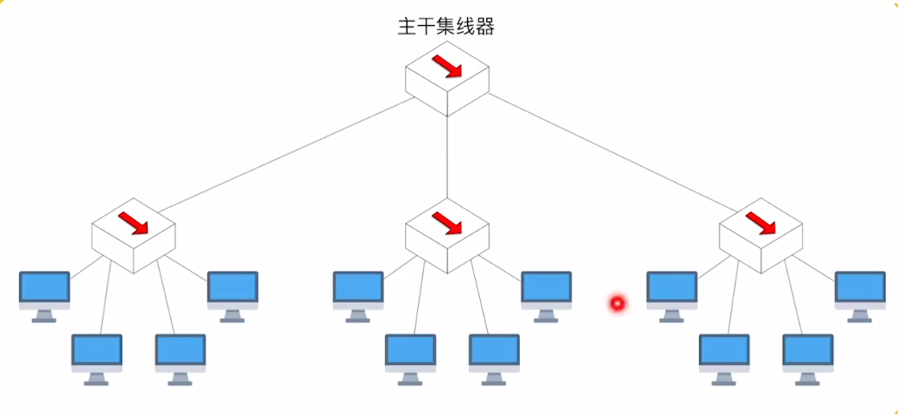

【例】冲突域的个数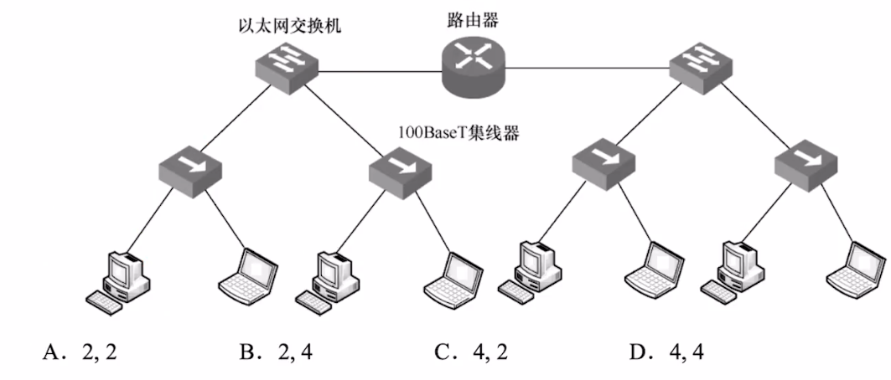

【解答】：冲突域有四个

**集线器与中继器的特性**：
- 集线器与中继器**不能无线串联**。如10Base5的5-4-3原则，即最多只能串联**五个网段**，使用**四台集线器（或交换机）**，只有**三个网段挂接计算机**
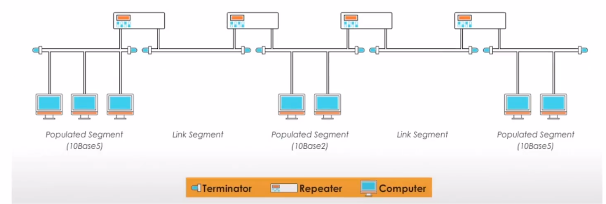
- 集线器连接的网络，**物理上是星型拓扑的，逻辑上是总线型拓扑的**，存在信道争用问题
- 集线器连接的各网段**共享带宽**。例如:带宽为10Mbps的集线器，连接8台主机，每台主机平均只拥有1.25Mbps带宽
- **传输介质≠物理层协议**：集线器可连接同一物理层协议（如以太网）的**不同介质**（如同轴电缆和双绞线），但必须保证速率、编码等协议核心参数一致。传输介质差异仅为物理实现细节，不改变协议本身。
- 集线器如果连接了速率不同的网段，会导致所有网段**速率向下兼容**

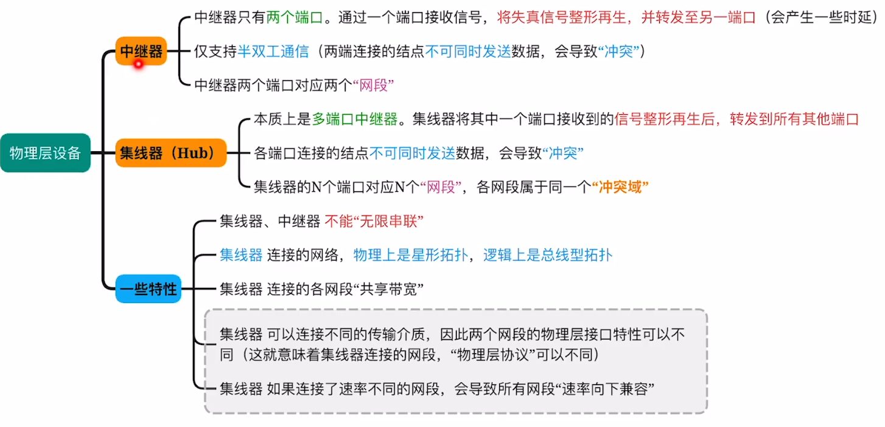

# 3. 数据链路层
## 3.1. 数据链路层的功能
向下看：数据链路层使用**物理层**提供的**比特传输**服务
向上看：数据链路层为**网络层**提供服务，将网络层的**IP数据报(分组)**封装成帧，传输给下一个**相邻结点**

**物理链路**：传输介质(0层)+物理层(1层)，实现了相邻结点之间的**物理链路**
**逻辑链路**:数据链路层需要**基于物理链路**，实现相邻结点之间逻辑上无差错的**数据链路（逻辑链路）**

**数据链路的功能**：
1. **组帧**（封装成帧）：
     - **帧定界**：把一串bit分割成多个Frame
     - **透明传输**：将接受到的Frame还原（去掉控制信息）
2. **差错控制**：发现并解决一个Frame的**位错误**
     - 解决方案一：发现错误后**丢弃**Frame，要求重传Frame，需要**检错编码技术**
     - 解决方案二：发现错误并**纠正**，需要**纠错编码技术**
3. **可靠传输**：发现并解决**帧错误**
     - **帧丢失**
     - **帧重复**
     - **帧时序**
4. **流量控制**：控制发送方的**发送帧速率**
5. **介质访问控制**
     - **广播信道**需要实现此功能。广播信道逻辑上是总线型拓扑，多个节点**争抢传输介质使用权**
     - **点对点信道**通常不用实现此功能。点对点信道意味着节点之间**有专属传输介质**

## 3.2. 功能1：组帧
- 向下：**帧定界**：把一串bit分割成多个Frame
- 向上：**透明传输**：将接受到的Frame还原（去掉控制信息）

（一）**字符计数法**：在帧的首部用**固定长度的计数字段**表示**Frame的长度**。
注意：帧的长度**包含首部的长度**
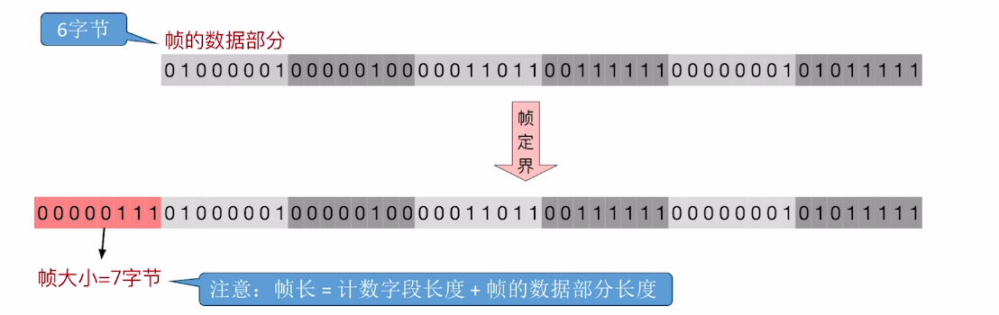

缺点：任何一个计数字段出错，都会导致**后续所有帧无法定界**

（二）**字节填充法**：帧的首部添加**SOH字符**（start of header）01H，尾部添加**EOT字符**（end of trans）04H
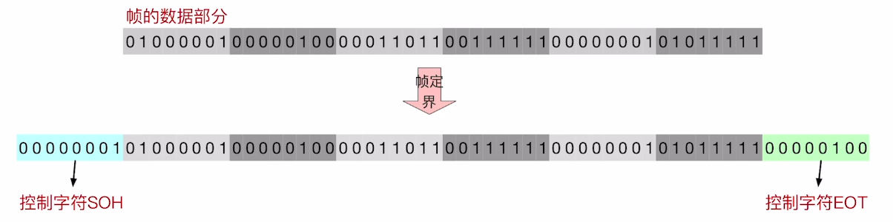
如果需要传输SOH和EOT字符，需要引入**转义字符ESC**（Escape Character）
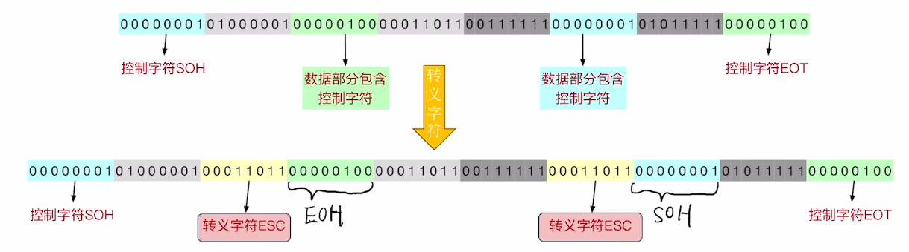
同理，传输ESC字符，需要ESC+ESC

（三）**零比特填充法**：使用特殊的比特串表示帧开始结束，通常是0111 1110

如果需要传输0111 1110，则需要进行如下操作
- 发送方每遇到5个1，就**插入1个0**
- 接受方每遇到5个1，就**删掉后面的0**

**HDLC协议和PPP协议**使用的是零比特填充法

（四）**违规编码法**：**曼彻斯特编码**下，周期中间一定发生跳变，如果没有跳变则违规。因此可以**利用违规信号组帧**
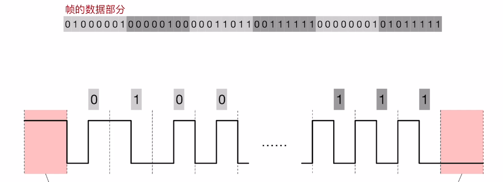

违规编码法**需要物理层的配合**

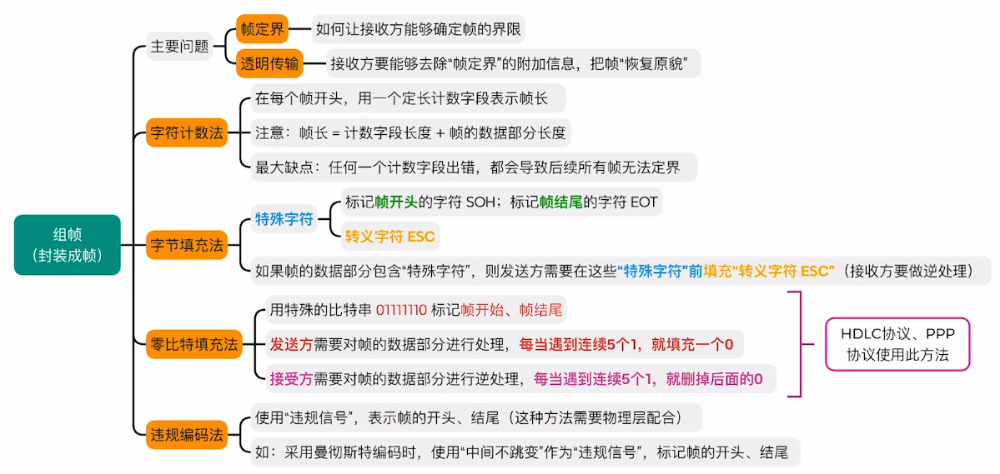

## 3.3. 功能2：差错控制
**差错控制**：发现并解决一个Frame的**位错误**
  - 解决方案一：发现错误后**丢弃**Frame，要求重传Frame，需要**检错编码技术**
  - 解决方案二：发现错误并**纠正**，需要**纠错编码技术**
### 3.3.1. 检错编码：奇偶校验、CRC校验
（一）**奇偶校验码**：在有效信息之前插入奇偶校验码
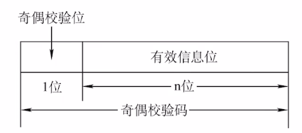
- **奇校验码**：需要保证有**奇数个1**
- **偶校验码**：需要保证有**偶数个1**

【例】求100 1101的奇校验码，偶校验码

【解答】奇校验：1100 1101；偶校验：0100 1101

**检错过程**：双方约定校验方式，检验是否符合校验方式
- **偶校验的硬件生成**：信息**异或相加**，最后得到的结果即为**偶校验位**
- **偶校验的硬件检验**：信息**异或相加**，**结果为1则表示出错**

奇偶校验的特点：**无法检测出偶数位个错误**，只能检错，无法纠错

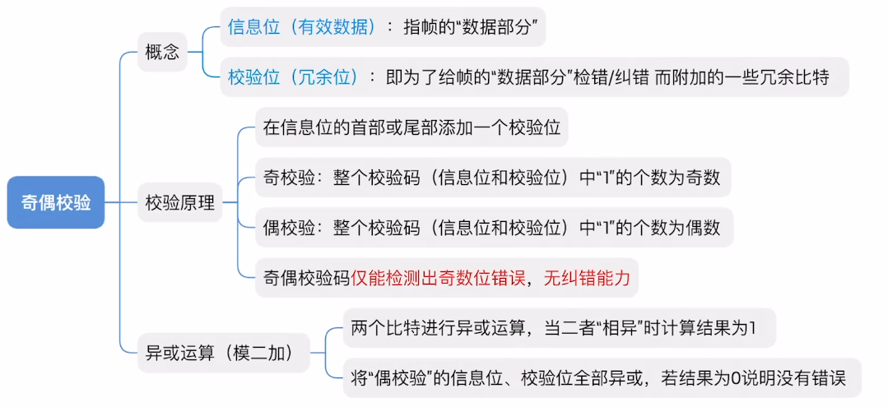

（二）**CRC校验码（循环冗余校验码）**：由K位信息位+R位校验位组成，保证CRC校验码除以余数结果为0

- **生成多项式**指明除数：如$x^3+x^2+1$对应的除数为1101
- $校验位位数R=除数位数-1$或多项式最高次幂
- CRC码生成过程：
  1. 有效信息**左移**R位
  2. 移位后的有效信息除以除数得到**余数**
  3. 得到的**余数即为校验位**
- CRC码的检验：模为0代表没有出错

CRC校验码的特点：
- 对于确定的生成多项式，**出错位与余数是相对应的**，有效信息的变化不会影响
- 当$2^R\geq K+R+1$，CRC码可以**纠正一位错**（保证一个余数对应一位）
- 可检测出所有**奇数个**错误;可检测出所有**双比特**的错误:可检测出所有**小于等于校验位长度**的连续错误;

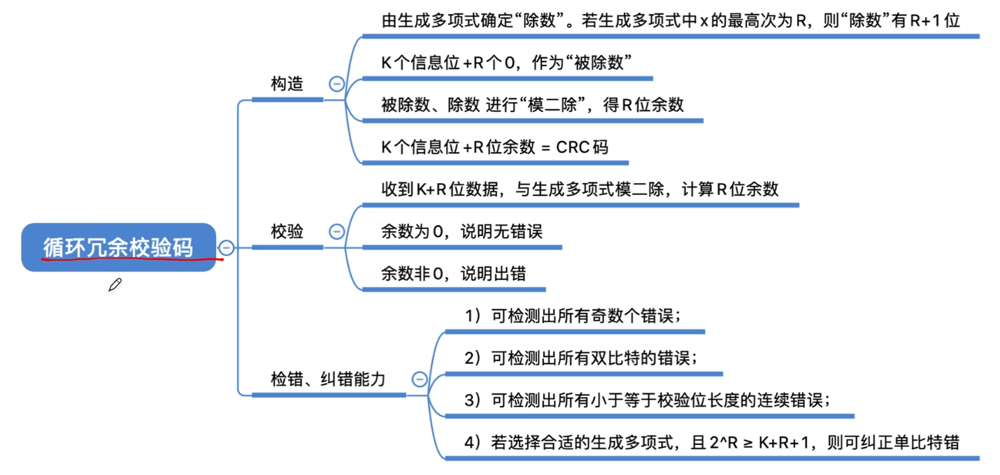

### 3.3.2. 纠错编码：海明码/汉明码
- **校验位的个数**：$2^k\geq n+k+1$（n+k个错误状态+1个正确状态）
- **海明码的求解**：假设信息位为1010，校验位为$P_3P_2P_1$
  1. 确定海明码的**位数**：4+3=7位
  2. 确定校验位的**分布**：校验位放在1、2、4位上（$2^{k-1}$）
  3. 信息放入空余位置
  4. 求校验位的**分组**
     1. $P_1$位于第**一**位上，所处的分组为**xx1**，即海明码第1、3、5、7位
     2. $P_2$位于第**二**位上，所处的分组为**x1x**，即海明码第2、3、6、7位
     3. $P_3$位于第**四**位上，所处的分组为**1xx**，即海明码第4、5、6、7位
  5. 求校验位的**值**：每个分组分别**偶校验**，求得每个海明码校验位的值
- **海明码的纠错**：
  - 如果正确，所有分组的偶校验结果都为0
  - 如果错误，求得偶校验的结果分别为$S_3、S_2、S_1$，**则$S_3S_2S_1$即为出错的位置**
- 海明码具有**一位纠错能力和两位检错能力**
- 为了区分是错一位还是错两位，需要添加**全校验位**，对全体进行偶校验
  - 如果**分组校验和偶校验都正确**，则正确
  - 如果**分组校验错误，偶校验错误**，则错一位，纠正即可
  - 如果**分组校验错误，偶校验正确**，则错两位，要求重传
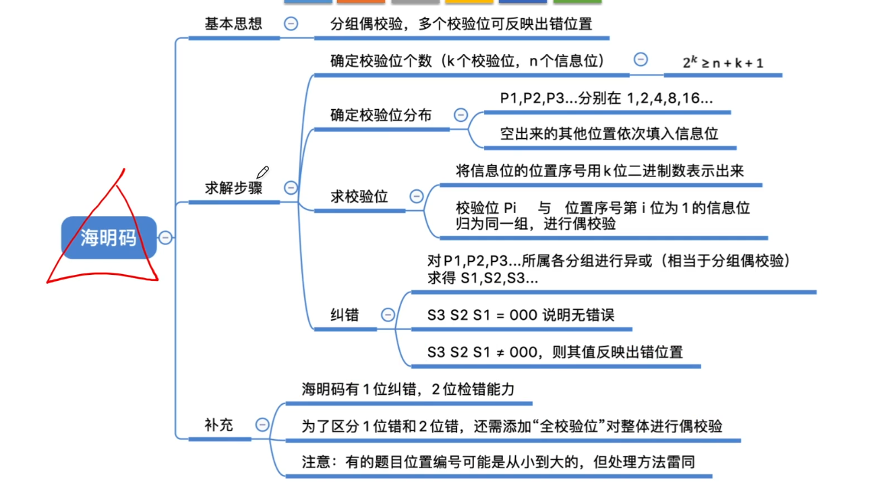

## 3.4. 功能3、4：流量控制、可靠传输
1. **可靠传输**：发现并解决**帧错误**
   - **帧丢失**
   - **帧重复**
   - **帧时序**
1. **流量控制**：控制发送方的**发送帧速率**

### 3.4.1. 流量控制、可靠传送与利用滑动窗口机制
**流量控制、可靠传送**都是利用了**滑动窗口机制**，不过三者的**窗口大小**不同

**发送窗口**$W_T$：落在发送窗口的帧才允许发送方发送
**接收窗口**$W_R$：落在接收窗口的帧才允许接收方接收
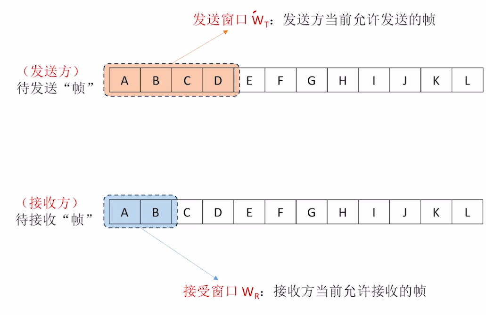

发送方窗口的滑动**由接收方控制**。接收方通过**确认机制**控制发送方的窗口滑动，从而实现了**流量控制**
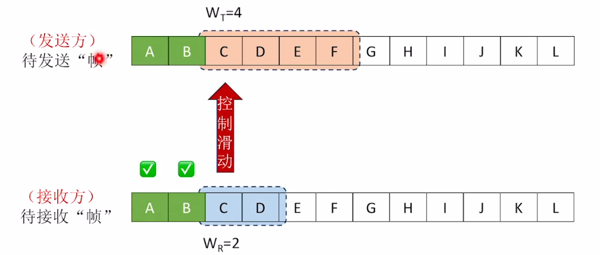

不同协议的窗口要求：
- **停止 - 等待协议（S-W）**：发送、接收窗口的大小都**等于1**
- **后退N帧协议（GBN）**：发送窗口**大于1**，接收窗口**等于1**
- **选择重传协议（SR）**：发送、接收窗口的大小都**大于1**

注意：
**滑动窗口协议**：把**后退N帧协议、选择重传协议**称为滑动窗口协议，S-W不属于滑动窗口协议
**ARQ协议**：即Automatic Repeat Request，包含S-W、GBN和SR
**连续ARQ协议**：把**后退N帧协议、选择重传协议**称为连续ARQ协议，S-W不属于连续ARQ协议

### 3.4.2. 停止-等待协议（S-W）
（一）停止-等待协议（S-W）（Stop-Wait）

-  窗口大小：停止-等待协议的发送窗口$W_T$大小和接收窗口$W_R$大小都**等于1**
-  确认机制：**确认帧$ACK_i$(acknowledge)**：若接收方收到i号帧，且没有检测出“差错”，需要给发送方返回确认帧$ACK_i$
- 重传机制：**超时重传**：若发送方**超时未收到**$ACK_i$，则重传i号帧
- 帧编号：仅需**1 bit**
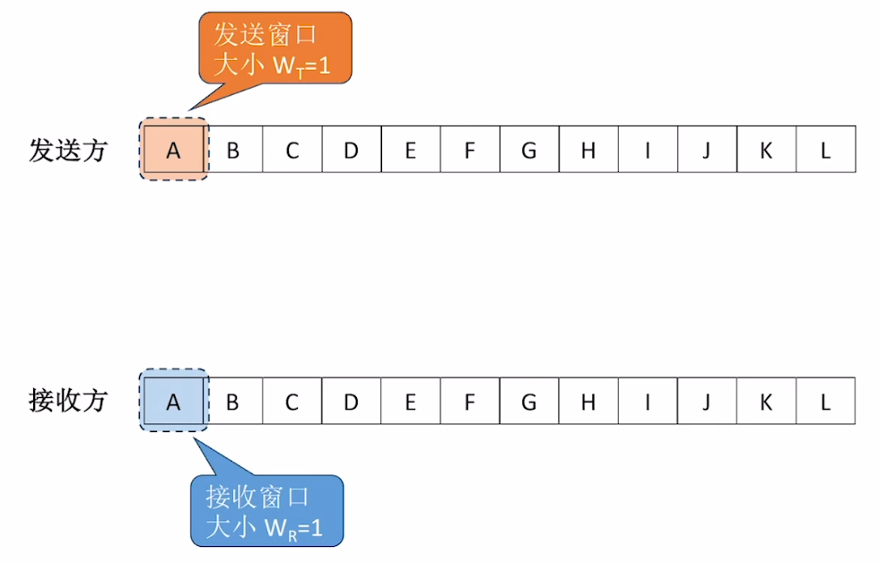

**1bit的循环编号方式**：发送方和接收方都按照0、1、0、1……为帧编号
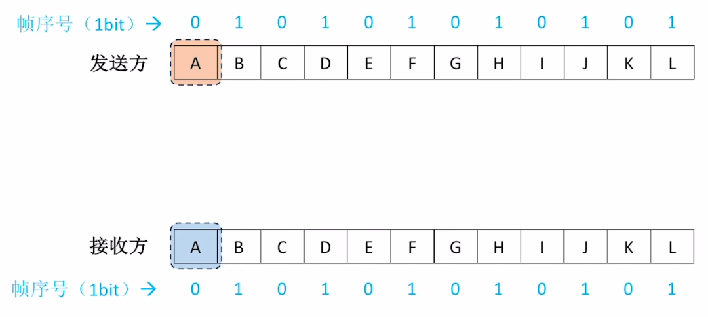

注：
- **帧序号**：发送方和接收方对帧进行的编号
- **数据帧**：发送方向接收方发送的数据帧，发送0帧简记为**Data0**
  - 数据帧由**首位的控制信息**和**数据部分**构成，数据部分可长可短
  - 首位的控制信息一般包含：**帧定界信息、校验码、帧类型、帧序号**等信息
- **确认帧**：接收方向发送方发送的确认帧，确认0帧简记为ACK0。确认帧一般很短
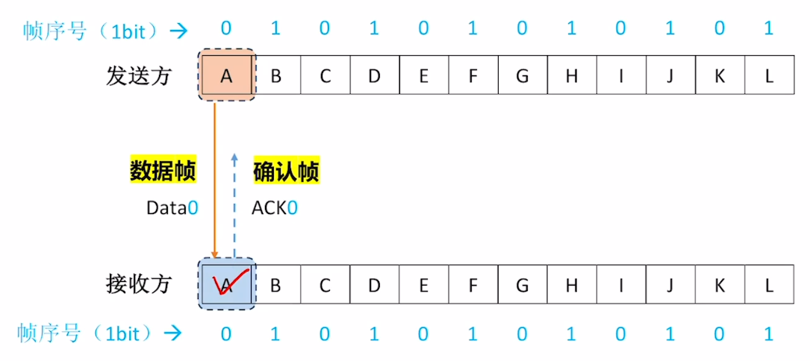

（二）**传输过程**

**正常情况**下S-W的传输过程：
1. 发送方发送Data0
2. 接收方接收到Data0，确认无误后滑动窗口右移，发送ACK0
3. 发送方收到ACK0，滑动窗口右移，发送Data1
4. 接收方接收到Data1，确认无误后滑动窗口右移，发送ACK1
…………

**异常情况1：数据帧丢失**：通过**超时重传机制**解决
1. 发送方发送Data0，同时启动**计时器**
2. **Data0丢失**
3. 发送方超时未接收到ACK0，**重新发送Data0**，并重置计时器
4. 接收方接收到Data0，确认无误后滑动窗口右移，发送ACK0
5. 发送方收到ACK0，滑动窗口右移，发送Data1
6. 接收方接收到Data1，确认无误后滑动窗口右移，发送ACK1
………………

**异常情况2：确认帧丢失**：通过**超时重传机制+帧序号**解决
1. 发送方发送Data0，同时启动**计时器**
2. 接收方接收到Data0，确认无误后滑动窗口右移，发送ACK0
3. **ACK0丢失**
4. 发送方超时未接收到ACK0，**重新发送Data0**，并重置计时器
5. 接收方**重复接收**到Data0，帧序号落在接受窗口之外
   1. **丢弃重复帧**
   2. **返回重复帧的ACK0**
6. 发送方收到ACK0，滑动窗口右移，发送Data1
7. 接收方接收到Data1，确认无误后滑动窗口右移，发送ACK1
………………

注意：
- 思考:在刚才这个场景中，如果没有“帧序号”会发生什么?
- 答:接收方无法判别重复帧”!
- 由于接受窗口和发送窗口的距离不超过1，因此用 1bit 表示帧序号足矣

**异常情况3：数据帧有差错**：通过**超时重传机制**解决
1. 发送方发送Data0，同时启动**计时器**
2. 接收方发现**Data0有差错**，**不发送ACK0**，等待发送方重传
3. 发送方超时未接收到ACK0，**重新发送Data0**，并重置计时器
4. 接收方接收到Data0，确认无误后滑动窗口右移，发送ACK0
5. 发送方收到ACK0，滑动窗口右移，发送Data1
6. 接收方接收到Data1，确认无误后滑动窗口右移，发送ACK1

S-W协议**不存在帧失序**的问题

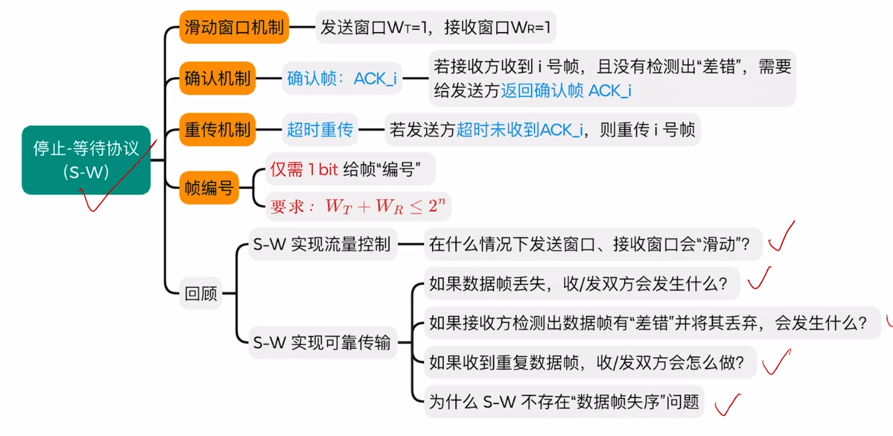

### 3.4.3. 后退N帧协议（GBN）
（一）**后退N帧协议**（GBN）（Go-Back-N）：
-  窗口大小：发送窗口$W_T$大小**大于1**，接收窗口$W_R$**等于1**
-  确认机制：接收方可以**累计确认**，即接受到连续的多个数据帧，可以**只返回最后一个帧的ACK**
- 重传机制：如果接收方超时未收到$ACK_i$，则**重传i号及i号后所有的帧**
- 帧编号：需要n bit，$W_T+W_R\leq2^n$
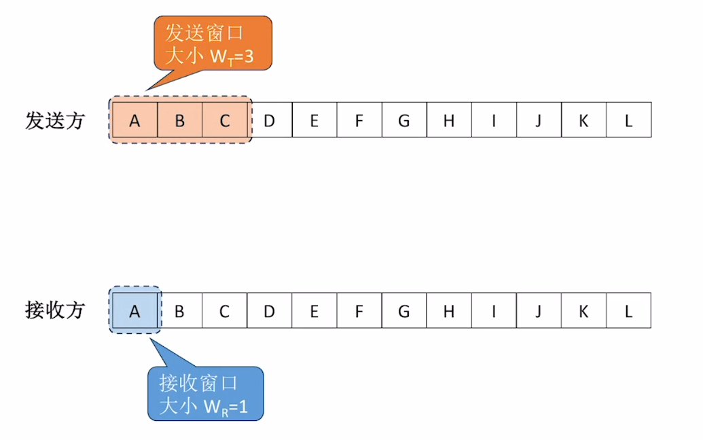

**2bit的循环编号方式**：发送方和接收方都按照0、1、2、3、0、1、2、3……为帧编号
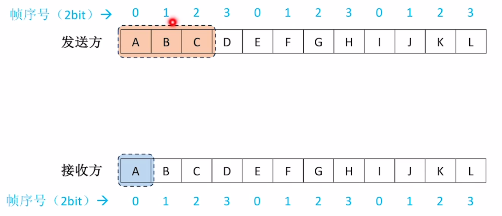

（二）**传输过程**

**正常情况**下的GBN的传输过程：
1. 发送方发送Data0、Data1、Data2
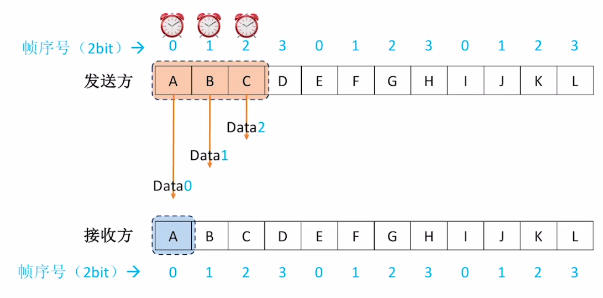
1. 接收方接收到Data0后窗口右移一位
2. 接收方接收到Data1后窗口右移一位
3. 接收方接收到Data2后窗口右移一位
4. 接收方发送**ACK2**
5. 发送方接收到ACK2，窗口**右移三位**
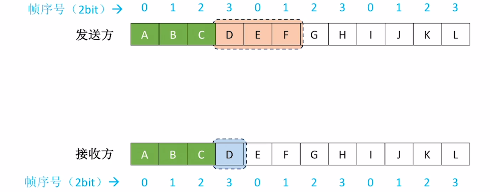

**异常情况1：数据帧丢失或错误**
1. 发送方发送Data0、Data1、Data2
2. 接收方接收到Data0后窗口右移一位
3. **Data1丢失**
4. 接收方接收到Data2并**丢弃**
5. 接收方**发送ACK0**
6. 接收方**接收到ACK0**，窗口**右移一位**，重传Data1、Data2，发送Data3

**异常情况2：确认帧丢失**
1. 发送方发送Data0、Data1、Data2，并启动计时器
2. 接收方接收到Data0后窗口右移一位
3. 接收方接收到Data1后窗口右移一位
4. 接收方接收到Data2后窗口右移一位
5. 接收方发送**ACK2**
6. **ACK2丢失**
7. 发送方**超时未接收到ACK0（第一个超时）**，重传Data0、Data1、Data2
8. 接收方接收到非法帧Data0、Data1、Data2，**直接丢弃**，并**返回ACK2**
9. 发送方接收到ACK2，滑动窗口右移三位

可以看出如果不保证$W_T+W_R\leq2^n$，在发生**确认帧丢失**的情况下，会导致帧**重复接收**
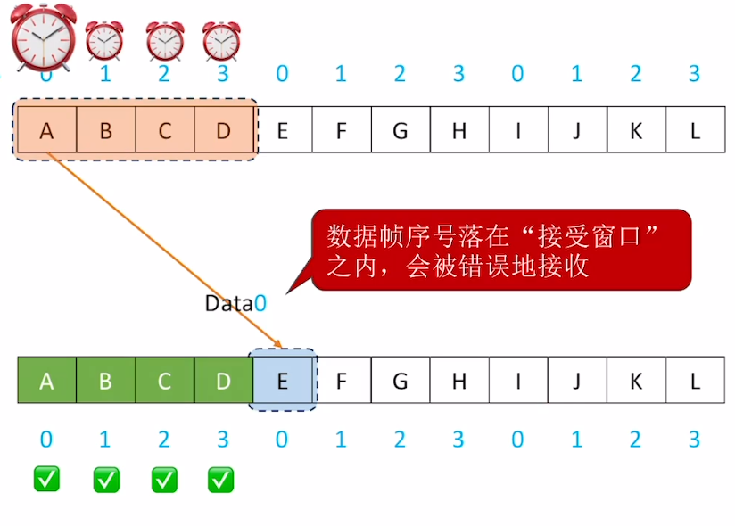

**GBN协议的缺点**:如果**接收方**接收帧的速度很慢，或在信道误码率很高的情况下，可能会导致发送方的发送进度经常需要“后退”，传输效率低下

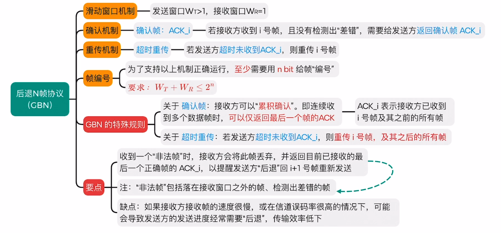

### 3.4.4. 选择重传协议（SR）
（一）选择重传协议（SR）（Select Repeat）
-  窗口大小：发送窗口$W_T$和接收窗口$W_R$大小**都大于1**，并且**接收窗口不能大于发送窗口**，通常取发送窗口$W_T$**等于**接收窗口$W_R$
-  确认机制：SR**不支持累计确认**，必须一帧帧确认
   - **确认帧$ACK_i$**：若接收方收到i号帧，且没有检测出“差错”，需要给发送方返回确认帧$ACK_i$
   - **否认帧$NAK_i$**：若接收方收到i号帧，但检测出i号帧有“差错”需要丢弃该帧，并给发送方返回否认帧 $NAK_i$
- 重传机制：
  - **超时重传**：若发送方**超时未收到**$ACK_i$，则重传i号帧
  - **请求重传**：若发送方**收到**$NAK_i$，则重传i号帧
- 帧编号：需要n bit，$W_T+W_R\leq2^n$

（二）SR的传输过程：
**正常情况下**
1. 发送方发送Data0、Data1、Data2、Data3
2. 接收方接收到Data0、Data1、Data2、Data3，向发送方发送ACK0、ACK1、ACK2、ACK3，窗口向右滑动四位
3. 发送方接收到ACK0到ACK3，窗口向右滑动四位
4. 发送方发送Data4、Data5、Data6、Data7

**异常情况1：数据帧丢失**：通过**超时重传机制**解决
1. 发送方发送Data0、Data1、Data2、Data3
2. **Data1丢失**
3. 接收方接收到Data0、Data2、Data3，向发送方发送ACK0、ACK2、ACK3，**窗口向右滑动一位**
4. 发送方接收到ACK0、ACK2、ACK3，**窗口向右滑动一位**
5. 发送方发送Data4，**超时重传Data1**
6. 接收方接收Data4、Data1，发送ACK4、ACK1，窗口向右滑动四位
7. 接收方接收到ACK1、ACK4，窗口向右滑动四位

**异常情况2：数据帧错误**：通过**请求重传机制**解决
1. 发送方发送Data0、Data1、Data2、Data3
2. **Data1差错**
3. 接收方接收到Data0、Data1、Data2、Data3，**检查到Data1差错**，向发送方发送ACK0、**NAK1**、ACK2、ACK3，**窗口向右滑动一位**
4. 发送方接收到ACK0、**NAK1**、ACK2、ACK3，**窗口向右滑动一位**
5. 发送方在超时之前**主动重传Data1**，发送Data4
6. 接收方接收Data4、Data1，发送ACK4、ACK1，窗口向右滑动四位
7. 接收方接收到ACK1、ACK4，窗口向右滑动四位

**异常情况3：确认帧丢失**
1. 发送方发送Data0、Data1、Data2、Data3
2. 接收方接收到Data0、Data1、Data2、Data3，向发送方发送ACK0、ACK1、ACK2、ACK3，窗口向右滑动四位
3. **ACK1、ACK3丢失**
4. 发送方接收到ACK0、ACK2，**窗口向右滑动一位**
5. 发送方发送Data4，超时重传Data1、Data3
6. 接收方接收Data4，发送ACK4，窗口向右滑动一位，发送ACK4
7. 接收方接收Data1、Data3，发现帧非法，**丢弃Data1、Data3并重传ACK1、ACK3**
8. 接收方接收到ACK1、ACK3、ACK4，窗口向右滑动四位

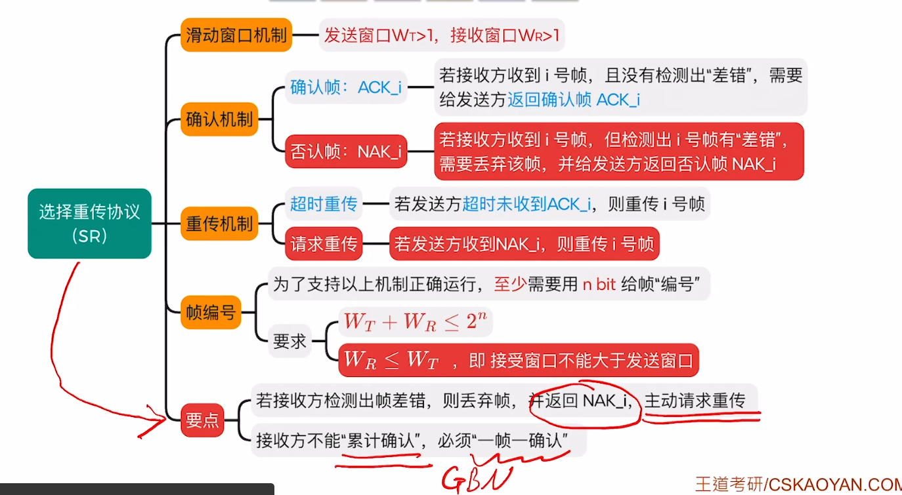

### 3.4.5. 三种协议的信道利用率：
（一）S-W的信道利用率
假设：
信道的数据传输速率=1 kbps
数据帧长度 =4 kb
确认帧长度=1kb
信道单向传播时延 =7s

分析：
- **数据帧的传输时延**为4s
- **确认帧的传输时延**为1s
- **传播总时延**为2*7=14s
- 一个S-W周期内耗费的时间为4+7+1+7=19s
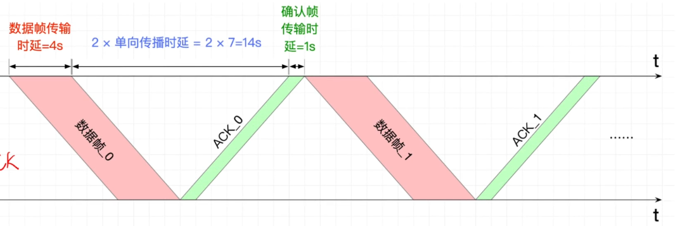

则发送信道的信道利用率为：4/19=21%

（二）GBN、SR的信道利用率
假设：
发送窗口大小 N=4
信道的数据传输速率=1kbps
数据帧长度 =4 kb
确认帧长度=1kb
信道单向传播时延 =7s

一个周期内：发送方发送了四个数据帧，接收到ACK0即开始下一个周期
- **数据帧的总传输时延**为4*4=16s
- **确认帧的传输时延**为1s
- **传播总时延**为2*7=14s
- 一个周期内的总时长为4+1+14=19s
(灰色代表一个周期)
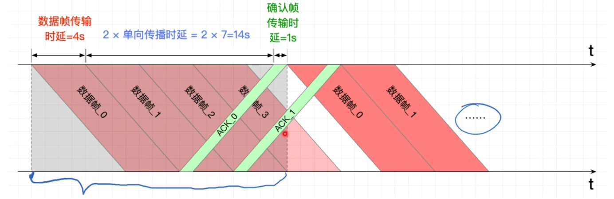

则发送信道的利用率为16/19=84%

如果发送窗口变为N=5：信道利用率为100%
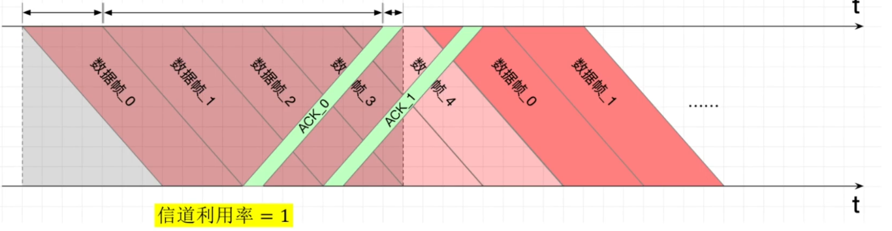

【例】36.主机甲与主机乙之间使用后退N帧协议(GBN)传输数据，甲的发送窗口尺寸为1000，数据帧长为1000字节，信道带宽为100Mbps，乙每收到一个数据帧立即利用一个短帧(忽略其传输延迟)进行确认，若甲、乙之间的单向传播延迟是50ms，则甲可以达到的最大平均数据传输速率约为()。
A. 10Mbps
B.20MMbps
C.80Mbps
D.100Mbps

【解答】数据帧的传输时延为1000B/100Mbps=80/1M=0.08ms。总传输时延为80ms，一个周期的时间约为0.08+100ms约等于100ms，则信道利用率为80%，传输速率为80Mbps

【例】主机甲通过(128kbps)卫星链路，采用滑动窗口协议向主机乙发送数据，链路单向传播延迟为250ms，帧长为1000字节。不考虑确认帧的开销，为使链路利用率不小于80%，帧序号的比特数至少是()。

【解答】数据帧的传输延迟为8000b/128kbps=8/128=1/16s，假设采用了$W_T=m$，传输总时延为m/16s，一个周期的时长为1/16+2*0.25=0.5625s，要保证利用率不小于0.8，即$\frac{m/16}{0.5625}\geq0.8$，求得$m\geq7.2$，则$W_T+W_R\geq8.2$，至少需要4位

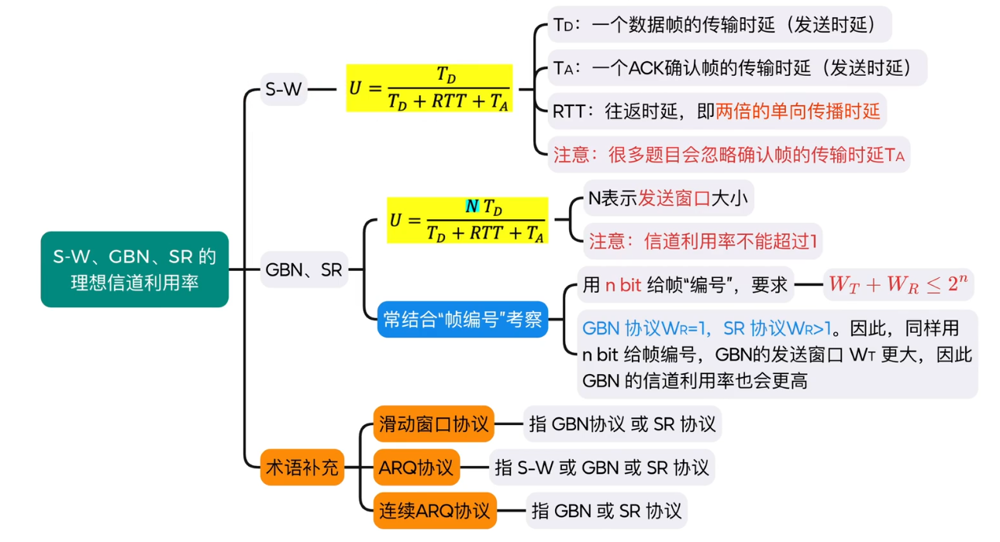

## 3.5. 功能5：介质访问控制
**介质访问控制**(Medium Access Control，MAC):多个节点共享同一个**总线型**播信道时，可能发生“信号冲突”。MAC就是要控制各节点对传输介质的控制，减少冲突甚至避免冲突

### 3.5.1. 信道划分法
（一）时分复用（TDM）、统计时分复用（STDM）
1. **时分复用**(Time Division Multiplexing， TDM):将时间分为等长的“**TDM帧**”每个“TDM帧”又分为**等长**的m个**时隙**将m个时隙分配给m对用户(节点)使用
   - TDM的缺点：
     - 每个节点最多只能分配到信道**总带宽的$\frac{1}{m}$**
     - 如果某节点暂不发送数据，会导致被分配的**时隙闲置**，**信道利用率低**
   - 解决方法：可统计每个节点对，信道的使用需求，动态按需分配时隙，即统计时分复用
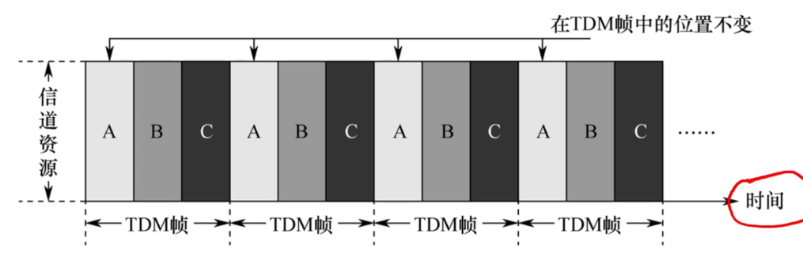
1. **统计时分复用**（Statistic Time Division Multiplexing,STDM）在TDM的基础上，**动态按序分配时隙**，又称**异步时分复用**
   - STDM的优点：
     - 如果需要时，一个节点可以在一段时间内**获得所有的信道带宽资源**
     - 如果某节点暂不发送数据，可以**不分配“时隙”**，信道利用率更高

（二）频分复用（FDM）、波分复用（WDM）
1. **频分复用**(Frequency Division Multiplexing，FDM)是将信道的总频带划分为多个**子频带**，每个子频带作为一个**子信道**，每对用户使用一个子信道进行通信
   - 优点:各节点可**同时发送信号**;充分利用了信道带宽(Hz)
   - 缺点:FDM技术只能用于**模拟信号**的传输
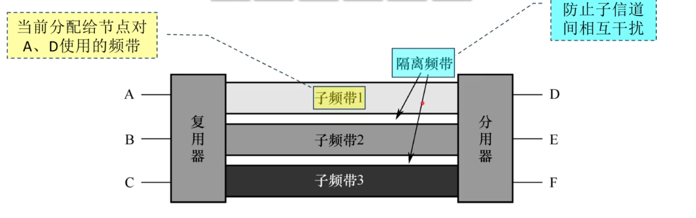
1. **波分复用技术**（Wavelength Division Multiplexing，WDM）：即**光的频分复用**
   - 光信号的频带范围(带宽)非常大，因此很适合采用波分复用技术，将一根光纤在逻辑上拆分为多个子信道

（三）**※码分复用（CDM）**
码分复用（CDM）的流程：
1. 给各节点分配专属**码片序列**
   - 码片序列包含**m个码片**(信号值)，可看作**m维向量**(m维向量的分量通常取1或-1)
   - 要求:各节点的“m维向量"必须**相互正交**
   - Tips:相互通信的各节点**知道彼此的码片序列**
2. 发送方如何**发送数据**：
   - 节点发出m个信号值与"码片序列"相同，表示比特1
   - 节点发出m个信号值与"码片序列"相反，表示比特0
3. 信号在传输过程中**叠加**：m个向量相加
4. 接收方如何接收数据：求得对应基向量的权重即可

【例】站点 A、B、C通过 CDMA 共享链路，A、B、C的码片序列(chipping sequence)分别是(1,1,1,1),(1,-1,1,-1)和(1,1,-1,-1)。若C从链路上收到的序列是(2,0,2,0,0,-2,0,-2,0,2,0,2),则C收到A发送的数据是(B)。
A.000
B.101
C.110
D.111

【解答】将序列拆分为：(2,0,2,0)，(0,-2,0,-2)，(0,2,0,2)，可以看出分别为a+b、-a+b、a-b，A发送了a、-a、a，因此为101

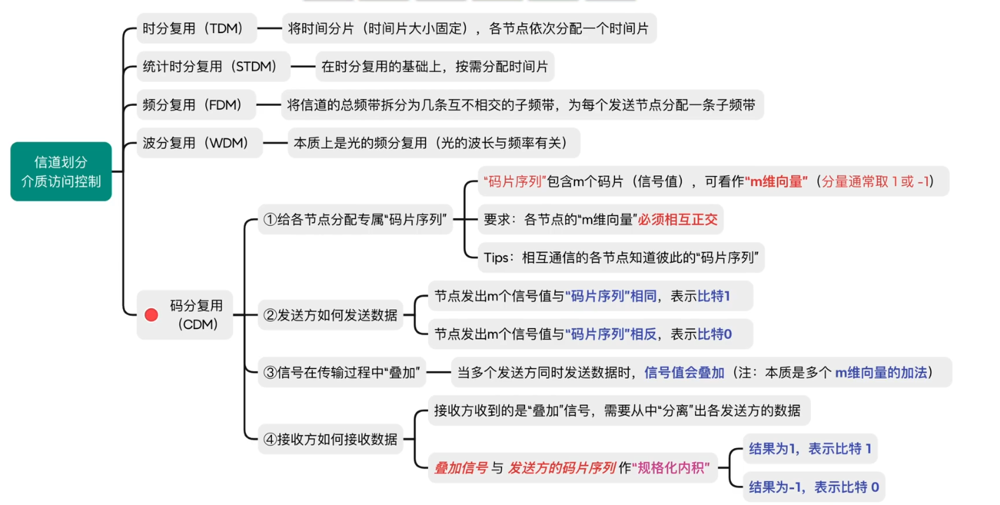
### 3.5.2. 随机访问法
#### 3.5.2.1. ALOHA协议
ALOHA协议实现了对介质的**随机访问**

（1） **纯ALOHA**：准备好就立即发送
- **纯ALOHA**协议的流程：
  1. 等待数据帧准备好
  2. 准备好，则**立即**把数据帧发送到信道
  3. 发送方等待ACK
  4. 若ACK超时，则**随机等待**一段时间后尝试重传
  5. 若接收到ACK，则等待下一个数据帧准备好
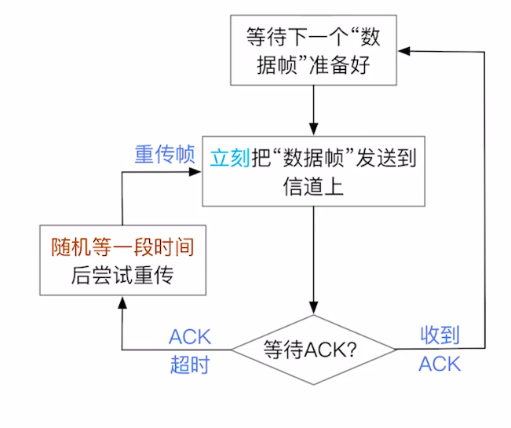
- 纯ALOHA协议的时序图：
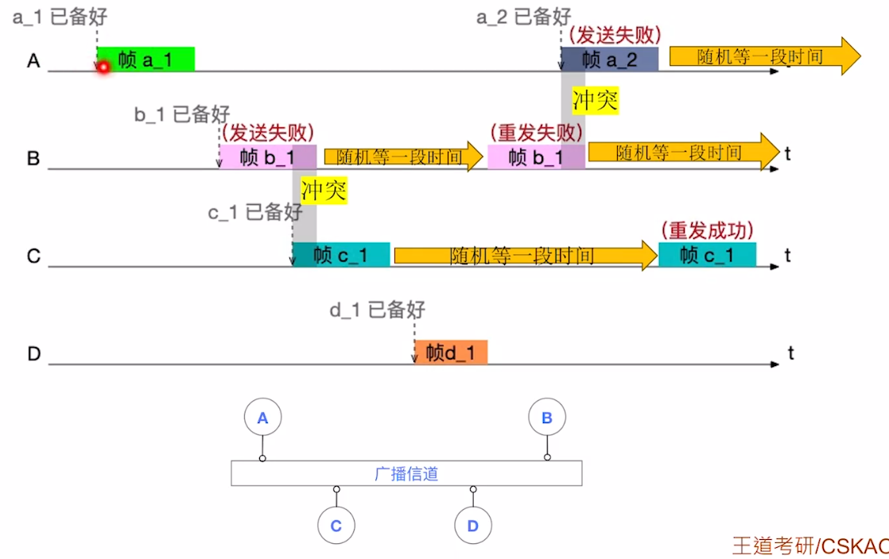

（2） **时隙ALOHA**：时隙大小固定 = 传输一个**最长帧**所需要的时间。只有在**每个时隙的开始**才能发送帧
- 时隙ALOHA的时序图
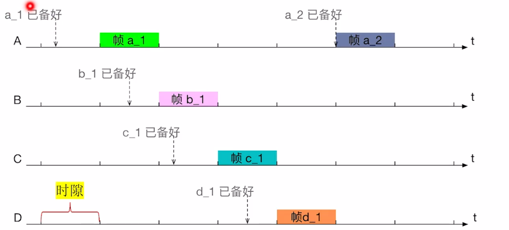
- 时隙ALOHA的优点：时隙ALOHA避免了用户发送数据的随意性，降低了冲突概率，提高了信道的利用率

#### 3.5.2.2. CSMA协议
**CSMA协议**：**载波监听多路访问协议**
CSMA协议在ALOHA协议的基础上加入**载波监听装置**：在发送数据之前，先**监听信道是否空闲**，只有信道空闲时，才会尝试发送

（1）**1-坚持CSMA**
- 1-坚持CSMA的流程：
  1. 发送方等待数据帧准备好
  2. 发送方**监听信道**
  3. 如果信道不空闲，则**坚持监听信道**
  4. 如果信道空闲，则**立即**把数据帧传输到信道上
  5. 如果传输失败，则随机延迟一段时间后，尝试监听并重传
  6. 如果传输成功，就等待下一个数据帧
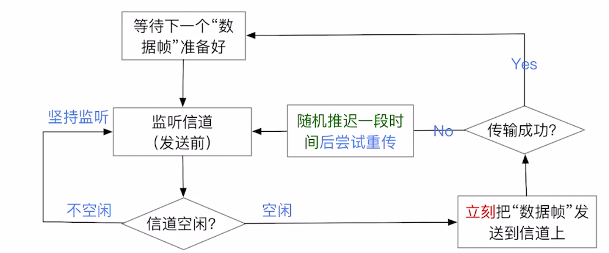
- 优点：信道利用率高，一旦空闲就可以被使用
- 缺点：如果多个节点**同时监听**，一旦信道空闲，则多个节点同时传输，发生冲突

（2）**非坚持CSMA**
- 非坚持CSMA的流程：
  1. 发送方等待数据帧准备好
  2. 发送方监听信道
  3. 如果信道不空闲，则**放弃监听信道**，随机延迟一段时间后再重新监听
  4. 如果信道空闲，则立即把数据帧传输到信道上
  5. 如果传输失败，则随机延迟一段时间后，尝试监听并重传
  6. 如果传输成功，就等待下一个数据帧
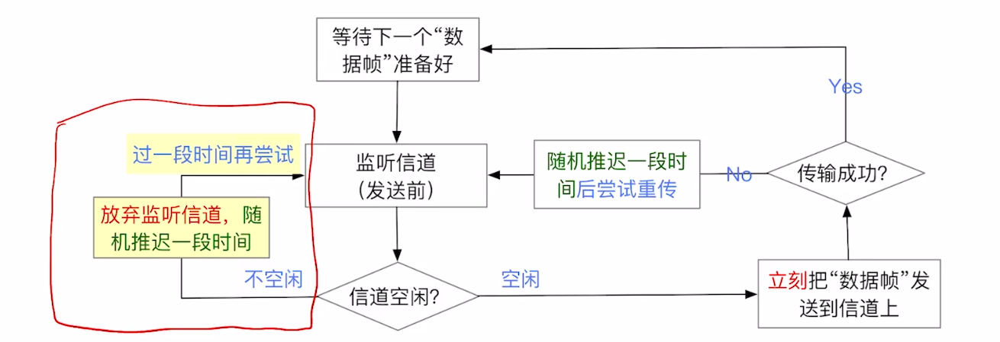
- 优点：当多个节点都已准备好数据时，如果信道不空闲，则各节点会随机推迟一段时间再尝试监听，从而使各节点**错开发送数据**，降低冲突概率
- 缺点：信道刚恢复空闲时，可能**不会被立即利用**，导致信道**利用率降低**

（3）**p-坚持CSMA**
- p-坚持CSMA的流程：
  1. 发送方等待数据帧准备好
  2. 发送方监听信道
  3. 如果信道不空闲，则**坚持监听信道**
  4. 如果信道空闲，则**有p的概率立即**把数据帧传输到信道上，**有1-p的概率延迟一段时间再尝试发送**
  5. 如果传输失败，则随机延迟一段时间后，尝试监听并重传
  6. 如果传输成功，就等待下一个数据帧
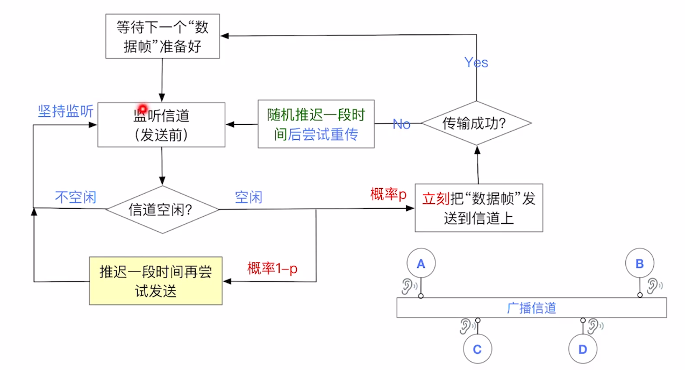
- 优点:属于1-坚持CSMA、非坚持CSMA折中方案，降低冲突概率的同时，提升信道利用率

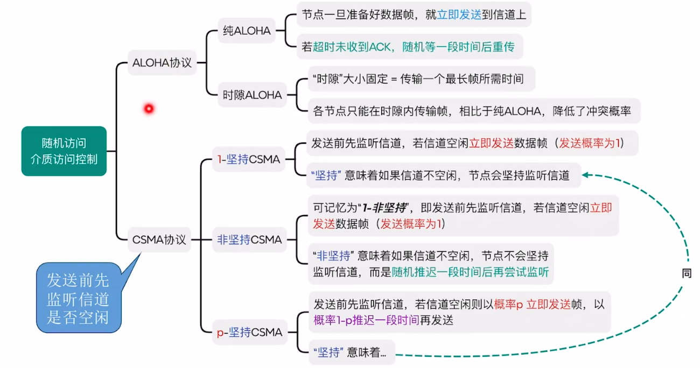

#### 3.5.2.3. ※※CSMA/CD协议
CSMA/CD协议用于早期**有线以太网**（**总线型**），具有坚持监听的特点
CD：Collision Detection，冲突检测
协议要点：先听后发、边听边发、冲突停发、随机重发

（1）协议流程：
  1. 发送方等待数据帧准备好
  2. 发送方**监听信道**
     1. 如果信道不空闲，则**坚持监听信道**
     2. 如果信道空闲，则**立即**把数据帧传输到信道上
  3. 发送方**一遍发送，一遍监听**
     1. 如果在发送过程中检测到冲突，会根据**截断二进制指数退避算法**等待一段时间
     2. 如果当前已经是**第16次冲突**了，则**立即停发并报告给网络层**
     3. 如果没有检测到冲突，则传输成功
  4. 发送方等待下一个数据帧
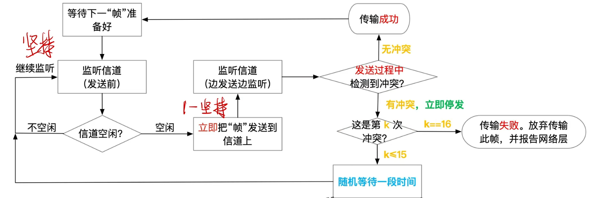

（2）**截断二进制指数退避算法**
假设**争用期**时间为t，当前已经是第k次冲突了，确定随机等待时间的算法如下：
- **随机等待**$r * t$时间，r的确定方法如下：
  - 如果$k\leq10$，则在$[0, 2^k-1]$区间内随机取一个**整数r**
  - 如果$k>10$，则在$[0, 2^{10}-1]$区间内随机取一个**整数r**
  - 如果$k=16$，放弃重传并报告网络层

由此可见，**第10次冲突和第16次冲突**是重要的分水岭

例：第一次冲突，在0、1之间随机。第二次冲突，在0、1、2、3之间随机。第三次冲突，在0、1、2、………7之间随机。直到第十次冲突，增长到[0, 1023]，之后不再增加

（3）**争用期**
争用期的时长为**二倍单向最大传播时延**，考虑**最远的两个节点**

- 如果**争用期内未发生冲突，后续就不可能会冲突**
- CSMA/CD协议**没有ACK机制**，如果没有检测到冲突，就认为传送成功

**争用期的原理**：假设ABCD依次相隔2000m，相距最远距离为6000m，假设信号的传播速度为2*10^8m/s，则单向最大传播时延为30us。
- 最极限的冲突情况：A发送数据，30us后传播到D。此时D刚好开始发送数据，D检测到冲突停止传送。
- A在30us后接收到D发送的信息，发现冲突，也停止传送。**A总共发送了60us的数据**。
- 也就是说，**一旦超过了60us还没有检测到冲突，就证明不会发生冲突**。
- 因此争用期的时长需要设为为**二倍单向最大传播时延**。

上述过程的流程表述：
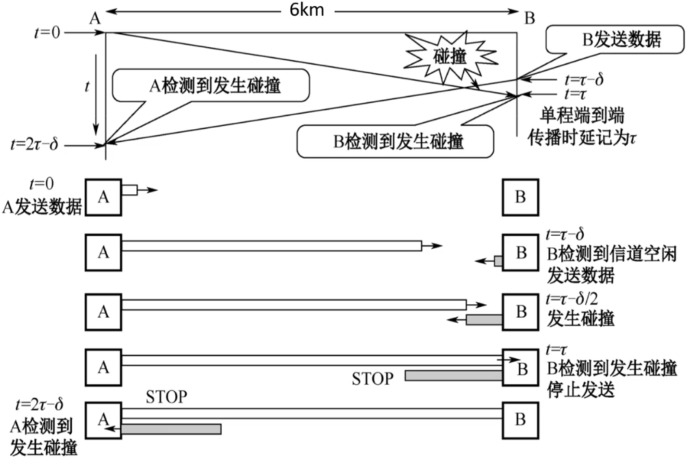

（4）**最短帧长**
最短帧长的大小 = **争用期 * 信道带宽** =  **二倍单向最大传播时延 * 信道带宽**。以太网规定为64B
- 接收方：若收到的帧**小于最短帧长**，视为**无效帧**
- 发送方：若实际要发送的数据很少，可以**填充到合法长度后再发送**

**最短帧长的作用**：如果帧长小于最短帧长，会导致发送方**误以为没有发生冲突**，但实际上已经发生了冲突。（因为在争用期内接收到了其他节点的数据，但是自己已经发送完了数据，所以不会判定为冲突）
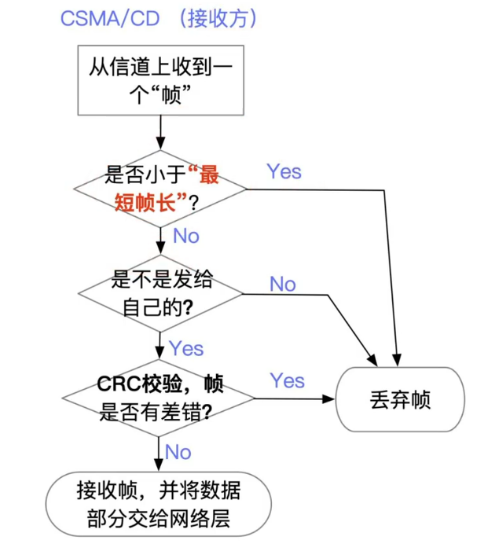

（5）**最长帧长**
最长帧长的长度：以太网规定为1518B
最长帧长的目的：防止某个节点一直占用信道

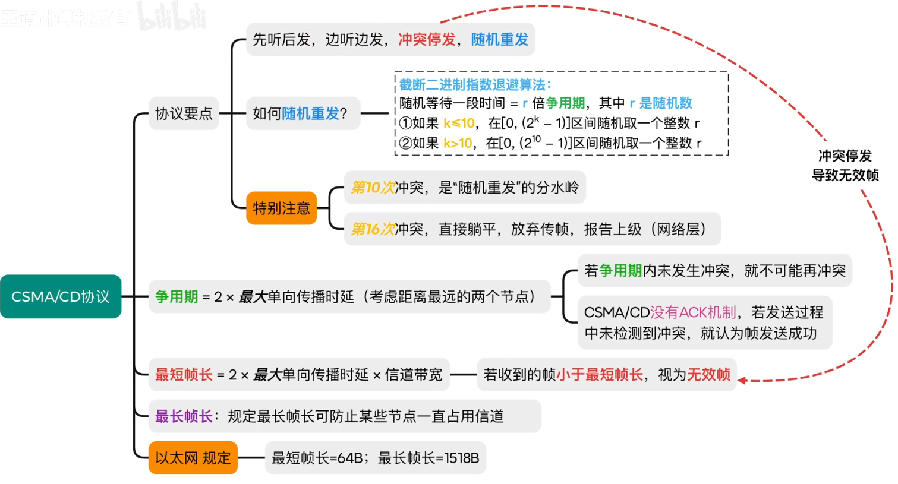

#### 3.5.2.4. ※CAMA/CA协议
CAMA/CA协议用于IEEE 802.11**无线局域网**（WiFi）
CA：Collision Avoidance（冲突避免）
CSMA/CA在发送的过程中不会检测冲突，而是在发送前想办法尽可能避免冲突

AP：接入点，即无线热点
**家用路由器 = 路由器 + 交换机 + AP**
无线设备通过AP与交换机连接，有线设备直接与交换机连接，交换机通过路由器与外部网络连接
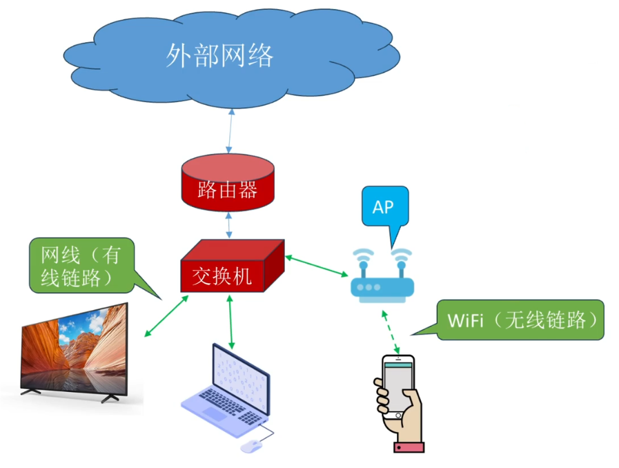

不使用CMSA/CD协议的原因：硬件上**很难实现边听边发、冲突检测**（自己检测到的最强信号永远是自己发送的）；**存在隐蔽站问题**（并非所有站点都能听见对方，发送方处不冲突不意味着AP不冲突）

（1）CSMA/CA协议的工作流程：
- **信道空闲情况下**：
  1. 发送方监测信道，若信道空闲，**间隔DIFS**后再发送帧。数据帧一口气发完，**无需冲突检测**
  2. 接收方接收到数据帧，**间隔SIFS**后再发送ACK
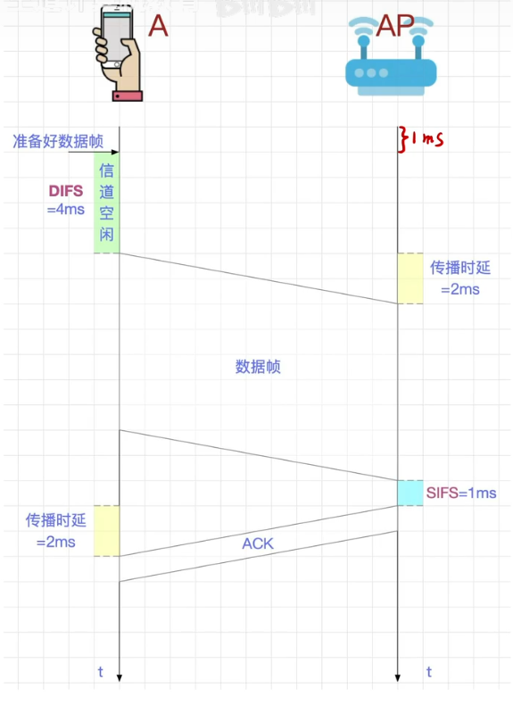
- **信道不空闲情况下**：
  1. 发送方监测信道，若信道不空闲，则使用**二进制指数退避算法**，确定等待时间。
  2. 注意：只有**信道空闲时等待时间才会减少**，如果信道一直忙碌则倒计时不会减少
  3. 等待时间结束，发送方**立即发送数据帧**
  4. 接收方接收到数据帧，**间隔SIFS**后再发送ACK
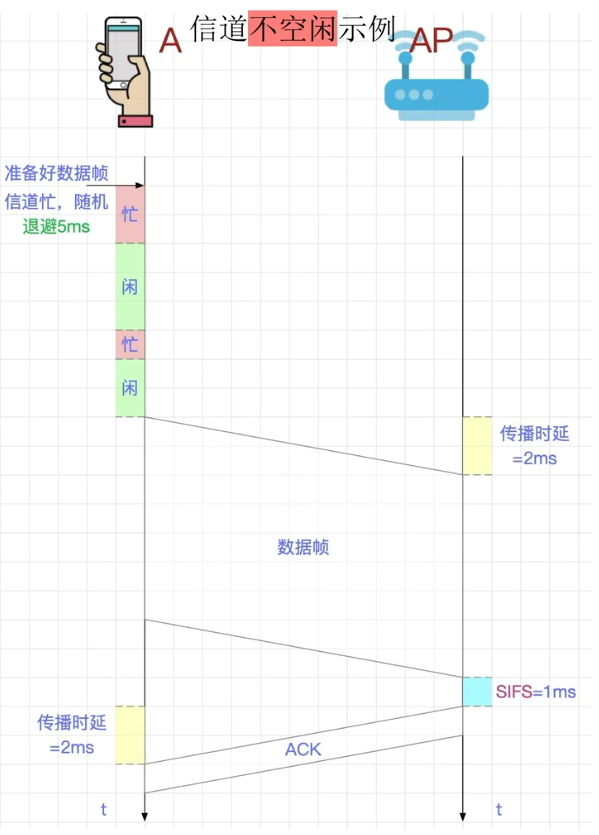
- **异常情况：数据帧丢失、数据帧出错**
  1. 接收方接收到数据帧，发现差错，不会发送ACK
  2. 发送方超时未接收到ACK，使用**二进制指数退避算法**，确定等待时间。
  3. 同理，只有信道空闲才能发送数据帧
  4. 等待时间结束，发送方**立即发送数据帧**

注：三种帧间间隔（IFS）：
- DIFS：分布式协调IFS，最长的帧间间隔，如4ms。用于**在帧事物开始之前等待的时间**。DIFS是为了避让SIFS的空闲
- SIFS：最短的帧间间隔，如1ms。**为了处理数据帧预留的一段时间**
- PIFS：中等长度IFS，无需掌握
- DIFS和SIFS都是**固定的时间间隔**，由IEEE 802.11规定
- 长度：DIFS > PIFS > SIFS

（2）引入**信道预约机制**的CSMA/CA协议：
- 正常情况下的流程：
  1. 发送方监测信道，若信道空闲，**间隔DIFS**后再发送**RTS控制帧**预约
  2. AP接收到RTS，**间隔SIFS**后**广播**发送**CTS控制帧**，表示同意预约。此后，其他移动节点**自觉禁言**
  3. 发送方接收到CTS，**间隔SIFS**发送数据帧
  4. AP接收到数据帧，**间隔SIFS**，**广播**发送ACK。此后解除禁言
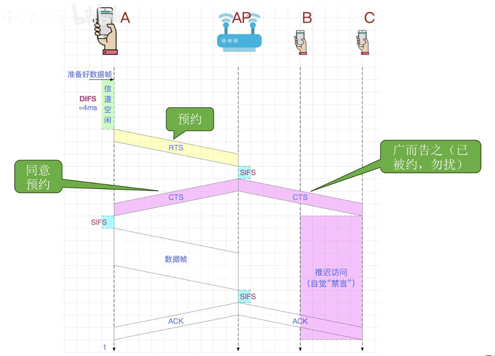
- **信道忙情况下**：
  1. 发送方监测信道，若信道空闲，**间隔DIFS**后再发送**RTS控制帧**预约。
  2. 发送方超时未接收到CTS控制帧，则使用**二进制指数退避算法**，确定等待时间。
  3. 同理，信道空闲才会减倒计时
  4. 倒计时技术，**重新发送RTS控制帧**
…………

注：
- **RTS控制帧**（Request To Send）：包括源地址、目的地址和这次通信的**持续时间**
- **CTS控制帧**（Clear To Send）：也包括源地址、目的地址和这次通信的**持续时间**
- **虚拟载波监听机制**：无关节点接收到CTS后自觉禁言的机制
- **信道预约机制**是可选的，802.11中规定，**发送方根据数据帧的长度**决定是否需要信道预约，如果数据帧长，则需要先预约

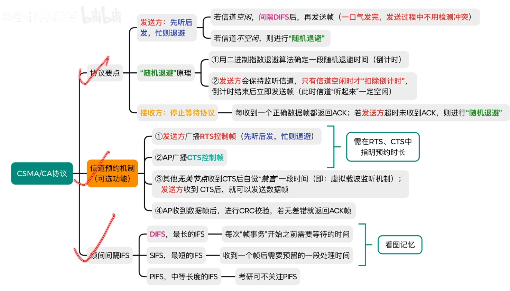

### 3.5.3. 轮询访问法：令牌传递协议
令牌传递协议适用于逻辑上**环形拓扑**

- 节点之间是循环队列的关系，每次拿到**令牌帧**，可以传送**一个数据帧**
- 数据帧包括令牌号、源地址、目的地址、数据部分、是否已接收等信息
- 数据帧也是在循环队列中**循环递送**的
- 无关节点接收到数据帧后，会传送给下一个帧
- 接收方接收到数据帧后，将数据部分拷贝，将数据帧的接收信息**更改为已接收**，并传送给下一个节点
- 发送方接收到数据帧，将**令牌帧传送给下一个节点**

注：
- 如果一个节点没有要发送的数据，会立刻释放令牌帧传递给下一个节点
- 如果数据帧出错，接收方不会接受，直接传递给下一个节点。发送方发现后**重传数据帧**，且有重传次数限制
- **MAU**：令牌环网的集中控制站，用于集中控制令牌环网
- 令牌传递协议适用于**负载高**的网络（不会发生冲突）

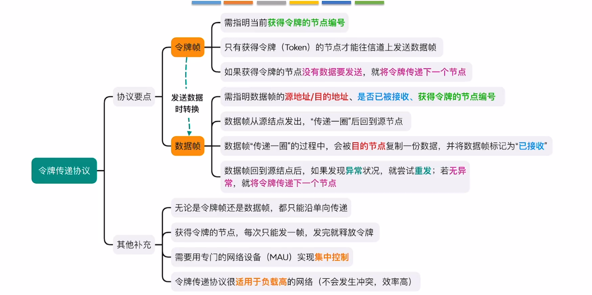

## 3.6. 局域网
局域网与IEEE 802
802.3工作组负责以太网技术
802.11工作组负责Wi-Fi技术
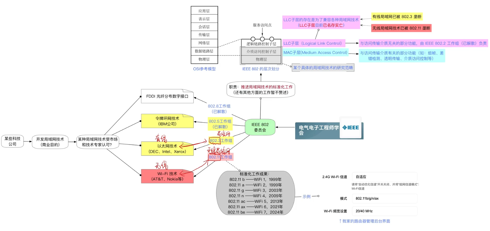
### 3.6.1. 局域网的基本概念与体系结构
（一）局域网的特点：
1. 覆盖较小的地理范围
2. 较低的时延和误码率
3. 局域网内的各节点之间以“**帧**”为单位进行传输
4. 支持**单播、广播、多播**
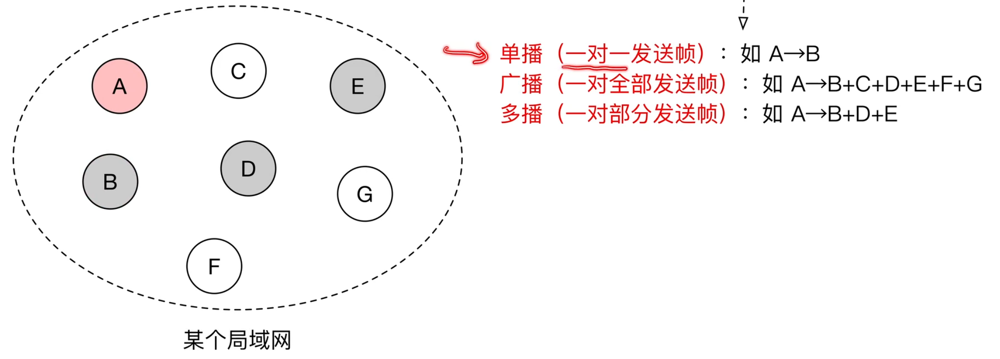

（二）局域网的分类：需要关注**①拓扑结构、②传输介质、③介质访问控制方式**
（1）LAN（局域网）
- 以太网/802.3：物理层采用**曼彻斯特编码**
   - 同轴电缆以太网：10Base5，**①总线型、②同轴电缆，可用中继器连接、③CSMA/CD协议**
     - 双绞线以太网：10BaseT
       - 使用集线器连接：**①物理上星型、逻辑上总线型，②双绞线，③CSMA/CD协议**
       - 使用交换机连接：**①星型，②双绞线，③CSMA/CD协议（半双工模式）或无协议（全双工模式）**
     - 光纤以太网：10BaseF，**①点对点（用于中继器、集线器、交换机之间的传输）、②光纤、③无需协议，使用两条光纤实现全双工通信**
- 令牌环网：**①环形、②同轴电缆或双绞线、③令牌传递协议**

（2）WLAN（无线局域网）：**①IEEE802.11定义为星型结构，②无线，③CSMA/CA协议**

（三）局域网的硬件架构
- 802.3局域网连接计算机，需要使用**以太网适配器**，属于**IO设备**
  - 以太网适配器内有**ROM、RAM**，ROM内是全球唯一的**MAC地址（物理地址，48bit）**，RAM用于帧缓冲
- 802.11局域网连接计算机，需要使用**WiFi网络适配器**（无线网卡）
  - WiFi网络适配器内也有**ROM、RAM**，ROM内是全球唯一的**MAC地址（物理地址，48bit）**，RAM用于帧缓冲

网络适配器(又名:网络接口卡、网卡)功能:
1. 负责**把帧发送到局域网**。
2. 负责**从局域网接收帧**。如果收到正确帧，就用“**中断**”通知CPU;如果收到异常帧，就直接丢弃
3. 需要根据接入的局域网类型，按照标准实现**数据链路层+物理层功能**
4. 需要完成数据的**串/并行转换**
5. 需要支持**帧缓冲**

注:关于“将IP数据报(IP分组)封装成帧”，有些系统由主机实现，有些系统由网络适配器负责，

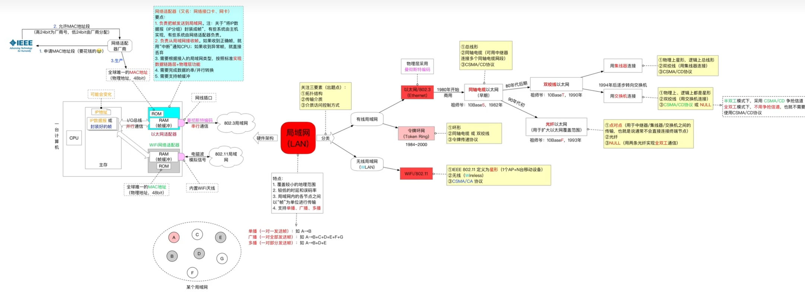
### 以太网与 IEEE 802. 3
