- [1. 图](#1-图)
  - [1.1. 图的基本概念](#11-图的基本概念)
  - [1.2. 图的存储结构](#12-图的存储结构)
    - [1.2.1. 邻接矩阵法](#121-邻接矩阵法)
    - [1.2.2. 邻接表法](#122-邻接表法)
    - [十字链表法：有向图](#十字链表法有向图)
    - [邻接多重表：无向图](#邻接多重表无向图)

# 1. 图
## 1.1. 图的基本概念

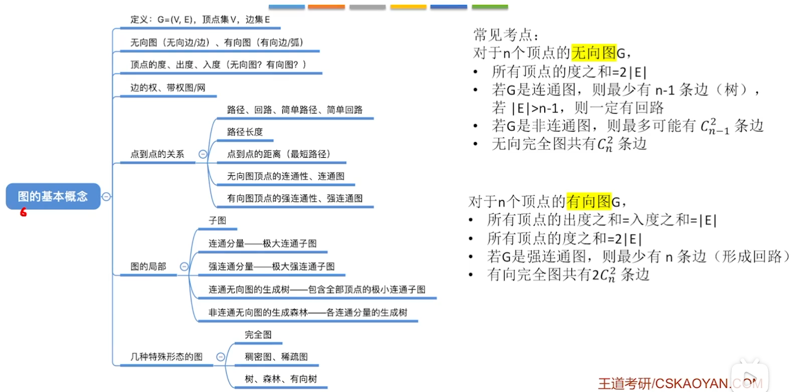
## 1.2. 图的存储结构
### 1.2.1. 邻接矩阵法
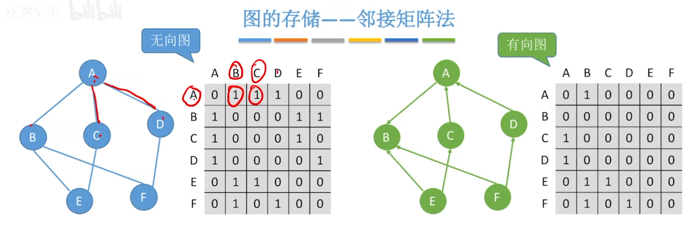
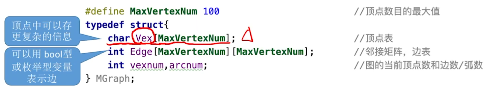

**求度数**：
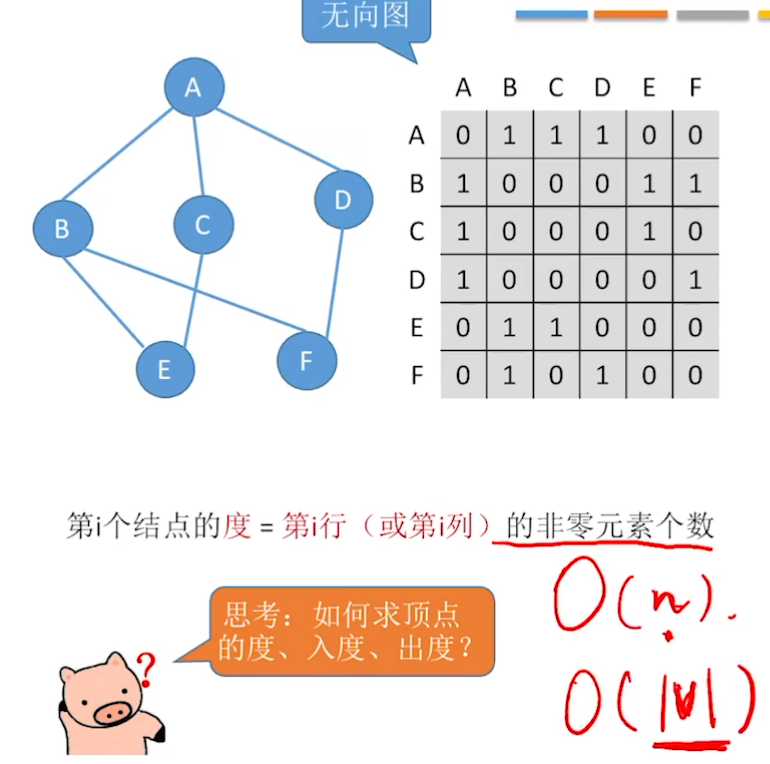
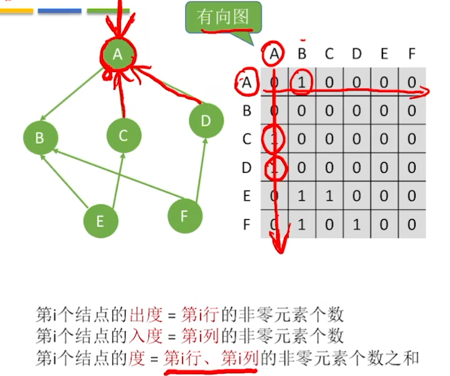

存储带权图：
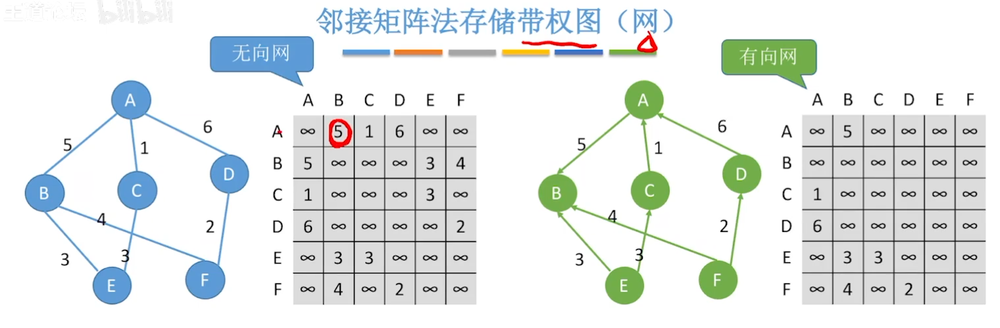
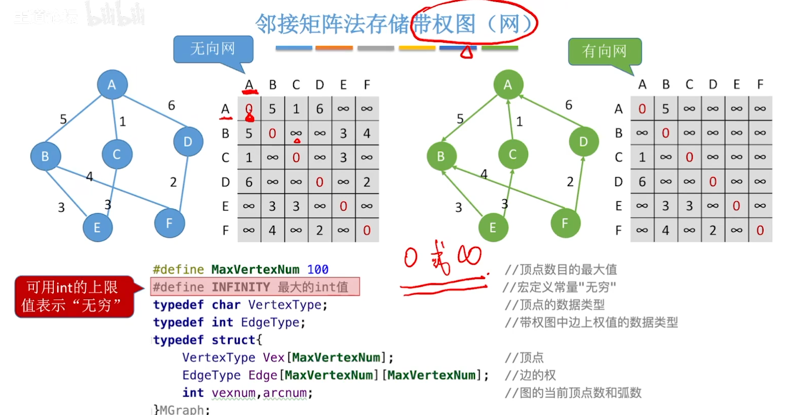

**性能分析**：**只适合存储稠密图**
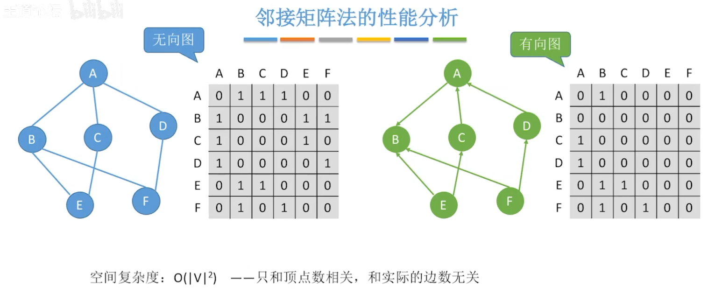

压缩存储：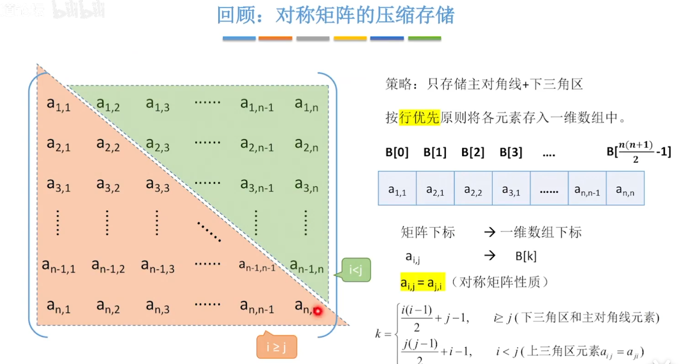

**邻接矩阵A的性质**：
**$A^n$：i到j路径长为n的路径数目**
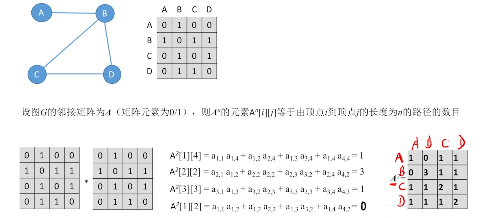

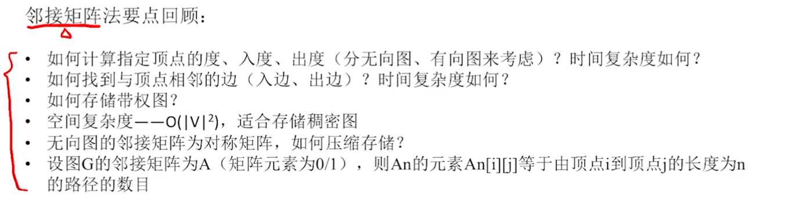

### 1.2.2. 邻接表法
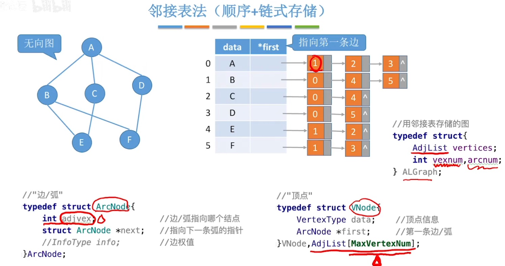
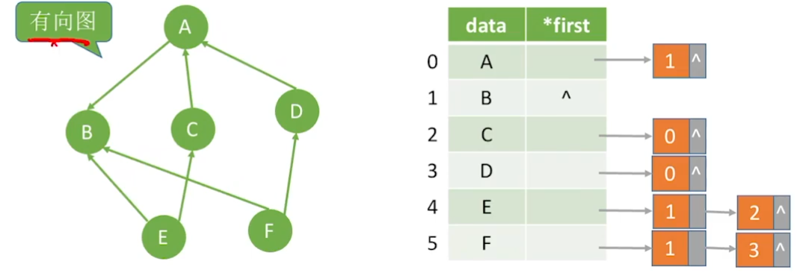

空间复杂度：
1. O（V+2E）（无向图)
2. O（V+E）（有向图）

求度数：
1. 无向图：遍历对应链表
2. 有向图求出度：遍历对应链表
3. 有向图求入度：遍历所有链表

邻接表表示法，**不唯一**
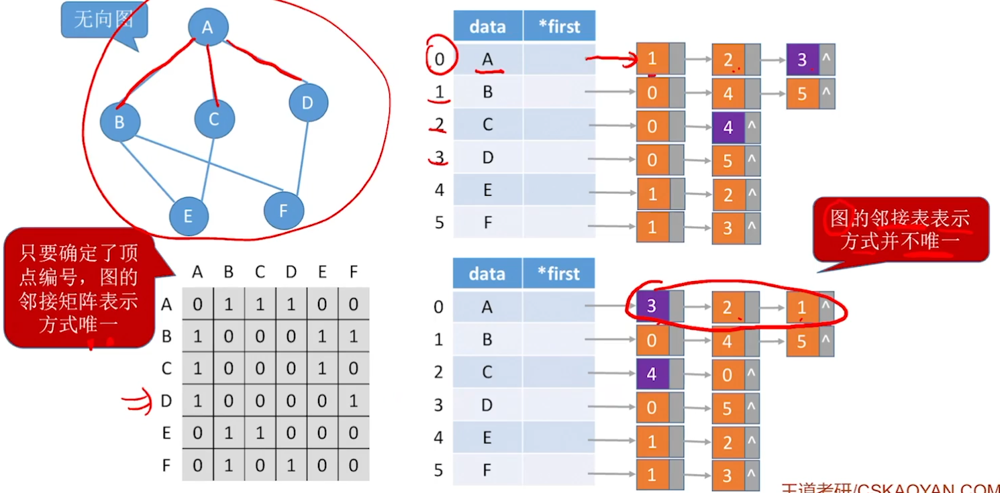

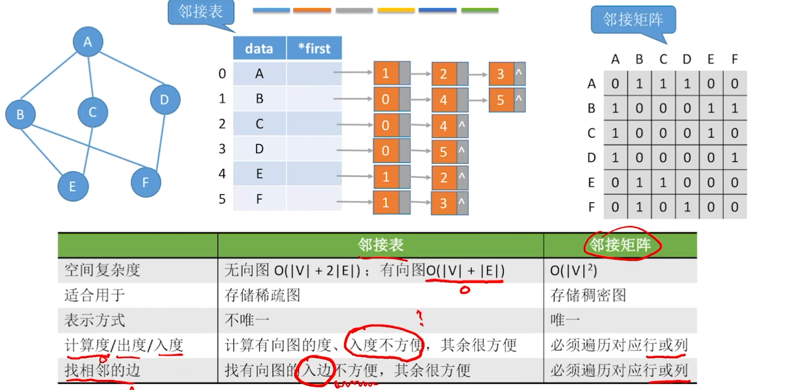

### 十字链表法：有向图

### 邻接多重表：无向图

